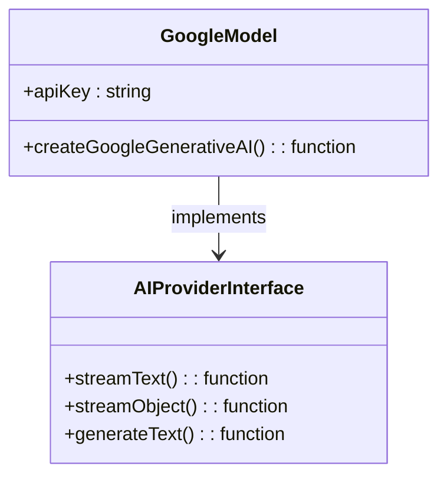
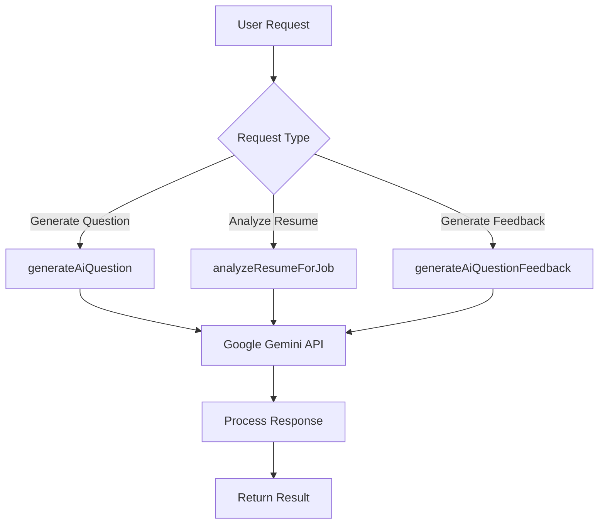
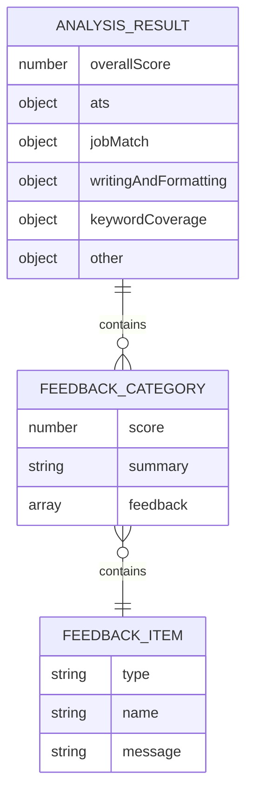
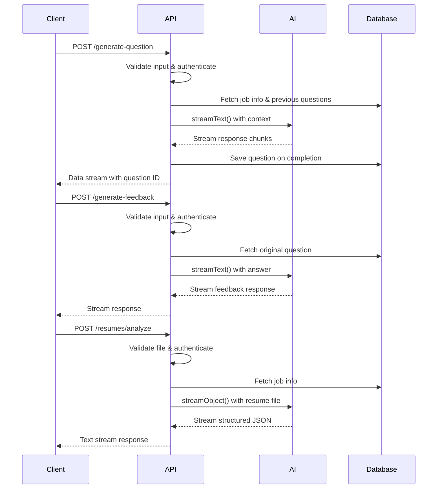

# AI Integration

<cite>
**Referenced Files in This Document**   
- [questions.ts](file://src/services/ai/questions.ts)
- [ai.ts](file://src/services/ai/resumes/ai.ts)
- [google.ts](file://src/services/ai/models/google.ts)
- [schemas.ts](file://src/services/ai/resumes/schemas.ts)
- [generate-question/route.ts](file://src/app/api/ai/questions/generate-question/route.ts)
- [generate-feedback/route.ts](file://src/app/api/ai/questions/generate-feedback/route.ts)
- [analyze/route.ts](file://src/app/api/ai/resumes/analyze/route.ts)
</cite>

## Table of Contents
1. [Introduction](#introduction)
2. [AI Provider Abstraction Layer](#ai-provider-abstraction-layer)
3. [Core AI Services](#core-ai-services)
4. [Streaming Response Implementation](#streaming-response-implementation)
5. [Prompt Engineering Strategies](#prompt-engineering-strategies)
6. [Structured Output Parsing with Zod](#structured-output-parsing-with-zod)
7. [API Route Usage Examples](#api-route-usage-examples)
8. [Cost Optimization and Token Monitoring](#cost-optimization-and-token-monitoring)
9. [Error Handling and Fallback Mechanisms](#error-handling-and-fallback-mechanisms)

## Introduction
The darasa application implements a sophisticated AI integration layer that leverages both Google Gemini and OpenAI models through the @ai-sdk/google and @ai-sdk/openai packages. This system provides intelligent features for generating technical interview questions, analyzing candidate resumes, and providing detailed feedback on interview performance. The architecture is designed with abstraction, scalability, and user experience in mind, featuring a standardized interface for interacting with multiple AI providers, streaming responses for real-time interaction, and robust error handling.

**Section sources**
- [questions.ts](file://src/services/ai/questions.ts#L1-L107)
- [ai.ts](file://src/services/ai/resumes/ai.ts#L1-L79)

## AI Provider Abstraction Layer
The AI integration layer in darasa features a clean abstraction that standardizes interactions with different AI providers. This abstraction is implemented in the `src/services/ai/models/` directory, where provider-specific configurations are encapsulated while exposing a consistent interface to the rest of the application.

The Google Generative AI service is configured through a dedicated module that imports the API key from environment variables and creates a properly configured client instance. This approach ensures secure credential management and allows for easy configuration changes without modifying business logic throughout the application.

**Diagram sources**
- [google.ts](file://src/services/ai/models/google.ts#L1-L6)

**Section sources**
- [google.ts](file://src/services/ai/models/google.ts#L1-L6)

## Core AI Services
The core AI functionality is organized into specialized services within the `src/services/ai/` directory, each designed for specific use cases including question generation, feedback provision, and resume analysis.

### Interview Question Generation
The system can generate technical interview questions tailored to specific job roles by analyzing job descriptions, required experience levels, and existing questions. The `generateAiQuestion` function accepts job information, previous questions for context, difficulty level, and a callback function to handle the generated question.

### Resume Analysis
The resume analysis service evaluates candidate resumes against job requirements using the `analyzeResumeForJob` function. It processes uploaded resume files (PDF, Word, or text) and provides structured feedback across multiple dimensions including ATS compatibility, job match, writing quality, keyword coverage, and additional insights.

### Feedback Generation
For interview answers, the system provides comprehensive feedback through the `generateAiQuestionFeedback` function. This service evaluates candidate responses, assigns ratings from 1-10, and provides constructive criticism along with a model answer for comparison.

**Diagram sources**
- [questions.ts](file://src/services/ai/questions.ts#L8-L107)
- [ai.ts](file://src/services/ai/resumes/ai.ts#L5-L79)

**Section sources**
- [questions.ts](file://src/services/ai/questions.ts#L8-L107)
- [ai.ts](file://src/services/ai/resumes/ai.ts#L5-L79)

## Streaming Response Implementation
The application implements streaming responses to provide real-time output display, enhancing user experience by showing content as it's generated rather than waiting for complete processing. This is achieved using the `streamText` and `streamObject` functions from the AI SDK, which enable incremental data transmission.

The streaming implementation follows a consistent pattern across all AI services:
1. Initiate a streaming request to the AI model
2. Process chunks of data as they arrive
3. Transmit partial results to the client immediately
4. Handle completion events appropriately

For question generation, the streaming response includes a mechanism to persist the generated question to the database once completed, ensuring that successful outputs are automatically saved. The `createDataStreamResponse` utility facilitates this process by merging the AI stream with custom data events.

**Section sources**
- [generate-question/route.ts](file://src/app/api/ai/questions/generate-question/route.ts#L36-L89)
- [questions.ts](file://src/services/ai/questions.ts#L8-L63)

## Prompt Engineering Strategies
The application employs sophisticated prompt engineering techniques to ensure high-quality, relevant AI outputs. Each service uses carefully crafted system prompts that provide clear instructions, context, and formatting requirements.

### Question Generation Prompts
The question generation system prompt includes:
- Specific job information (title, description, experience level)
- Guidelines for creating realistic, relevant technical questions
- Instructions to match the specified difficulty level
- Requirements to focus on practical, real-world challenges
- Formatting specifications (markdown output)
- Clear termination instructions

### Feedback Generation Prompts
The feedback generation prompt structures evaluation around:
- A 1-10 rating scale with clear criteria for each range
- Requirements for concise, constructive feedback
- Inclusion of a complete correct answer
- Direct address to the candidate using "you"
- Strict output format with markdown sections

### Resume Analysis Prompts
The resume analysis prompt defines five evaluation categories with specific criteria:
- ATS compatibility assessment
- Job requirements alignment
- Writing and formatting quality
- Keyword coverage analysis
- Additional insights

Each category has detailed guidelines to ensure consistent, actionable feedback that helps candidates improve their resumes.

**Section sources**
- [questions.ts](file://src/services/ai/questions.ts#L46-L107)
- [ai.ts](file://src/services/ai/resumes/ai.ts#L20-L79)

## Structured Output Parsing with Zod
The system uses Zod schemas to enforce structured output formats, particularly for complex responses like resume analysis. The `aiAnalyzeSchema` in `src/services/ai/resumes/schemas.ts` defines a comprehensive structure for resume feedback that includes an overall score and detailed assessments across multiple categories.

Each category in the schema contains:
- A numeric score (1-10)
- A summary string
- An array of feedback items with type, name, and message

The feedback item types are strictly defined as "strength", "minor-improvement", or "major-improvement", ensuring consistency in the feedback provided. This structured approach enables reliable parsing and presentation of AI-generated content in the user interface.

**Diagram sources**
- [schemas.ts](file://src/services/ai/resumes/schemas.ts#L1-L37)

**Section sources**
- [schemas.ts](file://src/services/ai/resumes/schemas.ts#L1-L37)
- [ai.ts](file://src/services/ai/resumes/ai.ts#L1-L79)

## API Route Usage Examples
The AI services are exposed through RESTful API endpoints that handle authentication, validation, and business logic before delegating to the appropriate AI service.

### Generate Question Endpoint
The `/api/ai/questions/generate-question` route:
1. Validates input parameters (difficulty, jobInfoId)
2. Authenticates the user and checks permissions
3. Retrieves job information and previous questions
4. Initiates streaming question generation
5. Persists the generated question upon completion
6. Returns a data stream response with the question ID

### Generate Feedback Endpoint
The `/api/ai/questions/generate-feedback` route:
1. Validates input (answer text, questionId)
2. Authenticates the user
3. Retrieves the original question
4. Generates feedback using the AI service
5. Returns the streaming response directly

### Resume Analysis Endpoint
The `/api/ai/resumes/analyze` route:
1. Handles multipart form data with resume file and jobInfoId
2. Validates file size (<10MB) and type (PDF, Word, text)
3. Authenticates the user and checks permissions
4. Retrieves job information
5. Processes the resume file and generates structured analysis
6. Returns the text stream response

**Diagram sources**
- [generate-question/route.ts](file://src/app/api/ai/questions/generate-question/route.ts#L1-L89)
- [generate-feedback/route.ts](file://src/app/api/ai/questions/generate-feedback/route.ts#L1-L59)
- [analyze/route.ts](file://src/app/api/ai/resumes/analyze/route.ts#L1-L68)

**Section sources**
- [generate-question/route.ts](file://src/app/api/ai/questions/generate-question/route.ts#L1-L89)
- [generate