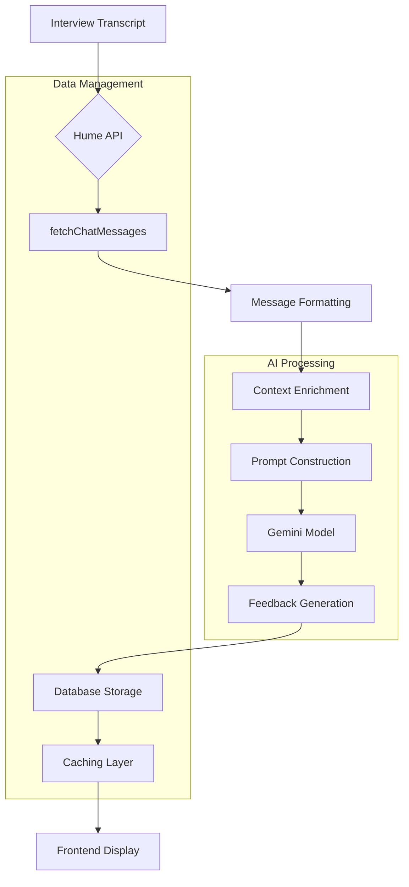
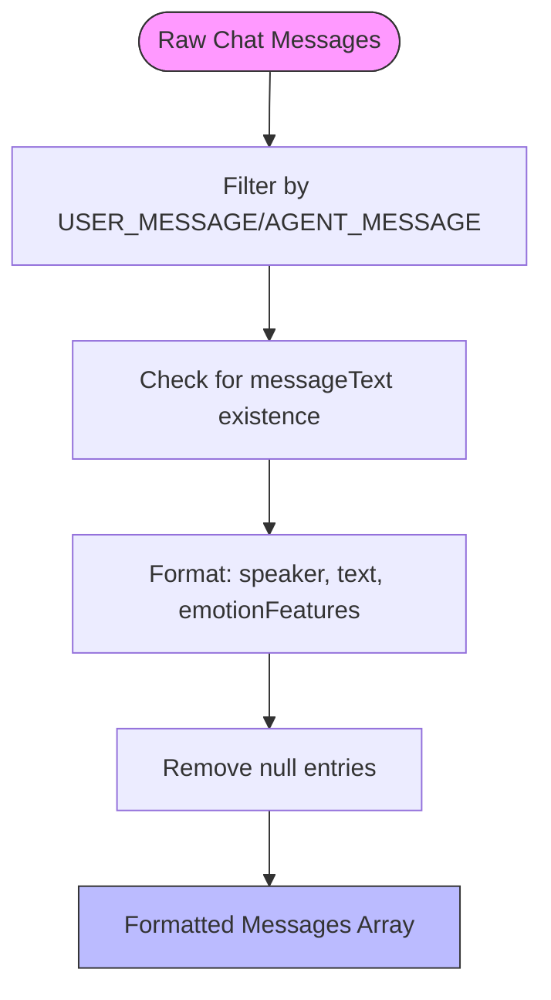
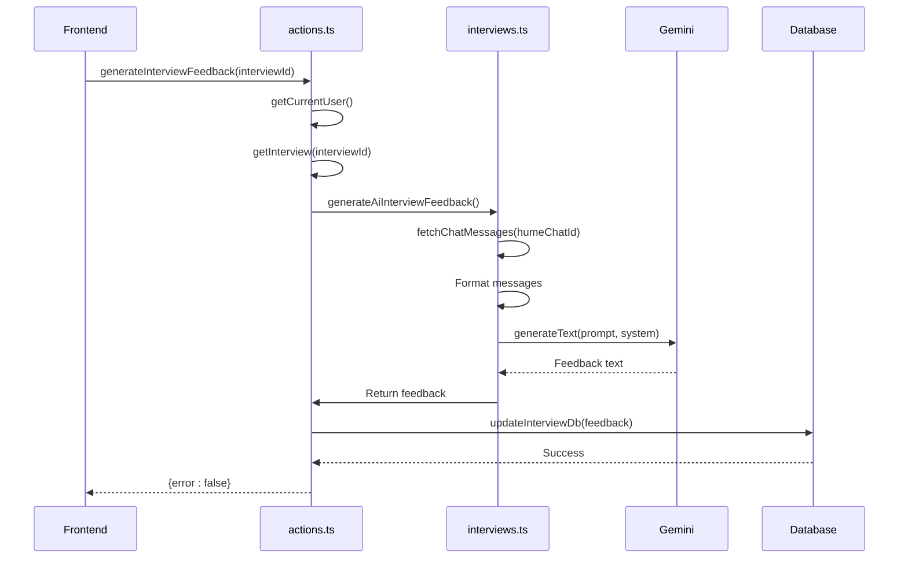
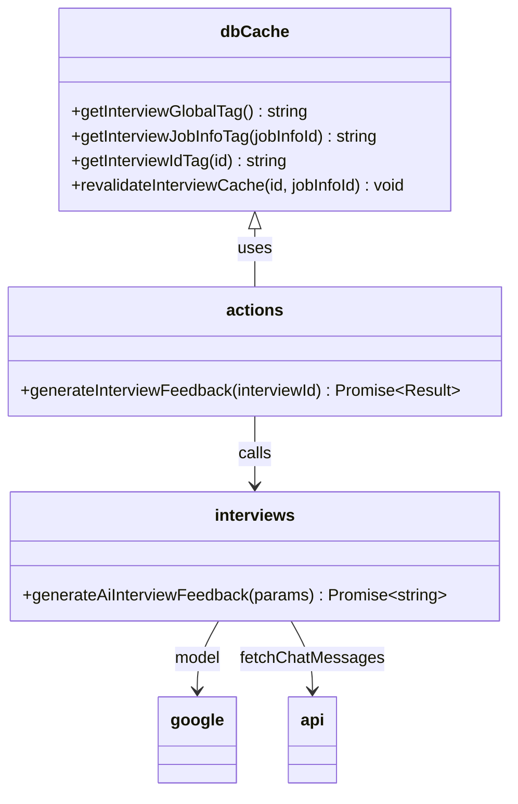
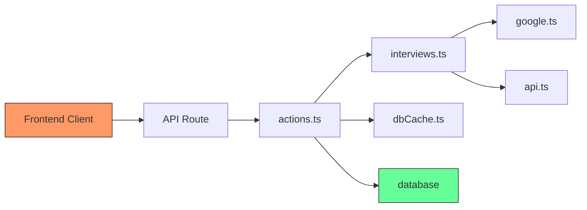

# Feedback Generation

<cite>
**Referenced Files in This Document**   
- [generateAiInterviewFeedback](file://src/services/ai/interviews.ts#L5-L113)
- [google.ts](file://src/services/ai/models/google.ts#L1-L6)
- [dbCache.ts](file://src/features/interviews/dbCache.ts#L1-L25)
- [actions.ts](file://src/features/interviews/actions.ts#L101-L156)
- [api.ts](file://src/services/hume/lib/api.ts#L4-L19)
</cite>

## Table of Contents
1. [Introduction](#introduction)
2. [Core Components](#core-components)
3. [Architecture Overview](#architecture-overview)
4. [Detailed Component Analysis](#detailed-component-analysis)
5. [Dependency Analysis](#dependency-analysis)
6. [Performance Considerations](#performance-considerations)
7. [Troubleshooting Guide](#troubleshooting-guide)
8. [Conclusion](#conclusion)

## Introduction
The AI-powered feedback generation system processes user responses from text or voice interviews and transforms them into structured, personalized feedback using advanced language models. The system leverages Gemini as the primary AI model to analyze interview transcripts, evaluate performance against job requirements, and generate constructive feedback. This document details the complete workflow from data collection to storage, focusing on the `generateAiInterviewFeedback` function's implementation, message transformation logic, context preservation techniques, and caching strategies.

## Core Components

The feedback generation system consists of several key components that work together to process interview data and deliver actionable insights. At its core is the `generateAiInterviewFeedback` function, which orchestrates the entire feedback pipeline by collecting transcript data, formatting it for AI processing, and structuring prompts with contextual information about the job and candidate. The system integrates with Hume API to retrieve voice interview transcripts, uses Google's Gemini model for analysis, and stores results in a database with proper caching mechanisms via `dbCache`. Personalization is achieved through dynamic template rendering that incorporates `userName` and `experienceLevel` to tailor feedback appropriately.

**Section sources**
- [interviews.ts](file://src/services/ai/interviews.ts#L5-L113)
- [google.ts](file://src/services/ai/models/google.ts#L1-L6)

## Architecture Overview

**Diagram sources **
- [api.ts](file://src/services/hume/lib/api.ts#L4-L19)
- [interviews.ts](file://src/services/ai/interviews.ts#L5-L113)

## Detailed Component Analysis

### Feedback Generation Process
The feedback generation process begins with retrieving raw interview transcripts from the Hume platform through the `fetchChatMessages` function. These messages are then filtered and transformed into a standardized format that preserves speaker identity (interviewee vs. interviewer), spoken text, and emotional features for the candidate. The transformation process removes irrelevant message types and null content, ensuring clean input for the AI model.

#### Message Transformation and Context Preservation

**Diagram sources **
- [interviews.ts](file://src/services/ai/interviews.ts#L15-L30)

**Section sources**
- [interviews.ts](file://src/services/ai/interviews.ts#L15-L30)
- [api.ts](file://src/services/hume/lib/api.ts#L4-L19)

### Prompt Structuring and AI Processing
The system constructs comprehensive prompts for the Gemini model by combining formatted transcripts with rich contextual information about the job position and candidate. The prompt includes specific instructions for the AI to act as an expert interview coach, providing structured feedback in markdown format across seven evaluation categories: Communication Clarity, Confidence and Emotional State, Response Quality, Pacing and Timing, Engagement and Interaction, Role Fit & Alignment, and Overall Strengths & Areas for Improvement.

The `generateText` function is called with experimental_continueSteps enabled, allowing for multi-turn reasoning where the model can refine its analysis through internal deliberation steps. This approach enables deeper evaluation by letting the AI model process information incrementally rather than generating feedback in a single pass.

**Diagram sources **
- [interviews.ts](file://src/services/ai/interviews.ts#L5-L113)
- [actions.ts](file://src/features/interviews/actions.ts#L101-L156)

**Section sources**
- [interviews.ts](file://src/services/ai/interviews.ts#L30-L71)
- [actions.ts](file://src/features/interviews/actions.ts#L130-L156)

### Caching and Storage Strategy
After successful feedback generation, the system implements a robust caching strategy to optimize performance and ensure data consistency. The feedback is stored in the database through the `updateInterviewDb` function, which persists the generated text to the Interview table. Following storage, the `revalidateInterviewCache` function is called to invalidate relevant cache tags, ensuring that subsequent requests retrieve fresh data.

The caching system uses a tag-based approach with three levels of granularity: global interview cache, job-specific cache, and individual interview cache. This hierarchical invalidation strategy allows for efficient cache management while maintaining optimal performance for frequently accessed data.

**Diagram sources **
- [dbCache.ts](file://src/features/interviews/dbCache.ts#L1-L25)
- [actions.ts](file://src/features/interviews/actions.ts#L101-L156)

**Section sources**
- [dbCache.ts](file://src/features/interviews/dbCache.ts#L1-L25)
- [actions.ts](file://src/features/interviews/actions.ts#L145-L156)

## Dependency Analysis

**Diagram sources **
- [interviews.ts](file://src/services/ai/interviews.ts#L5-L113)
- [actions.ts](file://src/features/interviews/actions.ts#L101-L156)
- [google.ts](file://src/services/ai/models/google.ts#L1-L6)
- [api.ts](file://src/services/hume/lib/api.ts#L4-L19)
- [dbCache.ts](file://src/features/interviews/dbCache.ts#L1-L25)

## Performance Considerations
The system employs several performance optimization techniques to ensure responsive feedback delivery. The use of cached chat message retrieval reduces redundant API calls to Hume's platform. Strategic cache tagging with `getInterviewIdTag`, `getInterviewJobInfoTag`, and `getInterviewGlobalTag` enables precise cache invalidation without unnecessary revalidation of unrelated data. The integration with Arcjet provides rate limiting at 4 requests per day with a burst capacity of 12, preventing abuse while accommodating legitimate usage patterns. For large transcripts, the system processes messages in paginated batches of 100 items, ensuring memory efficiency during transcript retrieval.

## Troubleshooting Guide
Common issues in the feedback generation system typically involve incomplete transcripts, authentication failures, or model response errors. When `humeChatId` is null, the system returns "Interview has not been completed yet" as the feedback cannot be generated without transcript data. Authentication issues manifest as "You don't have permission to do this" when user validation fails in `getCurrentUser`. If the AI model fails to generate feedback, the system returns "Failed to generate feedback" after verifying that the interview exists and permissions are valid. Rate limiting issues are communicated through RATE_LIMIT_MESSAGE when Arcjet denies requests exceeding the token bucket limits. Empty or malformed messages are filtered out during the formatting stage, preventing them from affecting the AI analysis.

**Section sources**
- [actions.ts](file://src/features/interviews/actions.ts#L110-L156)
- [interviews.ts](file://src/services/ai/interviews.ts#L15-L30)

## Conclusion
The AI-powered feedback generation system provides a comprehensive solution for transforming interview responses into actionable insights. By leveraging Gemini's capabilities with carefully structured prompts and contextual information, the system delivers personalized, constructive feedback tailored to specific job requirements and candidate profiles. The architecture balances sophisticated AI processing with robust data management, implementing effective caching strategies and error handling to ensure reliability. Future enhancements could include more granular feedback parsing, sentiment analysis refinement, and expanded evaluation criteria to further improve the quality and depth of generated feedback.