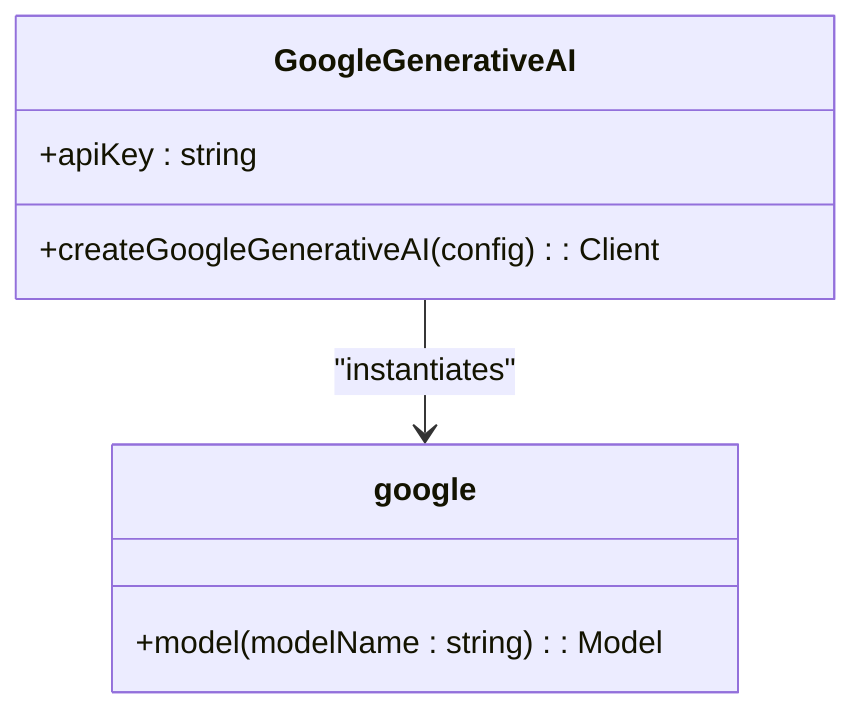
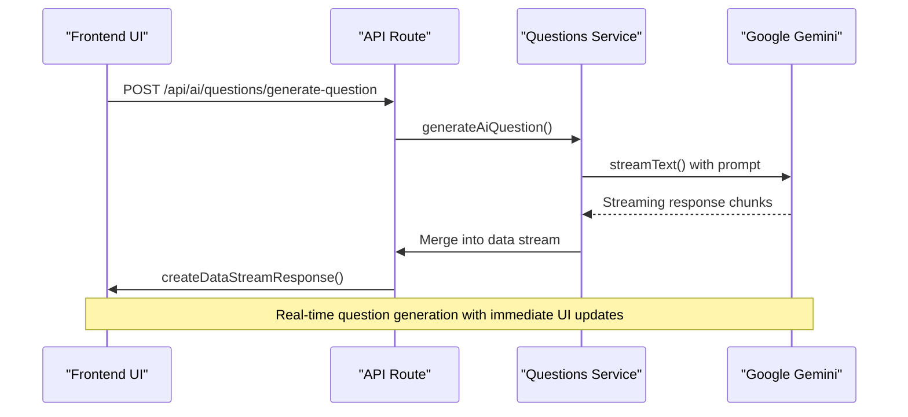
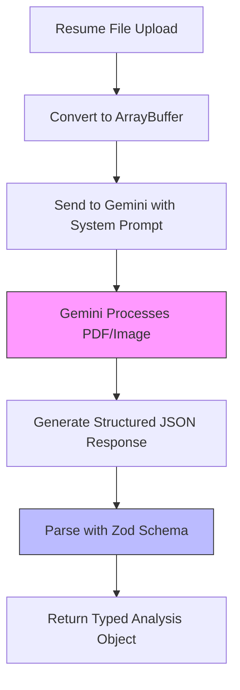
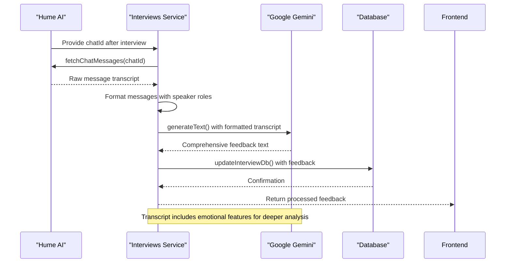
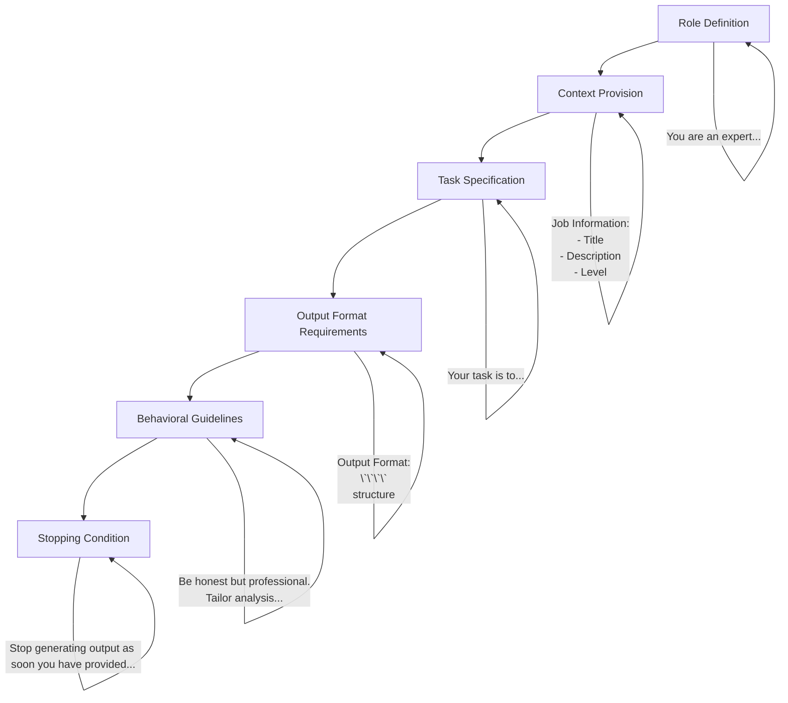

# Google Gemini Integration

<cite>
**Referenced Files in This Document**   
- [google.ts](file://src/services/ai/models/google.ts)
- [questions.ts](file://src/services/ai/questions.ts)
- [ai.ts](file://src/services/ai/resumes/ai.ts)
- [schemas.ts](file://src/services/ai/resumes/schemas.ts)
- [interviews.ts](file://src/services/ai/interviews.ts)
- [generate-question/route.ts](file://src/app/api/ai/questions/generate-question/route.ts)
</cite>

## Table of Contents
1. [Introduction](#introduction)
2. [Gemini Model Configuration](#gemini-model-configuration)
3. [Interview Question Generation](#interview-question-generation)
4. [Resume Analysis with Structured Output](#resume-analysis-with-structured-output)
5. [Voice Interview Feedback Integration](#voice-interview-feedback-integration)
6. [Prompt Engineering Strategies](#prompt-engineering-strategies)
7. [Error Handling and Rate Limiting](#error-handling-and-rate-limiting)
8. [Performance and Cost Optimization](#performance-and-cost-optimization)

## Introduction

The darasa application integrates Google's Gemini AI models through the `@ai-sdk/google` library to power intelligent features for job interview preparation and career development. The integration enables three core functionalities: generating technical interview questions, analyzing resumes against job descriptions, and providing feedback on voice-based interviews conducted via Hume AI. This document details the implementation architecture, configuration patterns, and usage strategies that enable these AI-powered capabilities.

## Gemini Model Configuration

The foundation of the Gemini integration is established in the model configuration file, which sets up the connection to Google's AI services using environment variables and the official SDK.

**Diagram sources**
- [google.ts](file://src/services/ai/models/google.ts#L3-L5)

**Section sources**
- [google.ts](file://src/services/ai/models/google.ts#L1-L6)

The `google` client is configured with the API key from the server environment and serves as the entry point for all Gemini interactions. The application consistently uses the `gemini-2.5-flash` model variant across its AI features, which represents a balance between performance, cost, and capability for the use cases implemented. This model selection is hardcoded in service functions rather than being configurable at runtime, ensuring consistency in behavior and response quality across the application.

## Interview Question Generation

The system generates context-aware technical interview questions by leveraging the Gemini model through streaming responses, allowing for real-time display of generated content in the user interface.

**Diagram sources**
- [questions.ts](file://src/services/ai/questions.ts#L10-L107)
- [generate-question/route.ts](file://src/app/api/ai/questions/generate-question/route.ts#L1-L89)

**Section sources**
- [questions.ts](file://src/services/ai/questions.ts#L1-L107)
- [generate-question/route.ts](file://src/app/api/ai/questions/generate-question/route.ts#L1-L89)

The question generation process incorporates contextual information including job description, experience level, and previous questions to ensure relevance and avoid repetition. The API route handles authentication, permission checks, and plan limitations before invoking the AI service. Upon successful generation, the system automatically persists the new question to the database and streams both the question text and its database ID back to the client for immediate use.

## Resume Analysis with Structured Output

The resume analysis feature demonstrates advanced usage of the Gemini integration by combining multimodal input processing with structured output parsing using Zod schemas.

**Diagram sources**
- [ai.ts](file://src/services/ai/resumes/ai.ts#L1-L79)
- [schemas.ts](file://src/services/ai/resumes/schemas.ts#L1-L37)

**Section sources**
- [ai.ts](file://src/services/ai/resumes/ai.ts#L1-L79)
- [schemas.ts](file://src/services/ai/resumes/schemas.ts#L1-L37)

The implementation uses `streamObject` instead of `streamText` to enforce structured output according to the `aiAnalyzeSchema` Zod schema. This schema defines a comprehensive evaluation framework with five assessment categories (ATS compatibility, job match, writing quality, keyword coverage, and other considerations), each containing a score, summary, and detailed feedback items. The system processes resume files directly by converting them to ArrayBuffer format, enabling Gemini to analyze PDFs, Word documents, or images of resumes. The prompt engineering guides the model to provide actionable, candidate-focused feedback while maintaining a consistent JSON structure that can be reliably consumed by the frontend.

## Voice Interview Feedback Integration

The application integrates with Hume AI for voice-based interviews and uses Gemini to analyze the recorded conversation transcripts, creating a powerful feedback loop for interview practice.

**Diagram sources**
- [interviews.ts](file://src/services/ai/interviews.ts#L1-L113)

**Section sources**
- [interviews.ts](file://src/services/ai/interviews.ts#L1-L113)

When a voice interview session concludes, the system retrieves the complete transcript from Hume AI, including timestamps, speaker identification, and emotional analysis data. The service formats this raw data into a structured message array that preserves the conversational flow and emotional context. Gemini then analyzes this transcript against the target job description to produce detailed feedback across seven performance categories, including communication clarity, confidence, response quality, and role fit. The feedback is personalized by addressing the candidate directly ("you") and includes specific references to moments in the conversation, creating a coaching-like experience.

## Prompt Engineering Strategies

The application employs sophisticated prompt engineering techniques to ensure high-quality, consistent outputs from the Gemini models across different use cases.

**System Prompt Structure Pattern:**

Each service function implements a specialized system prompt that follows a consistent structure: defining the AI's role, providing relevant context (job details, previous interactions), specifying the exact task, mandating output format, establishing behavioral guidelines, and including a stopping condition to prevent unnecessary token usage. The prompts are carefully crafted to produce markdown-formatted responses with clear headings and sections, enabling direct rendering in the application's UI without additional processing. For structured outputs like resume analysis, the prompt explicitly references the JSON schema to guide the model's response format.

## Error Handling and Rate Limiting

While the codebase does not contain explicit error handling blocks for Gemini API calls, the integration relies on several defensive programming practices to manage potential failures.

The application performs pre-validation of inputs through Zod schemas before initiating AI requests, preventing malformed data from reaching the API. Permission checks and authentication validation occur at the API route level, ensuring only authorized users can trigger resource-intensive AI operations. The system also implements plan-based access control, restricting AI feature usage according to the user's subscription tier. Although specific error handlers for rate limits, timeouts, or API outages are not visible in the analyzed code, the streaming nature of the responses provides some resilience by allowing partial results to be delivered even if a request is interrupted. Future improvements could include retry logic with exponential backoff, circuit breakers for degraded service, and fallback mechanisms for critical paths.

## Performance and Cost Optimization

The Gemini integration incorporates several performance and cost optimization strategies to deliver responsive AI features while managing operational expenses.

The consistent use of the `gemini-2.5-flash` model variant reflects a deliberate choice for lower latency and reduced cost compared to more capable but slower models. Streaming responses (`streamText`, `streamObject`) enable progressive rendering in the UI, improving perceived performance by displaying content as it becomes available rather than waiting for complete responses. The system minimizes redundant processing by incorporating caching mechanisms at multiple levels - both for database queries and potentially for AI responses, though response caching would need careful implementation to avoid serving stale or inappropriate content. Token usage is optimized through precise prompt engineering that avoids unnecessary verbosity while still providing sufficient context for high-quality outputs. The application also limits the depth of analysis through parameters like `maxSteps: 10`, preventing excessively long processing chains that could increase both latency and cost.