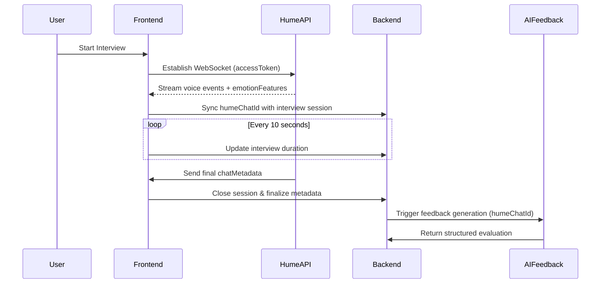
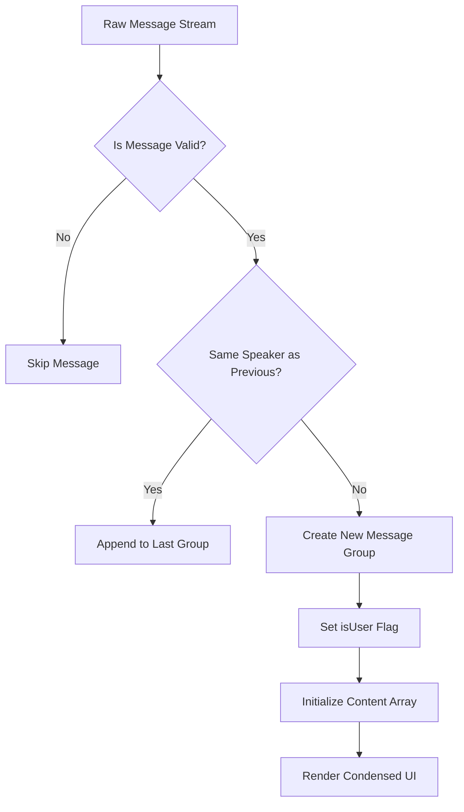
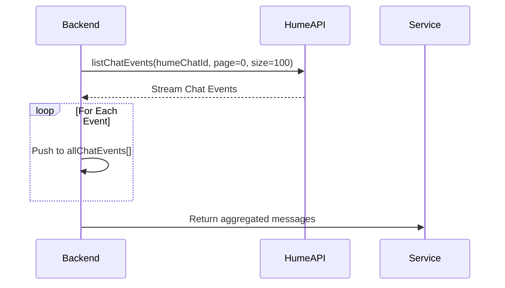
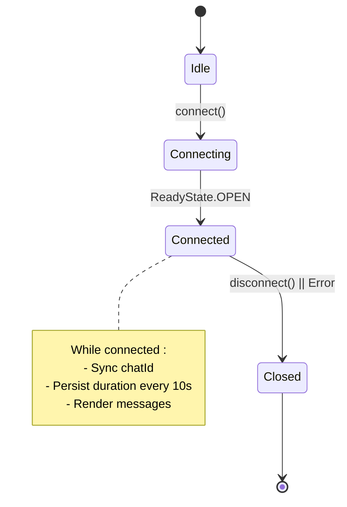

# Hume Voice AI

<cite>
**Referenced Files in This Document**   
- [CondensedMessages.tsx](file://src/services/hume/components/CondensedMessages.tsx)
- [api.ts](file://src/services/hume/lib/api.ts)
- [condenseChatMessages.ts](file://src/services/hume/lib/condenseChatMessages.ts)
- [_StartCall.tsx](file://src/app/app/job-infos/[jobInfoId]/interviews/new/_StartCall.tsx)
- [new/page.tsx](file://src/app/app/job-infos/[jobInfoId]/interviews/new/page.tsx)
- [interviews.ts](file://src/services/ai/interviews.ts)
</cite>

## Table of Contents
1. [Introduction](#introduction)
2. [Hume Voice AI Integration Overview](#hume-voice-ai-integration-overview)
3. [Frontend Components and Message Display](#frontend-components-and-message-display)
4. [Backend Services and API Interaction](#backend-services-and-api-interaction)
5. [Conversation History Processing](#conversation-history-processing)
6. [WebSocket Connection and State Management](#websocket-connection-and-state-management)
7. [Emotion Features Extraction and Feedback Generation](#emotion-features-extraction-and-feedback-generation)
8. [Hume Credentials and Session Management](#hume-credentials-and-session-management)
9. [Troubleshooting Audio Streaming Issues](#troubleshooting-audio-streaming-issues)

## Introduction
This document provides a comprehensive overview of the integration between darasa and Hume Voice AI for real-time voice interview simulation. It details how emotional tone and speech patterns are captured, processed, and used to generate personalized feedback. The interaction between frontend components such as `CondensedMessages.tsx` and backend services via `fetchChatMessages` in `api.ts` is explained, along with conversation history processing and state synchronization during live interviews.

## Hume Voice AI Integration Overview
The platform leverages Hume Voice AI to simulate realistic job interviews by capturing both spoken content and emotional cues from users. Real-time audio streams are analyzed using Hume’s Empathic Voice Interface (EVI), which extracts emotion features including vocal intensity, pitch variation, and sentiment indicators. These data points are synchronized with transcript messages and stored under a unique `humeChatId`, enabling post-interview analysis and AI-driven performance feedback.

**Diagram sources**
- [new/page.tsx](file://src/app/app/job-infos/[jobInfoId]/interviews/new/page.tsx#L36-L64)
- [_StartCall.tsx](file://src/app/app/job-infos/[jobInfoId]/interviews/new/_StartCall.tsx#L79-L129)
- [interviews.ts](file://src/services/ai/interviews.ts#L5-L113)

**Section sources**
- [new/page.tsx](file://src/app/app/job-infos/[jobInfoId]/interviews/new/page.tsx)
- [_StartCall.tsx](file://src/app/app/job-infos/[jobInfoId]/interviews/new/_StartCall.tsx)

## Frontend Components and Message Display
The `CondensedMessages.tsx` component renders the conversation flow between the user (interviewee) and the AI interviewer. It receives a list of message objects containing speaker role, text, and optional emotion features. Messages from the same speaker are grouped together using the `condenseChatMessages` utility function to improve readability.

Visual indicators include:
- User avatar for interviewee messages
- Animated brain icon for AI responses
- Dynamic scaling based on FFT (frequency spectrum) input to reflect vocal energy

**Diagram sources**
- [CondensedMessages.tsx](file://src/services/hume/components/CondensedMessages.tsx#L4-L54)
- [condenseChatMessages.ts](file://src/services/hume/lib/condenseChatMessages.ts#L5-L26)

**Section sources**
- [CondensedMessages.tsx](file://src/services/hume/components/CondensedMessages.tsx#L4-L54)
- [condenseChatMessages.ts](file://src/services/hume/lib/condenseChatMessages.ts#L5-L26)

## Backend Services and API Interaction
The `fetchChatMessages` function in `api.ts` retrieves all chat events associated with a given `humeChatId`. Using the HumeClient SDK, it paginates through the event stream and aggregates them into a complete transcript array. This data is later formatted and passed to the AI feedback pipeline.

Key implementation details:
- Uses server-side environment variables (`HUME_API_KEY`) for authentication
- Implements pagination with `pageSize: 100` to handle long conversations
- Leverages async iteration over `listChatEvents` for efficient streaming

**Diagram sources**
- [api.ts](file://src/services/hume/lib/api.ts#L4-L19)

**Section sources**
- [api.ts](file://src/services/hume/lib/api.ts#L4-L19)

## Conversation History Processing
After retrieving raw chat events via `fetchChatMessages`, the system processes them into a structured format suitable for AI analysis. Only `USER_MESSAGE` and `AGENT_MESSAGE` types are retained, while metadata like timestamps and emotion features are preserved selectively.

In `generateAiInterviewFeedback`, messages are transformed into a JSON structure that includes:
- `speaker`: "interviewee" or "interviewer"
- `text`: Transcribed speech content
- `emotionFeatures`: Available only for user messages, used internally for confidence and pacing analysis

This formatted transcript is then sent as a prompt to Google's Gemini model for generating detailed performance feedback.

**Section sources**
- [interviews.ts](file://src/services/ai/interviews.ts#L5-L113)

## WebSocket Connection and State Synchronization
During a live interview, the frontend establishes a secure WebSocket connection to Hume EVI using an access token generated from API and secret keys. The `VoiceProvider` context manages connection state, message streaming, and real-time metrics like FFT and call duration.

Critical state synchronization mechanisms:
- On connection open: `chatMetadata.chatId` is synced with the current `interviewId` via `updateInterview`
- Every 10 seconds: Current `callDurationTimestamp` is persisted to database
- On disconnect: Final duration is saved and user is redirected to feedback page

**Diagram sources**
- [_StartCall.tsx](file://src/app/app/job-infos/[jobInfoId]/interviews/new/_StartCall.tsx#L38-L80)
- [new/page.tsx](file://src/app/app/job-infos/[jobInfoId]/interviews/new/page.tsx#L36-L64)

**Section sources**
- [_StartCall.tsx](file://src/app/app/job-infos/[jobInfoId]/interviews/new/_StartCall.tsx#L38-L80)

## Emotion Features Extraction and Feedback Generation
Hume AI analyzes each user utterance in real time to extract emotion features such as excitement, calmness, hesitation, and confidence levels. These are represented as numerical intensities (0–1) per emotion category and attached to corresponding `USER_MESSAGE` events.

These emotion features play a critical role in personalized feedback generation:
- **Confidence Assessment**: High excitement + low hesitation scores indicate strong presence
- **Pacing Analysis**: Pauses detected via silence intervals combined with low FFT suggest uncertainty
- **Engagement Level**: Consistent vocal energy (measured via FFT peaks) correlates with active participation

The AI evaluator uses these signals alongside linguistic content to assess communication clarity, emotional state, and overall role fit.

**Section sources**
- [interviews.ts](file://src/services/ai/interviews.ts#L5-L113)
- [condenseChatMessages.ts](file://src/services/hume/lib/condenseChatMessages.ts#L5-L26)

## Hume Credentials and Session Management
To authenticate with Hume AI services:
1. Server generates an access token using `fetchAccessToken({ apiKey, secretKey })`
2. Token is passed securely to the client component within `_StartCall.tsx`
3. Client uses token to establish WebSocket connection via `auth: { type: "accessToken", value }`

Each interview session is uniquely identified by:
- `humeChatId`: Assigned by Hume upon connection; stored in `InterviewTable`
- `interviewId`: Internal database ID; linked to user and job info
- `configId`: Retrieved from `NEXT_PUBLIC_HUME_CONFIG_ID` environment variable

Session variables like `userName`, `title`, and `experienceLevel` are injected at connection time to personalize the AI interviewer’s behavior.

**Section sources**
- [new/page.tsx](file://src/app/app/job-infos/[jobInfoId]/interviews/new/page.tsx#L36-L64)
- [_StartCall.tsx](file://src/app/app/job-infos/[jobInfoId]/interviews/new/_StartCall.tsx#L79-L129)

## Troubleshooting Audio Streaming Issues
Common issues and resolutions:

| Issue | Cause | Solution |
|------|-------|----------|
| No microphone access | Browser permissions blocked | Prompt user to enable mic access manually |
| Silent input despite connection | Muted state not reflected | Ensure `isMuted` state syncs with UI button; use `mute()`/`unmute()` handlers |
| Delayed or missing messages | Network latency or reconnection | Implement local echo for user messages; validate `readyState` before sending |
| Incomplete emotion data | Short utterances | Encourage longer responses; validate minimum speech length |
| WebSocket closure after short time | Authentication failure | Verify `apiKey` and `secretKey` validity; check token expiration |

Ensure environment variables are correctly set:
- `HUME_API_KEY`: Public key for client initialization
- `HUME_SECRET_KEY`: Used server-side to generate access tokens
- `NEXT_PUBLIC_HUME_CONFIG_ID`: Points to correct EVI configuration

**Section sources**
- [_StartCall.tsx](file://src/app/app/job-infos/[jobInfoId]/interviews/new/_StartCall.tsx#L38-L80)
- [new/page.tsx](file://src/app/app/job-infos/[jobInfoId]/interviews/new/page.tsx#L36-L64)