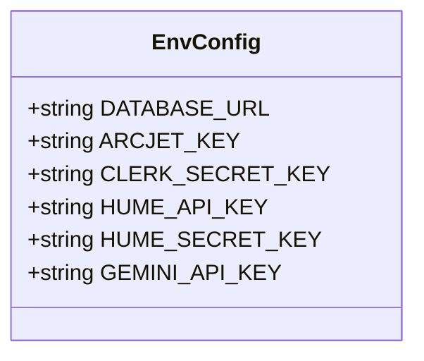

# OpenAI Integration

<cite>
**Referenced Files in This Document **   
- [google.ts](file://src/services/ai/models/google.ts)
- [package-lock.json](file://package-lock.json)
- [server.ts](file://src/data/env/server.ts)
</cite>

## Table of Contents
1. [Introduction](#introduction)
2. [OpenAI Dependency Analysis](#openai-dependency-analysis)
3. [Configuration and Environment Setup](#configuration-and-environment-setup)
4. [Provider Usage and AI Abstraction Layer](#provider-usage-and-ai-abstraction-layer)
5. [Integration with Core Services](#integration-with-core-services)
6. [Error Handling and Fallback Considerations](#error-handling-and-fallback-considerations)
7. [Conclusion](#conclusion)

## Introduction
This document provides a comprehensive analysis of OpenAI integration within the darasa application, focusing on its role as an optional AI provider through the `@ai-sdk/openai` package. While Google Gemini is the primary AI provider used throughout the codebase, OpenAI is included as a dependency and may serve as an alternative or fallback option. The documentation details configuration requirements, API key management, model invocation patterns, and compatibility with existing services such as question generation and resume analysis.

## OpenAI Dependency Analysis
The project includes the `@ai-sdk/openai` package as a direct dependency, indicating support for OpenAI models via the AI SDK abstraction layer. Despite this inclusion, no active usage of OpenAI providers was found in the service implementations, which exclusively use Google's Gemini models.

```mermaid
dependencyDiagram
graph TD
A["@ai-sdk/openai"] --> B["@ai-sdk/provider"]
A --> C["@ai-sdk/provider-utils"]
D["ai"] --> E["@ai-sdk/react"]
D --> F["@ai-sdk/ui-utils"]
G["@ai-sdk/google"] --> H["@ai-sdk/provider"]
G --> I["@ai-sdk/provider-utils"]
```

**Diagram sources**
- [package-lock.json](file://package-lock.json#L110-L147)

**Section sources**
- [package-lock.json](file://package-lock.json#L110-L147)

## Configuration and Environment Setup
The environment configuration does not include any OpenAI-specific API keys. Instead, it defines `GEMINI_API_KEY` as the sole AI provider credential, reinforcing that Google Gemini is the default and currently active provider.



**Diagram sources**
- [server.ts](file://src/data/env/server.ts#L1-L58)

**Section sources**
- [server.ts](file://src/data/env/server.ts#L1-L58)

## Provider Usage and AI Abstraction Layer
The application uses the AI SDK to abstract AI provider interactions, allowing potential switching between providers without major code changes. However, all current implementations explicitly import and use the Google provider.

The `google` instance is created using `createGoogleGenerativeAI` and configured with the `GEMINI_API_KEY` from environment variables. This instance is then used across various AI-powered features including interview feedback generation, resume analysis, and question generation.

No equivalent `openai` provider instance was found in the codebase, nor were there any conditional logic blocks to switch between providers based on configuration.

**Section sources**
- [google.ts](file://src/services/ai/models/google.ts#L1-L5)

## Integration with Core Services
All AI-powered services in the application are integrated with the Google Gemini provider. These include:

- Resume analysis (`analyzeResumeForJob`)
- Interview feedback generation (`generateAiInterviewFeedback`)
- Question generation (`generateAiQuestion`)

Each service imports the `google` model instance from `./models/google` and uses it directly with specific Gemini models (e.g., "gemini-2.5-flash"). The architecture supports pluggable AI providers through the AI SDK interface, but only Google's implementation is currently utilized.

Despite the presence of the OpenAI package, there is no evidence of feature toggles, provider selection mechanisms, or fallback strategies to OpenAI in case of Gemini unavailability.

**Section sources**
- [google.ts](file://src/services/ai/models/google.ts#L1-L5)
- [questions.ts](file://src/services/ai/questions.ts#L1-L107)
- [interviews.ts](file://src/services/ai/interviews.ts#L1-L113)
- [ai.ts](file://src/services/ai/resumes/ai.ts#L1-L79)

## Error Handling and Fallback Considerations
The codebase does not implement explicit error recovery strategies for AI provider failures. There are no try-catch blocks that would fall back to OpenAI if Google's API fails, nor are there circuit breaker patterns or retry mechanisms with alternate providers.

Rate limiting is likely handled by the AI SDK and underlying provider APIs, but no custom rate limiting logic or quota management for either Google or OpenAI was identified in the analyzed files.

Authentication is managed solely through API keys stored in environment variables, with no dynamic credential rotation or multi-provider authentication schemes present.

**Section sources**
- [questions.ts](file://src/services/ai/questions.ts#L1-L107)
- [interviews.ts](file://src/services/ai/interviews.ts#L1-L113)
- [ai.ts](file://src/services/ai/resumes/ai.ts#L1-L79)

## Conclusion
While the darasa application includes the `@ai-sdk/openai` package as a dependency, OpenAI is not actively used as an AI provider in the current implementation. The system is built around Google Gemini as the primary and only utilized AI service. The architecture supports provider abstraction through the AI SDK, making future integration of OpenAI feasible, but no such functionality has been implemented. There are no fallback mechanisms, provider switching capabilities, or dual-provider configurations in place. To enable OpenAI as a fallback or alternative provider, additional configuration, provider instantiation, and error handling logic would need to be implemented.