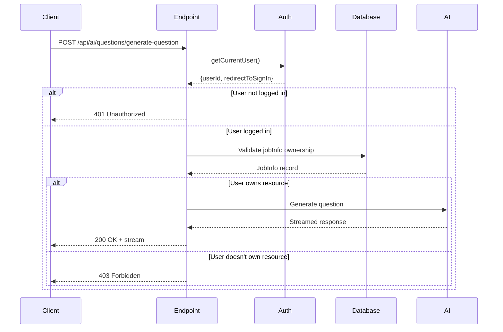
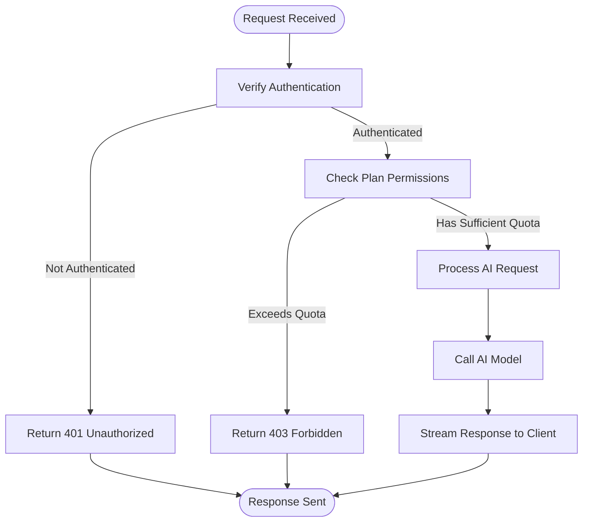
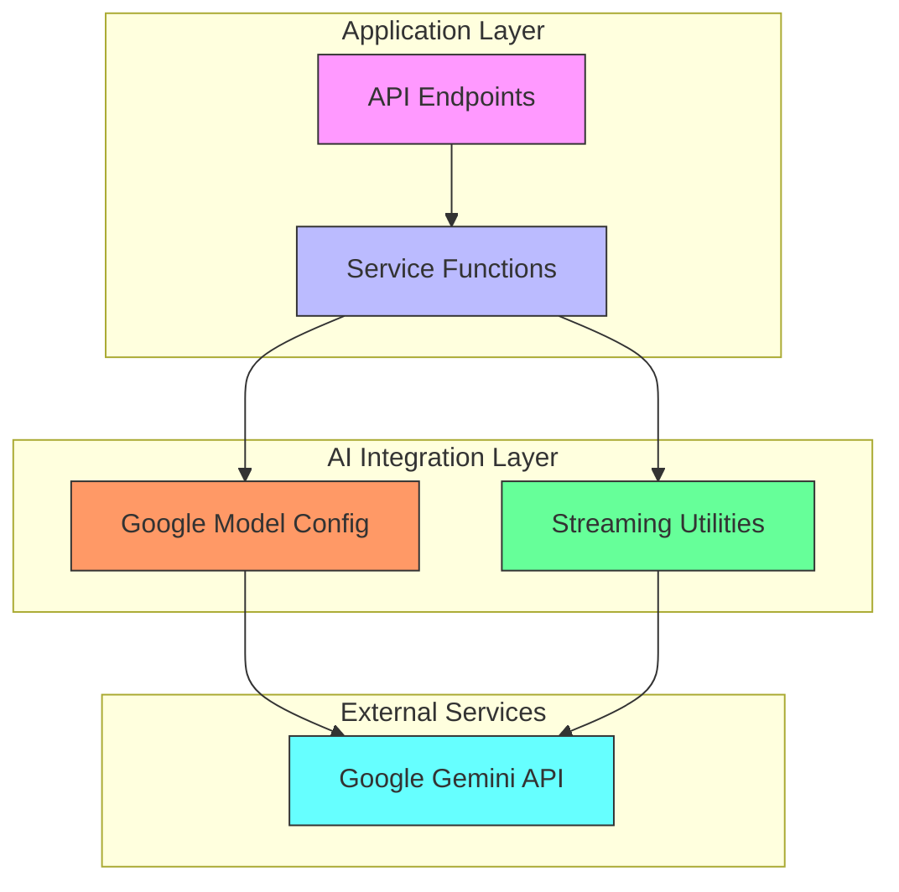

# AI API Reference

<cite>
**Referenced Files in This Document**   
- [src/app/api/ai/questions/generate-question/route.ts](file://src/app/api/ai/questions/generate-question/route.ts)
- [src/app/api/ai/questions/generate-feedback/route.ts](file://src/app/api/ai/questions/generate-feedback/route.ts)
- [src/app/api/ai/resumes/analyze/route.ts](file://src/app/api/ai/resumes/analyze/route.ts)
- [src/services/ai/questions.ts](file://src/services/ai/questions.ts)
- [src/services/ai/resumes/ai.ts](file://src/services/ai/resumes/ai.ts)
- [src/services/ai/models/google.ts](file://src/services/ai/models/google.ts)
- [src/services/ai/resumes/schemas.ts](file://src/services/ai/resumes/schemas.ts)
- [src/drizzle/schema/question.ts](file://src/drizzle/schema/question.ts)
- [src/drizzle/schema/jobinfo.ts](file://src/drizzle/schema/jobinfo.ts)
- [src/features/questions/permissions.ts](file://src/features/questions/permissions.ts)
- [src/features/resumeAnalysis/permissions.ts](file://src/features/resumeAnalysis/permissions.ts)
- [src/services/clerk/lib/getCurrentUser.ts](file://src/services/clerk/lib/getCurrentUser.ts)
</cite>

## Table of Contents
1. [Introduction](#introduction)
2. [Authentication and Authorization](#authentication-and-authorization)
3. [Rate Limiting and Plan Controls](#rate-limiting-and-plan-controls)
4. [AI Model Integration](#ai-model-integration)
5. [Question Generation Endpoint](#question-generation-endpoint)
6. [Feedback Generation Endpoint](#feedback-generation-endpoint)
7. [Resume Analysis Endpoint](#resume-analysis-endpoint)
8. [Error Handling](#error-handling)
9. [Client-Side Implementation](#client-side-implementation)
10. [Debugging Strategies](#debugging-strategies)

## Introduction

The darasa platform provides a suite of AI-powered endpoints designed to enhance technical interview preparation and career development. These endpoints leverage large language models through Google Gemini to generate intelligent responses for various use cases including technical question generation, answer feedback, and resume analysis. All endpoints are protected by authentication and incorporate rate limiting based on user subscription plans.

The AI functionality is structured around three primary endpoints:
- `/api/ai/questions/generate-question`: Generates technical interview questions based on job descriptions
- `/api/ai/questions/generate-feedback`: Provides scored feedback on interview answers
- `/api/ai/resumes/analyze`: Analyzes resumes against job requirements and provides improvement recommendations

All endpoints follow RESTful principles with JSON request/response payloads and appropriate HTTP status codes for error conditions.

**Section sources**
- [src/app/api/ai/questions/generate-question/route.ts](file://src/app/api/ai/questions/generate-question/route.ts)
- [src/app/api/ai/questions/generate-feedback/route.ts](file://src/app/api/ai/questions/generate-feedback/route.ts)
- [src/app/api/ai/resumes/analyze/route.ts](file://src/app/api/ai/resumes/analyze/route.ts)

## Authentication and Authorization

All AI endpoints require authenticated access via Clerk integration. The system verifies user identity through the `getCurrentUser` function, which extracts authentication state from the request context.

When a request is received, the endpoint calls `getCurrentUser()` to retrieve the authenticated user's ID. If no valid session exists (userId is null), the endpoint returns a 401 Unauthorized response. This authentication check occurs at the beginning of each endpoint's execution flow before any business logic is processed.

The authorization model ensures that users can only access resources they own. For example, when generating questions or feedback, the system validates that the referenced job information belongs to the authenticated user by checking the userId field in the database record.



**Diagram sources**
- [src/services/clerk/lib/getCurrentUser.ts](file://src/services/clerk/lib/getCurrentUser.ts#L7-L15)
- [src/app/api/ai/questions/generate-question/route.ts](file://src/app/api/ai/questions/generate-question/route.ts#L20-L25)

**Section sources**
- [src/services/clerk/lib/getCurrentUser.ts](file://src/services/clerk/lib/getCurrentUser.ts#L7-L15)
- [src/app/api/ai/questions/generate-question/route.ts](file://src/app/api/ai/questions/generate-question/route.ts#L20-L25)
- [src/app/api/ai/questions/generate-feedback/route.ts](file://src/app/api/ai/questions/generate-feedback/route.ts#L20-L25)
- [src/app/api/ai/resumes/analyze/route.ts](file://src/app/api/ai/resumes/analyze/route.ts#L10-L15)

## Rate Limiting and Plan Controls

The AI endpoints implement plan-based rate limiting through permission checks that enforce subscription limits. These controls prevent abuse and ensure fair usage across different user tiers.

For question generation, the `canCreateQuestion()` function evaluates whether the user has sufficient quota based on their subscription plan. Users with "unlimited_questions" permission can generate unlimited questions, while those with "5_questions" permission are limited to five questions total, checked against their current question count in the database.

Similarly, resume analysis is controlled by `canRunResumeAnalysis()`, which grants access only to users with the "unlimited_resume_analysis" permission. When quota limits are exceeded, endpoints return a 403 Forbidden response with a descriptive message defined in `PLAN_LIMIT_MESSAGE`.



**Diagram sources**
- [src/features/questions/permissions.ts](file://src/features/questions/permissions.ts#L6-L16)
- [src/features/resumeAnalysis/permissions.ts](file://src/features/resumeAnalysis/permissions.ts#L2-L4)
- [src/app/api/ai/questions/generate-question/route.ts](file://src/app/api/ai/questions/generate-question/route.ts#L27-L31)
- [src/app/api/ai/resumes/analyze/route.ts](file://src/app/api/ai/resumes/analyze/route.ts#L48-L52)

**Section sources**
- [src/features/questions/permissions.ts](file://src/features/questions/permissions.ts#L6-L16)
- [src/features/resumeAnalysis/permissions.ts](file://src/features/resumeAnalysis/permissions.ts#L2-L4)
- [src/lib/errorToast.tsx](file://src/lib/errorToast.tsx)

## AI Model Integration

The AI functionality integrates with Google Gemini through the @ai-sdk/google package, configured with API key authentication. The integration is centralized in `google.ts`, which exports a configured model factory function.

The system uses Google's Gemini 2.5 Flash model for all AI operations, selected for its balance of speed and capability. The model configuration includes the GEMINI_API_KEY from environment variables, ensuring secure credential management. This single integration point allows consistent model behavior across all AI features while simplifying configuration updates.

All AI operations leverage streaming capabilities to provide immediate feedback to users. Question generation uses `streamText` for continuous text output, while resume analysis employs `streamObject` to generate structured JSON responses according to predefined schemas.



**Diagram sources**
- [src/services/ai/models/google.ts](file://src/services/ai/models/google.ts#L1-L6)
- [src/services/ai/questions.ts](file://src/services/ai/questions.ts#L7-L8)
- [src/services/ai/resumes/ai.ts](file://src/services/ai/resumes/ai.ts#L2-L3)

**Section sources**
- [src/services/ai/models/google.ts](file://src/services/ai/models/google.ts#L1-L6)
- [src/services/ai/questions.ts](file://src/services/ai/questions.ts#L7-L8)
- [src/services/ai/resumes/ai.ts](file://src/services/ai/resumes/ai.ts#L2-L3)

## Question Generation Endpoint

The `/api/ai/questions/generate-question` endpoint generates technical interview questions tailored to specific job descriptions and difficulty levels. It accepts a JSON payload containing a jobInfoId and difficulty level, then uses AI to create relevant questions based on the job's requirements.

### Request Schema
The request body must conform to the following Zod schema:

```typescript
const schema = z.object({
  prompt: z.enum(["easy", "medium", "hard"]),
  jobInfoId: z.string().min(1),
})
```

### Request Format
```json
{
  "prompt": "medium",
  "jobInfoId": "clx1a2b3c4d5e6f7g8h9i0j1k"
}
```

### Response Format
The endpoint returns a streamed response with