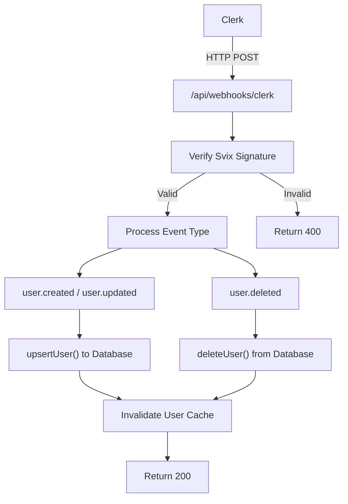
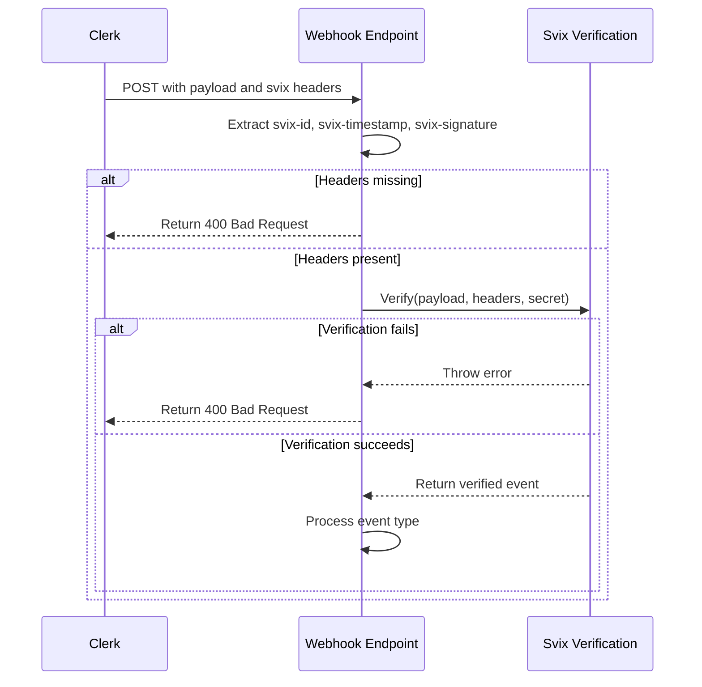
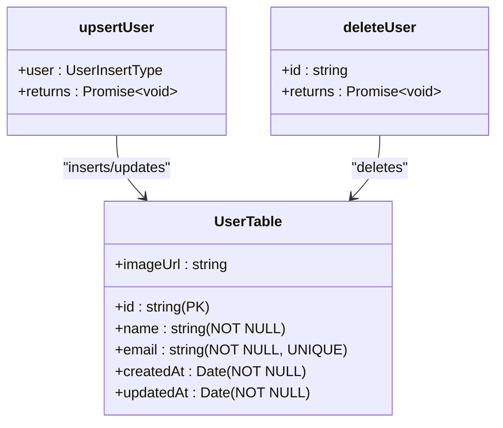
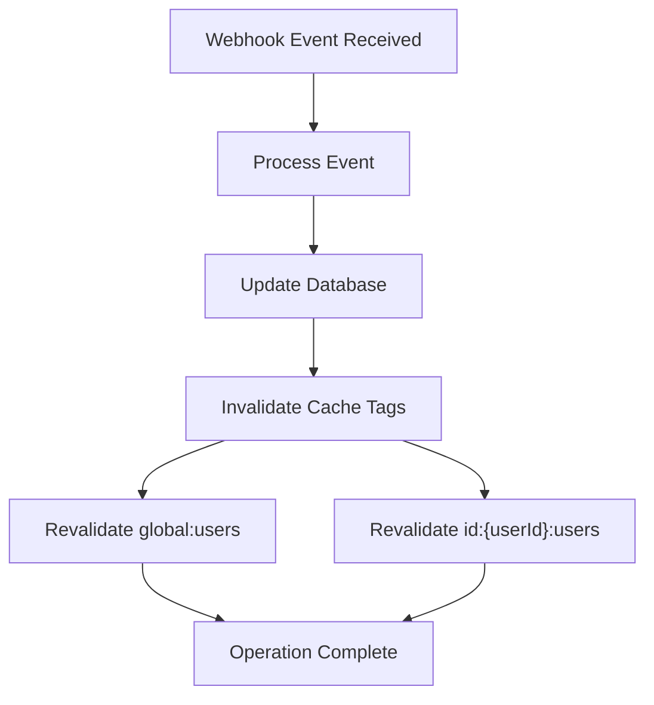

# Webhooks Reference

<cite>
**Referenced Files in This Document **   
- [src/app/api/webhooks/clerk/route.ts](file://src/app/api/webhooks/clerk/route.ts)
- [src/drizzle/schema/user.ts](file://src/drizzle/schema/user.ts)
- [src/features/users/db.ts](file://src/features/users/db.ts)
- [src/features/users/dbCache.ts](file://src/features/users/dbCache.ts)
- [src/lib/dataCache.ts](file://src/lib/dataCache.ts)
</cite>

## Table of Contents
1. [Introduction](#introduction)
2. [Webhook Endpoint Overview](#webhook-endpoint-overview)
3. [Event Types and Payload Structure](#event-types-and-payload-structure)
4. [Signature Verification Process](#signature-verification-process)
5. [Database Synchronization Logic](#database-synchronization-logic)
6. [Cache Invalidation Mechanism](#cache-invalidation-mechanism)
7. [Security Practices](#security-practices)
8. [Error Handling and Logging](#error-handling-and-logging)
9. [Idempotency and Retry Logic](#idempotency-and-retry-logic)
10. [Testing Guidance](#testing-guidance)

## Introduction
The `/api/webhooks/clerk` endpoint serves as the integration point between Clerk's authentication system and the application's user management system. It receives user lifecycle events from Clerk, verifies their authenticity, and synchronizes user data with the PostgreSQL database using Drizzle ORM. This documentation provides comprehensive details about the webhook implementation, including payload structure, security measures, data synchronization logic, and operational best practices.

## Webhook Endpoint Overview
The webhook endpoint at `/api/webhooks/clerk` handles HTTP POST requests from Clerk containing user event notifications. It processes three primary event types: `user.created`, `user.updated`, and `user.deleted`. The endpoint implements proper signature verification using Svix, integrates with Drizzle ORM for database operations, and maintains cache consistency across the application. A GET endpoint is also available for testing accessibility.



**Diagram sources **
- [src/app/api/webhooks/clerk/route.ts](file://src/app/api/webhooks/clerk/route.ts#L1-L123)

**Section sources**
- [src/app/api/webhooks/clerk/route.ts](file://src/app/api/webhooks/clerk/route.ts#L1-L123)

## Event Types and Payload Structure
The webhook endpoint handles the following event types from Clerk:

- `user.created`: Triggered when a new user is created in Clerk
- `user.updated`: Triggered when an existing user is updated in Clerk
- `user.deleted`: Triggered when a user is deleted from Clerk

The expected payload structure includes the event type and user data:

```json
{
  "type": "user.created",
  "data": {
    "id": "clerk_user_abc123",
    "email_addresses": [
      {
        "id": "email_address_123",
        "email_address": "user@example.com"
      }
    ],
    "primary_email_address_id": "email_address_123",
    "first_name": "John",
    "last_name": "Doe",
    "image_url": "https://example.com/avatar.jpg",
    "created_at": 1700000000000,
    "updated_at": 1700000000000
  }
}
```

For `user.created` and `user.updated` events, the system extracts the primary email address by matching the `primary_email_address_id` with the corresponding entry in the `email_addresses` array. The full name is constructed from `first_name` and `last_name` fields, defaulting to "User" if both are empty. The `image_url` field is optional and may be null.

**Section sources**
- [src/app/api/webhooks/clerk/route.ts](file://src/app/api/webhooks/clerk/route.ts#L8-L20)

## Signature Verification Process
The webhook implements robust signature verification using Svix to ensure that incoming requests originate from Clerk and have not been tampered with. The process involves:

1. Extracting Svix headers (`svix-id`, `svix-timestamp`, `svix-signature`) from the request
2. Validating that all required headers are present
3. Using the `CLERK_WEBHOOK_SIGNING_SECRET` environment variable to create a Svix Webhook instance
4. Verifying the payload against the provided headers



**Diagram sources **
- [src/app/api/webhooks/clerk/route.ts](file://src/app/api/webhooks/clerk/route.ts#L30-L55)

**Section sources**
- [src/app/api/webhooks/clerk/route.ts](file://src/app/api/webhooks/clerk/route.ts#L30-L55)

## Database Synchronization Logic
The webhook synchronizes user data with the PostgreSQL database using Drizzle ORM through the `upsertUser` and `deleteUser` functions. The User table schema defines the following fields:

| Field | Type | Constraints | Description |
|-------|------|-------------|-------------|
| id | varchar(255) | Primary Key | Clerk user ID |
| name | varchar(255) | Not Null | Full name |
| email | varchar(255) | Not Null, Unique | Primary email address |
| imageUrl | varchar(1000) | Nullable | Profile image URL |
| createdAt | timestamp | Not Null | Creation timestamp |
| updatedAt | timestamp | Not Null | Last update timestamp |

For `user.created` and `user.updated` events, the system performs an upsert operation that inserts a new record or updates an existing one based on the user ID. For `user.deleted` events, the system removes the corresponding record from the database.



**Diagram sources **
- [src/drizzle/schema/user.ts](file://src/drizzle/schema/user.ts#L1-L17)
- [src/features/users/db.ts](file://src/features/users/db.ts#L1-L21)

**Section sources**
- [src/drizzle/schema/user.ts](file://src/drizzle/schema/user.ts#L1-L17)
- [src/features/users/db.ts](file://src/features/users/db.ts#L1-L21)

## Cache Invalidation Mechanism
To maintain data consistency across the application, the webhook triggers cache invalidation whenever user data changes. The caching system uses Next.js tags for efficient cache management:

- Global user cache tag: `global:users`
- Individual user cache tag: `id:{userId}:users`

When a user is created, updated, or deleted, the `revalidateUserCache` function is called, which invalidates both the global users cache and the specific user's cache. This ensures that subsequent requests retrieve fresh data from the database.



**Diagram sources **
- [src/features/users/db.ts](file://src/features/users/db.ts#L1-L21)
- [src/features/users/dbCache.ts](file://src/features/users/dbCache.ts#L1-L14)
- [src/lib/dataCache.ts](file://src/lib/dataCache.ts#L1-L16)

**Section sources**
- [src/features/users/db.ts](file://src/features/users/db.ts#L1-L21)
- [src/features/users/dbCache.ts](file://src/features/users/dbCache.ts#L1-L14)

## Security Practices
The webhook implementation incorporates multiple security measures to protect against unauthorized access and abuse:

1. **Signature Verification**: All requests are validated using Svix signatures to ensure they originate from Clerk
2. **Environment Secret**: The `CLERK_WEBHOOK_SIGNING_SECRET` is stored in environment variables and never exposed client-side
3. **Input Validation**: The system validates the presence of required headers and essential user data fields
4. **Rate Limiting**: Integration with Arcjet provides rate limiting and bot detection capabilities
5. **Error Handling**: Comprehensive error logging without exposing sensitive information in responses

The endpoint returns generic error messages (400 status) for verification failures to prevent information leakage while logging detailed errors server-side for debugging purposes.

**Section sources**
- [src/app/api/webhooks/clerk/route.ts](file://src/app/api/webhooks/clerk/route.ts#L30-L55)
- [src/app/api/arcjet/route.ts](file://src/app/api/arcjet/route.ts#L1-L80)

## Error Handling and Logging
The webhook implements comprehensive error handling and logging to facilitate monitoring and debugging:

- All successful operations are logged with appropriate emojis