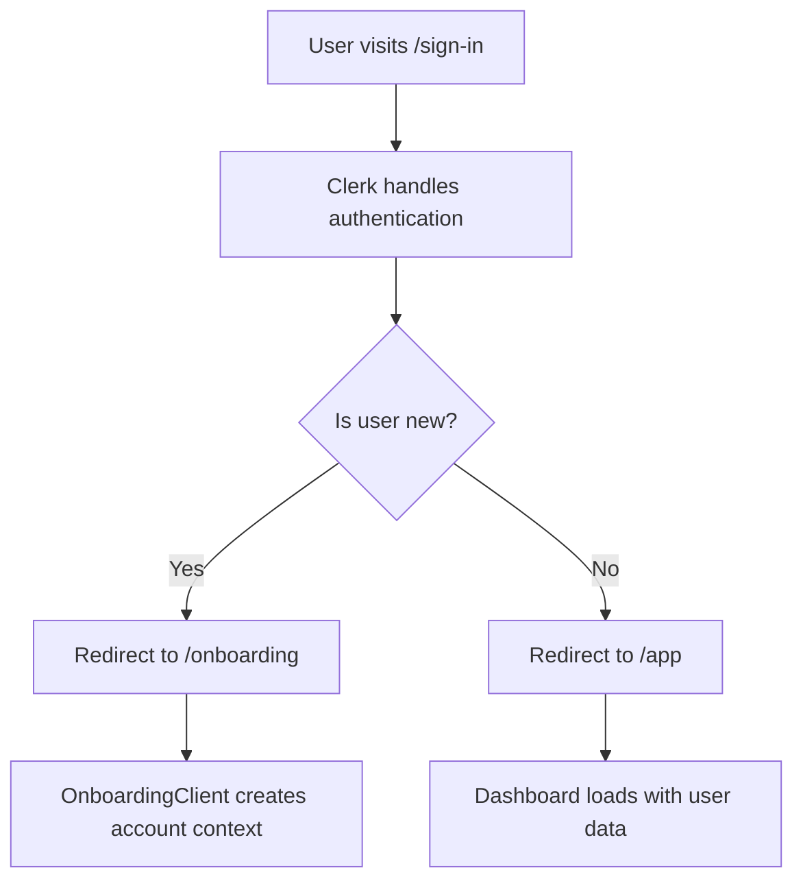
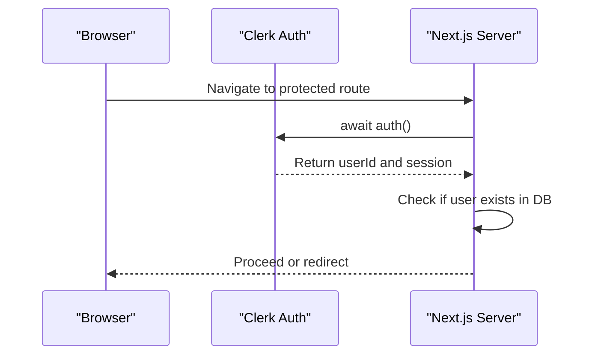
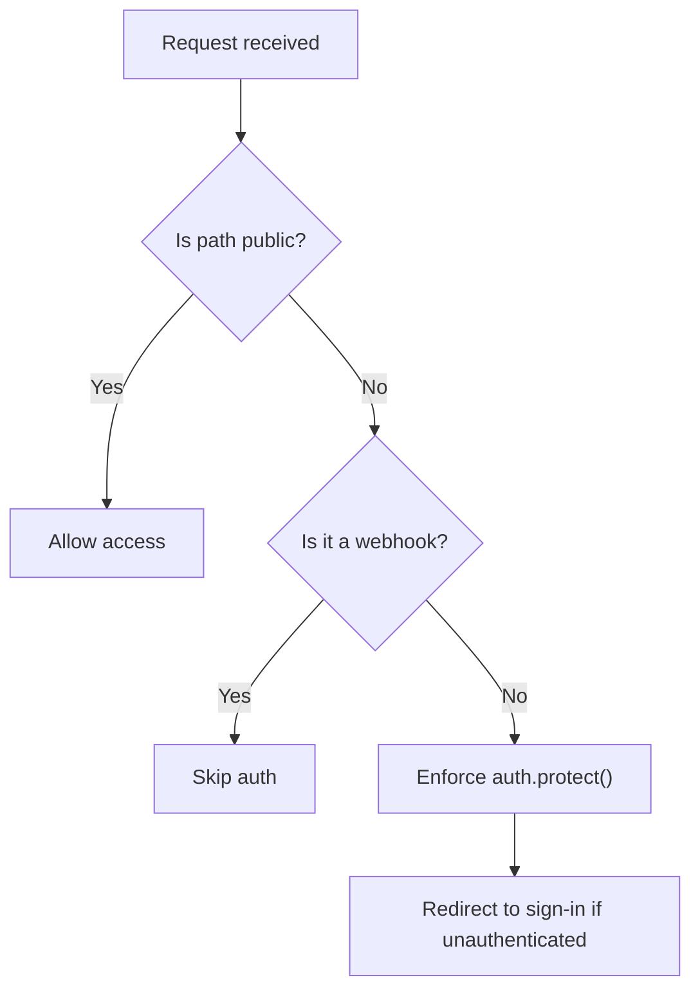
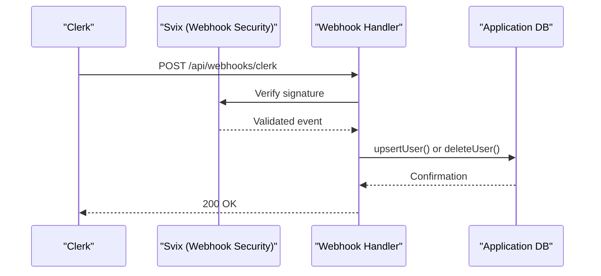
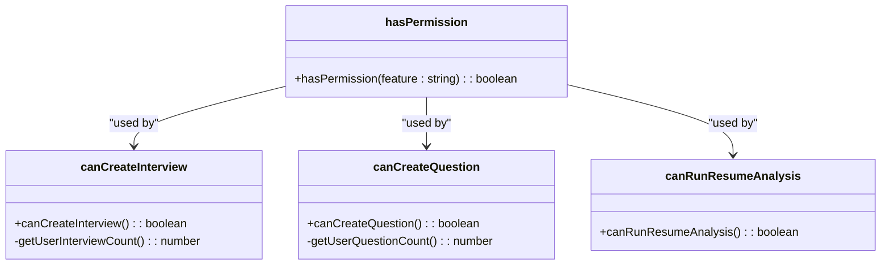
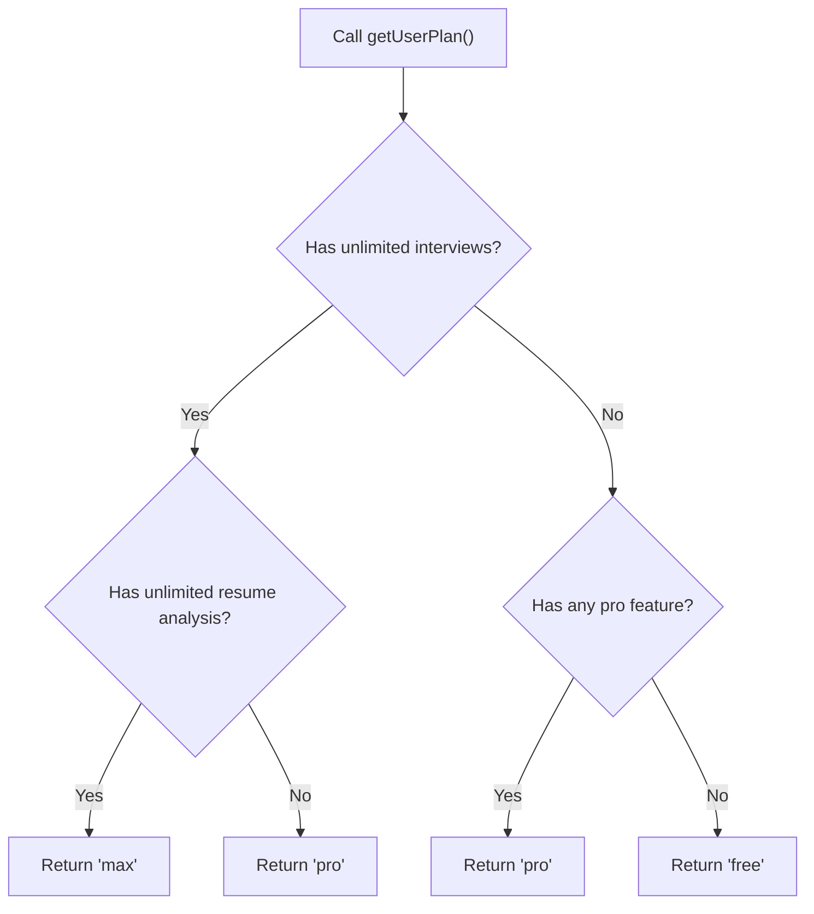

# Authentication & Authorization

<cite>
**Referenced Files in This Document**   
- [getCurrentUser.ts](file://src/services/clerk/lib/getCurrentUser.ts)
- [hasPermission.ts](file://src/services/clerk/lib/hasPermission.ts)
- [middleware.ts](file://src/middleware.ts)
- [route.ts](file://src/app/api/webhooks/clerk/route.ts)
- [page.tsx](file://src/app/sign-in/[[...sign-in]]/page.tsx)
- [plan.ts](file://src/features/users/plan.ts)
- [permissions.ts](file://src/features/interviews/permissions.ts)
- [permissions.ts](file://src/features/questions/permissions.ts)
- [permissions.ts](file://src/features/resumeAnalysis/permissions.ts)
- [onboarding/page.tsx](file://src/app/onboarding/page.tsx)
- [db.ts](file://src/features/users/db.ts)
</cite>

## Table of Contents
1. [Introduction](#introduction)
2. [Authentication Flow Overview](#authentication-flow-overview)
3. [Clerk Integration and User Session Management](#clerk-integration-and-user-session-management)
4. [Route Protection via Middleware](#route-protection-via-middleware)
5. [User Profile Synchronization with Webhooks](#user-profile-synchronization-with-webhooks)
6. [Role-Based Access Control and Permissions](#role-based-access-control-and-permissions)
7. [Subscription Plan Enforcement](#subscription-plan-enforcement)
8. [Secure API Access and JWT Handling](#secure-api-access-and-jwt-handling)
9. [Common Authentication Issues and Mitigations](#common-authentication-issues-and-mitigations)
10. [Conclusion](#conclusion)

## Introduction
This document provides a comprehensive overview of the authentication and authorization system in Darasa, built on Clerk and integrated with Next.js. It details how user sign-in, session management, profile synchronization, and access control are implemented across the application. The system leverages `@clerk/nextjs` for secure identity management, enforces role-based permissions through feature flags, and manages subscription tiers using metadata stored in Clerk.

## Authentication Flow Overview
The authentication flow begins at the `/sign-in` route, where users can either sign in or create an account using Clerk’s pre-built UI components. Upon successful authentication, users are redirected based on their onboarding status: new users are directed to the onboarding page, while returning users proceed directly to the dashboard (`/app`). This decision is made server-side using the `getCurrentUser` utility function.

**Diagram sources**
- [page.tsx](file://src/app/sign-in/[[...sign-in]]/page.tsx#L1-L62)
- [onboarding/page.tsx](file://src/app/onboarding/page.tsx#L1-L16)

**Section sources**
- [page.tsx](file://src/app/sign-in/[[...sign-in]]/page.tsx#L1-L62)
- [onboarding/page.tsx](file://src/app/onboarding/page.tsx#L1-L16)

## Clerk Integration and User Session Management
Darasa uses `@clerk/nextjs` for seamless authentication and session handling. The `auth()` function from Clerk is used throughout the application to retrieve the current user's session and ID. The `getCurrentUser` utility wraps this functionality and optionally fetches full user data from the database when needed.

**Diagram sources**
- [getCurrentUser.ts](file://src/services/clerk/lib/getCurrentUser.ts#L7-L15)

**Section sources**
- [getCurrentUser.ts](file://src/services/clerk/lib/getCurrentUser.ts#L7-L15)

## Route Protection via Middleware
All routes except public ones (`/`, `/sign-in`, and `/api/webhooks`) are protected by `clerkMiddleware`. This ensures that unauthenticated users are redirected to the sign-in page. The middleware also allows webhook endpoints to bypass authentication, which is essential for receiving events from Clerk without requiring bearer tokens.

**Diagram sources**
- [middleware.ts](file://src/middleware.ts#L1-L54)

**Section sources**
- [middleware.ts](file://src/middleware.ts#L1-L54)

## User Profile Synchronization with Webhooks
User data is synchronized between Clerk and the application database using webhooks hosted at `/api/webhooks/clerk`. These webhooks listen for `user.created`, `user.updated`, and `user.deleted` events, ensuring that the internal user table stays consistent with Clerk’s records. The Svix library verifies incoming payloads using cryptographic signatures.

**Diagram sources**
- [route.ts](file://src/app/api/webhooks/clerk/route.ts#L1-L123)
- [db.ts](file://src/features/users/db.ts#L5-L21)

**Section sources**
- [route.ts](file://src/app/api/webhooks/clerk/route.ts#L1-L123)
- [db.ts](file://src/features/users/db.ts#L5-L21)

## Role-Based Access Control and Permissions
Permissions are managed through Clerk’s feature-based permission model. Each feature corresponds to a capability such as creating interviews or analyzing resumes. The `hasPermission` utility checks these features server-side, enabling fine-grained access control. Feature flags like `unlimited_interviews` and `unlimited_questions` determine what actions a user can perform.

Multiple features implement permission logic:
- **Interviews**: Checks for unlimited access or limited allowance (e.g., 2 interviews)
- **Questions**: Allows creation if user has unlimited access or fewer than 5 questions
- **Resume Analysis**: Grants access only if `unlimited_resume_analysis` is enabled

**Diagram sources**
- [hasPermission.ts](file://src/services/clerk/lib/hasPermission.ts#L11-L14)
- [permissions.ts](file://src/features/interviews/permissions.ts#L1-L47)
- [permissions.ts](file://src/features/questions/permissions.ts#L1-L33)
- [permissions.ts](file://src/features/resumeAnalysis/permissions.ts#L1-L4)

**Section sources**
- [hasPermission.ts](file://src/services/clerk/lib/hasPermission.ts#L11-L14)
- [permissions.ts](file://src/features/interviews/permissions.ts#L1-L47)
- [permissions.ts](file://src/features/questions/permissions.ts#L1-L33)
- [permissions.ts](file://src/features/resumeAnalysis/permissions.ts#L1-L4)

## Subscription Plan Enforcement
Subscription plans—Free, Pro, and Max—are determined dynamically using the `getUserPlan` function in `plan.ts`. This function evaluates multiple permission flags (e.g., `unlimited_interviews`, `unlimited_resume_analysis`) and combines them to infer the user’s plan tier. The logic supports backward compatibility by checking both plural and singular forms of permission names.

**Diagram sources**
- [plan.ts](file://src/features/users/plan.ts#L1-L33)

**Section sources**
- [plan.ts](file://src/features/users/plan.ts#L1-L33)

## Secure API Access and JWT Handling
API routes use Clerk’s JWT verification implicitly through middleware. Protected routes automatically validate sessions, and sensitive operations rely on server-side calls to `auth()` to ensure requests originate from authenticated users. Webhook endpoints explicitly verify payload integrity using Svix signatures, preventing unauthorized access.

Additionally, all server actions use `"use server"` directives to prevent client-side execution, ensuring that permission checks occur in a trusted environment.

## Common Authentication Issues and Mitigations
### Session Expiration
Users may experience session expiration after prolonged inactivity. The Clerk SDK automatically redirects expired sessions to `/sign-in`, preserving the intended destination via return URL parameters.

### Multi-Device Login
Clerk supports concurrent sessions across devices. Users remain logged in unless they explicitly log out or their session is revoked via admin action.

### Permission Escalation Prevention
All permission checks occur server-side using `hasPermission`, which queries Clerk’s backend. This prevents clients from spoofing permissions. Additionally, database operations are scoped to the current user’s ID, avoiding cross-user data access.

## Conclusion
Darasa’s authentication and authorization system provides a robust foundation for secure user management. By leveraging Clerk’s identity platform, the application achieves scalable sign-in, reliable session management, and flexible role-based access control. Webhook-driven synchronization ensures data consistency, while granular permissions enable precise feature gating based on subscription plans. This architecture balances security, usability, and maintainability across the entire user lifecycle.