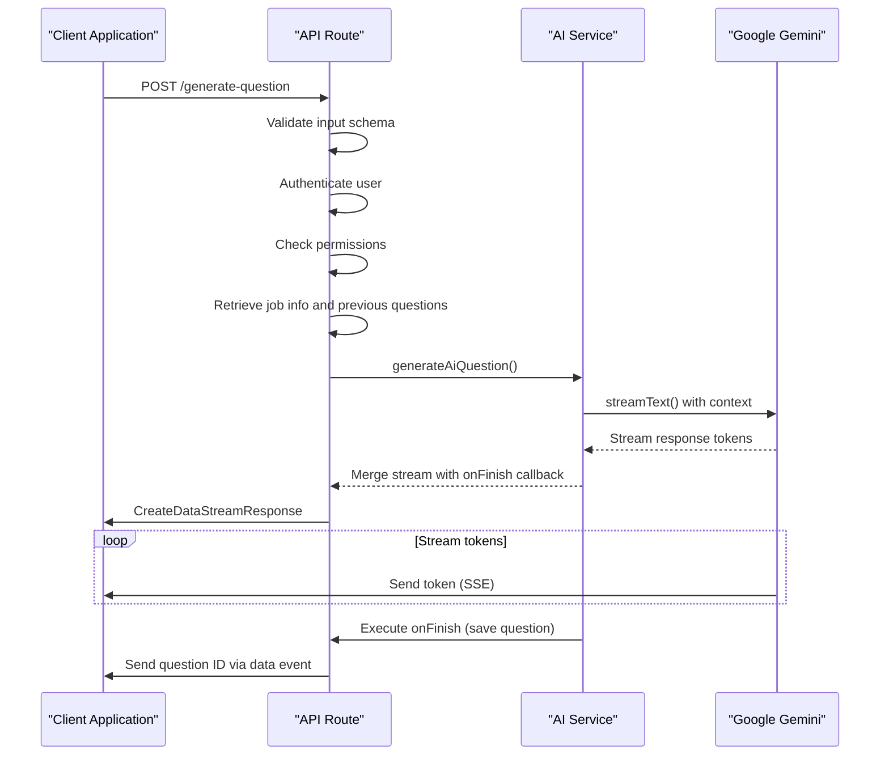
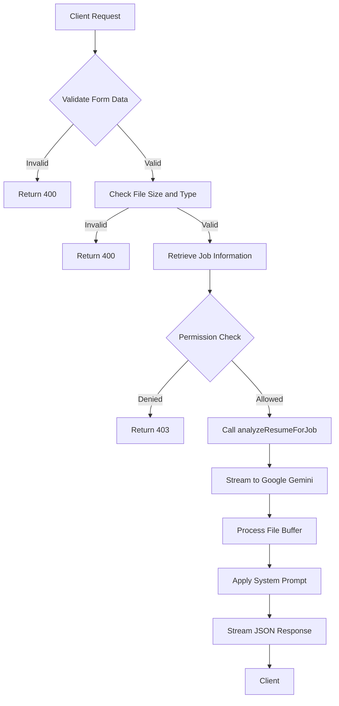
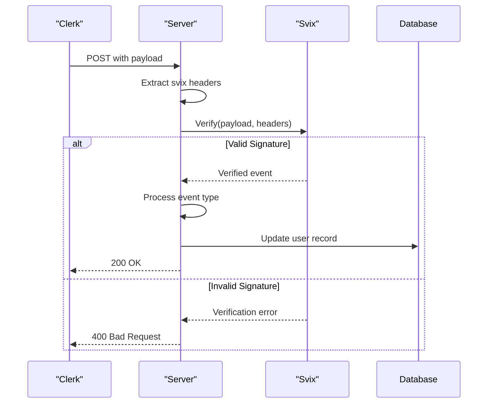

# API Endpoints

<cite>
**Referenced Files in This Document**   
- [generate-question/route.ts](file://src/app/api/ai/questions/generate-question/route.ts)
- [analyze/route.ts](file://src/app/api/ai/resumes/analyze/route.ts)
- [webhooks/clerk/route.ts](file://src/app/api/webhooks/clerk/route.ts)
- [arcjet/route.ts](file://src/app/api/arcjet/route.ts)
- [questions.ts](file://src/services/ai/questions.ts)
- [ai.ts](file://src/services/ai/resumes/ai.ts)
- [google.ts](file://src/services/ai/models/google.ts)
- [middleware.ts](file://src/middleware.ts)
</cite>

## Table of Contents
1. [Introduction](#introduction)
2. [AI Question Generation](#ai-question-generation)
3. [Resume Analysis](#resume-analysis)
4. [Clerk Webhook Integration](#clerk-webhook-integration)
5. [Arcjet Security and Rate Limiting](#arcjet-security-and-rate-limiting)
6. [Client Implementation Patterns](#client-implementation-patterns)
7. [Performance Considerations](#performance-considerations)
8. [Conclusion](#conclusion)

## Introduction
This document provides comprehensive documentation for the core API endpoints in the darasa application. The system leverages AI-powered features for interview question generation and resume analysis, integrated with third-party services for authentication (Clerk) and security (Arcjet). The API design follows RESTful principles with specialized handling for streaming responses, file uploads, and webhook events.

The documented endpoints enable key functionality:
- AI-generated technical interview questions based on job descriptions
- Resume analysis against job requirements using AI models
- User synchronization via Clerk webhooks
- Rate limiting and bot protection through Arcjet integration

All endpoints are implemented using Next.js App Router patterns with server-side logic abstracted into dedicated service modules.

**Section sources**
- [route.ts](file://src/app/api/ai/questions/generate-question/route.ts#L1-L90)
- [route.ts](file://src/app/api/ai/resumes/analyze/route.ts#L1-L69)

## AI Question Generation

### Endpoint Overview
- **Route**: `POST /api/ai/questions/generate-question`
- **Authentication**: Required (via Clerk)
- **Rate Limiting**: Enforced by Arcjet
- **Response Type**: Streaming text (SSE)

### Request Parameters
| Parameter | Type | Required | Description |
|---------|------|----------|-------------|
| `jobInfoId` | string | Yes | Unique identifier for the job information record |
| `prompt` | enum["easy", "medium", "hard"] | Yes | Difficulty level for the generated question |

### Authentication Requirements
The endpoint requires user authentication through Clerk. Unauthenticated requests receive a 401 status. Users must have permission to create questions, enforced by the `canCreateQuestion()` function which checks subscription plan limits.

### Input Processing
The request body is validated using Zod schema validation. Invalid inputs return a 400 status code. The job information is retrieved from the database and verified against the authenticated user's permissions.

### AI Processing Flow


**Diagram sources**
- [generate-question/route.ts](file://src/app/api/ai/questions/generate-question/route.ts#L1-L90)
- [questions.ts](file://src/services/ai/questions.ts#L8-L63)

### Streaming Response Format
The endpoint uses AI SDK's `createDataStreamResponse` to provide real-time streaming of the AI-generated question. The response format follows Server-Sent Events (SSE):

- Text content is streamed as plain text events
- Completion events include structured data via `writeData()`:
  ```json
  { "questionId": "string" }
  ```
- Clients should handle both text chunks and data events

### AI Model Configuration
The system uses Google Gemini (gemini-2.5-flash) model configured through the AI SDK. The prompt engineering includes:
- Job description and experience level context
- Historical question difficulty patterns
- Structured system instructions for consistent output formatting
- Markdown formatting requirements

**Section sources**
- [generate-question/route.ts](file://src/app/api/ai/questions/generate-question/route.ts#L1-L90)
- [questions.ts](file://src/services/ai/questions.ts#L8-L63)
- [google.ts](file://src/services/ai/models/google.ts#L1-L6)

## Resume Analysis

### Endpoint Overview
- **Route**: `POST /api/ai/resumes/analyze`
- **Authentication**: Required (via Clerk)
- **Request Type**: multipart/form-data
- **Response Type**: Text stream (JSON)

### Request Parameters
| Parameter | Type | Required | Description |
|---------|------|----------|-------------|
| `resumeFile` | File | Yes | Candidate's resume (PDF, DOCX, TXT) |
| `jobInfoId` | string | Yes | Reference to job posting for analysis |

### File Upload Constraints
| Constraint | Value |
|----------|-------|
| Maximum Size | 10MB |
| Allowed Types | PDF, Word (.doc, .docx), Plain Text |
| Processing | Direct buffer transfer to AI model |

### Authentication and Authorization
Similar to the question generation endpoint, this route requires Clerk authentication and enforces plan-based limits through `canRunResumeAnalysis()`. The job information is permission-checked against the authenticated user.

### AI Analysis Process


**Diagram sources**
- [analyze/route.ts](file://src/app/api/ai/resumes/analyze/route.ts#L1-L69)
- [ai.ts](file://src/services/ai/resumes/ai.ts#L5-L79)

### Feedback Generation Structure
The AI returns structured feedback in JSON format according to the `aiAnalyzeSchema`, containing five main categories:

```json
{
  "ats": {
    "score": 1-10,
    "summary": "string",
    "feedback": [
      {
        "type": "strength|minor-improvement|major-improvement",
        "name": "string",
        "message": "string"
      }
    ]
  },
  "jobMatch": { /* same structure */ },
  "writingAndFormatting": { /* same structure */ },
  "keywordCoverage": { /* same structure */ },
  "other": { /* same structure */ },
  "overallScore": 1-10
}
```

The analysis considers:
- ATS compatibility (formatting, structure, machine readability)
- Job description alignment (skills, experience, requirements)
- Writing quality and professionalism
- Keyword optimization for applicant tracking systems
- Overall candidate suitability

**Section sources**
- [analyze/route.ts](file://src/app/api/ai/resumes/analyze/route.ts#L1-L69)
- [ai.ts](file://src/services/ai/resumes/ai.ts#L5-L79)
- [schemas.ts](file://src/services/ai/resumes/schemas.ts#L1-L50)

## Clerk Webhook Integration

### Endpoint Overview
- **Route**: `POST /api/webhooks/clerk`
- **Security**: Svix signature verification
- **Purpose**: User synchronization between Clerk and application database

### Payload Structure
The webhook handles three primary event types from Clerk:

```json
{
  "type": "user.created|user.updated|user.deleted",
  "data": {
    "id": "string",
    "email_addresses": [
      {
        "id": "string",
        "email_address": "string"
      }
    ],
    "primary_email_address_id": "string",
    "first_name": "string",
    "last_name": "string",
    "image_url": "string",
    "created_at": "number(unix)",
    "updated_at": "number(unix)"
  }
}
```

### Security Verification


**Diagram sources**
- [webhooks/clerk/route.ts](file://src/app/api/webhooks/clerk/route.ts#L1-L124)

### Event Handling Logic
| Event Type | Action | Database Operation |
|-----------|--------|-------------------|
| `user.created` | Create new user record | `upsertUser()` |
| `user.updated` | Update existing user | `upsertUser()` |
| `user.deleted` | Remove user data | `deleteUser()` |

The system extracts the primary email address from the array of email addresses and constructs a display name from first and last name fields. User images are stored as URLs.

### Error Handling
Comprehensive logging is implemented for debugging webhook issues:
- Missing Svix headers (400 response)
- Signature verification failures (400 response)
- Missing primary email (400 response)
- Database operation errors (logged but return 200 to prevent replay)

**Section sources**
- [webhooks/clerk/route.ts](file://src/app/api/webhooks/clerk/route.ts#L1-L124)

## Arcjet Security and Rate Limiting

### Endpoint Overview
- **Route**: `GET /api/arcjet`
- **Integration**: Next.js middleware
- **Purpose**: Security enforcement and rate limiting

### Security Rules Configuration
The Arcjet instance enforces three primary rules:

```mermaid
graph TB
A[Arcjet Protection] --> B[Shield Rule]
A --> C[Bot Detection]
A --> D[Rate Limiting]
B --> E[Block common attacks<br>(SQLi, XSS, etc)]
C --> F[Block bots except:]
F --> G[Search Engines]
F --> H[Monitoring Services]
F --> I[Link Previews]
D --> J[Token Bucket Algorithm]
J --> K[5 requests per 10 seconds]
J --> L[Capacity: 10 tokens]
```

**Diagram sources**
- [arcjet/route.ts](file://src/app/api/arcjet/route.ts#L1-L82)

### Rule Details
| Rule | Mode | Configuration | Purpose |
|------|------|---------------|---------|
| Shield