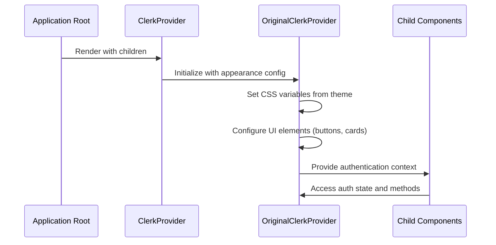
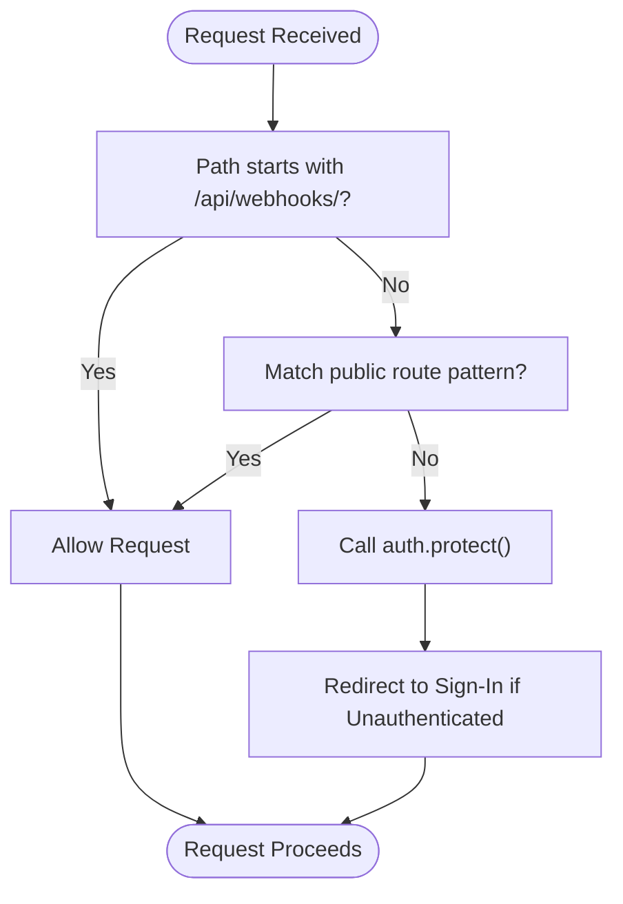
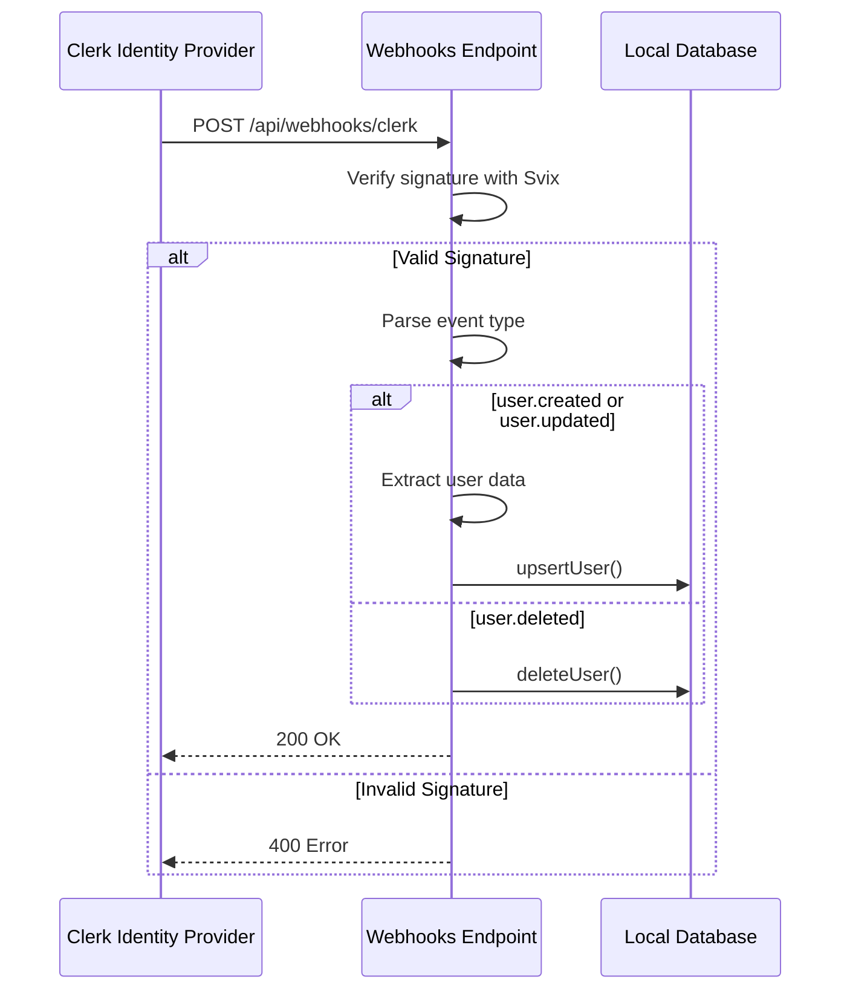

# Authentication Flow

<cite>
**Referenced Files in This Document**  
- [middleware.ts](file://src/middleware.ts)
- [getCurrentUser.ts](file://src/services/clerk/lib/getCurrentUser.ts)
- [ClerkProvider.tsx](file://src/services/clerk/components/ClerkProvider.tsx)
- [hasPermission.ts](file://src/services/clerk/lib/hasPermission.ts)
- [route.ts](file://src/app/api/webhooks/clerk/route.ts)
</cite>

## Table of Contents
1. [Introduction](#introduction)
2. [Authentication Architecture Overview](#authentication-architecture-overview)
3. [ClerkProvider: Authentication State Management](#clerkprovider-authentication-state-management)
4. [Middleware Route Protection](#middleware-route-protection)
5. [Session Data Retrieval with getCurrentUser](#session-data-retrieval-with-getcurrentuser)
6. [Webhook Synchronization with Clerk Identity Provider](#webhook-synchronization-with-clerk-identity-provider)
7. [Role-Based Access Control and Permissions](#role-based-access-control-and-permissions)
8. [Common Issues and Security Best Practices](#common-issues-and-security-best-practices)

## Introduction

The darasa application implements a robust authentication system powered by Clerk, providing secure user management, session handling, and role-based access control. This documentation details the complete authentication flow from initial sign-in through route protection, session management, and webhook synchronization. The system integrates seamlessly with Next.js App Router, leveraging React Server Components and middleware for comprehensive security across both client and server environments.

## Authentication Architecture Overview

The authentication architecture follows a layered approach with distinct components handling different aspects of identity management:

```mermaid
graph TB
A[User Sign-In] --> B[ClerkProvider]
B --> C[React Server Components]
C --> D[getCurrentUser]
D --> E[Clerk auth()]
E --> F[Session Validation]
F --> G[Protected Routes]
G --> H[Middleware]
H --> I[Clerk Webhooks]
I --> J[Local User Database]
J --> K[Role-Based Access]
```

**Diagram sources**  
- [ClerkProvider.tsx](file://src/services/clerk/components/ClerkProvider.tsx)
- [getCurrentUser.ts](file://src/services/clerk/lib/getCurrentUser.ts)
- [middleware.ts](file://src/middleware.ts)
- [route.ts](file://src/app/api/webhooks/clerk/route.ts)

**Section sources**  
- [middleware.ts](file://src/middleware.ts)
- [getCurrentUser.ts](file://src/services/clerk/lib/getCurrentUser.ts)

## ClerkProvider: Authentication State Management

The `ClerkProvider` component serves as the root-level authentication wrapper that manages authentication state across the entire application. It wraps the application with Clerk's authentication context, enabling all child components to access user session data and authentication methods.

The implementation extends the original Clerk provider with customized appearance settings that align with the application's design system, including color variables, border radii, and typography. This ensures consistent styling of Clerk-hosted pages such as sign-in and sign-up flows while maintaining the application's visual identity.



**Diagram sources**  
- [ClerkProvider.tsx](file://src/services/clerk/components/ClerkProvider.tsx)

**Section sources**  
- [ClerkProvider.tsx](file://src/services/clerk/components/ClerkProvider.tsx)

## Middleware Route Protection

Route protection is implemented through Next.js middleware using Clerk's `clerkMiddleware`. The middleware configuration defines public routes that don't require authentication, including sign-in pages, the home page, and API webhooks endpoints.

For all other routes, the middleware enforces authentication by calling `auth.protect()`, which redirects unauthenticated users to the sign-in page. The webhook endpoint is explicitly excluded from authentication requirements to allow Clerk to send user event notifications without authentication headers.



**Diagram sources**  
- [middleware.ts](file://src/middleware.ts#L10-L20)

**Section sources**  
- [middleware.ts](file://src/middleware.ts#L1-L53)

## Session Data Retrieval with getCurrentUser

The `getCurrentUser` utility function provides a centralized way to retrieve authenticated user data within server components and API routes. It leverages Clerk's `auth()` function to obtain the current session's user ID and authentication status.

When requested with the `allData` parameter, the function also retrieves the complete user record from the local database by calling the internal `getUser` function. This enables server components to access both authentication state and application-specific user data within React Server Components.

The function implements caching via Next.js' `use cache` directive and cache tagging, improving performance by reducing redundant database queries for frequently accessed user data.

**Section sources**  
- [getCurrentUser.ts](file://src/services/clerk/lib/getCurrentUser.ts#L7-L24)

## Webhook Synchronization with Clerk Identity Provider

The application maintains synchronization between Clerk's identity provider and the local user database through a dedicated webhook endpoint at `/api/webhooks/clerk`. This endpoint receives user lifecycle events from Clerk, including user creation, updates, and deletions.

Using Svix for webhook verification, the endpoint validates incoming requests with the configured signing secret before processing. For `user.created` and `user.updated` events, it extracts user information such as email, name, and profile image, then upserts the record into the local database. For `user.deleted` events, it removes the corresponding record from the local database.

This bidirectional synchronization ensures that the application's local user records remain consistent with Clerk's authoritative identity store, even when user changes occur outside the application context.



**Diagram sources**  
- [route.ts](file://src/app/api/webhooks/clerk/route.ts#L1-L123)

**Section sources**  
- [route.ts](file://src/app/api/webhooks/clerk/route.ts#L1-L123)

## Role-Based Access Control and Permissions

Role-based access control is implemented through the `hasPermission` function, which checks whether the current user has specific feature permissions granted by Clerk. The function accepts a permission string representing various application features such as unlimited resume analysis, interviews, or question generation.

By leveraging Clerk's built-in permission system, the application can implement tiered access levels and feature flags without managing role data locally. The permissions are checked server-side during rendering or API request processing, preventing unauthorized access to premium features.

The implementation includes tolerance for potential naming inconsistencies in feature flags, accepting both plural and singular forms of permission names to ensure reliable access control.

**Section sources**  
- [hasPermission.ts](file://src/services/clerk/lib/hasPermission.ts#L11-L14)

## Common Issues and Security Best Practices

### Session Expiration Handling
The authentication system handles session expiration gracefully by redirecting users to the sign-in page when sessions expire. The `redirectToSignIn` property returned by the `auth()` function provides a convenient way to initiate this redirect when needed.

### Secure Cookie Handling
Clerk manages authentication cookies securely with appropriate HTTP-only and SameSite attributes. The application inherits these security measures through the Clerk integration, protecting against cross-site scripting (XSS) and cross-site request forgery (CSRF) attacks.

### CSRF Protection
While Clerk handles CSRF protection for its own authentication flows, the application should implement additional CSRF protection for custom form submissions. This can be achieved by validating origin headers and implementing anti-CSRF tokens for sensitive operations.

### Token Refresh Mechanisms
Clerk automatically handles token refresh through its session management system. When access tokens approach expiration, Clerk silently refreshes them in the background, ensuring uninterrupted user experience without requiring manual intervention.

### Error Monitoring
The webhook endpoint includes comprehensive logging for debugging and monitoring purposes, capturing verification failures, parsing errors, and database operation results. This facilitates rapid diagnosis of synchronization issues between the identity provider and local database.