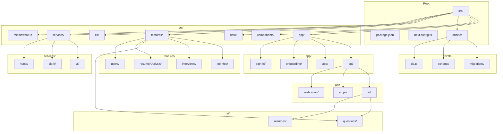

# Backend Architecture

<cite>
**Referenced Files in This Document**
- [middleware.ts](file://src/middleware.ts)
- [db.ts](file://src/drizzle/db.ts)
- [schema.ts](file://src/drizzle/schema.ts)
- [user.ts](file://src/drizzle/schema/user.ts)
- [jobinfo.ts](file://src/drizzle/schema/jobinfo.ts)
- [interview.ts](file://src/drizzle/schema/interview.ts)
- [question.ts](file://src/drizzle/schema/question.ts)
- [getCurrentUser.ts](file://src/services/clerk/lib/getCurrentUser.ts)
- [hasPermission.ts](file://src/services/clerk/lib/hasPermission.ts)
- [google.ts](file://src/services/ai/models/google.ts)
- [questions.ts](file://src/services/ai/questions.ts)
- [interviews.ts](file://src/services/ai/interviews.ts)
- [api.ts](file://src/services/hume/lib/api.ts)
- [condenseChatMessages.ts](file://src/services/hume/lib/condenseChatMessages.ts)
- [actions.ts](file://src/features/jobInfos/actions.ts)
- [db.ts](file://src/features/jobInfos/db.ts)
- [dbCache.ts](file://src/features/jobInfos/dbCache.ts)
- [actions.ts](file://src/features/interviews/actions.ts)
- [db.ts](file://src/features/interviews/db.ts)
- [dbCache.ts](file://src/features/interviews/dbCache.ts)
- [permissions.ts](file://src/features/interviews/permissions.ts)
- [route.ts](file://src/app/api/ai/questions/generate-question/route.ts)
- [route.ts](file://src/app/api/ai/resumes/analyze/route.ts)
- [route.ts](file://src/app/api/webhooks/clerk/route.ts)
- [route.ts](file://src/app/api/arcjet/route.ts)
</cite>

## Table of Contents
1. [Introduction](#introduction)
2. [Project Structure](#project-structure)
3. [Core Components](#core-components)
4. [Architecture Overview](#architecture-overview)
5. [Detailed Component Analysis](#detailed-component-analysis)
6. [Dependency Analysis](#dependency-analysis)
7. [Performance Considerations](#performance-considerations)
8. [Troubleshooting Guide](#troubleshooting-guide)
9. [Conclusion](#conclusion)

## Introduction
This document provides comprehensive architectural documentation for the backend system of Darasa, a platform designed to help users prepare for technical interviews. The system leverages Next.js route handlers under src/app/api/ to implement RESTful patterns for AI generation, webhooks, and security endpoints. The architecture follows a layered approach with clear separation between API endpoints, service layers, and data access components. Key technologies include Clerk for authentication, Arcjet for rate limiting and bot detection, Drizzle ORM for database operations, and Hume AI for voice interview processing. The system is designed around Server Actions for data mutations and implements sophisticated caching strategies for performance optimization.

## Project Structure



**Diagram sources**
- [src/app/api/ai/questions/generate-question/route.ts](file://src/app/api/ai/questions/generate-question/route.ts)
- [src/app/api/ai/resumes/analyze/route.ts](file://src/app/api/ai/resumes/analyze/route.ts)
- [src/app/api/webhooks/clerk/route.ts](file://src/app/api/webhooks/clerk/route.ts)
- [src/drizzle/schema.ts](file://src/drizzle/schema.ts)
- [src/features/jobInfos/actions.ts](file://src/features/jobInfos/actions.ts)
- [src/services/ai/questions.ts](file://src/services/ai/questions.ts)

**Section sources**
- [src/app/api/ai/questions/generate-question/route.ts](file://src/app/api/ai/questions/generate-question/route.ts)
- [src/app/api/ai/resumes/analyze/route.ts](file://src/app/api/ai/resumes/analyze/route.ts)
- [src/app/api/webhooks/clerk/route.ts](file://src/app/api/webhooks/clerk/route.ts)
- [src/drizzle/schema.ts](file://src/drizzle/schema.ts)

## Core Components

The Darasa backend system consists of several core components that work together to provide a comprehensive interview preparation platform. The API layer exposes endpoints for AI generation, webhook handling, and security functions, organized under the src/app/api/ directory. The service layer in src/services/ contains external integrations with AI providers (Google Gemini), voice analysis (Hume), and authentication (Clerk). The features layer in src/features/ encapsulates business logic with domain-specific actions and data access patterns. Data persistence is handled through Drizzle ORM with PostgreSQL, configured in src/drizzle/db.ts and schema definitions. Authentication and authorization are managed through Clerk with custom permission checks, while rate limiting and bot protection are implemented using Arcjet. The system leverages Next.js Server Actions for data mutations and implements a sophisticated caching strategy using Next.js cache tags for optimal performance.

**Section sources**
- [src/middleware.ts](file://src/middleware.ts)
- [src/drizzle/db.ts](file://src/drizzle/db.ts)
- [src/services/ai/models/google.ts](file://src/services/ai/models/google.ts)
- [src/services/clerk/lib/getCurrentUser.ts](file://src/services/clerk/lib/getCurrentUser.ts)
- [src/features/jobInfos/actions.ts](file://src/features/jobInfos/actions.ts)

## Architecture Overview

```mermaid
sequenceDiagram
participant Client as "Client Application"
participant Middleware as "middleware.ts"
participant Clerk as "Clerk Auth"
participant Arcjet as "Arcjet Protection"
participant API as "API Route Handler"
participant Service as "Service Layer"
participant DB as "Database (Drizzle)"
Client->>Middleware : HTTP Request
activate Middleware
Middleware->>Clerk : Authentication Check
activate Clerk
Clerk-->>Middleware : User Identity
deactivate Clerk
alt Public Route
Middleware-->>API : Forward Request
else Protected Route
Middleware->>Arcjet : Rate Limiting/Bot Detection
activate Arcjet
Arcjet-->>Middleware : Decision
deactivate Arcjet
alt Allowed
Middleware-->>API : Forward Request
else Denied
Middleware-->>Client : 403 Forbidden
deactivate Middleware
return
end
end
activate API
API->>Service : Business Logic Processing
activate Service
Service->>DB : Data Operations
activate DB
DB-->>Service : Data Results
deactivate DB
Service-->>API : Processed Results
deactivate Service
API-->>Client : JSON Response
deactivate API
deactivate Middleware
```

**Diagram sources**
- [src/middleware.ts](file://src/middleware.ts)
- [src/app/api/ai/questions/generate-question/route.ts](file://src/app/api/ai/questions/generate-question/route.ts)
- [src/services/ai/questions.ts](file://src/services/ai/questions.ts)
- [src/drizzle/db.ts](file://src/drizzle/db.ts)

## Detailed Component Analysis

### API Endpoint Structure

The API endpoint structure follows Next.js route handler conventions under src/app/api/, implementing RESTful patterns for various functionalities. The AI generation endpoints are organized under /api/ai/ with subdirectories for different AI capabilities such as question generation and resume analysis. Webhook handling is implemented through /api/webhooks/clerk/route.ts, which processes user lifecycle events from Clerk. Security endpoints are available at /api/arcjet/route.ts, providing rate limiting and bot detection capabilities. Each route handler follows a consistent pattern of authentication, authorization, input validation, business logic execution, and response generation. The endpoints support both GET and POST methods as appropriate, with POST requests typically used for data mutations and AI generation tasks. The API returns JSON responses with appropriate status codes and error messages, following standard HTTP semantics.

**Section sources**
- [src/app/api/ai/questions/generate-question/route.ts](file://src/app/api/ai/questions/generate-question/route.ts)
- [src/app/api/ai/resumes/analyze/route.ts](file://src/app/api/ai/resumes/analyze/route.ts)
- [src/app/api/webhooks/clerk/route.ts](file://src/app/api/webhooks/clerk/route.ts)
- [src/app/api/arcjet/route.ts](file://src/app/api/arcjet/route.ts)

### Request Flow and Middleware

```mermaid
flowchart TD
    Start([Incoming Request]) --> AuthCheck["Authentication Check"]
    AuthCheck --> IsWebhook{"Is Webhook?"}
    IsWebhook -->|Yes| SkipAuth["Skip Authentication"]
    IsWebhook -->|No| IsPublic{"Is Public Route?"}
    IsPublic -->|No| ClerkAuth["Clerk Authentication"]
    ClerkAuth --> RateLimit["Rate Limiting Check"]
    IsPublic -->|Yes| RateLimit
    RateLimit --> Arcjet