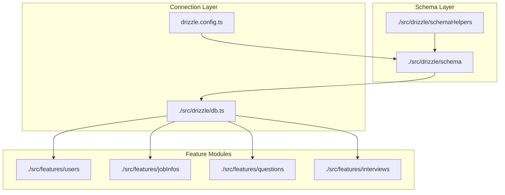
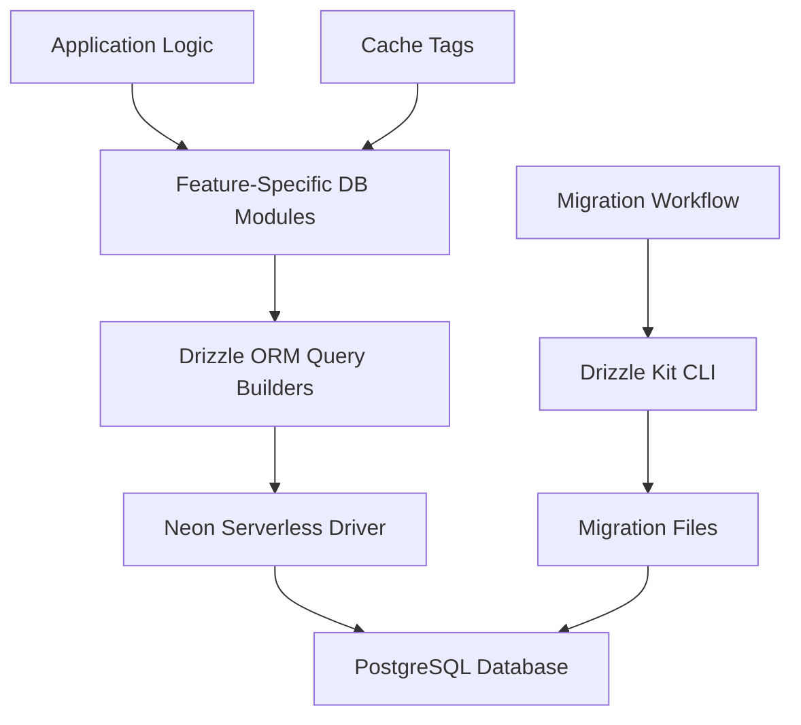
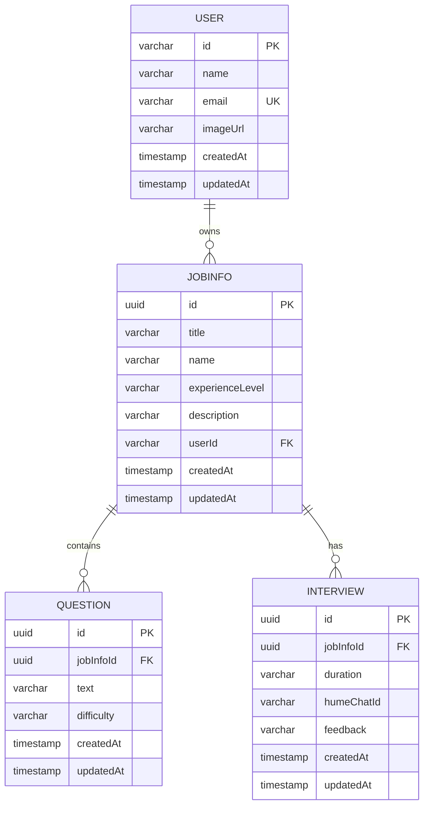
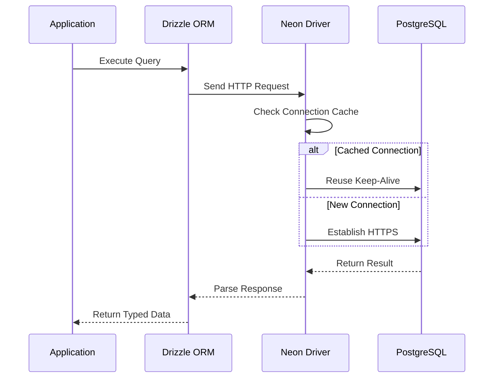
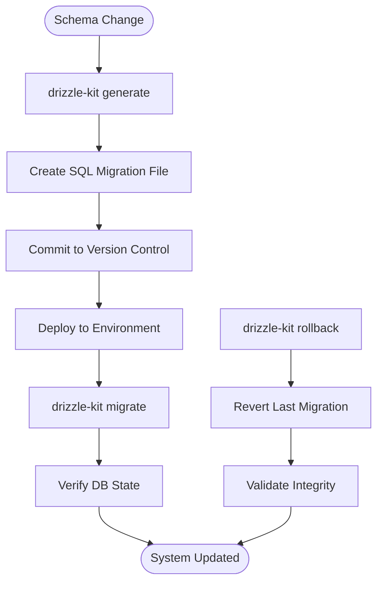
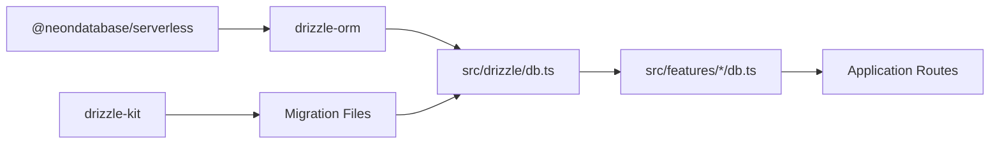

# Database Integration

<cite>
**Referenced Files in This Document**   
- [db.ts](file://src/drizzle/db.ts)
- [schema.ts](file://src/drizzle/schema.ts)
- [user.ts](file://src/drizzle/schema/user.ts)
- [jobinfo.ts](file://src/drizzle/schema/jobinfo.ts)
- [interview.ts](file://src/drizzle/schema/interview.ts)
- [question.ts](file://src/drizzle/schema/question.ts)
- [schemaHelpers.ts](file://src/drizzle/schemaHelpers.ts)
- [drizzle.config.ts](file://drizzle.config.ts)
- [server.ts](file://src/data/env/server.ts)
- [dbCache.ts](file://src/features/users/dbCache.ts)
- [db.ts](file://src/features/users/db.ts)
- [dbCache.ts](file://src/features/jobInfos/dbCache.ts)
- [db.ts](file://src/features/jobInfos/db.ts)
- [dbCache.ts](file://src/features/questions/dbCache.ts)
- [db.ts](file://src/features/questions/db.ts)
- [dbCache.ts](file://src/features/interviews/dbCache.ts)
- [db.ts](file://src/features/interviews/db.ts)
</cite>

## Table of Contents
1. [Introduction](#introduction)
2. [Project Structure](#project-structure)
3. [Core Components](#core-components)
4. [Architecture Overview](#architecture-overview)
5. [Detailed Component Analysis](#detailed-component-analysis)
6. [Dependency Analysis](#dependency-analysis)
7. [Performance Considerations](#performance-considerations)
8. [Troubleshooting Guide](#troubleshooting-guide)
9. [Conclusion](#conclusion)

## Introduction
This document provides comprehensive documentation for the database integration layer in the darasa application. It details the PostgreSQL schema implemented using Drizzle ORM, covering core entities such as User, JobInfo, Question, and Interview. The architecture leverages Neon's serverless driver for efficient connection handling, with full TypeScript integration ensuring type safety across all data access patterns. The system supports robust caching via feature-specific dbCache modules, transactional integrity, and a well-defined migration workflow managed through Drizzle Kit.

## Project Structure
The database layer is organized under `src/drizzle`, containing schema definitions, shared helpers, and the primary database connection abstraction. Each major feature (users, jobInfos, questions, interviews) maintains its own data access module under `src/features`, encapsulating queries, permissions, and caching logic. Migrations are auto-generated into `src/drizzle/migrations` via Drizzle Kit, with configuration defined in `drizzle.config.ts`.

**Diagram sources**
- [schema.ts](file://src/drizzle/schema.ts#L1-L5)
- [db.ts](file://src/drizzle/db.ts#L1-L10)
- [drizzle.config.ts](file://drizzle.config.ts#L1-L14)

**Section sources**
- [schema.ts](file://src/drizzle/schema.ts#L1-L5)
- [db.ts](file://src/drizzle/db.ts#L1-L10)
- [drizzle.config.ts](file://drizzle.config.ts#L1-L14)

## Core Components
The core components include the centralized schema definition, the database client configured with Neon, and reusable field definitions in schemaHelpers. These elements form the foundation for type-safe, maintainable data access throughout the application. Feature-specific db modules provide curated interfaces to interact with these schemas while enforcing business rules and optimizing performance through caching.

**Section sources**
- [db.ts](file://src/drizzle/db.ts#L1-L10)
- [schemaHelpers.ts](file://src/drizzle/schemaHelpers.ts#L1-L10)
- [schema.ts](file://src/drizzle/schema.ts#L1-L5)

## Architecture Overview
The database architecture follows a layered pattern where Drizzle ORM abstracts direct SQL interactions, providing strongly-typed query builders. The Neon serverless driver enables efficient HTTP-based connections suitable for serverless environments like Vercel. Each feature owns its data access logic, promoting modularity and separation of concerns. Caching is implemented at the service level using Next.js cache tags for revalidation.

**Diagram sources**
- [db.ts](file://src/drizzle/db.ts#L1-L10)
- [drizzle.config.ts](file://drizzle.config.ts#L1-L14)
- [schema.ts](file://src/drizzle/schema.ts#L1-L5)

## Detailed Component Analysis

### Data Model Entities
The data model consists of four primary entities: User, JobInfo, Question, and Interview. Relationships are enforced through foreign key constraints with cascade delete behavior. Shared fields like `id`, `createdAt`, and `updatedAt` are abstracted into schemaHelpers for consistency.

#### Entity Relationship Diagram

**Diagram sources**
- [user.ts](file://src/drizzle/schema/user.ts#L1-L18)
- [jobinfo.ts](file://src/drizzle/schema/jobinfo.ts#L1-L36)
- [question.ts](file://src/drizzle/schema/question.ts#L1-L29)
- [interview.ts](file://src/drizzle/schema/interview.ts#L1-L23)

**Section sources**
- [user.ts](file://src/drizzle/schema/user.ts#L1-L18)
- [jobinfo.ts](file://src/drizzle/schema/jobinfo.ts#L1-L36)
- [question.ts](file://src/drizzle/schema/question.ts#L1-L29)
- [interview.ts](file://src/drizzle/schema/interview.ts#L1-L23)

### Connection Management
The database connection uses Neon’s serverless Postgres driver, optimized for edge and serverless runtimes. Connection reuse is enabled via `neonConfig.fetchConnectionCache = true`, reducing latency by reusing HTTP keep-alive connections between function invocations.

**Diagram sources**
- [db.ts](file://src/drizzle/db.ts#L1-L10)

**Section sources**
- [db.ts](file://src/drizzle/db.ts#L1-L10)

### Migration Workflow
Migrations are managed using Drizzle Kit, which generates incremental SQL files based on changes to the schema definition. The configuration points to `src/drizzle/schema.ts` as the single source of truth. Migration execution is safe for production use, supporting rollback procedures through versioned migration files.

**Diagram sources**
- [drizzle.config.ts](file://drizzle.config.ts#L1-L14)

**Section sources**
- [drizzle.config.ts](file://drizzle.config.ts#L1-L14)

## Dependency Analysis
The database layer has minimal external dependencies, relying primarily on `drizzle-orm`, `@neondatabase/serverless`, and Node.js types. Internal dependencies flow from feature modules toward the central schema and connection abstractions. There are no circular dependencies, and each feature module depends only on the global db instance and its own schema subset.

**Diagram sources**
- [package.json](file://package.json#L39-L73)
- [db.ts](file://src/drizzle/db.ts#L1-L10)
- [drizzle.config.ts](file://drizzle.config.ts#L1-L14)

**Section sources**
- [package.json](file://package.json#L39-L73)
- [db.ts](file://src/drizzle/db.ts#L1-L10)
- [drizzle.config.ts](file://drizzle.config.ts#L1-L14)

## Performance Considerations
Performance is optimized through connection caching, selective querying via Drizzle’s column picking, and per-feature caching strategies. The use of UUIDs with default random generation ensures index distribution efficiency. Timestamps with timezone support prevent date-related inconsistencies across regions. Queries within feature modules are designed to minimize round trips and avoid N+1 issues through proper joins when necessary.

**Section sources**
- [db.ts](file://src/drizzle/db.ts#L1-L10)
- [schemaHelpers.ts](file://src/drizzle/schemaHelpers.ts#L1-L10)

## Troubleshooting Guide
Common issues include missing environment variables (`DATABASE_URL` or DB_* fallbacks), stale cache states, and migration conflicts. Ensure `.env` contains valid credentials or that all DB_* variables are set. Use `drizzle-kit studio` to inspect current schema state. For cache invalidation problems, verify correct usage of cache tags in `revalidateTag` calls within dbCache modules.

**Section sources**
- [server.ts](file://src/data/env/server.ts#L1-L45)
- [dbCache.ts](file://src/features/users/dbCache.ts)
- [dbCache.ts](file://src/features/jobInfos/dbCache.ts)
- [dbCache.ts](file://src/features/questions/dbCache.ts)
- [dbCache.ts](file://src/features/interviews/dbCache.ts)

## Conclusion
The darasa application employs a modern, type-safe database architecture leveraging Drizzle ORM and Neon serverless Postgres. The design emphasizes maintainability through modular feature-based data access, robustness via automated migrations, and performance through connection reuse and intelligent caching. This approach ensures scalability and developer productivity in a serverless-first environment.