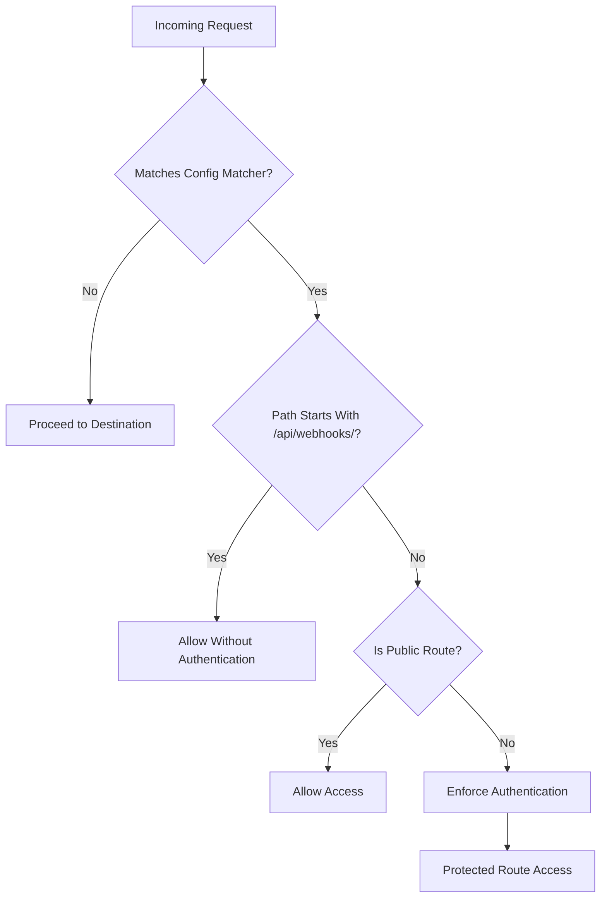
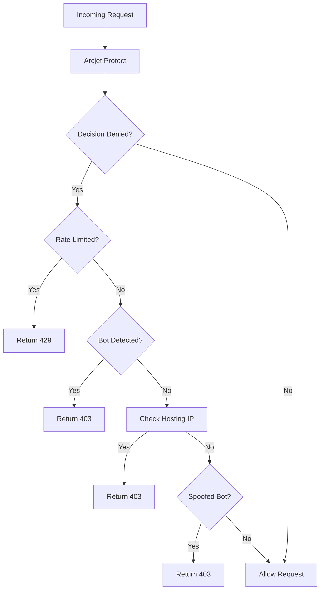

# Middleware Configuration

<cite>
**Referenced Files in This Document **   
- [middleware.ts](file://src/middleware.ts)
- [api/arcjet/route.ts](file://src/app/api/arcjet/route.ts)
- [data/env/server.ts](file://src/data/env/server.ts)
</cite>

## Table of Contents
1. [Introduction](#introduction)
2. [Request Interception Flow](#request-interception-flow)
3. [Authentication with Clerk](#authentication-with-clerk)
4. [Rate Limiting and Bot Protection via Arcjet](#rate-limiting-and-bot-protection-via-arcjet)
5. [Conditional Routing and Path Matching](#conditional-routing-and-path-matching)
6. [Edge Runtime Considerations](#edge-runtime-considerations)
7. [Performance Impact and Debugging](#performance-impact-and-debugging)
8. [Extending Middleware Functionality](#extending-middleware-functionality)
9. [Common Pitfalls and Best Practices](#common-pitfalls-and-best-practices)

## Introduction
The middleware configuration in darasa manages critical request processing tasks including authentication, rate limiting, bot detection, and conditional routing. It operates at the edge layer using Next.js middleware capabilities to intercept requests before they reach application routes. The system integrates Clerk for user authentication and Arcjet for security and rate control, providing a robust foundation for protecting application endpoints while enabling flexible access policies.

## Request Interception Flow
The middleware processes incoming HTTP requests through a defined sequence of checks and decisions. Requests are first evaluated against the matcher configuration to determine if the middleware should execute. Once triggered, the flow proceeds through webhook bypass checks, public route evaluation, and conditional authentication enforcement. Although Arcjet integration is currently disabled for debugging purposes, the intended flow includes bot detection, DDoS protection, and usage-based throttling prior to authentication checks.

**Diagram sources **
- [middleware.ts](file://src/middleware.ts#L0-L53)

**Section sources**
- [middleware.ts](file://src/middleware.ts#L0-L53)

## Authentication with Clerk
Authentication is managed through Clerk's `clerkMiddleware` which provides session management and user identity verification. The implementation uses `createRouteMatcher` to define public routes that don't require authentication, including the sign-in page, home page, and webhook endpoints. For non-public routes, the middleware invokes `auth.protect()` to ensure only authenticated users can access protected resources. The current configuration temporarily bypasses Arcjet checks to isolate authentication issues during development.

**Section sources**
- [middleware.ts](file://src/middleware.ts#L0-L53)

## Rate Limiting and Bot Protection via Arcjet
Arcjet integration provides comprehensive security features including bot detection, DDoS protection, and usage-based throttling. The configuration in `api/arcjet/route.ts` demonstrates a token bucket rate limiting strategy with a refill rate of 5 tokens every 10 seconds and a maximum capacity of 10 tokens. Bot detection is configured to allow search engine crawlers while blocking other automated traffic. Shield protection guards against common web attacks like SQL injection. Although currently disabled in the main middleware, these rules are fully implemented and testable through the dedicated Arcjet API route.

**Diagram sources **
- [api/arcjet/route.ts](file://src/app/api/arcjet/route.ts#L0-L80)

**Section sources**
- [api/arcjet/route.ts](file://src/app/api/arcjet/route.ts#L0-L80)
- [middleware.ts](file://src/middleware.ts#L0-L53)

## Conditional Routing and Path Matching
The middleware implements sophisticated path matching through the `matcher` configuration, which uses regular expressions to determine when the middleware should activate. The pattern excludes Next.js internal routes and static assets while ensuring all API and TRPC routes are intercepted. Public route matching is handled by `createRouteMatcher`, which supports wildcard patterns for paths like sign-in and webhooks. This dual-layer matching system ensures optimal performance by minimizing unnecessary middleware execution while maintaining security coverage for sensitive endpoints.

**Section sources**
- [middleware.ts](file://src/middleware.ts#L0-L53)

## Edge Runtime Considerations
The middleware operates in Next.js edge runtime, requiring careful consideration of performance and resource constraints. All operations must complete quickly to avoid degrading user experience, particularly authentication and security checks. The current implementation prioritizes reliability by temporarily disabling Arcjet integration during authentication debugging. Environment variables are properly typed and validated through the env configuration system, ensuring secure access to secrets like `ARCJET_KEY` and `CLERK_SECRET_KEY` without exposing them to client-side code.

**Section sources**
- [middleware.ts](file://src/middleware.ts#L0-L53)
- [data/env/server.ts](file://src/data/env/server.ts#L0-L57)

## Performance Impact and Debugging
Middleware execution adds latency to every matched request, making optimization critical. The current configuration balances security and performance by selectively applying protections and using efficient pattern matching. Debugging is facilitated through console logging in the Arcjet route and strategic commenting of security rules during development. The separation of Arcjet testing into a dedicated API route allows isolated performance evaluation without affecting the main authentication flow. Monitoring decision outcomes and response times helps identify potential bottlenecks in the security pipeline.

**Section sources**
- [middleware.ts](file://src/middleware.ts#L0-L53)
- [api/arcjet/route.ts](file://src/app/api/arcjet/route.ts#L0-L80)

## Extending Middleware Functionality
The middleware architecture supports extension for custom authorization policies, A/B testing, and analytics injection. Additional rules can be added to the Arcjet configuration for more granular access control based on user attributes or behavioral patterns. Custom headers can be injected for feature flag evaluation or analytics tracking. The modular design allows new security rules to be implemented and tested independently before deployment to production. Future enhancements could include role-based access control, geographic restrictions, or integration with additional monitoring services.

**Section sources**
- [middleware.ts](file://src/middleware.ts#L0-L53)
- [api/arcjet/route.ts](file://src/app/api/arcjet/route.ts#L0-L80)

## Common Pitfalls and Best Practices
Common issues include infinite redirects caused by incorrect matcher configurations and authentication loops. Ensuring webhook routes are properly excluded prevents disruption of third-party integrations. Careful testing of public route patterns avoids unintentionally locking out legitimate traffic. When re-enabling Arcjet, gradual rollout using DRY_RUN mode allows observation of decision patterns without blocking users. Maintaining clear separation between development and production security policies prevents accidental exposure of sensitive systems during debugging.

**Section sources**
- [middleware.ts](file://src/middleware.ts#L0-L53)
- [api/arcjet/route.ts](file://src/app/api/arcjet/route.ts#L0-L80)