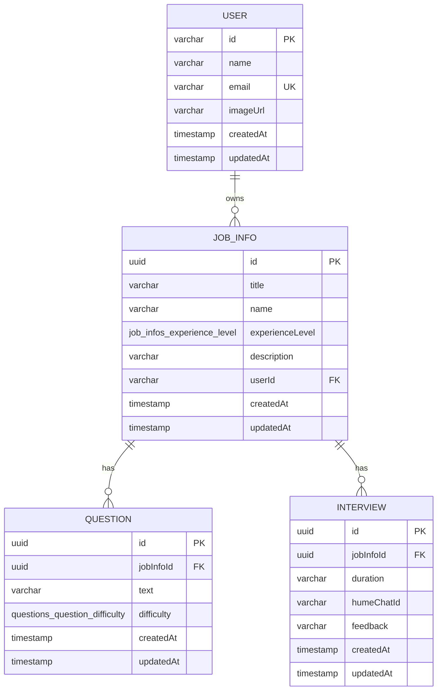

# Database Schema

<cite>
**Referenced Files in This Document**   
- [user.ts](file://src/drizzle/schema/user.ts)
- [jobinfo.ts](file://src/drizzle/schema/jobinfo.ts)
- [question.ts](file://src/drizzle/schema/question.ts)
- [interview.ts](file://src/drizzle/schema/interview.ts)
- [schemaHelpers.ts](file://src/drizzle/schemaHelpers.ts)
- [0000_many_swordsman.sql](file://src/drizzle/migrations/0000_many_swordsman.sql)
- [dbCache.ts](file://src/features/users/dbCache.ts)
- [dbCache.ts](file://src/features/jobInfos/dbCache.ts)
- [dbCache.ts](file://src/features/questions/dbCache.ts)
- [dbCache.ts](file://src/features/interviews/dbCache.ts)
- [dataCache.ts](file://src/lib/dataCache.ts)
</cite>

## Table of Contents
1. [Introduction](#introduction)
2. [Core Entities](#core-entities)
3. [Entity Relationships](#entity-relationships)
4. [Database Constraints and Referential Integrity](#database-constraints-and-referential-integrity)
5. [Indexing and Performance Optimization](#indexing-and-performance-optimization)
6. [Data Lifecycle and Retention Policies](#data-lifecycle-and-retention-policies)
7. [Caching Strategy](#caching-strategy)
8. [Migration System and Version Management](#migration-system-and-version-management)
9. [Sample Queries](#sample-queries)
10. [Conclusion](#conclusion)

## Introduction
This document provides comprehensive documentation for the database schema used in the darasa application. The system is built using Drizzle ORM with PostgreSQL as the underlying database engine. The core data model revolves around four primary entities: User, JobInfo, Question, and Interview. These entities are interconnected through well-defined relationships that support the application's functionality for managing job preparation workflows, generating interview questions, and conducting simulated interviews.

The schema leverages modern TypeScript patterns and Drizzle ORM features to enforce referential integrity, define constraints, and ensure type safety across the application layer. This documentation details each entity’s structure, their interrelationships, indexing strategies, and operational considerations including caching and migrations.

**Section sources**
- [schema.ts](file://src/drizzle/schema.ts#L1-L3)

## Core Entities

### User Entity
Represents an authenticated user within the system, typically created via Clerk authentication.

**Fields:**
- `id`: varchar(255), Primary Key – Unique identifier from Clerk
- `name`: varchar(255), Not Null – Full name of the user
- `email`: varchar(255), Not Null, Unique – Email address (used for login)
- `imageUrl`: varchar(1000) – URL to profile image
- `createdAt`: timestamp with time zone, Not Null, Default now()
- `updatedAt`: timestamp with time zone, Not Null, Default now(), Auto-updated

**Constraints:**
- Unique constraint on `email`
- Primary key on `id`

**Section sources**
- [user.ts](file://src/drizzle/schema/user.ts#L1-L17)

### JobInfo Entity
Stores information about a specific job position a user wants to prepare for.

**Fields:**
- `id`: uuid, Primary Key, Default gen_random_uuid()
- `title`: varchar – Optional job title
- `name`: varchar, Not Null – Name of the job or company
- `experienceLevel`: enum("job_infos_experience_level"), Not Null – One of: "junior", "mid-level", "senior"
- `description`: varchar, Not Null – Detailed job description
- `userId`: varchar, Not Null, Foreign Key → users(id), ON DELETE CASCADE
- `createdAt`: timestamp with time zone, Not Null, Default now()
- `updatedAt`: timestamp with time zone, Not Null, Default now(), Auto-updated

**Constraints:**
- Foreign key constraint on `userId` referencing `users.id` with cascade delete
- Check constraint ensuring `experienceLevel` values are valid

**Section sources**
- [jobinfo.ts](file://src/drizzle/schema/jobinfo.ts#L1-L35)

### Question Entity
Represents practice questions generated for a particular job preparation context.

**Fields:**
- `id`: uuid, Primary Key, Default gen_random_uuid()
- `jobInfoId`: uuid, Not Null, Foreign Key → job_info(id), ON DELETE CASCADE
- `text`: varchar, Not Null – The actual question text
- `difficulty`: enum("questions_question_difficulty"), Not Null – One of: "easy", "medium", "hard"
- `createdAt`: timestamp with time zone, Not Null, Default now()
- `updatedAt`: timestamp with time zone, Not Null, Default now(), Auto-updated

**Constraints:**
- Foreign key constraint on `jobInfoId` referencing `job_info.id` with cascade delete
- Check constraint ensuring `difficulty` values are valid

**Section sources**
- [question.ts](file://src/drizzle/schema/question.ts#L1-L28)

### Interview Entity
Captures metadata about a simulated interview session tied to a job preparation profile.

**Fields:**
- `id`: uuid, Primary Key, Default gen_random_uuid()
- `jobInfoId`: uuid, Not Null, Foreign Key → job_info(id), ON DELETE CASCADE
- `duration`: varchar, Not Null – Duration of the interview (e.g., "15 minutes")
- `humeChatId`: varchar – Reference to Hume AI chat session ID
- `feedback`: varchar – Generated feedback after interview
- `createdAt`: timestamp with time zone, Not Null, Default now()
- `updatedAt`: timestamp with time zone, Not Null, Default now(), Auto-updated

**Constraints:**
- Foreign key constraint on `jobInfoId` referencing `job_info.id` with cascade delete

**Section sources**
- [interview.ts](file://src/drizzle/schema/interview.ts#L1-L22)

## Entity Relationships

**Diagram sources**
- [jobinfo.ts](file://src/drizzle/schema/jobinfo.ts#L1-L35)
- [user.ts](file://src/drizzle/schema/user.ts#L1-L17)
- [question.ts](file://src/drizzle/schema/question.ts#L1-L28)
- [interview.ts](file://src/drizzle/schema/interview.ts#L1-L22)

### Relationship Details
- **User → JobInfo**: One-to-many relationship. A user can create multiple job preparation profiles. Enforced by `JobInfoTable.userId` foreign key with cascade delete.
- **JobInfo → Question**: One-to-many relationship. Each job profile can have many associated practice questions. Enforced by `QuestionTable.jobInfoId` foreign key with cascade delete.
- **JobInfo → Interview**: One-to-many relationship. Each job profile can have multiple simulated interviews. Enforced by `InterviewTable.jobInfoId` foreign key with cascade delete.

These relationships are explicitly defined using Drizzle ORM's `relations()` function, enabling efficient eager loading and type-safe joins in queries.

**Section sources**
- [jobinfo.ts](file://src/drizzle/schema/jobinfo.ts#L25-L35)
- [question.ts](file://src/drizzle/schema/question.ts#L20-L28)
- [interview.ts](file://src/drizzle/schema/interview.ts#L15-L22)

## Database Constraints and Referential Integrity

All referential integrity rules are enforced at the database level using foreign key constraints defined in Drizzle ORM and reflected in raw SQL migration files.

### Foreign Keys
| Constraint Name | From Table | From Column | To Table | To Column | On Delete |
|-----------------|------------|-----------|----------|-----------|-----------|
| job_info_userId_users_id_fk | job_info | userId | users | id | CASCADE |
| interviews_jobInfoId_job_info_id_fk | interviews | jobInfoId | job_info | id | CASCADE |
| questions_jobInfoId_job_info_id_fk | questions | jobInfoId | job_info | id | CASCADE |

These constraints ensure that when a parent record is deleted (e.g., a JobInfo), all dependent child records (Questions, Interviews) are automatically removed.

### Enum Types
Two custom PostgreSQL enum types are defined:
- `job_infos_experience_level`: Values: "junior", "mid-level", "senior"
- `questions_question_difficulty`: Values: "easy", "medium", "hard"

These prevent invalid data entry and provide better query optimization.

### Primary Keys and Defaults
All tables use UUIDs as primary keys except `users`, which uses Clerk-provided string IDs. UUID generation uses PostgreSQL's `gen_random_uuid()`. Timestamps use `now()` defaults with automatic updates on modification via `$onUpdate(() => new Date())`.

**Section sources**
- [0000_many_swordsman.sql](file://src/drizzle/migrations/0000_many_swordsman.sql#L31-L44)
- [schemaHelpers.ts](file://src/drizzle/schemaHelpers.ts#L1-L9)

## Indexing and Performance Optimization

While explicit indexes are not currently defined in the schema files, the following implicit indexes exist:

- Primary key columns (`id`) are automatically indexed
- Foreign key columns (`userId`, `jobInfoId`) benefit from index usage during joins
- Unique constraint on `users.email` creates a unique index

For performance-critical access patterns such as retrieving all questions for a job or listing interviews by job, it is recommended to add dedicated indexes on `jobInfoId` in both `questions` and `interviews` tables if query performance degrades at scale.

Drizzle ORM enables efficient query building with `.where()`, `.with()`, and `.orderBy()` clauses. Eager loading via `with` reduces N+1 query problems—for example, fetching an interview along with its associated job info in a single query.

**Section sources**
- [interview.ts](file://src/drizzle/schema/interview.ts#L15-L22)
- [jobinfo.ts](file://src/drizzle/schema/jobinfo.ts#L25-L35)

## Data Lifecycle and Retention Policies

The data lifecycle follows a cascading deletion model:
- Deleting a **User** removes all associated **JobInfo**, **Question**, and **Interview** records
- Deleting a **JobInfo** removes all related **Question** and **Interview** entries

There are no explicit retention policies or archival mechanisms implemented in the current schema. All data persists indefinitely unless manually deleted by the user through the application interface.

Soft deletion is not implemented; deletions are permanent and irreversible at the database level. Future enhancements could include adding `deletedAt` timestamps and modifying queries to filter out soft-deleted records.

**Section sources**
- [jobinfo.ts](file://src/drizzle/schema/jobinfo.ts#L15-L18)
- [question.ts](file://src/drizzle/schema/question.ts#L10-L12)
- [interview.ts](file://src/drizzle/schema/interview.ts#L8-L10)

## Caching Strategy

A multi-layer caching strategy is implemented using Next.js App Router cache tags, coordinated with database operations.

Each feature module includes a `dbCache.ts`