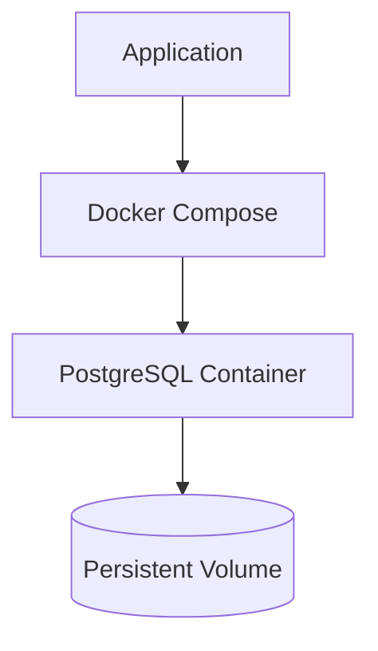
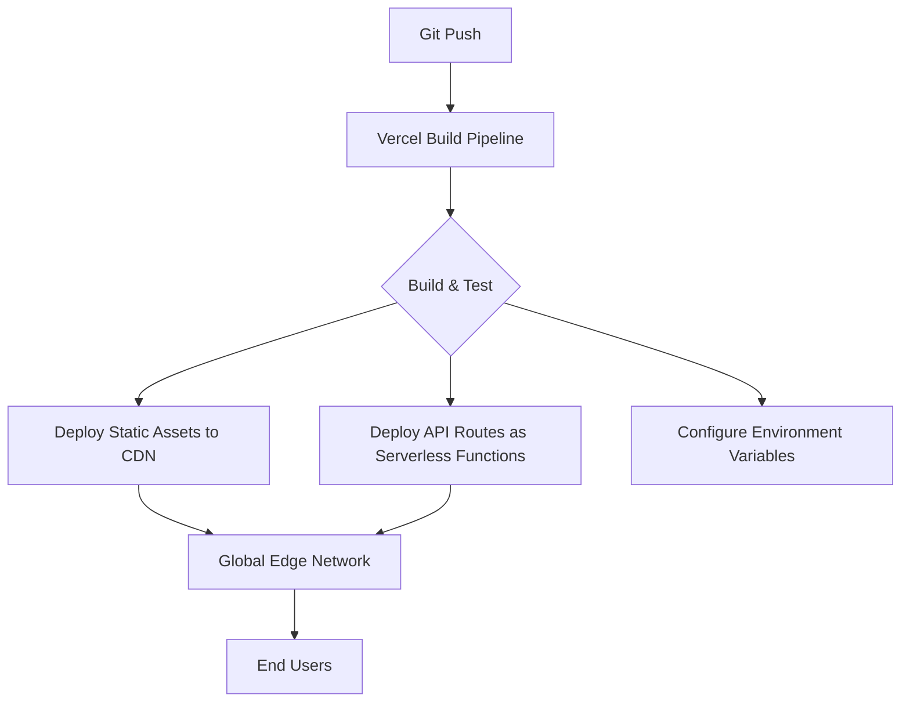
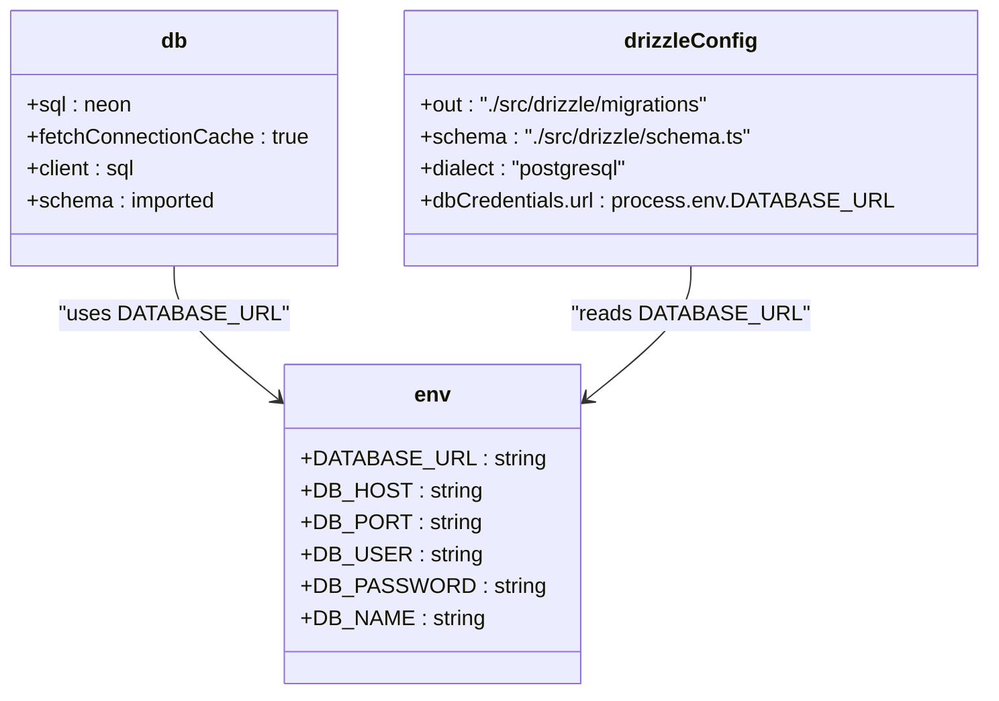

# Deployment & Operations

<cite>
**Referenced Files in This Document**   
- [docker-compose.yml](file://docker-compose.yml)
- [next.config.ts](file://next.config.ts)
- [src/data/env/server.ts](file://src/data/env/server.ts)
- [src/data/env/client.ts](file://src/data/env/client.ts)
- [src/drizzle/db.ts](file://src/drizzle/db.ts)
- [drizzle.config.ts](file://drizzle.config.ts)
- [README.md](file://README.md)
</cite>

## Table of Contents
1. [Introduction](#introduction)
2. [Local Development Setup](#local-development-setup)
3. [Containerization with Docker Compose](#containerization-with-docker-compose)
4. [Vercel Production Deployment](#vercel-production-deployment)
5. [Database Configuration with Neon PostgreSQL](#database-configuration-with-neon-postgresql)
6. [Scaling and Performance Optimization](#scaling-and-performance-optimization)
7. [Monitoring, Logging, and Error Tracking](#monitoring-logging-and-error-tracking)
8. [CI/CD Pipeline Recommendations](#cicd-pipeline-recommendations)
9. [Backup, Disaster Recovery, and Rollback Procedures](#backup-disaster-recovery-and-rollback-procedures)

## Introduction
This guide provides comprehensive instructions for deploying and operating the darasa application across both local development and production environments. It covers containerization, cloud deployment on Vercel, database configuration using Neon PostgreSQL, performance optimization, monitoring, CI/CD integration, and disaster recovery planning.

## Local Development Setup
To set up a local development environment for darasa, ensure Node.js (v19 or higher) is installed. Install dependencies via `npm install`. The project uses environment variables managed through `@t3-oss/env-nextjs` for type-safe configuration. Server-side variables are defined in `src/data/env/server.ts`, while client-visible variables are in `src/data/env/client.ts`.

Environment variables must be provided either via a `.env` file or directly through the hosting platform. Required secrets include `ARCJET_KEY`, `CLERK_SECRET_KEY`, `HUME_API_KEY`, `HUME_SECRET_KEY`, and `GEMINI_API_KEY`. Public Clerk and Hume configuration keys are exposed to the client.

**Section sources**
- [src/data/env/server.ts](file://src/data/env/server.ts#L0-L58)
- [src/data/env/client.ts](file://src/data/env/client.ts#L0-L22)

## Containerization with Docker Compose
The application includes a `docker-compose.yml` configuration that defines a PostgreSQL 17.0 service for local database emulation. This enables consistent development environments across different machines by isolating the database layer.

The service maps port 5432 on the host to the container, uses environment variables (`DB_HOST`, `DB_PORT`, `DB_USER`, `DB_PASSWORD`, `DB_NAME`) for configuration, and persists data via a named volume `pgdata`. This setup allows developers to run the full stack locally without requiring external database dependencies during development.



**Diagram sources**
- [docker-compose.yml](file://docker-compose.yml#L0-L13)

**Section sources**
- [docker-compose.yml](file://docker-compose.yml#L0-L13)

## Vercel Production Deployment
Deployment to Vercel is streamlined through built-in Next.js support. The `next.config.ts` file configures experimental features such as request caching (`useCache: true`), which improves response times for repeated requests.

API routes are automatically deployed as serverless functions. Static assets are served via Vercel’s global CDN, ensuring low-latency delivery worldwide. Edge Functions can be used for API routes requiring ultra-low latency by configuring them in `next.config.ts` with the appropriate runtime settings.

Environment variables must be configured in the Vercel dashboard under Project Settings > Environment Variables, matching those required in `src/data/env/server.ts` and `src/data/env/client.ts`.



**Diagram sources**
- [next.config.ts](file://next.config.ts#L0-L9)
- [src/data/env/server.ts](file://src/data/env/server.ts#L0-L58)
- [src/data/env/client.ts](file://src/data/env/client.ts#L0-L22)

**Section sources**
- [next.config.ts](file://next.config.ts#L0-L9)
- [README.md](file://README.md#L31-L36)

## Database Configuration with Neon PostgreSQL
For production, the application connects to Neon PostgreSQL using the `DATABASE_URL` environment variable. If `DATABASE_URL` is not provided, the system attempts to construct it from individual components: `DB_HOST`, `DB_PORT`, `DB_USER`, `DB_PASSWORD`, and `DB_NAME`. This fallback supports local development but should be avoided in production.

Database connections leverage `@neondatabase/serverless` with connection caching enabled via `neonConfig.fetchConnectionCache = true`. This reuses connections between invocations, significantly improving performance in serverless environments where cold starts are common.

Drizzle ORM is used for schema management and migrations. The `drizzle.config.ts` file specifies the migration output directory and schema path, using `DATABASE_URL` to connect during migration execution.



**Diagram sources**
- [src/drizzle/db.ts](file://src/drizzle/db.ts#L0-L10)
- [drizzle.config.ts](file://drizzle.config.ts#L0-L14)
- [src/data/env/server.ts](file://src/data/env/server.ts#L0-L58)

**Section sources**
- [src/drizzle/db.ts](file://src/drizzle/db.ts#L0-L10)
- [drizzle.config.ts](file://drizzle.config.ts#L0-L14)
- [src/data/env/server.ts](file://src/data/env/server.ts#L0-L58)

## Scaling and Performance Optimization
The application is designed for horizontal scaling on Vercel's serverless infrastructure. Key optimizations include:

- **Edge Function Deployment**: Critical API routes (e.g., authentication, real-time features) can be migrated to Edge Runtime for reduced latency.
- **Static Asset CDN**: All static content (images, fonts, compiled assets) is automatically distributed via Vercel’s CDN.
- **Connection Pooling**: Neon PostgreSQL supports connection pooling via pgBouncer, which should be enabled in production to handle high concurrency efficiently.
- **Caching Strategies**: Use Redis or Upstash for session and query result caching. Implement HTTP caching headers for idempotent API responses.

Ensure `DATABASE_URL` points to a Neon connection string with pooling mode enabled (e.g., `pooler` subdomain).

## Monitoring, Logging, and Error Tracking
Implement the following monitoring strategies:

- **Arcjet Integration**: The `/api/arcjet/route.ts` endpoint enforces bot detection, rate limiting, and shield protection against common attacks. Logs are available in the Arcjet dashboard.
- **Structured Logging**: Use console logs with structured JSON format for easy parsing in Vercel Analytics or third-party tools like Datadog.
- **Error Tracking**: Integrate Sentry or LogRocket for frontend error tracking. Use server-side logging for critical operations in API routes.
- **Uptime Monitoring**: Set up external monitors (e.g., UptimeRobot) to ping health check endpoints.

**Section sources**
- [src/app/api/arcjet/route.ts](file://src/app/api/arcjet/route.ts#L0-L34)

## CI/CD Pipeline Recommendations
Use GitHub Actions for automated CI/CD workflows:

1. On pull request:
   - Run linting and type checking
   - Execute unit and integration tests
2. On merge to main:
   - Deploy to staging environment
   - Run end-to-end tests
   - Apply database migrations using Drizzle CLI
   - Promote to production if all checks pass

Example workflow steps:
```yaml
- run: npx drizzle-kit push
- run: vercel --prod --token=$VERCEL_TOKEN
```

Ensure sensitive environment variables are stored in GitHub Secrets and injected during pipeline execution.

## Backup, Disaster Recovery, and Rollback Procedures
### Backup Strategy
- Enable automated backups in Neon PostgreSQL (daily snapshots with point-in-time recovery)
- Export critical data (user profiles, job infos, interviews) weekly to encrypted cloud storage

### Disaster Recovery
- Maintain a secondary region deployment on Vercel
- Store database backup credentials separately in a secure vault
- Document manual failover procedure for critical services

### Rollback Procedures
- Use Vercel’s built-in rollback feature to revert to previous deployments
- For database rollbacks, restore from Neon backups into a new branch and remigrate if needed
- Communicate downtime via status page and email notifications