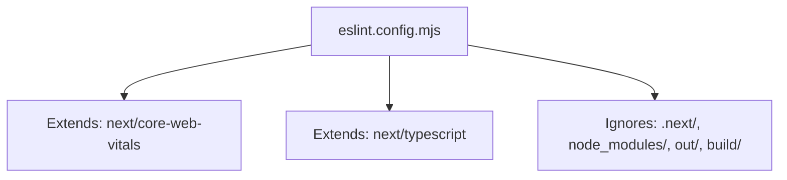
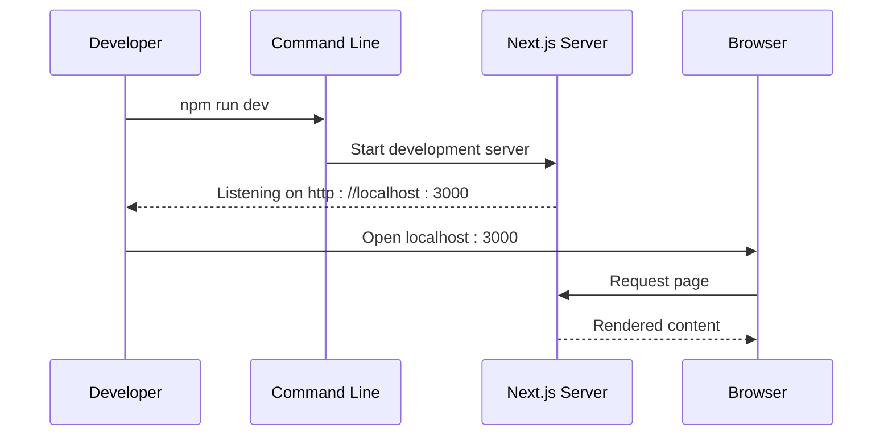
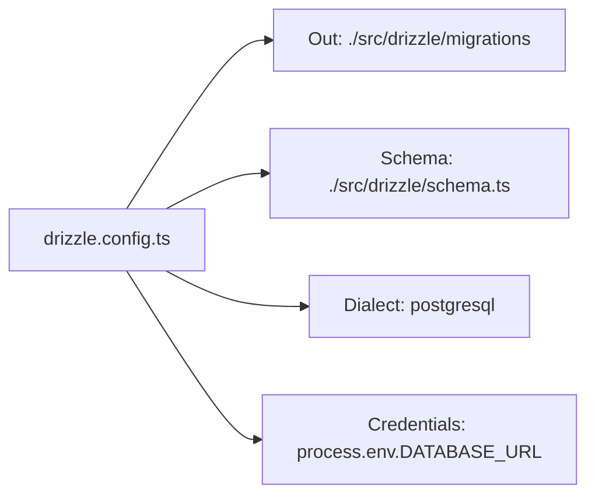
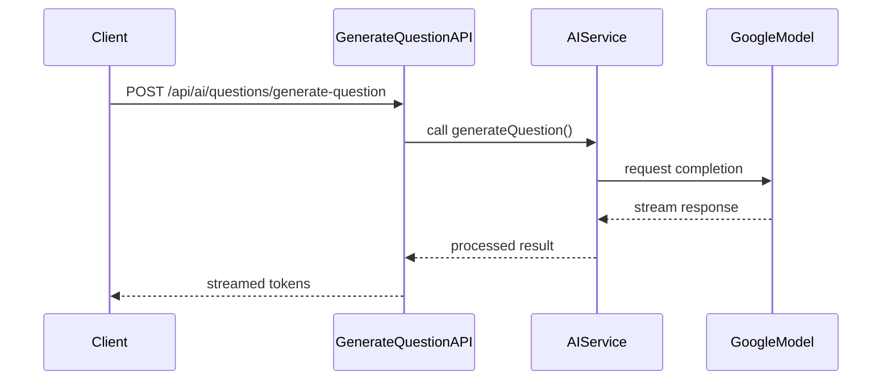
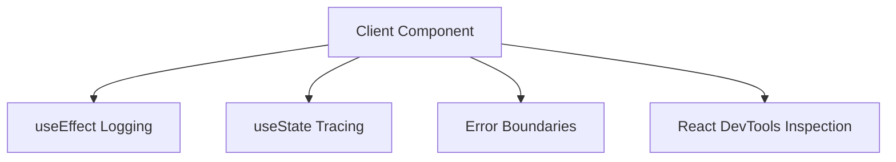
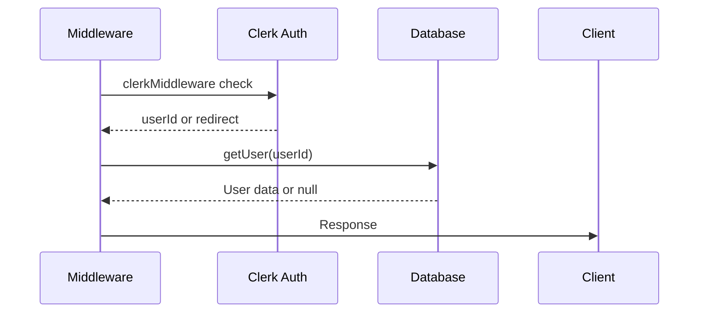
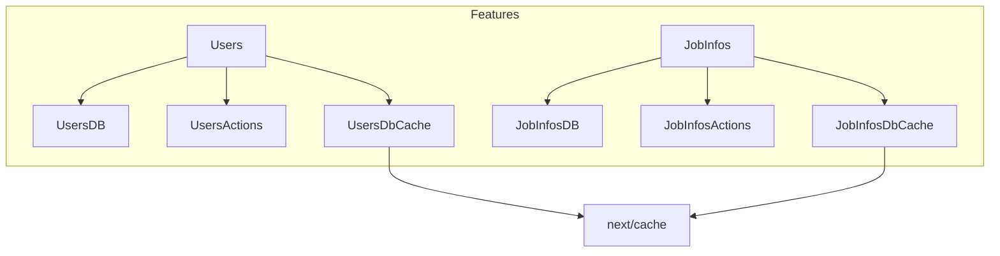

# Developer Workflows

<cite>
**Referenced Files in This Document**   
- [eslint.config.mjs](file://eslint.config.mjs)
- [tsconfig.json](file://tsconfig.json)
- [README.md](file://README.md)
- [next.config.ts](file://next.config.ts)
- [tailwind.config.ts](file://tailwind.config.ts)
- [drizzle.config.ts](file://drizzle.config.ts)
- [middleware.ts](file://src/middleware.ts)
- [db.ts](file://src/features/users/db.ts)
- [actions.ts](file://src/features/users/actions.ts)
- [getCurrentUser.ts](file://src/services/clerk/lib/getCurrentUser.ts)
- [google.ts](file://src/services/ai/models/google.ts)
- [schema.ts](file://src/drizzle/schema.ts)
</cite>

## Table of Contents
1. [Introduction](#introduction)
2. [Development Standards and Configuration](#development-standards-and-configuration)
3. [Feature Implementation Workflow](#feature-implementation-workflow)
4. [Running the Application Locally](#running-the-application-locally)
5. [Database Management](#database-management)
6. [API Testing and Debugging](#api-testing-and-debugging)
7. [Frontend and Backend Debugging Techniques](#frontend-and-backend-debugging-techniques)
8. [Architecture Patterns and Best Practices](#architecture-patterns-and-best-practices)
9. [Contribution Guidelines](#contribution-guidelines)

## Introduction
This document outlines the standard developer workflows for contributing to the darasa project. It covers coding standards, local development setup, database operations, API testing, debugging strategies, and architectural patterns used throughout the codebase. The goal is to ensure consistency across contributions and streamline onboarding for new developers.

## Development Standards and Configuration

The darasa project enforces consistent code quality through ESLint, TypeScript, and formatting tools configured with modern best practices.

### ESLint Configuration
ESLint is configured via `eslint.config.mjs` using the Flat Config format. The configuration extends Next.js' built-in rules for core web vitals and TypeScript support. It automatically ignores common build and dependency directories such as `.next`, `node_modules`, and `out`.



**Diagram sources**
- [eslint.config.mjs](file://eslint.config.mjs#L1-L25)

**Section sources**
- [eslint.config.mjs](file://eslint.config.mjs#L1-L25)

### TypeScript Configuration
TypeScript is configured in `tsconfig.json` to target ES2017 with modern module resolution suitable for bundlers. Key settings include strict type checking, JSX transformation using React's new transform, and path mapping for easier imports via `@/*` aliases that resolve to the `src` directory.

```mermaid
classDiagram
class TsConfig {
+target : "ES2017"
+strict : true
+jsx : "react-jsx"
+moduleResolution : "bundler"
+paths : { "@/*" : ["./src/*"] }
}
```

**Diagram sources**
- [tsconfig.json](file://tsconfig.json#L1-L27)

**Section sources**
- [tsconfig.json](file://tsconfig.json#L1-L27)

### Styling and Build Tools
Tailwind CSS is integrated with typography plugin scoped to `.markdown` classes. PostCSS and Next.js configurations enable optimized font loading and experimental caching features.

**Section sources**
- [tailwind.config.ts](file://tailwind.config.ts#L1-L11)
- [next.config.ts](file://next.config.ts#L1-L9)

## Feature Implementation Workflow

Developers should follow a standardized workflow when implementing new features to maintain code quality and collaboration efficiency.

### Branching Strategy
Use feature branches based on the main branch:
```
git checkout main
git pull origin main
git checkout -b feature/new-interview-flow
```

All changes must be submitted via pull requests for review before merging.

### Writing Tests
While test files are not visible in the current structure, any new functionality should include unit and integration tests under appropriate `__tests__` directories or alongside implementation files.

### Linting and Formatting
Run linting and formatting checks before committing:
```bash
npm run lint
npm run format
```

These commands ensure compliance with project coding standards enforced by ESLint and Prettier (implied by standard tooling).

**Section sources**
- [eslint.config.mjs](file://eslint.config.mjs#L1-L25)
- [tsconfig.json](file://tsconfig.json#L1-L27)

### Submitting Pull Requests
Pull requests should:
- Reference relevant issues
- Include clear descriptions of changes
- Pass all CI checks
- Be reviewed by at least one team member
- Include updates to documentation if applicable

## Running the Application Locally

To run the application locally, follow these steps:

1. Ensure environment variables are set in a `.env` file
2. Install dependencies: `npm install`
3. Start the development server: `npm run dev`

The app will be available at [http://localhost:3000](http://localhost:3000). Pages update automatically during development.



**Diagram sources**
- [README.md](file://README.md#L5-L12)

**Section sources**
- [README.md](file://README.md#L5-L12)

## Database Management

The project uses Drizzle ORM for database interactions with PostgreSQL.

### Drizzle Configuration
Drizzle is configured in `drizzle.config.ts` to generate migrations in `src/drizzle/migrations` and use the schema defined in `src/drizzle/schema.ts`. The database connection uses credentials from the `DATABASE_URL` environment variable.



**Diagram sources**
- [drizzle.config.ts](file://drizzle.config.ts#L1-L13)

**Section sources**
- [drizzle.config.ts](file://drizzle.config.ts#L1-L13)

### Schema Structure
The database schema is modular, split into individual files under `src/drizzle/schema/` for users, jobinfo, interview, and question entities. These are exported collectively from `schema.ts`.

**Section sources**
- [schema.ts](file://src/drizzle/schema.ts#L1-L4)

### Running Migrations
Generate and apply migrations using Drizzle CLI:
```bash
npx drizzle-kit generate
npx drizzle-kit push
```

Migrations are versioned and stored in SQL format for reproducibility.

## API Testing and Debugging

API endpoints are located under `src/app/api` and follow Next.js App Router conventions.

### Example AI Endpoint Flow
When generating AI-powered questions:



**Diagram sources**
- [google.ts](file://src/services/ai/models/google.ts#L1-L5)
- [generate-question/route.ts](file://src/app/api/ai/questions/generate-question/route.ts)

### Inspecting AI Stream Responses
Use browser developer tools to monitor streaming responses in real time. Look for `text/event-stream` content type and inspect individual chunks as they arrive.

Enable logging in AI service wrappers like `useCompletion` hooks to trace payload structure and timing.

**Section sources**
- [google.ts](file://src/services/ai/models/google.ts#L1-L5)
- [_NewQuestionClientPage.tsx](file://src/app/app/job-infos/[jobInfoId]/questions/_NewQuestionClientPage.tsx#L36-L86)

## Frontend and Backend Debugging Techniques

Effective debugging requires understanding both client and server execution contexts.

### Frontend Debugging
Use `console.log` strategically in client components like `OnboardingClient` to trace user flow and state transitions. Leverage React Developer Tools to inspect component hierarchy and props.

For cache-related issues, examine how `use cache` directives interact with `cacheTag` and revalidation logic.



**Section sources**
- [onboarding/_client.tsx](file://src/app/onboarding/_client.tsx#L1-L38)
- [errorToast.tsx](file://src/lib/errorToast.tsx#L1-L33)

### Backend Debugging
Server actions and API routes can be debugged by adding structured logs. For example, `createUserFromClerk` includes console logs to track manual user creation attempts.

Monitor middleware behavior, especially authentication flows handled by Clerk and temporarily disabled Arcjet protection.



**Diagram sources**
- [middleware.ts](file://src/middleware.ts#L1-L53)
- [getCurrentUser.ts](file://src/services/clerk/lib/getCurrentUser.ts#L1-L24)

**Section sources**
- [middleware.ts](file://src/middleware.ts#L1-L53)
- [actions.ts](file://src/features/users/actions.ts#L1-L49)
- [db.ts](file://src/features/users/db.ts#L1-L21)

## Architecture Patterns and Best Practices

The codebase follows several key architectural patterns to promote maintainability and scalability.

### Modular Feature Organization
Features like `users`, `jobInfos`, and `interviews` have dedicated directories containing actions, database access, permissions, and UI components.

Each feature encapsulates its own cache invalidation logic through `dbCache.ts` modules.



**Diagram sources**
- [dbCache.ts](file://src/features/users/dbCache.ts#L1-L25)
- [db.ts](file://src/features/users/db.ts#L1-L21)

**Section sources**
- [features/users/](file://src/features/users/)
- [features/jobInfos/](file://src/features/jobInfos/)

### Reusable Components
UI components under `src/components/ui` follow Headless UI principles with unstyled base components enhanced via Tailwind CSS.

Common utilities like `BackLink`, `S