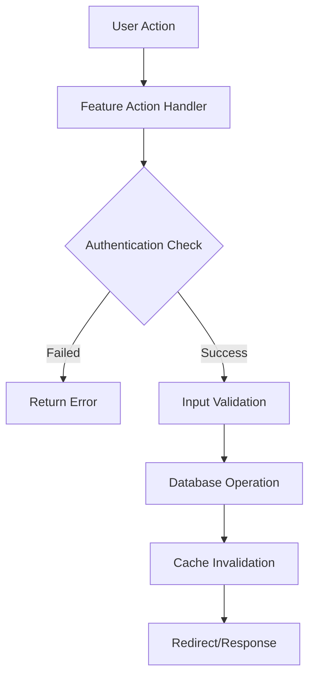
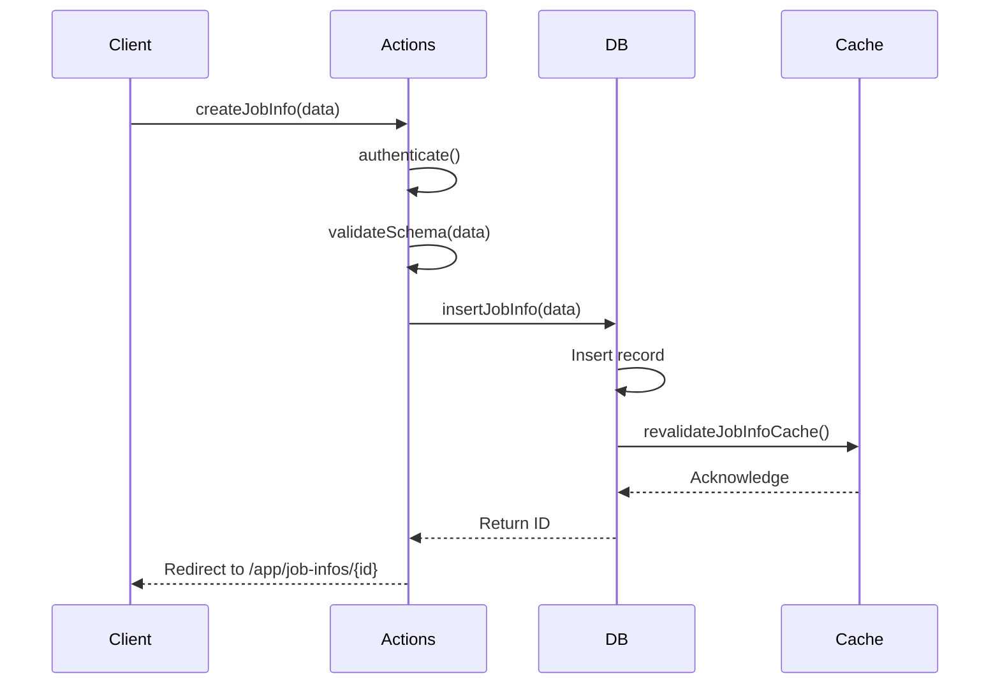
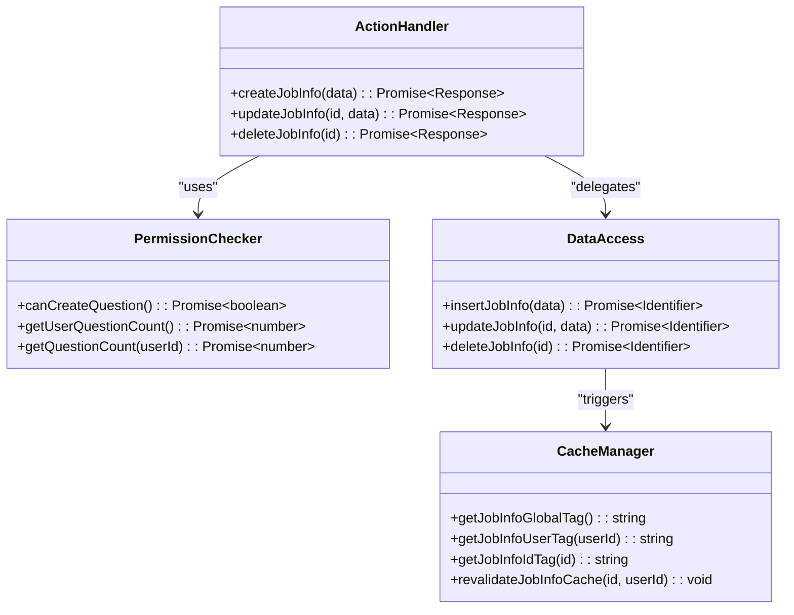

# Feature Modules

<cite>
**Referenced Files in This Document**  
- [src/features/jobInfos/actions.ts](file://src/features/jobInfos/actions.ts)
- [src/features/jobInfos/db.ts](file://src/features/jobInfos/db.ts)
- [src/features/jobInfos/dbCache.ts](file://src/features/jobInfos/dbCache.ts)
- [src/features/interviews/actions.ts](file://src/features/interviews/actions.ts)
- [src/features/interviews/db.ts](file://src/features/interviews/db.ts)
- [src/features/questions/db.ts](file://src/features/questions/db.ts)
- [src/features/questions/permissions.ts](file://src/features/questions/permissions.ts)
- [src/features/users/plan.ts](file://src/features/users/plan.ts)
</cite>

## Table of Contents
1. [Introduction](#introduction)
2. [Domain-Driven Organization](#domain-driven-organization)
3. [Feature Module Structure Pattern](#feature-module-structure-pattern)
4. [Core Functionality and Interactions](#core-functionality-and-interactions)
5. [Implementation Examples](#implementation-examples)
6. [Cross-Cutting Concerns](#cross-cutting-concerns)
7. [Guidelines for Extension](#guidelines-for-extension)
8. [Conclusion](#conclusion)

## Introduction
The darasa application implements a domain-driven architecture through its feature modules system, organized under the `src/features/` directory. Each feature corresponds to a bounded context such as jobInfos, interviews, or questions, encapsulating related functionality and data access patterns. This document details the architectural conventions, internal structure, and implementation patterns used across these feature modules, providing guidance for both understanding existing code and extending the system with new features.

## Domain-Driven Organization

The `src/features/` directory serves as the primary organizational boundary for domain-specific functionality within darasa. Each subdirectory represents a distinct bounded context aligned with business capabilities:

- **jobInfos**: Manages job description entities and associated metadata
- **interviews**: Handles interview sessions, recordings, and AI-generated feedback
- **questions**: Controls question generation and management for interview preparation
- **users**: Contains user-specific logic including subscription plans and profile data
- **resumeAnalysis**: Governs permissions and workflows related to resume analysis

This domain-driven organization enables clear separation of concerns, allowing teams to work on independent features while maintaining consistent implementation patterns across the codebase.

**Section sources**
- [src/features/jobInfos](file://src/features/jobInfos)
- [src/features/interviews](file://src/features/interviews)
- [src/features/questions](file://src/features/questions)

## Feature Module Structure Pattern

Each feature module follows a standardized internal structure that promotes consistency and maintainability. The core files within each feature directory serve specific architectural roles:

### actions.ts - Server-Side Operations
Contains server actions that handle user-initiated operations. These functions typically:
- Validate authentication and authorization
- Parse and validate input data
- Coordinate calls to database operations
- Handle redirects and revalidation
- Implement error handling at the feature boundary

### db.ts - Direct Database Access
Provides low-level data access methods that directly interact with the Drizzle ORM. Functions in this file:
- Perform CRUD operations against database tables
- Return minimal necessary data (typically identifiers)
- Trigger cache invalidation after mutations
- Maintain type safety through inferred schema types

### dbCache.ts - Cache Coordination
Manages Next.js cache tags and revalidation logic specific to the feature. This file:
- Defines cache tag naming conventions
- Exports revalidation functions called by db operations
- Coordinates cache invalidation across related resources
- Integrates with global caching utilities from `@/lib/dataCache`

### permissions.ts - Authorization Logic
Encapsulates permission checks and plan-based restrictions. These functions:
- Query Clerk permissions to determine capability
- Implement business rules based on subscription tiers
- Aggregate multiple permission requirements
- Return boolean results for use in action guards

This consistent structure allows developers to quickly understand any feature's implementation by recognizing familiar patterns across modules.

**Section sources**
- [src/features/jobInfos/actions.ts](file://src/features/jobInfos/actions.ts)
- [src/features/jobInfos/db.ts](file://src/features/jobInfos/db.ts)
- [src/features/jobInfos/dbCache.ts](file://src/features/jobInfos/dbCache.ts)
- [src/features/questions/permissions.ts](file://src/features/questions/permissions.ts)

## Core Functionality and Interactions

Feature modules interact with each other through well-defined interfaces and shared dependencies. Key interaction patterns include:

- **Authentication Integration**: All features import `getCurrentUser` from `@/services/clerk/lib/getCurrentUser` to verify user identity before operations
- **Schema Sharing**: Validation schemas are defined within features and reused across actions and API routes
- **Cross-Feature Navigation**: Actions often redirect to routes managed by other features (e.g., job info creation redirecting to interview pages)
- **Permission Delegation**: Features may check permissions defined in other domains (e.g., questions checking user plan limits)

Data flows follow a unidirectional pattern: actions → db operations → database, with cache invalidation signals propagating back up through the call chain. Error handling is performed at the action level, ensuring users receive meaningful feedback while maintaining clean separation between presentation and business logic.

**Diagram sources**
- [src/features/jobInfos/actions.ts](file://src/features/jobInfos/actions.ts)
- [src/features/interviews/actions.ts](file://src/features/interviews/actions.ts)

## Implementation Examples

### Job Information Management
The `jobInfos` feature demonstrates the complete pattern through its action and data access layers. The `createJobInfo` action validates user permissions, parses input against a Zod schema, delegates to `insertJobInfo` in the db layer, and redirects upon success. The corresponding `insertJobInfo` function performs the actual database insertion and triggers cache revalidation through `revalidateJobInfoCache`.

**Diagram sources**
- [src/features/jobInfos/actions.ts](file://src/features/jobInfos/actions.ts#L1-L40)
- [src/features/jobInfos/db.ts](file://src/features/jobInfos/db.ts#L1-L20)

### Interview Workflow
The `interviews` feature extends the base pattern with additional concerns like rate limiting and AI integration. The `createInterview` action incorporates Arcjet for rate limiting, checks plan-based permissions through `canCreateInterview`, and validates user ownership of the target job information before proceeding with database insertion.

**Section sources**
- [src/features/interviews/actions.ts](file://src/features/interviews/actions.ts)
- [src/features/interviews/db.ts](file://src/features/interviews/db.ts)

## Cross-Cutting Concerns

### Cache Invalidation
Cache coordination is implemented through a layered approach. The `dbCache.ts` files define feature-specific revalidation functions that invalidate multiple related cache tags. For example, updating a job information record invalidates global, user-specific, and record-specific tags to ensure consistency across different access patterns.

### Permission Checks
Authorization is handled consistently across features using Clerk's permission system. The `questions/permissions.ts` file demonstrates a sophisticated permission model that combines plan-based limits (unlimited_questions) with usage counting to enforce quotas. This pattern allows fine-grained control over feature accessibility based on subscription tiers.

### Error Handling
Error handling occurs at the action boundary, with structured responses containing error flags and user-friendly messages. Errors are not propagated beyond the feature module, maintaining clean separation between internal implementation details and external interfaces.

**Diagram sources**
- [src/features/questions/permissions.ts](file://src/features/questions/permissions.ts)
- [src/features/jobInfos/dbCache.ts](file://src/features/jobInfos/dbCache.ts)
- [src/features/jobInfos/actions.ts](file://src/features/jobInfos/actions.ts)
- [src/features/jobInfos/db.ts](file://src/features/jobInfos/db.ts)

## Guidelines for Extension

When extending existing features or adding new ones, follow these conventions:

1. **Maintain File Structure**: New features should include `actions.ts`, `db.ts`, and `dbCache.ts` at minimum, with `permissions.ts` added if authorization logic is required.

2. **Use Consistent Naming**: Cache tag functions should follow the pattern `get{Feature}{Scope}Tag`, and revalidation functions should be named `revalidate{Feature}Cache`.

3. **Handle Authentication First**: All actions should begin with `getCurrentUser()` and return permission errors for unauthenticated requests.

4. **Validate Input Early**: Use Zod schemas for input validation and return structured error responses before proceeding with business logic.

5. **Chain Operations Properly**: Actions should call db functions, which in turn trigger cache revalidation—never bypass this chain.

6. **Preserve Type Safety**: Leverage Drizzle's `$inferInsert` types to ensure database operations match schema definitions.

7. **Implement Idempotent Revalidation**: Cache invalidation should be safe to call multiple times, even if the underlying record has been deleted.

8. **Centralize Permissions**: Complex permission logic should be isolated in dedicated functions that return booleans, making them easy to test and reuse.

Following these guidelines ensures new code integrates seamlessly with the existing architecture and maintains the system's overall consistency and reliability.

**Section sources**
- [src/features/jobInfos/actions.ts](file://src/features/jobInfos/actions.ts)
- [src/features/jobInfos/db.ts](file://src/features/jobInfos/db.ts)
- [src/features/jobInfos/dbCache.ts](file://src/features/jobInfos/dbCache.ts)
- [src/features/questions/permissions.ts](file://src/features/questions/permissions.ts)

## Conclusion

The feature modules system in darasa provides a robust, scalable architecture for organizing domain-specific functionality. By adhering to domain-driven design principles and enforcing consistent implementation patterns across features, the codebase maintains clarity and predictability. The separation of concerns between actions, data access, caching, and permissions enables focused development while ensuring cross-cutting concerns are properly addressed. This structure facilitates both maintenance of existing features and extension of the system with new capabilities, supporting the long-term evolution of the application.