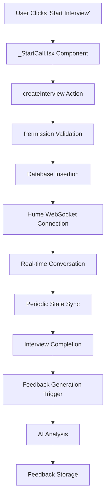
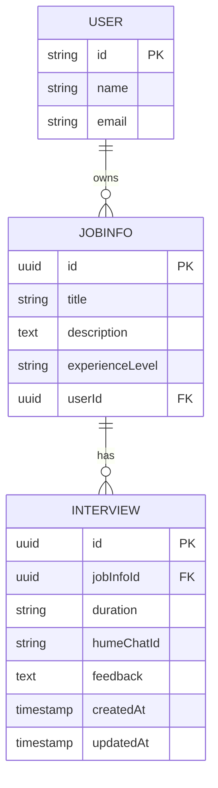
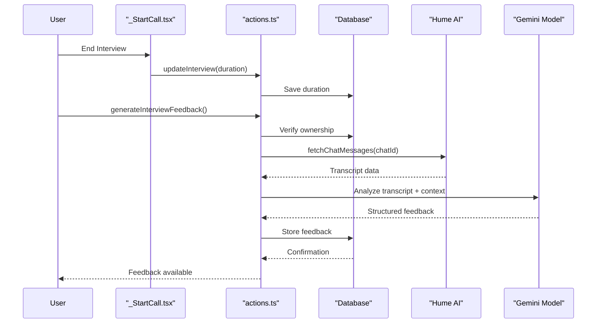

# Interview Simulation

<cite>
**Referenced Files in This Document**   
- [_StartCall.tsx](file://src/app/app/job-infos/[jobInfoId]/interviews/new/_StartCall.tsx)
- [api.ts](file://src/services/hume/lib/api.ts)
- [db.ts](file://src/drizzle/db.ts)
- [interview.ts](file://src/drizzle/schema/interview.ts)
- [permissions.ts](file://src/features/interviews/permissions.ts)
- [actions.ts](file://src/features/interviews/actions.ts)
- [interviews.ts](file://src/services/ai/interviews.ts)
</cite>

## Table of Contents
1. [Introduction](#introduction)
2. [Interview Session Lifecycle](#interview-session-lifecycle)
3. [Core Components and Data Flow](#core-components-and-data-flow)
4. [State Management and Client-Server Synchronization](#state-management-and-client-server-synchronization)
5. [Database Persistence and Security](#database-persistence-and-security)
6. [AI-Powered Feedback Generation](#ai-powered-feedback-generation)
7. [WebSocket Connection and Audio Streaming](#websocket-connection-and-audio-streaming)
8. [Performance Optimization and Error Handling](#performance-optimization-and-error-handling)
9. [Conclusion](#conclusion)

## Introduction

The Interview Simulation feature in darasa provides users with real-time, voice-based mock interviews powered by Hume AI's Empathic Voice technology. This immersive experience enables job seekers to practice interviews in a realistic environment where an AI interviewer engages them in natural conversation. The system captures the full interaction, analyzes both verbal content and emotional cues, and delivers comprehensive performance feedback. The architecture integrates client-side React components with server-side actions, WebSocket streaming, and AI analysis pipelines to create a seamless simulation experience that helps users improve their interview skills.

## Interview Session Lifecycle

The lifecycle of an interview session begins when a user initiates a mock interview from the job information page. The process follows a well-defined sequence from initiation to completion and feedback generation. When the user clicks "Start Interview," the `_StartCall.tsx` component triggers the `createInterview` action, which validates permissions and creates a new interview record in the database. Upon successful creation, the client establishes a WebSocket connection to Hume AI's servers using the `useVoice` hook from the Hume React SDK. During the conversation, the system continuously synchronizes state between client and server, updating the interview duration every 10 seconds. When the user ends the call or disconnects, the final duration is saved, and the interview session transitions to a completed state, making it available for AI analysis and feedback generation.

**Section sources**
- [actions.ts](file://src/features/interviews/actions.ts#L1-L178)
- [_StartCall.tsx](file://src/app/app/job-infos/[jobInfoId]/interviews/new/_StartCall.tsx#L1-L197)

## Core Components and Data Flow

The Interview Simulation feature comprises several interconnected components that work together to deliver a cohesive user experience. The primary entry point is the `_StartCall.tsx` component, which orchestrates the entire interview process. This client-side component uses the Hume React SDK's `useVoice` hook to manage the audio stream and WebSocket connection. On the server side, the `actions.ts` file contains server actions that handle interview creation, updates, and feedback generation. The data flow begins with the client requesting interview creation, which triggers server-side validation through permission checks before persisting the interview record. Once the interview completes, the system triggers AI analysis to generate detailed feedback based on the conversation transcript and emotional analysis data provided by Hume AI.

**Diagram sources**
- [_StartCall.tsx](file://src/app/app/job-infos/[jobInfoId]/interviews/new/_StartCall.tsx#L1-L197)
- [actions.ts](file://src/features/interviews/actions.ts#L1-L178)

## State Management and Client-Server Synchronization

State management in the Interview Simulation feature relies on a combination of client-side React state and server-side database persistence with periodic synchronization. The `_StartCall.tsx` component maintains local state for the interview ID and uses React's `useEffect` hooks to synchronize critical data points with the server. Two primary synchronization mechanisms are implemented: chat metadata synchronization and duration tracking. The first effect monitors changes to `chatMetadata.chatId` and immediately updates the corresponding field in the database through the `updateInterview` action. The second effect runs an interval timer that updates the interview duration every 10 seconds, ensuring accurate time tracking even if the session terminates unexpectedly. Additionally, a cleanup effect handles the final state update when the WebSocket connection closes, guaranteeing that the last recorded duration is persisted regardless of how the interview ends.

**Section sources**
- [_StartCall.tsx](file://src/app/app/job-infos/[jobInfoId]/interviews/new/_StartCall.tsx#L1-L197)
- [actions.ts](file://src/features/interviews/actions.ts#L1-L178)

## Database Persistence and Security

Interview data persistence is managed through a structured database schema with appropriate security controls. The `interview.ts` schema defines the structure of interview records, including foreign key relationships to job information and fields for storing the Hume chat ID, duration, and AI-generated feedback. Each interview is associated with a specific `jobInfoId`, creating a clear hierarchical relationship between job profiles and their corresponding mock interviews. Security is enforced through the `permissions.ts` file, which implements access control logic to prevent unauthorized operations. The system checks both feature-based permissions (via Clerk) and usage limits (maximum of two interviews for non-upgraded users) before allowing interview creation. All database operations are performed through server actions that validate the user's ownership of the associated job information, ensuring that users can only access their own interview data.

**Diagram sources**
- [interview.ts](file://src/drizzle/schema/interview.ts#L1-L22)
- [permissions.ts](file://src/features/interviews/permissions.ts#L1-L47)

## AI-Powered Feedback Generation

Post-interview feedback generation leverages AI analysis to provide users with comprehensive performance evaluation. The `generateAiInterviewFeedback` function in `interviews.ts` serves as the core of this system, orchestrating the retrieval and processing of interview data. When triggered, this function first fetches the complete conversation transcript from Hume AI using the stored chat ID. It then formats the messages with speaker identification and emotional features before submitting them to Google's Gemini model for analysis. The AI prompt is carefully crafted to guide the model in evaluating multiple dimensions of interview performance, including communication clarity, confidence, response quality, pacing, engagement, role fit, and overall strengths and areas for improvement. The resulting feedback is structured in markdown format with numerical ratings and actionable insights, providing users with a detailed assessment they can use to improve their interviewing skills.

**Diagram sources**
- [actions.ts](file://src/features/interviews/actions.ts#L1-L178)
- [interviews.ts](file://src/services/ai/interviews.ts#L1-L113)
- [api.ts](file://src/services/hume/lib/api.ts#L1-L19)

## WebSocket Connection and Audio Streaming

The real-time voice interaction is facilitated through Hume AI's WebSocket API, implemented using the Hume React SDK. The connection process begins when the `connect` function is called with authentication credentials and configuration parameters, including the Hume config ID and session variables such as the user's name, job title, and description. The WebSocket stream transmits audio data bidirectionally, enabling natural conversation between the user and the AI interviewer. Client