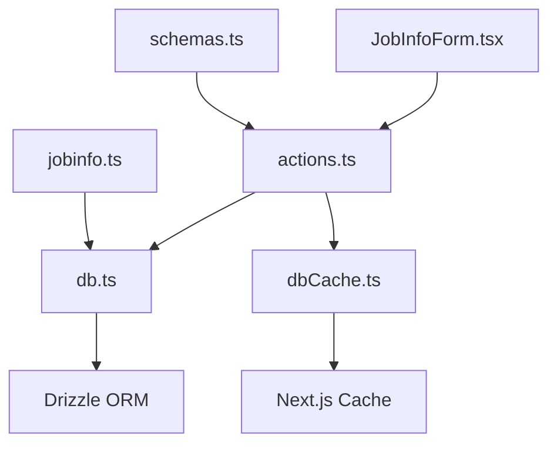
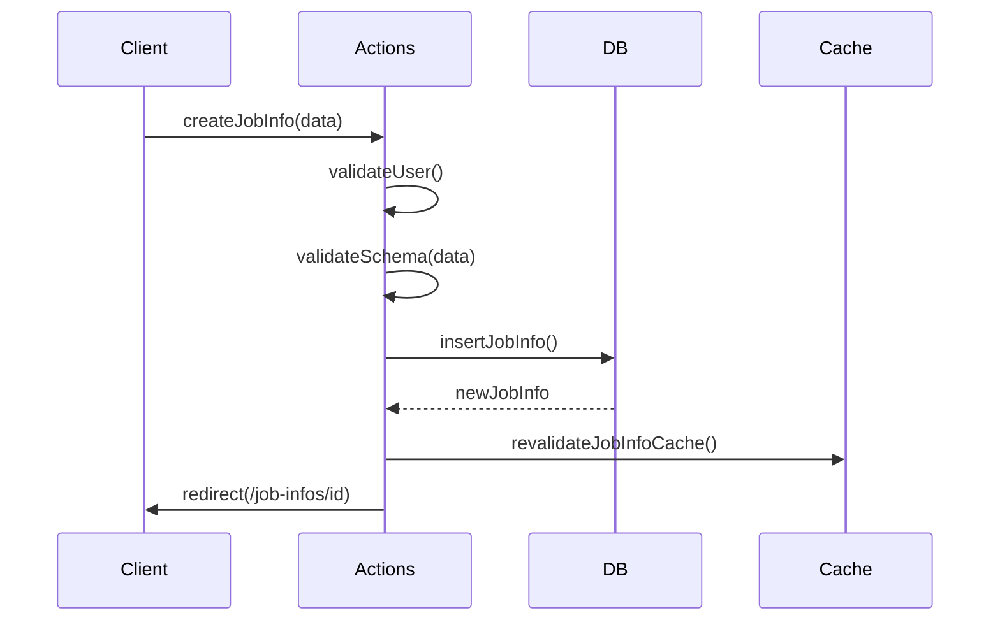
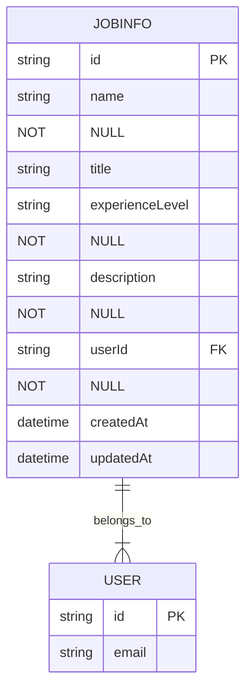
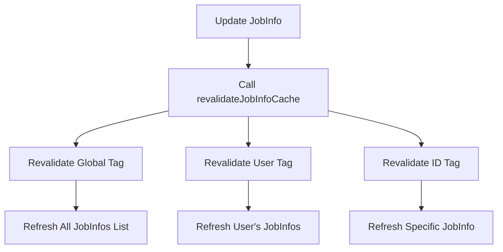
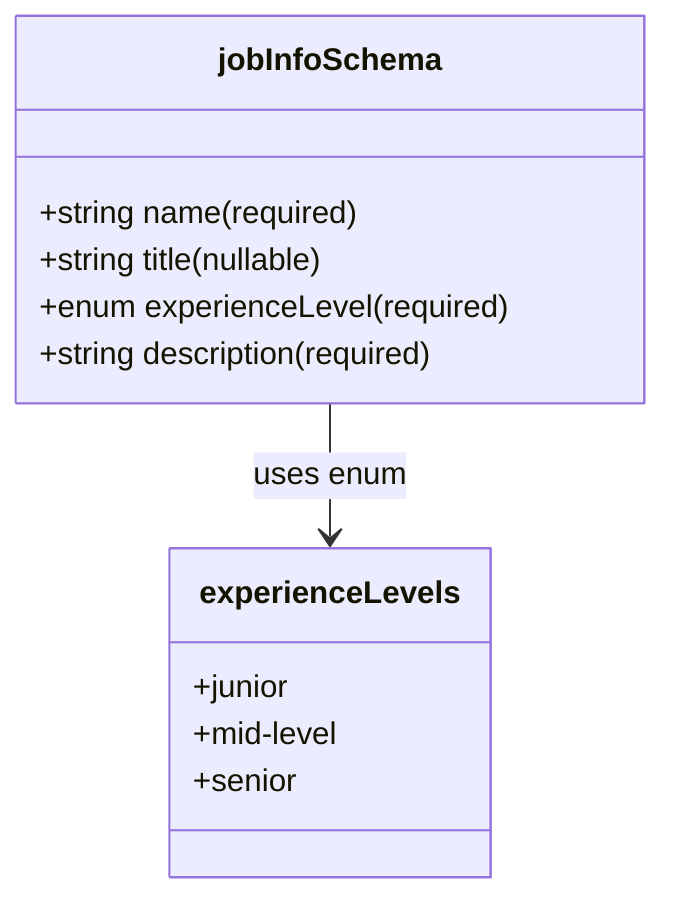

# Job Information Management

<cite>
**Referenced Files in This Document**   
- [actions.ts](file://src/features/jobInfos/actions.ts)
- [db.ts](file://src/features/jobInfos/db.ts)
- [dbCache.ts](file://src/features/jobInfos/dbCache.ts)
- [schemas.ts](file://src/features/jobInfos/schemas.ts)
- [JobInfoForm.tsx](file://src/features/jobInfos/components/JobInfoForm.tsx)
- [jobinfo.ts](file://src/drizzle/schema/jobinfo.ts)
</cite>

## Table of Contents
1. [Introduction](#introduction)
2. [Core Components and Architecture](#core-components-and-architecture)
3. [CRUD Operations via Server Actions](#crud-operations-via-server-actions)
4. [Database Interaction with Drizzle ORM](#database-interaction-with-drizzle-orm)
5. [Cache Coordination and Revalidation](#cache-coordination-and-revalidation)
6. [Form Handling and Validation with Zod](#form-handling-and-validation-with-zod)
7. [UI Integration through JobInfoForm](#ui-integration-through-jobinfoform)
8. [Integration with Interviews and Questions](#integration-with-interviews-and-questions)
9. [Common Issues and Troubleshooting](#common-issues-and-troubleshooting)
10. [Best Practices for Schema Extension](#best-practices-for-schema-extension)

## Introduction
The Job Information Management feature in darasa serves as the central hub for storing and managing job application details such as company name, role title, description, and experience level. It enables users to create, update, and delete job information records that act as contextual anchors for AI-powered interviews and question generation. This module is foundational to personalizing user interactions by providing detailed job context used across downstream features.

## Core Components and Architecture
This module follows a layered architecture pattern with clear separation between UI, business logic, data access, and caching layers. The components are organized under `src/features/jobInfos` and include actions for server-side operations, database utilities, schema definitions, and UI components.

**Diagram sources**
- [JobInfoForm.tsx](file://src/features/jobInfos/components/JobInfoForm.tsx)
- [actions.ts](file://src/features/jobInfos/actions.ts)
- [db.ts](file://src/features/jobInfos/db.ts)
- [dbCache.ts](file://src/features/jobInfos/dbCache.ts)
- [schemas.ts](file://src/features/jobInfos/schemas.ts)
- [jobinfo.ts](file://src/drizzle/schema/jobinfo.ts)

**Section sources**
- [actions.ts](file://src/features/jobInfos/actions.ts)
- [db.ts](file://src/features/jobInfos/db.ts)
- [dbCache.ts](file://src/features/jobInfos/dbCache.ts)
- [schemas.ts](file://src/features/jobInfos/schemas.ts)
- [JobInfoForm.tsx](file://src/features/jobInfos/components/JobInfoForm.tsx)

## CRUD Operations via Server Actions
Server actions in `actions.ts` handle all CRUD operations for job information. These functions run on the server and are invoked from client components using React Server Components patterns. Each action includes permission checks, input validation, and appropriate redirects or responses.

The `createJobInfo` function validates incoming data against the Zod schema, ensures the user is authenticated, inserts the record into the database, and redirects to the newly created job info page. Similarly, `updateJobInfo` performs authentication and ownership verification before updating the record.

**Diagram sources**
- [actions.ts](file://src/features/jobInfos/actions.ts#L17-L37)
- [db.ts](file://src/features/jobInfos/db.ts#L21-L37)

**Section sources**
- [actions.ts](file://src/features/jobInfos/actions.ts#L17-L70)

## Database Interaction with Drizzle ORM
Direct database interactions occur through `db.ts`, which exports functions like `insertJobInfo`, `updateJobInfo`, and `deleteJobInfo`. These functions use Drizzle ORM to perform SQL operations on the `JobInfoTable`. All mutations return the affected record identifiers to enable cache invalidation.

The `JobInfoTable` schema defines fields including `name`, `title`, `experienceLevel`, and `description`, with foreign key constraints linking to the `UserTable`. The table supports cascading deletes to maintain referential integrity when a user is removed.

**Diagram sources**
- [jobinfo.ts](file://src/drizzle/schema/jobinfo.ts#L14-L25)
- [db.ts](file://src/features/jobInfos/db.ts)

**Section sources**
- [db.ts](file://src/features/jobInfos/db.ts)
- [jobinfo.ts](file://src/drizzle/schema/jobinfo.ts)

## Cache Coordination and Revalidation
Cache coordination is managed through `dbCache.ts`, which implements tag-based revalidation strategies using Next.js cache tags. When a job info record is created, updated, or deleted, the `revalidateJobInfoCache` function invalidates three types of tags: global, user-specific, and record-specific.

This ensures that stale data is not served from cache after mutations. The tagging system uses standardized prefixes (`global:jobInfos`, `user:userId:jobInfos`, `id:id:jobInfos`) to allow fine-grained control over revalidation scope.

**Diagram sources**
- [dbCache.ts](file://src/features/jobInfos/dbCache.ts#L15-L25)
- [lib/dataCache.ts](file://src/lib/dataCache.ts)

**Section sources**
- [dbCache.ts](file://src/features/jobInfos/dbCache.ts)

## Form Handling and Validation with Zod
Form validation is implemented using Zod schemas defined in `schemas.ts`. The `jobInfoSchema` enforces required fields like `name` and `description`, optional nullable fields like `title`, and restricts `experienceLevel` to an enumerated set of values: "junior", "mid-level", and "senior".

These validations are applied both on the client side (via react-hook-form and zodResolver) and server side (using safeParse) to ensure data integrity regardless of the request source. This dual-layer validation prevents malformed data from being submitted even if API calls are made directly.

**Diagram sources**
- [schemas.ts](file://src/features/jobInfos/schemas.ts#L3-L8)
- [jobinfo.ts](file://src/drizzle/schema/jobinfo.ts#L1-L12)

**Section sources**
- [schemas.ts](file://src/features/jobInfos/schemas.ts)

## UI Integration through JobInfoForm
The `JobInfoForm.tsx` component provides the user interface for creating and editing job information. It uses React Hook Form with Zod resolver for state management and validation feedback. The form dynamically switches between create and update modes based on whether a `jobInfo` prop is provided.

Field rendering includes specialized handling for nullable strings (like title) and enumerated types (like experience level), which are rendered using select inputs populated from the `experienceLevels` array. Form submission triggers either `createJobInfo` or `updateJobInfo` server actions accordingly.

**Section sources**
- [JobInfoForm.tsx](file://src/features/jobInfos/components/JobInfoForm.tsx)

## Integration with Interviews and Questions
Job information acts as the parent context for generating role-specific content in interviews and questions. Other modules such as interviews and questions reference job info records to retrieve contextual data like job description and experience level when generating AI responses.

For example, when listing interviews for a specific job, the system filters by `jobInfoId` and verifies user ownership through the associated `userId`. This hierarchical relationship ensures that all generated content remains relevant to the specific job context.

**Section sources**
- [jobinfo.ts](file://src/drizzle/schema/jobinfo.ts#L27-L34)
- [interview.ts](file://src/drizzle/schema/interview.ts)
- [page.tsx](file://src/app/app/job-infos/[jobInfoId]/interviews/page.tsx)

## Common Issues and Troubleshooting
Common issues include form validation failures due to missing required fields, cache invalidation delays after updates, and permission errors during edit attempts. Validation errors are handled gracefully through toast notifications triggered by error responses from server actions.

Permission checks occur at multiple levels: user authentication is verified first, followed by ownership validation ensuring that users can only modify their own job information. If these checks fail, appropriate error messages are returned to the client.

**Section sources**
- [actions.ts](file://src/features/jobInfos/actions.ts#L44-L101)
- [JobInfoForm.tsx](file://src/features/jobInfos/components/JobInfoForm.tsx#L44-L92)

## Best Practices for Schema Extension
To extend the `JobInfo` schema, developers should:
1. Update the `JobInfoTable` definition in `jobinfo.ts` with new column definitions
2. Add corresponding fields to the `jobInfoSchema` in `schemas.ts` with appropriate validation rules
3. Modify the `JobInfoFormData` type