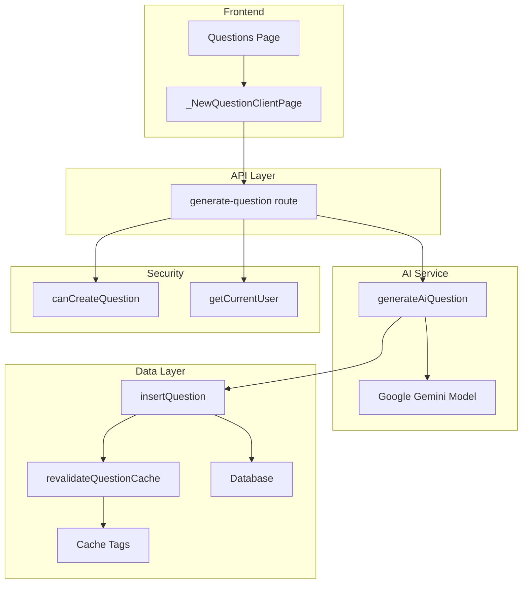
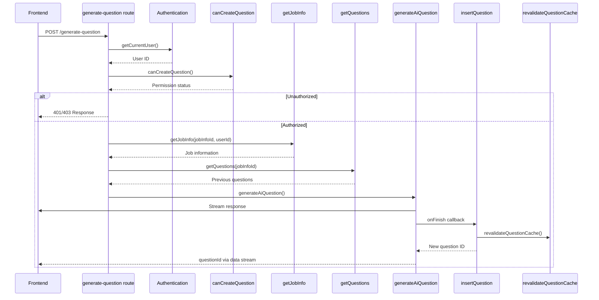
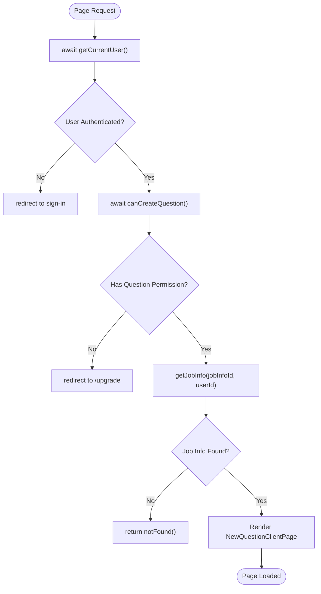
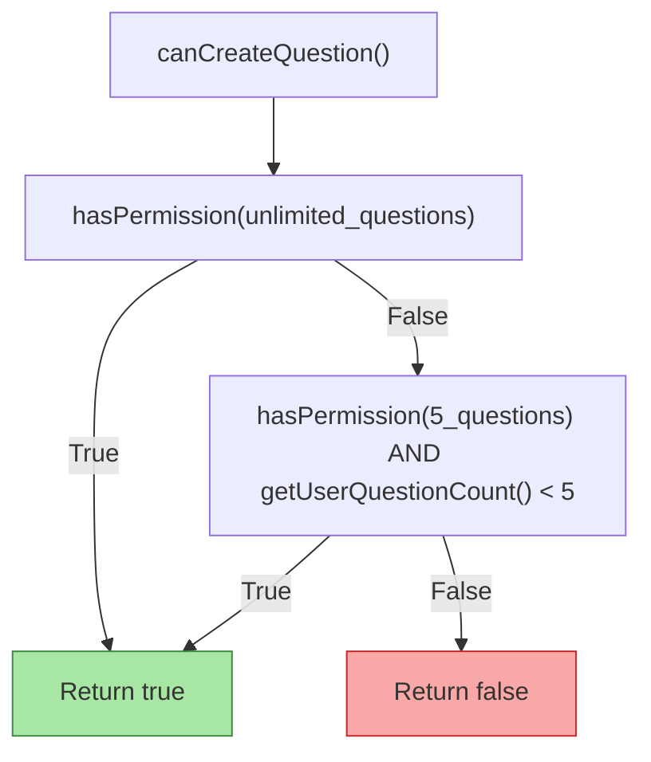

<cite>
**Referenced Files in This Document**   
- [route.ts](file://src/app/api/ai/questions/generate-question/route.ts)
- [questions.ts](file://src/services/ai/questions.ts)
- [db.ts](file://src/features/questions/db.ts)
- [dbCache.ts](file://src/features/questions/dbCache.ts)
- [permissions.ts](file://src/features/questions/permissions.ts)
- [formatters.ts](file://src/features/questions/formatters.ts)
- [page.tsx](file://src/app/app/job-infos/[jobInfoId]/questions/page.tsx)
- [_NewQuestionClientPage.tsx](file://src/app/app/job-infos/[jobInfoId]/questions/_NewQuestionClientPage.tsx)
</cite>

# Question Generation System

## Table of Contents
1. [Introduction](#introduction)
2. [Architecture Overview](#architecture-overview)
3. [Core Components](#core-components)
4. [Backend Flow Analysis](#backend-flow-analysis)
5. [Frontend Integration](#frontend-integration)
6. [Access Control and Permissions](#access-control-and-permissions)
7. [Data Management and Caching](#data-management-and-caching)
8. [Output Formatting](#output-formatting)
9. [Common Issues and Troubleshooting](#common-issues-and-troubleshooting)
10. [Customization and Extension](#customization-and-extension)

## Introduction

The Question Generation System in darasa is an AI-powered feature designed to create technical interview questions based on job information. The system enables users to generate contextually relevant questions tailored to specific job roles, experience levels, and skill requirements. By leveraging artificial intelligence, the system provides a dynamic way to prepare for technical interviews by generating realistic questions that reflect actual job descriptions.

This documentation details the complete flow of question generation, from API invocation through AI processing, data storage, and frontend presentation. It covers the backend architecture, security mechanisms, caching strategy, and user interface integration that make this system functional and efficient.

## Architecture Overview

**Diagram sources**
- [route.ts](file://src/app/api/ai/questions/generate-question/route.ts)
- [questions.ts](file://src/services/ai/questions.ts)
- [db.ts](file://src/features/questions/db.ts)
- [dbCache.ts](file://src/features/questions/dbCache.ts)
- [permissions.ts](file://src/features/questions/permissions.ts)

**Section sources**
- [route.ts](file://src/app/api/ai/questions/generate-question/route.ts)
- [questions.ts](file://src/services/ai/questions.ts)

## Core Components

The Question Generation System consists of several key components that work together to deliver AI-generated technical interview questions:

- **API Endpoint**: The `/api/ai/questions/generate-question` route serves as the entry point for question generation requests.
- **AI Service**: The `generateAiQuestion` function orchestrates AI model interaction using Google's Gemini model.
- **Data Persistence**: Questions are stored in the database through the `insertQuestion` function.
- **Cache Management**: Cache tags are managed via `revalidateQuestionCache` to ensure data consistency.
- **Access Control**: Permission checks are enforced through `canCreateQuestion`.
- **Frontend Interface**: The Questions page and associated client components handle user interactions.

These components form a cohesive system where user actions trigger AI processing, resulting in generated questions that are stored and displayed appropriately.

**Section sources**
- [route.ts](file://src/app/api/ai/questions/generate-question/route.ts)
- [questions.ts](file://src/services/ai/questions.ts)
- [db.ts](file://src/features/questions/db.ts)
- [dbCache.ts](file://src/features/questions/dbCache.ts)
- [permissions.ts](file://src/features/questions/permissions.ts)

## Backend Flow Analysis

### API Route Processing

The question generation process begins at the API route `generate-question/route.ts`, which handles POST requests containing job information and difficulty level. The endpoint validates input parameters against a Zod schema that ensures proper formatting and required fields.

**Diagram sources**
- [route.ts](file://src/app/api/ai/questions/generate-question/route.ts)

**Section sources**
- [route.ts](file://src/app/api/ai/questions/generate-question/route.ts)

### AI Question Generation Logic

The core AI logic resides in `services/ai/questions.ts` within the `generateAiQuestion` function. This function constructs a prompt for the AI model using job information (title, description, experience level) and previous questions to maintain context. The system uses Google's Gemini 2.5 Flash model through the AI SDK's `streamText` function.

The AI model is instructed to generate only one realistic technical question that matches the job requirements and specified difficulty level (easy, medium, or hard). The system prompt emphasizes practical, real-world challenges over trivia and requires the output to be formatted in markdown. Previous question-answer pairs are included in the conversation history to provide context and prevent duplication.

When the AI completes generating a question, the `onFinish` callback triggers the database insertion process, ensuring that successfully generated questions are persisted immediately.

**Section sources**
- [questions.ts](file://src/services/ai/questions.ts)

## Frontend Integration

### Server-Side Page Component

The server-side component `page.tsx` in the questions directory serves as the entry point for the Questions page. This component handles authentication checks, permission validation, and job information retrieval before rendering the client-side interface.

**Diagram sources**
- [page.tsx](file://src/app/app/job-infos/[jobInfoId]/questions/page.tsx)

**Section sources**
- [page.tsx](file://src/app/app/job-infos/[jobInfoId]/questions/page.tsx)

### Client-Side Interaction

The client-side component `_NewQuestionClientPage.tsx` manages the interactive user experience using the `useCompletion` hook from the AI SDK. This component provides a responsive interface where users can select question difficulty levels and receive streamed AI responses.

The UI features a resizable panel layout (desktop) or vertical stack (mobile) that displays the generated question, allows answer input, and shows feedback. Three primary states govern the workflow:
- **Initial state**: User selects difficulty level to generate a question
- **Awaiting answer**: Question is displayed, user can type their response
- **Awaiting difficulty**: Feedback is shown, user can generate a new question

Each difficulty button triggers the AI generation process by calling `generateQuestion` with the selected difficulty level. The API endpoint receives this parameter along with the jobInfoId to contextualize the question generation.

**Section sources**
- [_NewQuestionClientPage.tsx](file://src/app/app/job-infos/[jobInfoId]/questions/_NewQuestionClientPage.tsx)

## Access Control and Permissions

### Permission Enforcement

The system implements robust access control through the `canCreateQuestion` function in `permissions.ts`. This function determines whether a user can generate new questions based on their subscription plan and current usage.

**Diagram sources**
- [permissions.ts](file://src/features/questions/permissions.ts)

**Section sources**
- [permissions.ts](file://src/features/questions/permissions.ts)

### Multi-Layer Security

The permission system employs a multi-layered approach:
1. **Authentication**: Verifies user login status via `getCurrentUser`
2. **Ownership**: Ensures users can only access job information they own
3. **Rate Limiting**: Restricts question generation based on subscription tier
4. **Plan Enforcement**: Differentiates between free and premium users

The ownership check occurs in the `getJobInfo` function, which verifies that the requested jobInfoId belongs to the authenticated user. This prevents unauthorized access to other users' job information and associated questions.

## Data Management and Caching

### Database Operations

Question persistence is handled by the `insertQuestion` function in `db.ts`, which inserts new questions into the database and returns the generated ID. The function uses Drizzle ORM to perform the insertion and specifies returning only the essential fields (id and jobInfoId) for efficiency.

After successful insertion, the function calls `revalidateQuestionCache` to update cache tags, ensuring that stale data is cleared from the Next.js cache. This maintains data consistency across the application without requiring full page reloads.

**Section sources**
- [db.ts](file://src/features/questions/db.ts)

### Cache Tag Strategy

The caching system uses a hierarchical tag structure defined in `dbCache.ts` to efficiently manage cache invalidation:

- **Global tag**: `getQuestionGlobalTag()` - for site-wide question updates