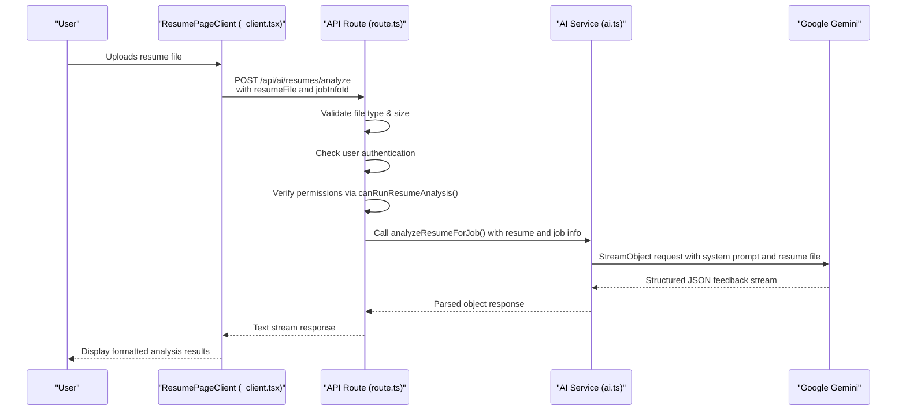
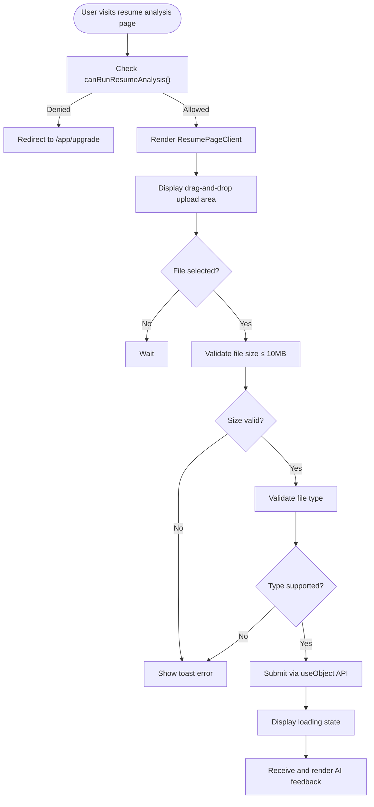
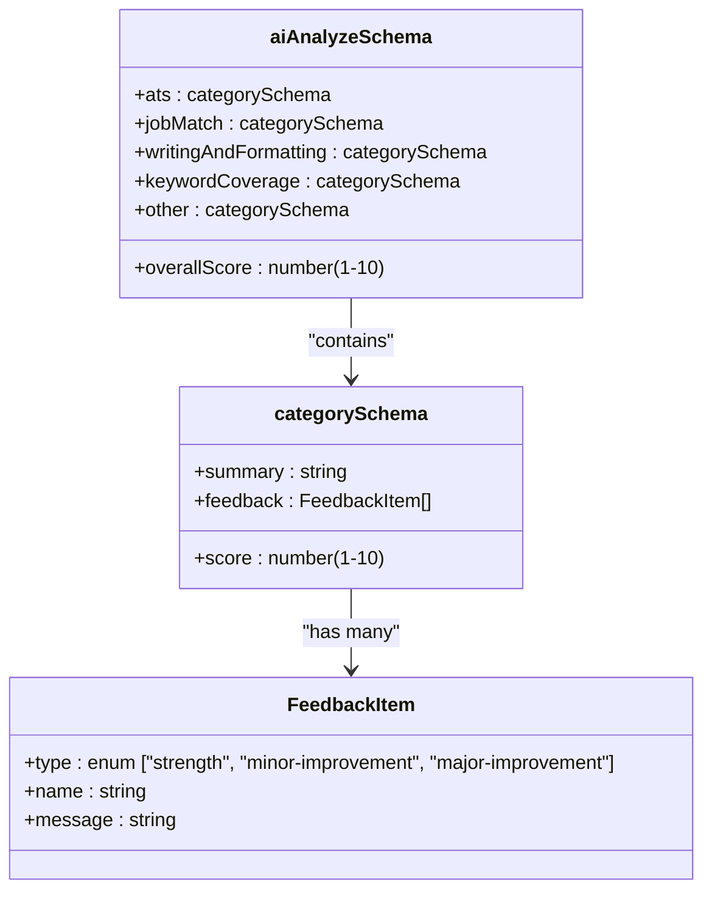

# Resume Analysis

<cite>
**Referenced Files in This Document**   
- [resume/page.tsx](file://src/app/app/job-infos/[jobInfoId]/resume/page.tsx)
- [api/ai/resumes/analyze/route.ts](file://src/app/api/ai/resumes/analyze/route.ts)
- [services/ai/resumes/ai.ts](file://src/services/ai/resumes/ai.ts)
- [services/ai/resumes/schemas.ts](file://src/services/ai/resumes/schemas.ts)
- [features/resumeAnalysis/permissions.ts](file://src/features/resumeAnalysis/permissions.ts)
- [app/app/job-infos/[jobInfoId]/resume/_client.tsx](file://src/app/app/job-infos/[jobInfoId]/resume/_client.tsx)
</cite>

## Table of Contents
1. [Introduction](#introduction)
2. [Workflow Overview](#workflow-overview)
3. [Frontend Submission Process](#frontend-submission-process)
4. [API Endpoint Handling](#api-endpoint-handling)
5. [AI Model Integration and Feedback Generation](#ai-model-integration-and-feedback-generation)
6. [Input Validation and Structured Output with Zod](#input-validation-and-structured-output-with-zod)
7. [Access Control and Permissions](#access-control-and-permissions)
8. [User Interface and Feedback Presentation](#user-interface-and-feedback-presentation)
9. [Common Issues and Limitations](#common-issues-and-limitations)
10. [Recommendations for Improvement](#recommendations-for-improvement)

## Introduction
The Resume Analysis feature in darasa provides AI-driven feedback on user-submitted resumes tailored to specific job applications. This functionality enables users to receive personalized, actionable insights about their resume's compatibility with a target position by leveraging advanced AI models such as Google Gemini. The system evaluates multiple dimensions including ATS (Applicant Tracking System) compatibility, job match relevance, writing quality, keyword coverage, and other critical factors. By integrating structured data validation, secure access controls, and real-time streaming responses, the feature delivers comprehensive analysis while maintaining performance and privacy standards.

## Workflow Overview
The Resume Analysis workflow begins when a user uploads a resume through the frontend interface at `resume/page.tsx`. The uploaded file is sent via an API call to the server-side endpoint located at `api/ai/resumes/analyze/route.ts`, which validates the request, checks user permissions, and forwards the resume along with job information to the AI service layer. The core logic resides in `services/ai/resumes/ai.ts`, where the resume is analyzed using the Google Gemini model based on contextual job details. A Zod schema ensures structured output formatting, and results are streamed back to the client for display. Throughout this process, permission checks restrict access to authorized users only.

**Diagram sources**
- [resume/page.tsx](file://src/app/app/job-infos/[jobInfoId]/resume/page.tsx)
- [api/ai/resumes/analyze/route.ts](file://src/app/api/ai/resumes/analyze/route.ts)
- [services/ai/resumes/ai.ts](file://src/services/ai/resumes/ai.ts)

**Section sources**
- [resume/page.tsx](file://src/app/app/job-infos/[jobInfoId]/resume/page.tsx)
- [api/ai/resumes/analyze/route.ts](file://src/app/api/ai/resumes/analyze/route.ts)
- [services/ai/resumes/ai.ts](file://src/services/ai/resumes/ai.ts)

## Frontend Submission Process
The frontend submission process starts in `resume/page.tsx`, which serves as the entry point for the resume analysis page. It first verifies whether the current user has permission to run resume analysis by calling `canRunResumeAnalysis()`. If not, the user is redirected to the upgrade page. Otherwise, it renders the `ResumePageClient` component from `_client.tsx`, which handles the interactive upload interface.

Users can drag and drop or click to upload their resume files in PDF, DOC, DOCX, or TXT formats. Client-side validation enforces a 10MB file size limit and checks MIME types before submission. Upon selection, the file is stored in a ref and passed to the `useObject` hook from `@ai-sdk/react`, which orchestrates the API call to `/api/ai/resumes/analyze`. The fetch configuration manually removes the `Content-Type` header to allow browser auto-detection of multipart form boundaries.

**Diagram sources**
- [resume/page.tsx](file://src/app/app/job-infos/[jobInfoId]/resume/page.tsx)
- [app/app/job-infos/[jobInfoId]/resume/_client.tsx](file://src/app/app/job-infos/[jobInfoId]/resume/_client.tsx)

**Section sources**
- [resume/page.tsx](file://src/app/app/job-infos/[jobInfoId]/resume/page.tsx)
- [app/app/job-infos/[jobInfoId]/resume/_client.tsx](file://src/app/app/job-infos/[jobInfoId]/resume/_client.tsx)

## API Endpoint Handling
The API endpoint defined in `api/ai/resumes/analyze/route.ts` handles incoming resume analysis requests. It begins by extracting the authenticated user ID via `getCurrentUser()` from Clerk. If no user is logged in, it returns a 401 Unauthorized response. The request body is parsed as form data to retrieve the resume file and associated `jobInfoId`.

Comprehensive validation occurs before processing:
- Ensures both `resumeFile` and `jobInfoId` are present
- Enforces a maximum file size of 10MB
- Validates file MIME type against allowed formats: PDF, Word documents, and plain text

It then retrieves the job information from the database using `getJobInfo()`, ensuring the user owns the specified job record. Access control is enforced via `canRunResumeAnalysis()`, which checks subscription permissions. Only upon passing all validations does the system invoke `analyzeResumeForJob()` from the AI service layer, streaming the final response back to the client.

**Section sources**
- [api/ai/resumes/analyze/route.ts](file://src/app/api/ai/resumes/analyze/route.ts)

## AI Model Integration and Feedback Generation
The AI model integration is implemented in `services/ai/resumes/ai.ts` through the `analyzeResumeForJob()` function. This function uses the `streamObject()` method from the `ai` SDK to interact with the Google Gemini model (`gemini-2.5-flash`) via the configured provider in `google.ts`. The resume file is included directly in the message content as binary data with its MIME type, allowing the model to parse and interpret the document.

A detailed system prompt instructs the AI to act as an expert resume reviewer, evaluating the candidate’s resume against the provided job description, title, and experience level. The feedback is organized into five categories:
- **ats**: Evaluates layout simplicity, standard headings, absence of graphics/columns
- **jobMatch**: Assesses alignment of skills, achievements, and technologies
- **writingAndFormatting**: Reviews grammar, clarity, structure, and consistency
- **keywordCoverage**: Analyzes presence of relevant keywords from the job posting
- **other**: Captures additional observations like missing contact info or red flags

Each category includes a score (1–10), summary, and array of feedback items categorized as strengths, minor improvements, or major improvements. The overall score reflects the holistic assessment.

**Section sources**
- [services/ai/resumes/ai.ts](file://src/services/ai/resumes/ai.ts)

## Input Validation and Structured Output with Zod
Zod schemas play a crucial role in ensuring reliable and predictable output from the AI model. Defined in `services/ai/resumes/schemas.ts`, the `aiAnalyzeSchema` enforces a strict structure for the AI-generated response. It specifies that each feedback category must contain:
- A numeric `score` between 1 and 10
- A textual `summary`
- An array of `feedback` items, each with:
  - `type`: one of `"strength"`, `"minor-improvement"`, or `"major-improvement"`
  - `name`: descriptive label
  - `message`: detailed explanation

This schema is passed directly to `streamObject()` as the `schema` parameter, enabling automatic parsing and validation of the AI output. Any deviation from the expected format triggers a retry mechanism within the SDK, improving robustness and reducing error rates in production usage.

**Diagram sources**
- [services/ai/resumes/schemas.ts](file://src/services/ai/resumes/schemas.ts)

**Section sources**
- [services/ai/resumes/schemas.ts](file://src/services/ai/resumes/schemas.ts)

## Access Control and Permissions
Access to the Resume Analysis feature is controlled through the `canRunResumeAnalysis()` function in `features/resumeAnalysis/permissions.ts`. This function delegates to `hasPermission("unlimited_resume_analysis")` from the Clerk integration library, which evaluates the user's subscription plan and entitlements.

If the user lacks the required permission, the API route returns a 403 Forbidden response with a predefined message (`PLAN_LIMIT_MESSAGE