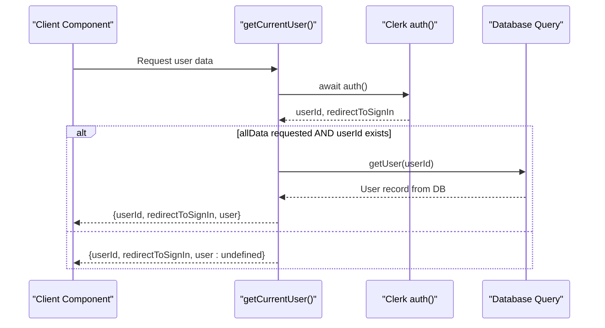
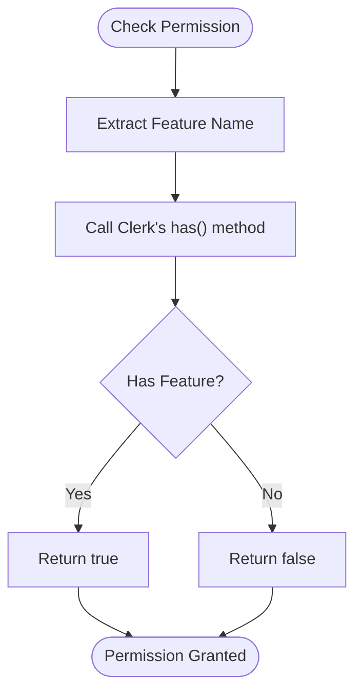
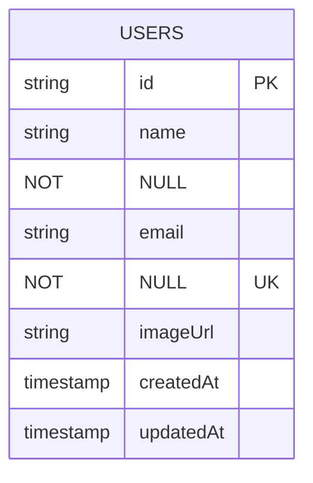
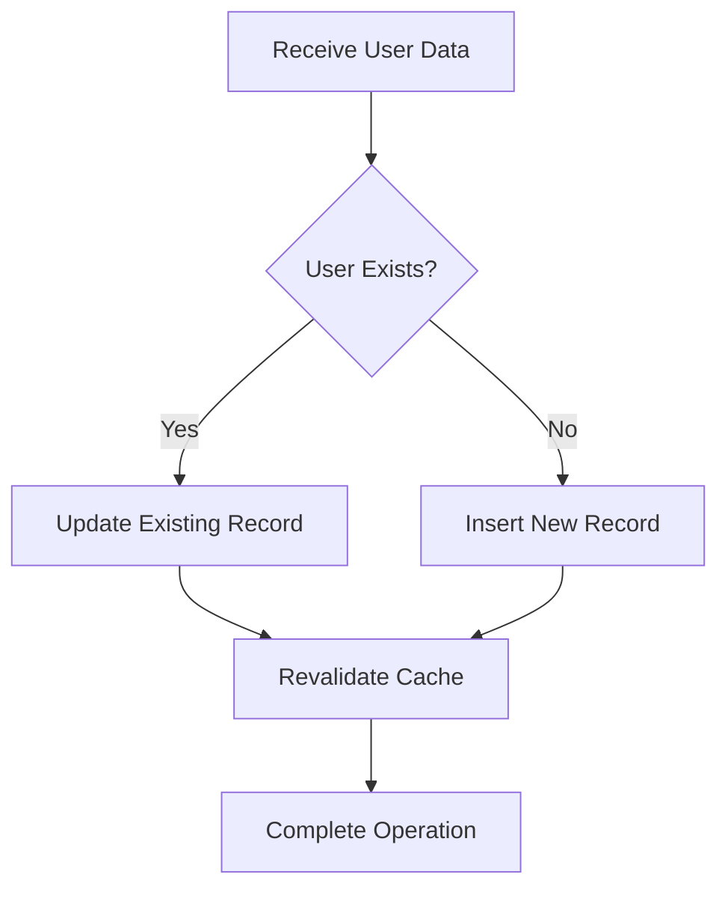
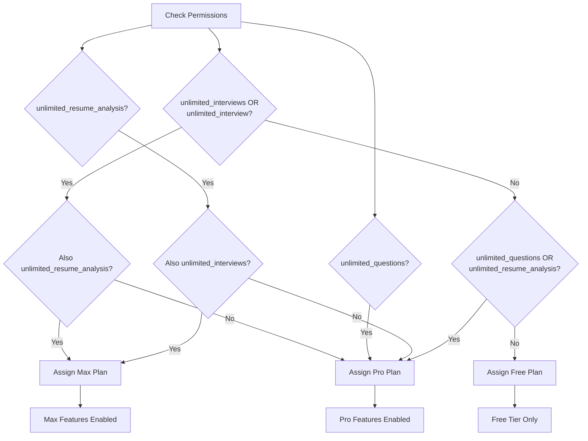
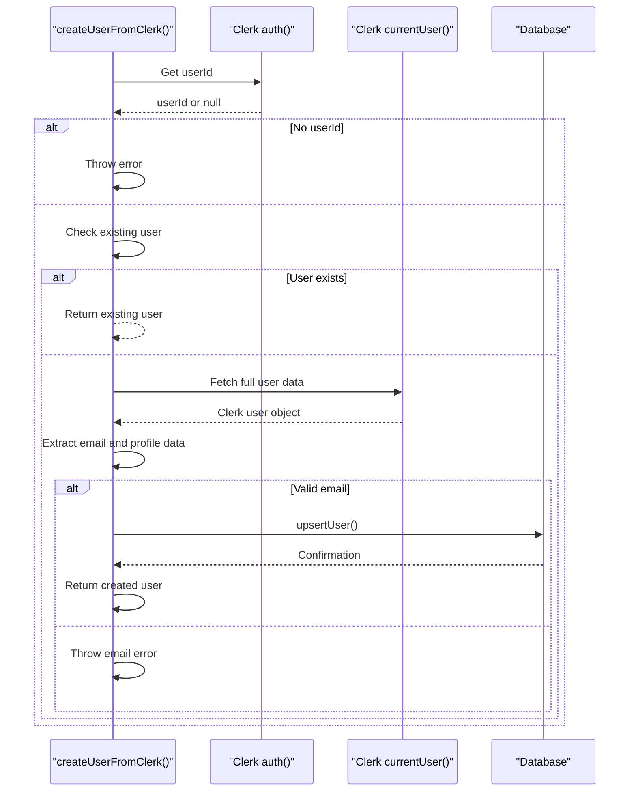
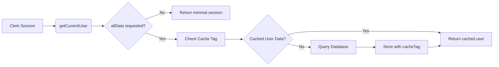

# User Management & Permissions

<cite>
**Referenced Files in This Document**  
- [getCurrentUser.ts](file://src/services/clerk/lib/getCurrentUser.ts)
- [hasPermission.ts](file://src/services/clerk/lib/hasPermission.ts)
- [db.ts](file://src/features/users/db.ts)
- [dbCache.ts](file://src/features/users/dbCache.ts)
- [plan.ts](file://src/features/users/plan.ts)
- [actions.ts](file://src/features/users/actions.ts)
- [_UserDropdown.tsx](file://src/app/_UserDropdown.tsx)
- [user.ts](file://src/drizzle/schema/user.ts)
</cite>

## Table of Contents
1. [Introduction](#introduction)
2. [Authentication Flow with Clerk](#authentication-flow-with-clerk)
3. [Role-Based Access Control](#role-based-access-control)
4. [User State Management](#user-state-management)
5. [Subscription Plan Logic](#subscription-plan-logic)
6. [User Mutation Actions](#user-mutation-actions)
7. [UI Integration and Navigation](#ui-integration-and-navigation)
8. [Caching Strategy and Data Synchronization](#caching-strategy-and-data-synchronization)
9. [Common Issues and Edge Cases](#common-issues-and-edge-cases)
10. [Implementation Guidelines](#implementation-guidelines)

## Introduction

The User Management & Permissions system in darasa provides a comprehensive solution for handling user authentication, authorization, state persistence, and subscription-based feature access. Built on top of Clerk for identity management and integrated with a PostgreSQL database via Drizzle ORM, the system ensures secure and efficient user operations across the application. This document details the architecture and implementation of key components that manage user lifecycle, permissions, and data consistency.

## Authentication Flow with Clerk

The authentication mechanism leverages Clerk's Next.js server SDK to securely retrieve session information and user identities. The `getCurrentUser` function serves as the primary interface for accessing authenticated user data within server components.



**Diagram sources**  
- [getCurrentUser.ts](file://src/services/clerk/lib/getCurrentUser.ts#L7-L15)

**Section sources**  
- [getCurrentUser.ts](file://src/services/clerk/lib/getCurrentUser.ts#L7-L15)

## Role-Based Access Control

Permission enforcement is implemented through the `hasPermission` utility, which integrates with Clerk's feature-based permission system. This approach enables fine-grained control over feature availability based on user subscriptions.



**Diagram sources**  
- [hasPermission.ts](file://src/services/clerk/lib/hasPermission.ts#L11-L14)

**Section sources**  
- [hasPermission.ts](file://src/services/clerk/lib/hasPermission.ts#L11-L14)

## User State Management

User profile data is persisted in the database using Drizzle ORM and synchronized between Clerk and the application's internal state. The system maintains critical user attributes including identity, contact information, and timestamps.

### Database Schema



**Diagram sources**  
- [user.ts](file://src/drizzle/schema/user.ts#L5-L17)

### Persistence Layer

The `upsertUser` operation handles both creation and updates of user records, ensuring data consistency through conflict resolution on the primary key.



**Section sources**  
- [db.ts](file://src/features/users/db.ts#L5-L21)
- [user.ts](file://src/drizzle/schema/user.ts#L5-L17)

## Subscription Plan Logic

The subscription tier system determines feature availability through permission checks against Clerk-managed entitlements. Three distinct plans—free, pro, and max—are derived from combinations of granted permissions.



**Section sources**  
- [plan.ts](file://src/features/users/plan.ts#L7-L33)

## User Mutation Actions

User-related mutations are encapsulated in server actions that handle complex workflows such as user creation from Clerk profiles. These actions include error handling, data validation, and logging for operational visibility.



**Section sources**  
- [actions.ts](file://src/features/users/actions.ts#L10-L67)

## UI Integration and Navigation

The `_UserDropdown.tsx` component provides the primary user interface for account management, integrating seamlessly with Clerk's authentication flows and displaying user identity through avatars.

```mermaid
graph TB
subgraph "User Interface"
Dropdown[UserDropdown Component]
Avatar[UserAvatar Display]
Trigger[Dropdown Trigger]
end
subgraph "Clerk Integration"
UserProfile[openUserProfile()]
SignOut[SignOutButton]
end
Avatar --> Trigger
Trigger --> Dropdown
Dropdown --> UserProfile
Dropdown --> SignOut
```

**Section sources**  
- [_UserDropdown.tsx](file://src/app/_UserDropdown.tsx#L1-L39)

## Caching Strategy and Data Synchronization

A multi-layer caching strategy ensures optimal performance while maintaining data freshness across tabs and sessions. The system uses Next.js cache tags to invalidate specific user data when changes occur.

### Cache Architecture



### Cache Invalidation Flow

```mermaid
flowchart TD
A[User Update] --> B[upsertUser/deleteUser]
B --> C[revalidateUserCache(id)]
C --> D[revalidateTag(user-global)]
C --> E[revalidateTag(user-id-specific)]
D --> F[Bust global users list]
E --> G[Bust individual user cache]
```

**Section sources**  
- [getCurrentUser.ts](file://src/services/clerk/lib/getCurrentUser.ts#L7-L15)
- [db.ts](file://src/features/users/db.ts#L5-L21)
- [dbCache.ts](file://src/features/users/dbCache.ts#L9-L14)

## Common Issues and Edge Cases

### Stale Sessions
When user data changes in Clerk but the application cache remains stale, subsequent requests may return outdated information. The cache invalidation chain triggered by `revalidateUserCache` mitigates this by clearing both individual and global user caches.

### Permission Escalation Bugs
Due to potential naming inconsistencies in Clerk feature flags (e.g., plural vs singular forms like "unlimited_interviews" vs "unlimited_interview"), the `getUserPlan` function performs multiple permission checks to ensure robust detection regardless of naming variations.

### Plan Downgrade Edge Cases
When a user downgrades their subscription, immediate feature restriction is enforced through revalidation of permission checks on subsequent requests. However, clients should implement graceful degradation by checking permissions before rendering premium features.

## Implementation Guidelines

### Adding New Permissions
To introduce new permission-controlled features:
1. Define the permission string in `Permission` type in `hasPermission.ts`
2. Configure the same feature flag in Clerk dashboard
3. Implement conditional logic using `hasPermission()` in relevant components
4. Update `getUserPlan()` if the new permission affects plan determination

### Extending User Metadata
When adding custom fields to user profiles:
1. Modify the `UserTable` schema in `user.ts`
2. Update `upsertUser` parameters and implementation in `db.ts`
3. Ensure `createUserFromClerk` populates the new field from appropriate Clerk data sources
4. Extend cache invalidation logic if needed

### Ensuring Cross-Tab Synchronization
Leverage Next.js revalidation mechanisms to propagate user state changes:
- Always call `revalidateUserCache()` after mutations
- Use consistent cache tag naming conventions
- Test tab synchronization scenarios during development