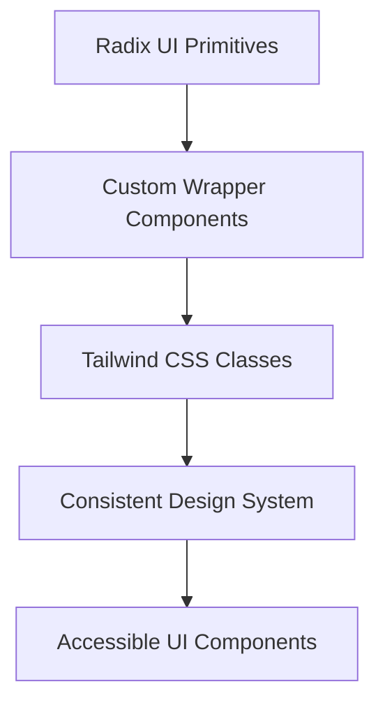
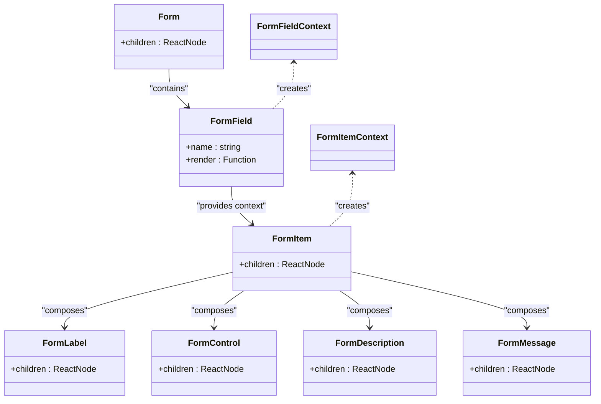
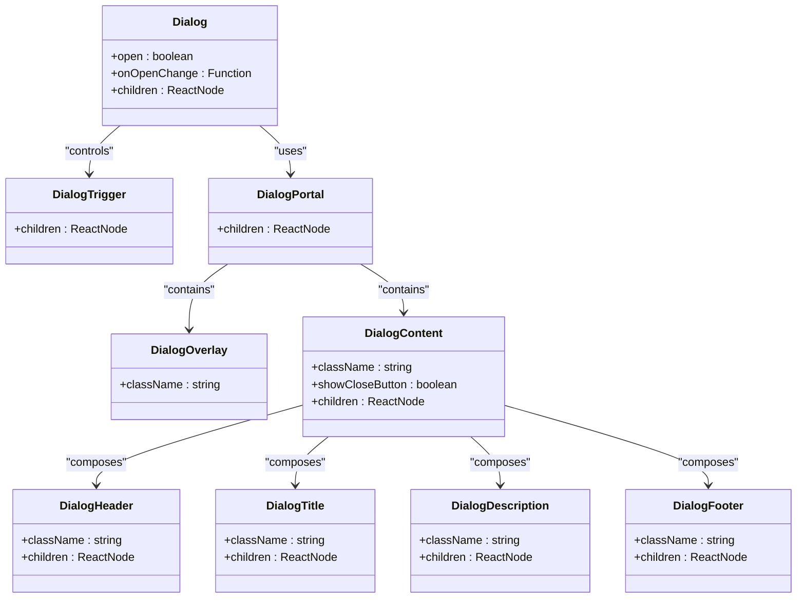
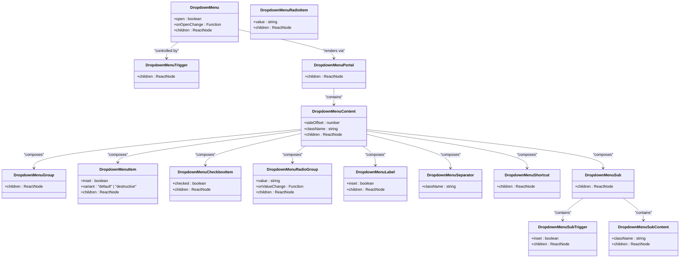
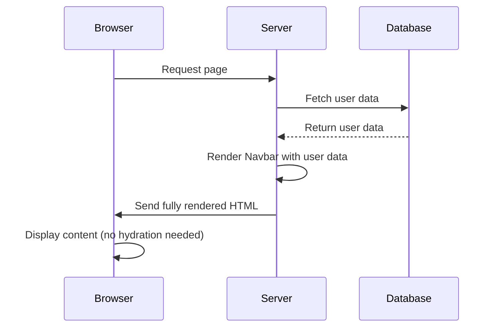
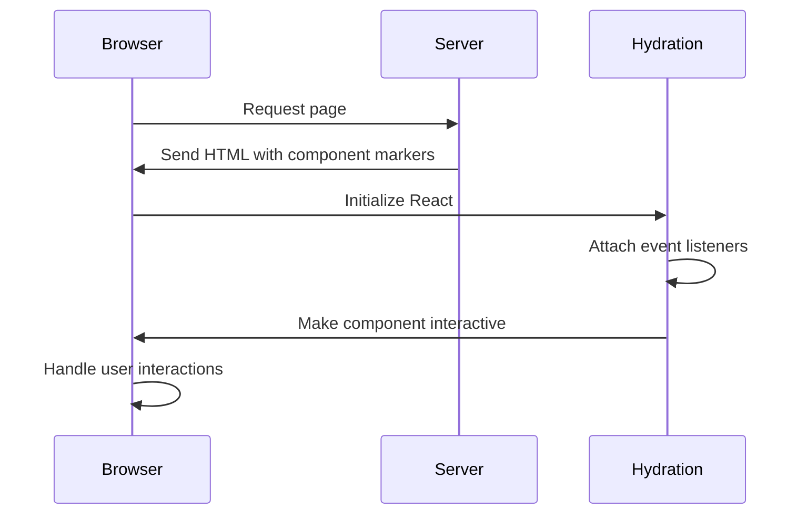
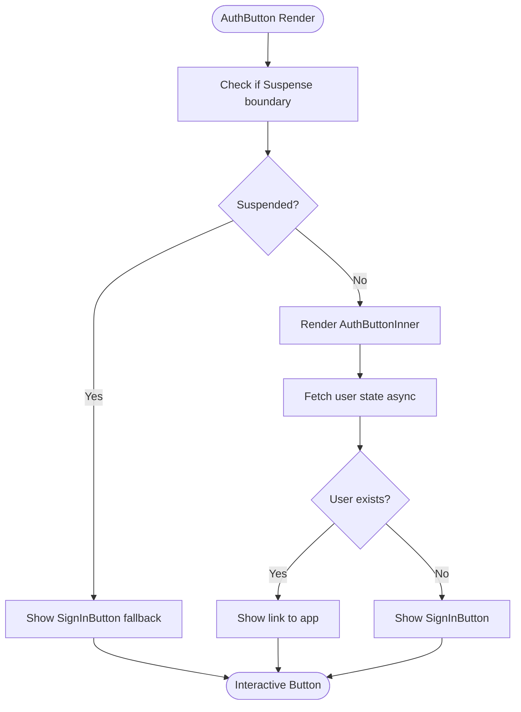
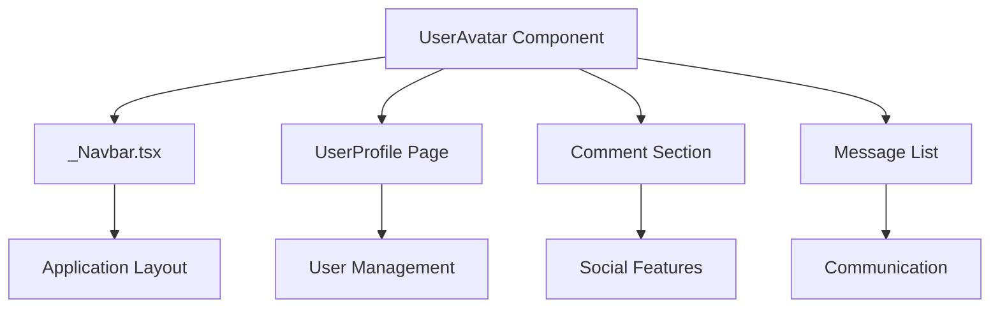
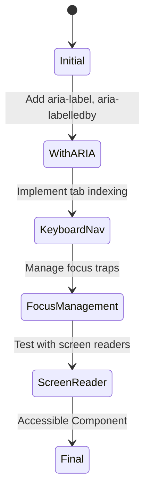
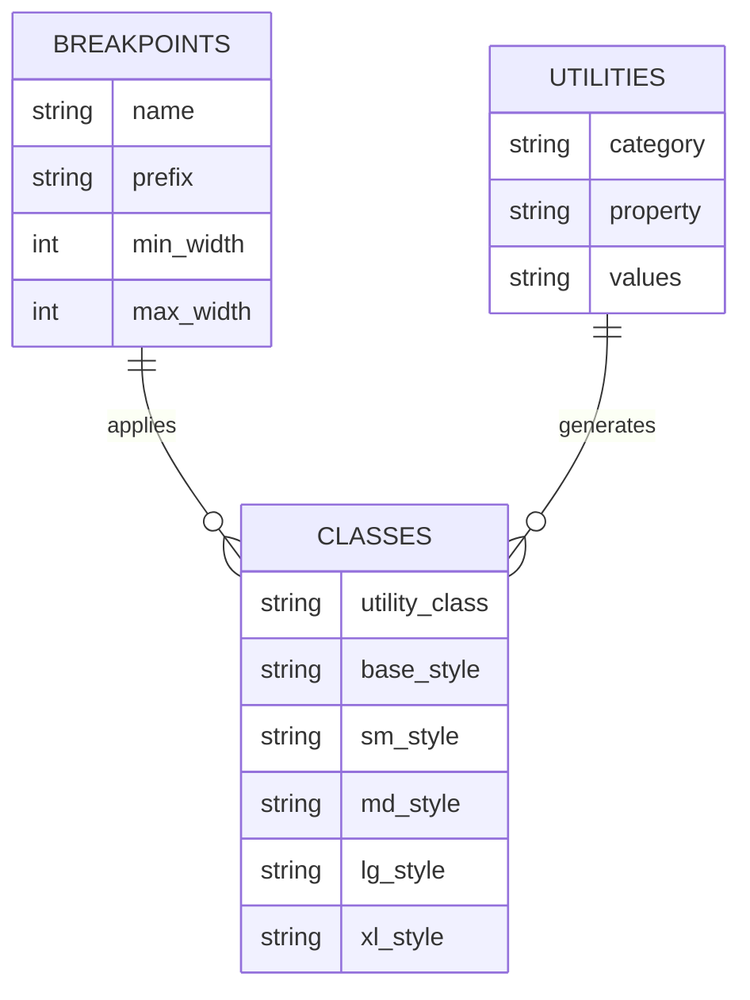

# Component Architecture

<cite>
**Referenced Files in This Document**   
- [form.tsx](file://src/components/ui/form.tsx)
- [dialog.tsx](file://src/components/ui/dialog.tsx)
- [dropdown-menu.tsx](file://src/components/ui/dropdown-menu.tsx)
- [_Navbar.tsx](file://src/app/app/_Navbar.tsx)
- [ThemeToggle.tsx](file://src/components/ThemeToggle.tsx)
- [AuthButton.tsx](file://src/components/AuthButton.tsx)
- [UserAvatar.tsx](file://src/features/users/components/UserAvatar.tsx)
</cite>

## Table of Contents
1. [Introduction](#introduction)
2. [Design System and UI Primitives](#design-system-and-ui-primitives)
3. [Compound Component Composition Patterns](#compound-component-composition-patterns)
4. [Server Components vs Client Components](#server-components-vs-client-components)
5. [Higher-Order Components and Suspense Integration](#higher-order-components-and-suspense-integration)
6. [Component Reuse and Accessibility Implementation](#component-reuse-and-accessibility-implementation)
7. [Responsive Design with Tailwind CSS](#responsive-design-with-tailwind-css)
8. [Performance Implications of SSR and Hydration](#performance-implications-of-ssr-and-hydration)

## Introduction
This document provides a comprehensive analysis of the UI component architecture in the darasa application. It explores the design system built on Radix UI primitives enhanced with Tailwind CSS, examines composition patterns for compound components, and details the strategic use of React Server Components and Client Components. The documentation also covers advanced patterns such as Suspense integration for async state resolution, accessibility implementation, responsive design strategies, and performance considerations related to server-side rendering and hydration.

## Design System and UI Primitives
The darasa application implements a robust design system through the `src/components/ui/` directory, which contains a collection of reusable UI components built by wrapping Radix UI primitives with Tailwind CSS utility classes. This approach combines the accessibility and behavior guarantees of Radix UI with the styling flexibility of Tailwind CSS, creating a consistent and accessible user interface across the application.

The design system follows a pattern where each Radix UI primitive is wrapped in a custom component that applies project-specific styling through the `cn()` utility function, which merges Tailwind classes with any provided className props. This ensures consistent spacing, typography, colors, and interactive states throughout the application while maintaining the underlying accessibility features of the Radix components.



**Diagram sources**
- [button.tsx](file://src/components/ui/button.tsx)
- [input.tsx](file://src/components/ui/input.tsx)
- [label.tsx](file://src/components/ui/label.tsx)

**Section sources**
- [form.tsx](file://src/components/ui/form.tsx)
- [dialog.tsx](file://src/components/ui/dialog.tsx)
- [dropdown-menu.tsx](file://src/components/ui/dropdown-menu.tsx)

## Compound Component Composition Patterns
The application employs sophisticated compound component patterns in several key UI components, including form.tsx, dialog.tsx, and dropdown-menu.tsx. These patterns enable flexible and intuitive API usage while maintaining proper component relationships and state management.

### Form Component Composition
The form.tsx component implements a context-based composition pattern using React Context to manage form state and provide access to field information across nested components. It establishes a clear hierarchy with `<Form>`, `<FormField>`, `<FormItem>`, `<FormLabel>`, `<FormControl>`, `<FormDescription>`, and `<FormMessage>` components that work together seamlessly.



**Diagram sources**
- [form.tsx](file://src/components/ui/form.tsx#L20-L167)

**Section sources**
- [form.tsx](file://src/components/ui/form.tsx#L1-L167)

### Dialog Component Composition
The dialog.tsx component follows a similar composition pattern, providing a structured API for creating modal dialogs with consistent styling and behavior. It wraps Radix UI's dialog primitives with additional customization options, such as the ability to show or hide the close button.



**Diagram sources**
- [dialog.tsx](file://src/components/ui/dialog.tsx#L14-L143)

**Section sources**
- [dialog.tsx](file://src/components/ui/dialog.tsx#L1-L143)

### Dropdown Menu Composition
The dropdown-menu.tsx component implements a rich composition pattern with support for various menu item types, submenus, groups, separators, and keyboard navigation. It exposes a comprehensive set of components that can be combined to create complex dropdown interfaces.



**Diagram sources**
- [dropdown-menu.tsx](file://src/components/ui/dropdown-menu.tsx#L14-L257)

**Section sources**
- [dropdown-menu.tsx](file://src/components/ui/dropdown-menu.tsx#L1-L257)

## Server Components vs Client Components
The application strategically differentiates between React Server Components and Client Components based on their functionality and interactivity requirements.

### Server Components
_Server Components like _Navbar.tsx are used for layout and data-fetching intensive components that don't require interactivity. These components can directly access server-side resources and APIs without the overhead of client-side hydration.



**Diagram sources**
- [_Navbar.tsx](file://src/app/app/_Navbar.tsx#L1-L116)

**Section sources**
- [_Navbar.tsx](file://src/app/app/_Navbar.tsx#L1-L116)

### Client Components
Client Components like ThemeToggle.tsx are used for interactive elements that require state management and event handling. These components are hydrated on the client side and can respond to user interactions.



**Diagram sources**
- [ThemeToggle.tsx](file://src/components/ThemeToggle.tsx#L1-L69)

**Section sources**
- [ThemeToggle.tsx](file://src/components/ThemeToggle.tsx#L1-L69)

## Higher-Order Components and Suspense Integration
The AuthButton.tsx component demonstrates an advanced pattern using React's Suspense to handle asynchronous user state resolution. This higher-order component wraps authentication logic and provides a seamless user experience during the authentication state resolution process.



**Diagram sources**
- [AuthButton.tsx](file://src/components/AuthButton.tsx#L1-L70)

**Section sources**
- [AuthButton.tsx](file://src/components/AuthButton.tsx#L1-L70)

## Component Reuse and Accessibility Implementation
The application demonstrates effective component reuse across various pages and implements accessibility best practices through proper ARIA attributes and semantic HTML.

### Component Reuse Examples
Components are reused throughout the application, such as the UserAvatar component being used in both the Navbar and user profile sections. This promotes consistency and reduces code duplication.



**Diagram sources**
- [UserAvatar.tsx](file://src/features/users/components/UserAvatar.tsx#L1-L26)
- [_Navbar.tsx](file://src/app/app/_Navbar.tsx#L31-L115)

**Section sources**
- [UserAvatar.tsx](file://src/features/users/components/UserAvatar.tsx#L1-L26)
- [_Navbar.tsx](file://src/app/app/_Navbar.tsx#L31-L115)

### Accessibility Implementation
Accessibility is implemented through proper ARIA attributes, semantic HTML elements, and keyboard navigation support. For example, the dialog component includes appropriate ARIA roles, labels, and focus management.



**Section sources**
- [dialog.tsx](file://src/components/ui/dialog.tsx#L50-L65)
- [dropdown-menu.tsx](file://src/components/ui/dropdown-menu.tsx#L100-L120)

## Responsive Design with Tailwind CSS
The application leverages Tailwind CSS for responsive design, using its utility-first approach to create adaptive layouts that work across different screen sizes.

### Responsive Patterns
Tailwind's responsive prefixes (sm:, md:, lg:, xl:) are used extensively to adjust component appearance and layout based on viewport size. For example, navigation items are hidden on small screens and displayed on larger screens.



**Section sources**
- [_Navbar.tsx](file://src/app/app/_Navbar.tsx#L80-L85)
- [ThemeToggle.tsx](file://src/components/ThemeToggle.tsx#L50-L60)

## Performance Implications of SSR and Hydration
The architecture balances server-side rendering benefits with client-side interactivity requirements, optimizing performance through strategic component placement.

### Server-Side Rendering Benefits
Layout components like _Navbar.tsx benefit from SSR by reducing client-side processing and improving initial load performance. Data fetching occurs on the server, eliminating additional client requests.

```mermaid
graph TB
    subgraph Server
        A[Data Fetching]
        B[Template Rendering]
        C[HTML Generation]
    end
    
    subgraph Network
        D[HTML Transfer]
    end
    
    subgraph Client
        E[Parse HTML]
        F[Display Content]
        G[Hydrate Interactive Elements]
    end
    
    A