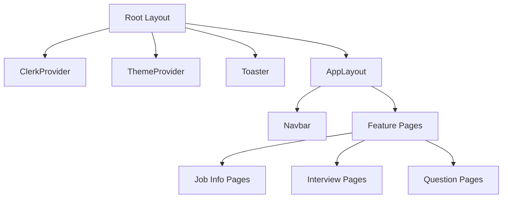
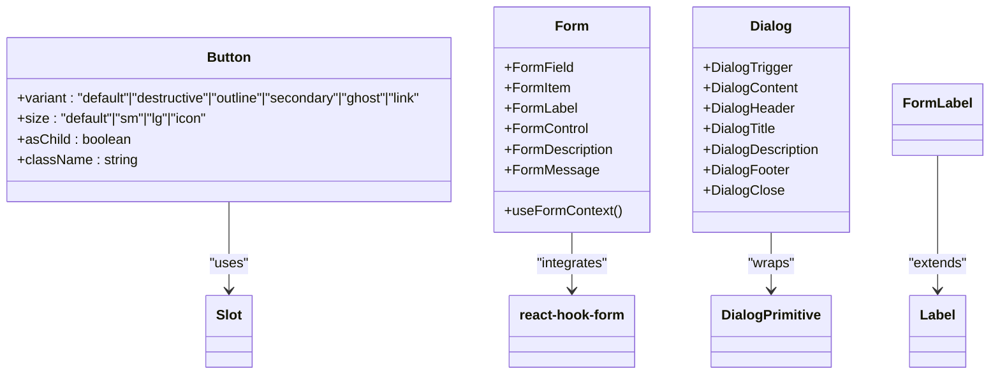
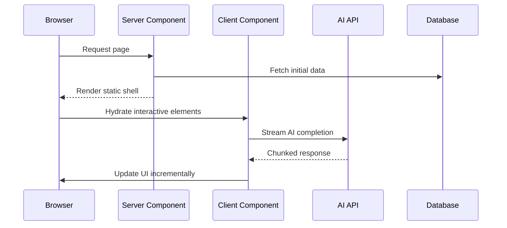
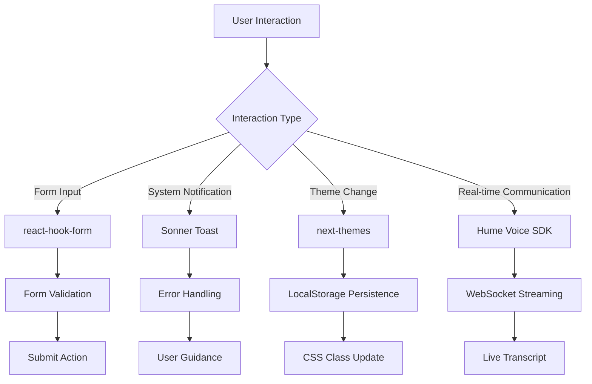
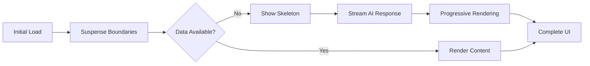

# Frontend Architecture

<cite>
**Referenced Files in This Document**   
- [layout.tsx](file://src/app/layout.tsx)
- [_StartCall.tsx](file://src/app/app/job-infos/[jobInfoId]/interviews/new/_StartCall.tsx)
- [_NewQuestionClientPage.tsx](file://src/app/app/job-infos/[jobInfoId]/questions/_NewQuestionClientPage.tsx)
- [button.tsx](file://src/components/ui/button.tsx)
- [form.tsx](file://src/components/ui/form.tsx)
- [dialog.tsx](file://src/components/ui/dialog.tsx)
- [sonner.tsx](file://src/components/ui/sonner.tsx)
- [ThemeToggle.tsx](file://src/components/ThemeToggle.tsx)
- [SuspendedItem.tsx](file://src/components/SuspendedItem.tsx)
- [utils.ts](file://src/lib/utils.ts)
</cite>

## Table of Contents
1. [Introduction](#introduction)
2. [Project Structure and Layout System](#project-structure-and-layout-system)
3. [Component Hierarchy and UI Library](#component-hierarchy-and-ui-library)
4. [React Server Components vs Client Components](#react-server-components-vs-client-components)
5. [State Management and User Interactions](#state-management-and-user-interactions)
6. [Responsive Design and Accessibility](#responsive-design-and-accessibility)
7. [Performance Optimization Strategies](#performance-optimization-strategies)
8. [Conclusion](#conclusion)

## Introduction
This document provides a comprehensive overview of the frontend architecture for Darasa, an AI-powered job preparation platform built with Next.js App Router. The documentation focuses on the React component hierarchy, UI component library implementation, state management patterns, and performance optimization techniques used throughout the application.

**Section sources**
- [layout.tsx](file://src/app/layout.tsx#L1-L44)

## Project Structure and Layout System
The Darasa frontend follows a feature-driven directory structure organized under `src/app`, leveraging the Next.js App Router for routing and layout composition. The root `layout.tsx` serves as the top-level wrapper that provides global providers including Clerk authentication, theme management via next-themes, and toast notifications through Sonner.

The application implements nested layouts, with a primary `AppLayout` in `src/app/app/layout.tsx` that renders the shared navigation bar and handles user authentication state. This layout conditionally redirects unauthenticated users while providing access to user data and subscription plan information across protected routes.

**Diagram sources**
- [layout.tsx](file://src/app/layout.tsx#L1-L44)
- [app/layout.tsx](file://src/app/app/layout.tsx#L1-L20)

**Section sources**
- [layout.tsx](file://src/app/layout.tsx#L1-L44)
- [app/layout.tsx](file://src/app/app/layout.tsx#L1-L20)

## Component Hierarchy and UI Library
The UI component system is organized under `src/components`, with reusable primitives located in `src/components/ui`. These components are built using Radix UI primitives wrapped with Tailwind CSS styling through the `cn` utility function from `src/lib/utils.ts`. This approach enables consistent, accessible UI elements while maintaining design flexibility.

The component library includes form controls (Button, Input, Textarea, Select), feedback components (Alert, Dialog, Toast), and layout utilities (Resizable, ScrollArea). Each component abstracts complex accessibility logic while exposing configurable props for variant and size control via class-variance-authority (cva).

**Diagram sources**
- [button.tsx](file://src/components/ui/button.tsx#L1-L59)
- [form.tsx](file://src/components/ui/form.tsx#L1-L167)
- [dialog.tsx](file://src/components/ui/dialog.tsx#L1-L143)

**Section sources**
- [button.tsx](file://src/components/ui/button.tsx#L1-L59)
- [form.tsx](file://src/components/ui/form.tsx#L1-L167)
- [dialog.tsx](file://src/components/ui/dialog.tsx#L1-L143)
- [utils.ts](file://src/lib/utils.ts#L1-L7)

## React Server Components vs Client Components
The application strategically uses React Server Components (RSC) for data fetching and initial rendering, while employing Client Components for interactive features. Server Components handle authentication state resolution, database queries, and API route definitions in `src/app/api`.

Interactive components such as `_StartCall.tsx` and `_NewQuestionClientPage.tsx` are designated as Client Components using the `"use client"` directive. These components manage real-time interactions including voice interview sessions with Hume AI and AI-generated question workflows using the `@ai-sdk/react` library's `useCompletion` hook.

Key differentiators:
- **Server Components**: Layouts, data loaders, authentication checks
- **Client Components**: Real-time communication interfaces, form interactions, dynamic content generation

**Diagram sources**
- [_StartCall.tsx](file://src/app/app/job-infos/[jobInfoId]/interviews/new/_StartCall.tsx#L1-L197)
- [_NewQuestionClientPage.tsx](file://src/app/app/job-infos/[jobInfoId]/questions/_NewQuestionClientPage.tsx#L1-L416)

**Section sources**
- [_StartCall.tsx](file://src/app/app/job-infos/[jobInfoId]/interviews/new/_StartCall.tsx#L1-L197)
- [_NewQuestionClientPage.tsx](file://src/app/app/job-infos/[jobInfoId]/questions/_NewQuestionClientPage.tsx#L1-L416)

## State Management and User Interactions
The application employs multiple state management strategies tailored to specific use cases. Form handling is implemented using `react-hook-form` through the custom `Form` component in `src/components/ui/form.tsx`, which provides accessible form controls with validation and error messaging.

Toast notifications are managed through Sonner integrated with `next-themes` for theme-aware presentation in `sonner.tsx`. The `errorToast` utility in `src/lib/errorToast.tsx` standardizes error presentation with contextual actions like upgrade prompts for plan limits.

Theme toggling is implemented via `ThemeToggle.tsx`, which uses `next-themes` to manage color mode preferences with client-side mounting protection to prevent hydration mismatches.

**Diagram sources**
- [form.tsx](file://src/components/ui/form.tsx#L1-L167)
- [sonner.tsx](file://src/components/ui/sonner.tsx#L1-L25)
- [ThemeToggle.tsx](file://src/components/ThemeToggle.tsx#L1-L69)
- [errorToast.tsx](file://src/lib/errorToast.tsx#L1-L33)

**Section sources**
- [form.tsx](file://src/components/ui/form.tsx#L1-L167)
- [sonner.tsx](file://src/components/ui/sonner.tsx#L1-L25)
- [ThemeToggle.tsx](file://src/components/ThemeToggle.tsx#L1-L69)
- [errorToast.tsx](file://src/lib/errorToast.tsx#L1-L33)

## Responsive Design and Accessibility
The frontend implements responsive design patterns using Tailwind CSS, with mobile-first breakpoints applied throughout the component library. The `_NewQuestionClientPage.tsx` demonstrates adaptive layout behavior, switching from resizable horizontal panels on desktop to a vertical stack on mobile devices using window width detection.

Accessibility is prioritized through proper ARIA attributes, semantic HTML, and keyboard navigation support. All interactive elements include focus states and screen reader labels (e.g., ``). The UI components leverage Radix Primitives which provide built-in accessibility features for complex widgets like dialogs and dropdown menus.

## Performance Optimization Strategies
The application implements several performance optimizations:

1. **Lazy Loading**: The `SuspendedItem` component wraps promises with React Suspense for graceful loading states
2. **Code Splitting**: Client components are isolated to minimize bundle size
3. **Streaming Responses**: AI completions are streamed incrementally using `useCompletion`
4. **Animation Optimization**: Typing animations in `typing-animation.tsx` and scroll-based effects in `scroll-animation.tsx` use efficient rendering techniques

The `SuspendedItem` component enables declarative handling of async data with fallback content, improving perceived performance during data loading.

**Diagram sources**
- [SuspendedItem.tsx](file://src/components/SuspendedItem.tsx#L1-L26)

**Section sources**
- [SuspendedItem.tsx](file://src/components/SuspendedItem.tsx#L1-L26)

## Conclusion
The Darasa frontend architecture effectively combines Next.js App Router features with modern React patterns to create a responsive, accessible, and performant user experience. By leveraging the strengths of both Server and Client Components, the application optimizes for fast initial loads while maintaining rich interactivity in key user workflows. The component library approach ensures consistency across the interface while allowing for flexible composition of complex UI patterns.