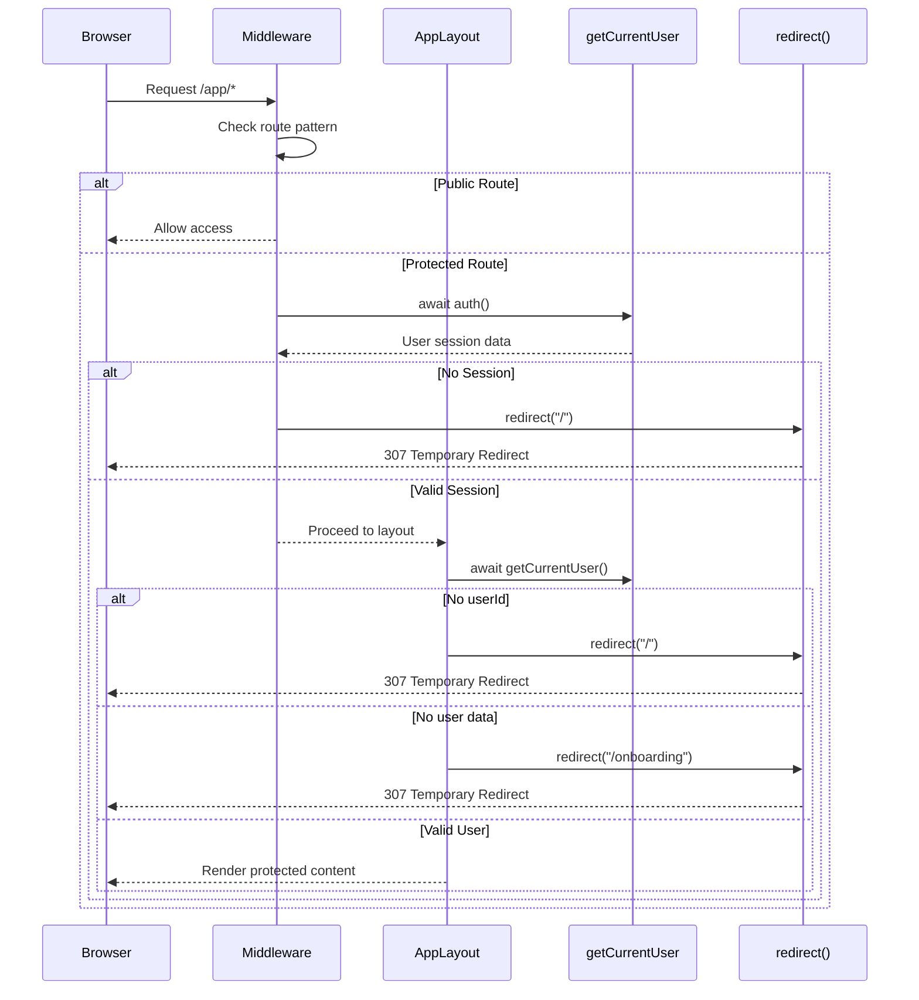
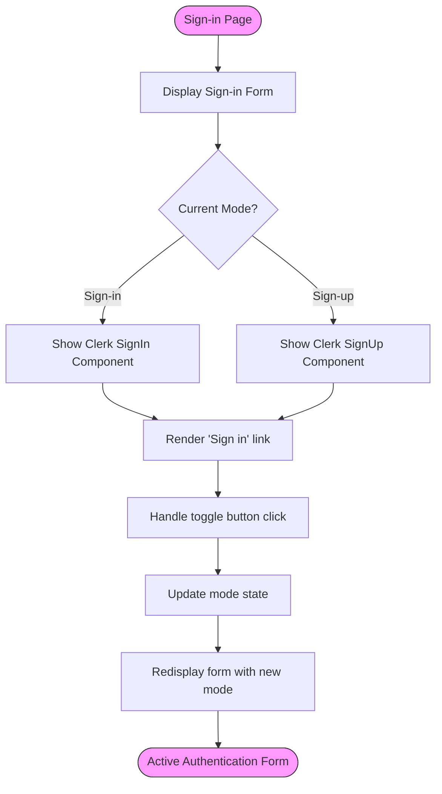
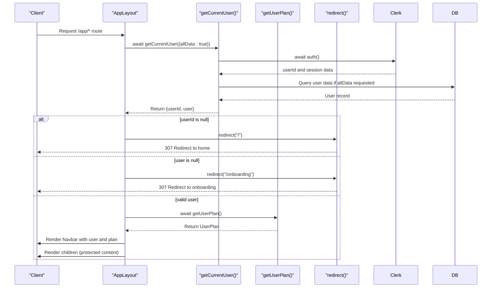

# Routing & Navigation

<cite>
**Referenced Files in This Document**   
- [layout.tsx](file://src/app/layout.tsx)
- [middleware.ts](file://src/middleware.ts)
- [sign-in/[[...sign-in]]/page.tsx](file://src/app/sign-in/[[...sign-in]]/page.tsx)
- [app/layout.tsx](file://src/app/app/layout.tsx)
- [app/page.tsx](file://src/app/app/page.tsx)
- [onboarding/page.tsx](file://src/app/onboarding/page.tsx)
- [services/clerk/lib/getCurrentUser.ts](file://src/services/clerk/lib/getCurrentUser.ts)
- [features/users/plan.ts](file://src/features/users/plan.ts)
- [app/_JobInfosGrid.tsx](file://src/app/app/_JobInfosGrid.tsx)
- [features/jobInfos/dbCache.ts](file://src/features/jobInfos/dbCache.ts)
</cite>

## Table of Contents
1. [Introduction](#introduction)
2. [Project Structure](#project-structure)
3. [Core Components](#core-components)
4. [Architecture Overview](#architecture-overview)
5. [Detailed Component Analysis](#detailed-component-analysis)
6. [Dependency Analysis](#dependency-analysis)
7. [Performance Considerations](#performance-considerations)
8. [Troubleshooting Guide](#troubleshooting-guide)
9. [Conclusion](#conclusion)

## Introduction
This document provides comprehensive architectural documentation for the routing and navigation system in the Darasa application, which is built using Next.js App Router. The system implements a sophisticated nested layout structure with robust authentication flows, protected routes, and dynamic segments to support personalized job interview preparation. The architecture leverages middleware for route protection, server-side authentication checks, and conditional redirects based on user state.

## Project Structure

The application follows a feature-based organization within the Next.js App Router structure, with clear separation between public and authenticated areas. The routing hierarchy begins at the root level and extends through nested layouts to specific features.

```mermaid
graph TD
subgraph "Root Level"
RootLayout[src/app/layout.tsx]
RootPage[src/app/page.tsx]
SignIn[src/app/sign-in/[[...sign-in]]/page.tsx]
Middleware[src/middleware.ts]
end
subgraph "Authenticated App"
AppLayout[src/app/app/layout.tsx]
AppPage[src/app/app/page.tsx]
JobInfos[src/app/app/job-infos/[jobInfoId]/page.tsx]
Interviews[src/app/app/job-infos/[jobInfoId]/interviews/[interviewId]/page.tsx]
end
subgraph "Onboarding"
Onboarding[src/app/onboarding/page.tsx]
end
RootLayout --> AppLayout
RootLayout --> SignIn
RootLayout --> Onboarding
AppLayout --> JobInfos
JobInfos --> Interviews
style RootLayout fill:#f9f,stroke:#333
style AppLayout fill:#bbf,stroke:#333
style SignIn fill:#f96,stroke:#333
```

**Diagram sources**
- [layout.tsx](file://src/app/layout.tsx)
- [app/layout.tsx](file://src/app/app/layout.tsx)
- [sign-in/[[...sign-in]]/page.tsx](file://src/app/sign-in/[[...sign-in]]/page.tsx)
- [onboarding/page.tsx](file://src/app/onboarding/page.tsx)

**Section sources**
- [layout.tsx](file://src/app/layout.tsx)
- [app/layout.tsx](file://src/app/app/layout.tsx)

## Core Components

The routing system in Darasa is built around several core components that work together to provide a seamless navigation experience while enforcing security requirements. The architecture implements a multi-layered approach to route protection, starting from the global middleware level down to individual component-level checks.

Key aspects include:
- Root layout providing global providers (Clerk authentication, theme, toast notifications)
- Middleware enforcing authentication rules across route patterns
- Nested layout structure for authenticated sections
- Dynamic segments for personalized job information and interviews
- Client-server coordination for authentication state management

**Section sources**
- [layout.tsx](file://src/app/layout.tsx)
- [middleware.ts](file://src/middleware.ts)
- [app/layout.tsx](file://src/app/app/layout.tsx)

## Architecture Overview

The routing architecture follows a hierarchical pattern where each level adds additional context and protection. The system uses a combination of server-side middleware, layout components with authentication checks, and client-side navigation to create a secure and responsive user experience.



**Diagram sources**
- [middleware.ts](file://src/middleware.ts#L1-L54)
- [app/layout.tsx](file://src/app/app/layout.tsx#L6-L20)
- [services/clerk/lib/getCurrentUser.ts](file://src/services/clerk/lib/getCurrentUser.ts#L7-L15)

## Detailed Component Analysis

### Root Layout Analysis
The root layout serves as the foundation for the entire application, providing global context providers that are available throughout the app. It wraps the entire application with authentication and theming capabilities.

```mermaid
classDiagram
class RootLayout {
+children : React.ReactNode
-outfitSans : Font
+metadata : Metadata
+RootLayout({ children } : { children : React.ReactNode }) React.JSX.Element
}
class ClerkProvider {
<<Context Provider>>
+children : React.ReactNode
}
class ThemeProvider {
<<Context Provider>>
+attribute : string
+defaultTheme : string
+enableColorScheme : boolean
+disableTransitionOnChange : boolean
+children : React.ReactNode
}
class Toaster {
<<UI Component>>
+theme : string
+position : string
}
RootLayout --> ClerkProvider : "wraps"
RootLayout --> ThemeProvider : "wraps"
RootLayout --> Toaster : "includes"
```

**Diagram sources**
- [layout.tsx](file://src/app/layout.tsx)

**Section sources**
- [layout.tsx](file://src/app/layout.tsx)

### Authentication Flow Analysis
The authentication system implements a multi-step process for user sign-in and account creation, with proper state management and navigation between modes.



**Diagram sources**
- [sign-in/[[...sign-in]]/page.tsx](file://src/app/sign-in/[[...sign-in]]/page.tsx)

**Section sources**
- [sign-in/[[...sign-in]]/page.tsx](file://src/app/sign-in/[[...sign-in]]/page.tsx)

### Protected Route Analysis
The AppLayout component implements server-side authentication guarding for all routes under the `/app` path, ensuring only authenticated users can access protected content.



**Diagram sources**
- [app/layout.tsx](file://src/app/app/layout.tsx#L6-L20)
- [services/clerk/lib/getCurrentUser.ts](file://src/services/clerk/lib/getCurrentUser.ts#L7-L15)
- [features/users/plan.ts](file://src/features/users/plan.ts#L10-L32)

**Section sources**
- [app/layout.tsx](file://src/app/app/layout.tsx)
- [services/clerk/lib/getCurrentUser.ts](file://src/services/clerk/lib/getCurrentUser.ts)
- [features/users/plan.ts](file://src/features/users/plan.ts)

### Data Fetching and Caching Analysis
The application implements a sophisticated data fetching strategy with caching and revalidation to optimize performance while maintaining data freshness.

```mermaid
flowchart TD
A[AppPage] --> B[getJobInfos function]
B --> C["use cache directive"]
C --> D[cacheTag with user-specific tag]
D --> E[Query database with Drizzle ORM]
E --> F[Return jobInfos array]
F --> G{jobInfos.length === 0?}
G --> |Yes| H[Render NoJobInfos component]
G --> |No| I[Render JobInfosGrid component]
I --> J[Pass jobInfos as props]
J --> K[JobInfosGrid renders JobInfoCard components]
K --> L[Each card has delete functionality]
L --> M[deleteJobInfoAction triggers]
M --> N[revalidateJobInfoCache called]
N --> O[Revalidate multiple cache tags]
O --> P[Trigger UI update via router.refresh()]
style A fill:#bbf,stroke:#333
style H fill:#f96,stroke:#333
style I fill:#bbf,stroke:#333
style N fill:#f96,stroke:#333
```

**Diagram sources**
- [app/page.tsx](file://src/app/app/page.tsx#L44-L70)
- [app/_JobInfosGrid.tsx](file://src/app/app/_JobInfosGrid.tsx#L44-L124)
- [features/jobInfos/dbCache.ts](file://src/features/jobInfos/dbCache.ts#L15-L25)

**Section sources**
- [app/page.tsx](file://src/app/app/page.tsx)
- [app/_JobInfosGrid.tsx](file://src/app/app/_JobInfosGrid.tsx)
- [features/jobInfos/dbCache.ts](file://src/features/jobInfos/dbCache.ts)

## Dependency Analysis

The routing and navigation system has well-defined dependencies that ensure proper authentication flow and data consistency across the application.

```mermaid
graph LR
    Middleware --> ClerkAuth