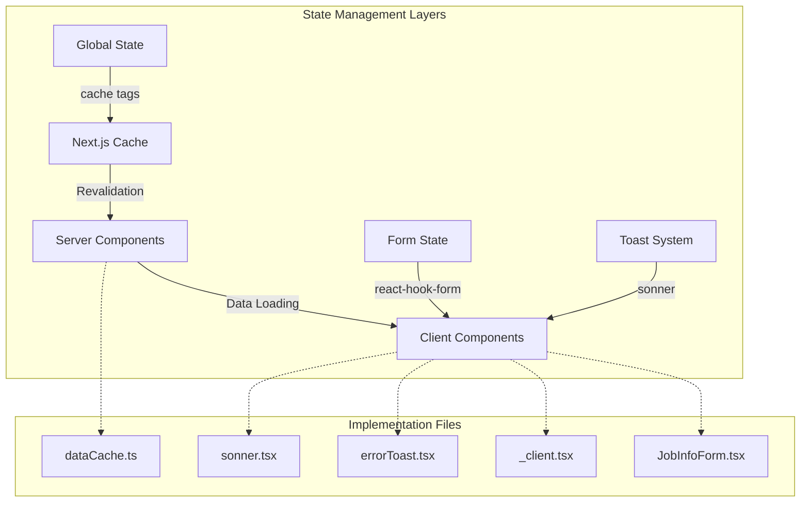
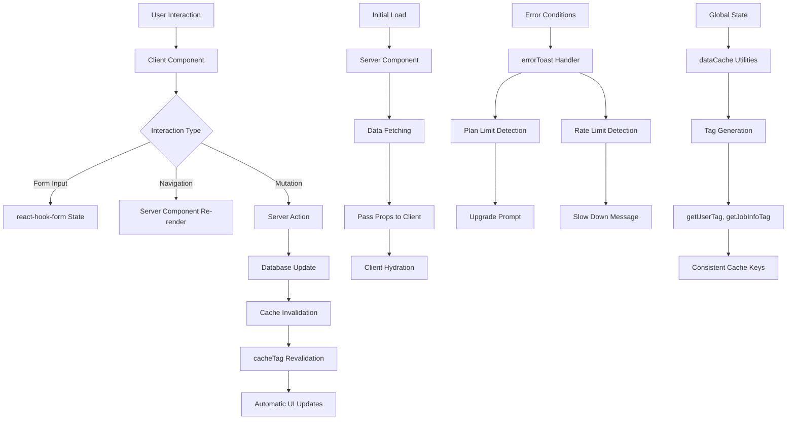
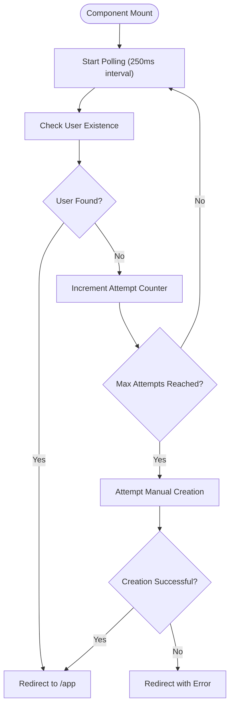
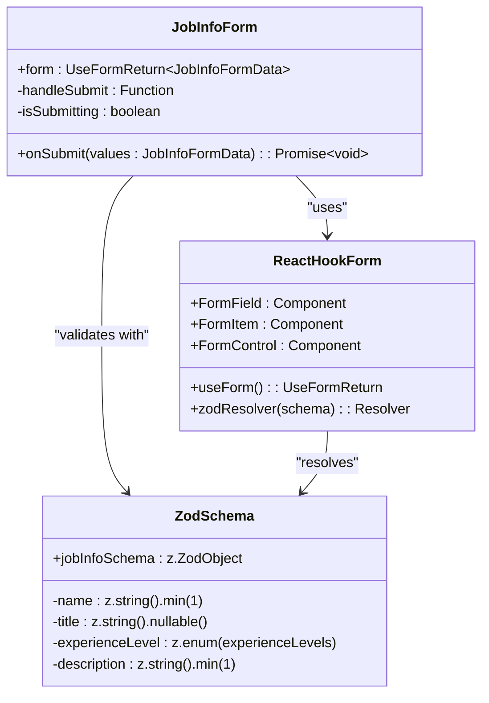
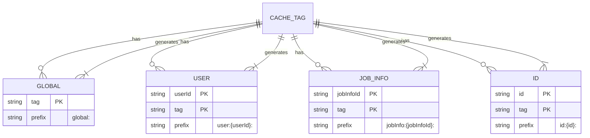
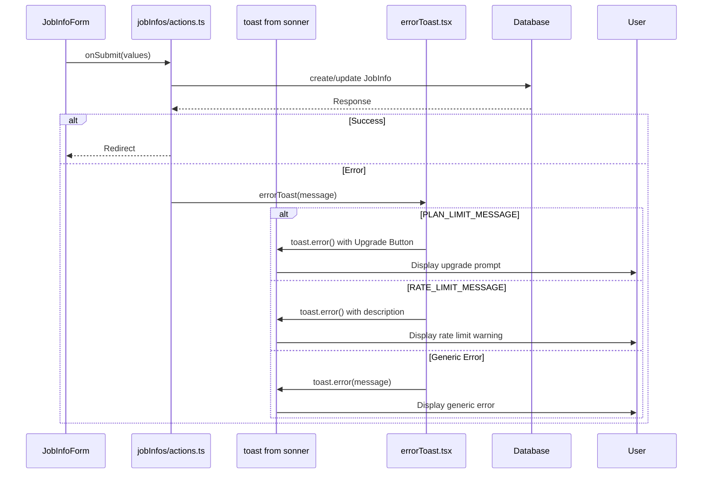
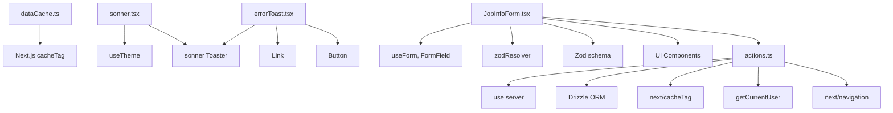

# State Management

<cite>
**Referenced Files in This Document**  
- [dataCache.ts](file://src/lib/dataCache.ts)
- [sonner.tsx](file://src/components/ui/sonner.tsx)
- [errorToast.tsx](file://src/lib/errorToast.tsx)
- [onboarding/_client.tsx](file://src/app/onboarding/_client.tsx)
- [jobInfos/components/JobInfoForm.tsx](file://src/features/jobInfos/components/JobInfoForm.tsx)
- [jobInfos/schemas.ts](file://src/features/jobInfos/schemas.ts)
- [jobInfos/actions.ts](file://src/features/jobInfos/actions.ts)
</cite>

## Table of Contents
1. [Introduction](#introduction)
2. [Project Structure](#project-structure)
3. [Core Components](#core-components)
4. [Architecture Overview](#architecture-overview)
5. [Detailed Component Analysis](#detailed-component-analysis)
6. [Dependency Analysis](#dependency-analysis)
7. [Performance Considerations](#performance-considerations)
8. [Troubleshooting Guide](#troubleshooting-guide)
9. [Conclusion](#conclusion)

## Introduction

This document provides a comprehensive analysis of state management strategies implemented in the darasa application. It details how React Server Components and Client Components are used to manage different types of state, including initial data loading, interactive form handling, global caching, and user feedback mechanisms. The system leverages Next.js features such as server actions, cache tags, and React's useEffect for efficient state synchronization between client and server.

The architecture follows modern full-stack React patterns with clear separation of concerns: server components handle data fetching and initial rendering, while client components manage interactive state and user interface updates. Global state is coordinated through a centralized caching strategy using Next.js cache tags, ensuring consistency across the application.

## Project Structure

The project organizes state management logic across several key directories:
- `src/lib`: Contains shared utilities like `dataCache.ts` and toast notification handlers
- `src/components/ui`: Houses UI components including `sonner.tsx` for notifications
- `src/app`: Implements page-level components with both server and client variants
- `src/features/*`: Feature-specific state management including forms, validation, and actions
- `src/services`: External service integrations that influence application state

**Diagram sources**  
- [dataCache.ts](file://src/lib/dataCache.ts)
- [sonner.tsx](file://src/components/ui/sonner.tsx)
- [errorToast.tsx](file://src/lib/errorToast.tsx)
- [onboarding/_client.tsx](file://src/app/onboarding/_client.tsx)
- [jobInfos/components/JobInfoForm.tsx](file://src/features/jobInfos/components/JobInfoForm.tsx)

**Section sources**  
- [src/lib](file://src/lib)
- [src/components/ui](file://src/components/ui)
- [src/app](file://src/app)
- [src/features](file://src/features)

## Core Components

The core state management components in darasa include:
- **React Server Components**: Handle initial data loading and server-side rendering
- **Client Components**: Manage interactive state for forms and user interactions
- **dataCache.ts**: Centralized cache tag management for revalidation
- **sonner.tsx**: Notification system implementation
- **errorToast.tsx**: Specialized error handling with plan and rate limit messaging
- **react-hook-form + Zod**: Form state management with type-safe validation

These components work together to create a cohesive state management strategy that balances performance, usability, and maintainability.

**Section sources**  
- [dataCache.ts](file://src/lib/dataCache.ts)
- [sonner.tsx](file://src/components/ui/sonner.tsx)
- [errorToast.tsx](file://src/lib/errorToast.tsx)
- [jobInfos/components/JobInfoForm.tsx](file://src/features/jobInfos/components/JobInfoForm.tsx)
- [jobInfos/schemas.ts](file://src/features/jobInfos/schemas.ts)

## Architecture Overview

The state management architecture in darasa follows a layered approach that separates concerns between server and client, leveraging the strengths of each environment:

**Diagram sources**  
- [dataCache.ts](file://src/lib/dataCache.ts)
- [jobInfos/actions.ts](file://src/features/jobInfos/actions.ts)
- [errorToast.tsx](file://src/lib/errorToast.tsx)
- [onboarding/_client.tsx](file://src/app/onboarding/_client.tsx)

## Detailed Component Analysis

### Client-Side State Management

#### Onboarding Flow State
The onboarding process uses a client component to manage asynchronous user setup state, implementing polling with exponential backoff and manual fallback creation:

**Diagram sources**  
- [onboarding/_client.tsx](file://src/app/onboarding/_client.tsx#L7-L84)

**Section sources**  
- [onboarding/_client.tsx](file://src/app/onboarding/_client.tsx#L7-L84)

#### Form State Management
The JobInfoForm demonstrates a robust pattern for managing complex form state using react-hook-form with Zod validation:

**Diagram sources**  
- [jobInfos/components/JobInfoForm.tsx](file://src/features/jobInfos/components/JobInfoForm.tsx#L33-L164)
- [jobInfos/schemas.ts](file://src/features/jobInfos/schemas.ts#L1-L8)

**Section sources**  
- [jobInfos/components/JobInfoForm.tsx](file://src/features/jobInfos/components/JobInfoForm.tsx#L33-L164)
- [jobInfos/schemas.ts](file://src/features/jobInfos/schemas.ts#L1-L8)

### Global State and Caching

#### Cache Tag Strategy
The dataCache module implements a systematic approach to cache tag generation, enabling precise revalidation of specific data subsets:

**Diagram sources**  
- [dataCache.ts](file://src/lib/dataCache.ts#L1-L16)

**Section sources**  
- [dataCache.ts](file://src/lib/dataCache.ts#L1-L16)

### Notification System

#### Toast Notification Patterns
The notification system combines sonner with custom error handling to provide contextual user feedback:

**Diagram sources**  
- [jobInfos/components/JobInfoForm.tsx](file://src/features/jobInfos/components/JobInfoForm.tsx#L33-L164)
- [jobInfos/actions.ts](file://src/features/jobInfos/actions.ts#L1-L121)
- [lib/errorToast.tsx](file://src/lib/errorToast.tsx#L1-L33)
- [components/ui/sonner.tsx](file://src/components/ui/sonner.tsx#L1-L25)

**Section sources**  
- [jobInfos/components/JobInfoForm.tsx](file://src/features/jobInfos/components/JobInfoForm.tsx#L33-L164)
- [jobInfos/actions.ts](file://src/features/jobInfos/actions.ts#L1-L121)
- [lib/errorToast.tsx](file://src/lib/errorToast.tsx#L1-L33)

## Dependency Analysis

The state management components have well-defined dependencies that follow Next.js best practices:

**Diagram sources**  
- [dataCache.ts](file://src/lib/dataCache.ts)
- [sonner.tsx](file://src/components/ui/sonner.tsx)
- [errorToast.tsx](file://src/lib/errorToast.tsx)
- [jobInfos/components/JobInfoForm.tsx](file://src/features/jobInfos/components/JobInfoForm.tsx)
- [jobInfos/actions.ts](file://src/features/jobInfos/actions.ts)

**Section sources**  
- [dataCache.ts](file://src/lib/dataCache.ts)
- [sonner.tsx](file://src/components/ui/sonner.tsx)
- [errorToast.tsx](file://src/lib/errorToast.tsx)
- [jobInfos/actions.ts](file://src/features/jobInfos/actions.ts)

## Performance Considerations

The state management implementation includes several performance optimizations:

1. **Minimized Client-Side State**: Only essential interactive state is maintained on the client, reducing bundle size and memory usage
2. **Efficient Revalidation**: Cache tags enable targeted revalidation without full page reloads
3. **Server Actions**: Mutations are handled server-side, reducing client processing and improving security
4. **Lazy Loading**: Components are split by feature, enabling code splitting and faster initial load
5. **Optimized Polling**: The onboarding client uses short polling intervals (250ms) with a reasonable maximum attempt limit
6. **Type Safety**: Zod schemas ensure data integrity while providing excellent developer experience

The architecture avoids common pitfalls like stale data through proper cache invalidation and prevents race conditions by using server actions with built-in serialization.

## Troubleshooting Guide

Common state management issues and their solutions:

**Stale Data Issues**
- Ensure proper cache tag usage in server actions
- Verify that all relevant tags are passed to `cacheTag()` function
- Check that tag generators in `dataCache.ts` are consistently used

**Form Validation Problems**
- Confirm Zod schema matches expected data structure
- Ensure `zodResolver` is properly configured in `useForm`
- Validate that default values match schema requirements

**Race Conditions During Mutations**
- Use server actions which are inherently serialized
- Implement optimistic updates only when necessary
- Leverage automatic revalidation via cache tags instead of manual state updates

**Notification Display Issues**
- Verify `Toaster` component is present in layout
- Check theme context is properly provided
- Ensure error messages match expected constants (`PLAN_LIMIT_MESSAGE`, `RATE_LIMIT_MESSAGE`)

**Onboarding Flow Failures**
- Monitor console logs for polling status
- Verify webhook integration with Clerk is functioning
- Check manual creation fallback path is operational

**Section sources**  
- [dataCache.ts](file://src/lib/dataCache.ts)
- [jobInfos/components/JobInfoForm.tsx](file://src/features/jobInfos/components/JobInfoForm.tsx)
- [jobInfos/actions.ts](file://src/features/jobInfos/actions.ts)
- [onboarding/_client.tsx](file://src/app/onboarding/_client.tsx)
- [errorToast.tsx](file://src/lib/errorToast.tsx)

## Conclusion

The darasa application implements a sophisticated state management strategy that effectively combines React