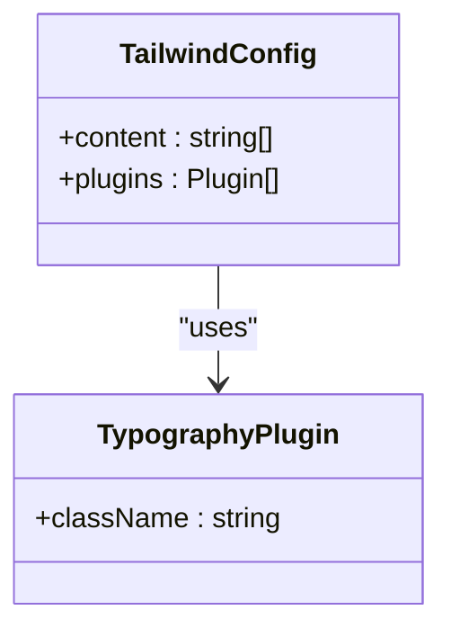
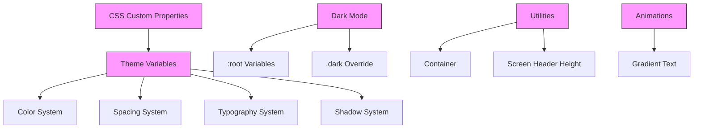
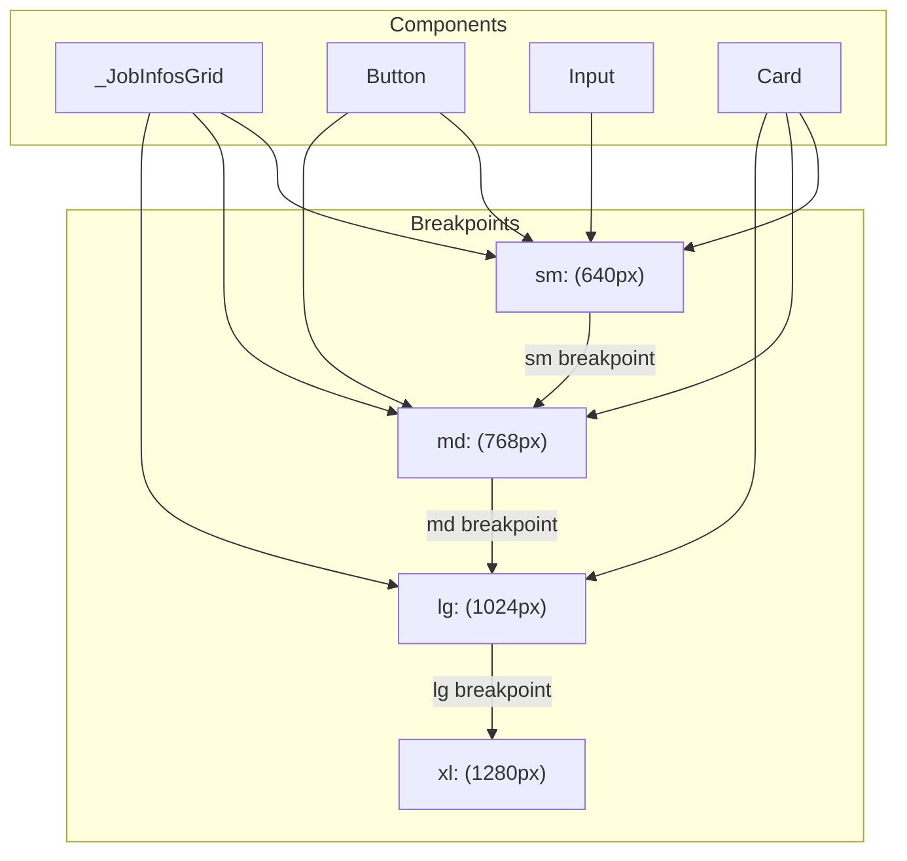
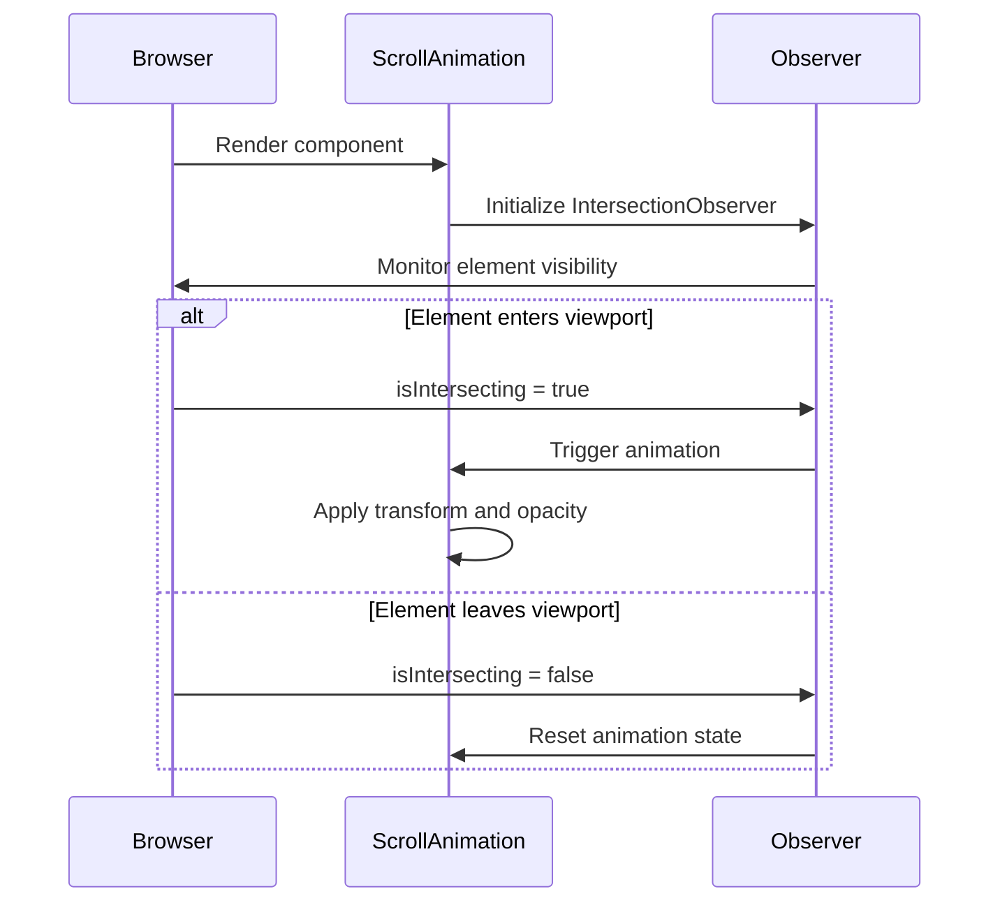

# Styling Strategy

<cite>
**Referenced Files in This Document**   
- [tailwind.config.ts](file://tailwind.config.ts)
- [globals.css](file://src/app/globals.css)
- [button.tsx](file://src/components/ui/button.tsx)
- [typing-animation.tsx](file://src/components/ui/typing-animation.tsx)
- [scroll-animation.tsx](file://src/components/ui/scroll-animation.tsx)
- [_JobInfosGrid.tsx](file://src/app/app/_JobInfosGrid.tsx)
</cite>

## Table of Contents
1. [Introduction](#introduction)
2. [Tailwind Configuration](#tailwind-configuration)
3. [Global Styles Setup](#global-styles-setup)
4. [Component-Level Styling Patterns](#component-level-styling-patterns)
5. [Feature-Specific Styling Implementation](#feature-specific-styling-implementation)
6. [Responsive Design Strategies](#responsive-design-strategies)
7. [Accessibility Considerations](#accessibility-considerations)
8. [Performance Optimization Techniques](#performance-optimization-techniques)
9. [Custom Animations Integration](#custom-animations-integration)

## Introduction
The darasa application employs a utility-first styling strategy centered around Tailwind CSS, leveraging its atomic classes for rapid UI development and consistent design language. The styling system integrates seamlessly with Next.js while maintaining high performance and accessibility standards. This document details the comprehensive styling architecture, from global configuration to component-level implementations.

## Tailwind Configuration

The Tailwind configuration in `tailwind.config.ts` establishes the foundation for the application's styling system. It utilizes Tailwind v4 canary features with scoped typography classes through the `@tailwindcss/typography` plugin. The configuration limits content scanning to TypeScript, TSX, and MDX files within the `src` and `app` directories, ensuring efficient build times and accurate class detection.



**Diagram sources**
- [tailwind.config.ts](file://tailwind.config.ts#L1-L12)

**Section sources**
- [tailwind.config.ts](file://tailwind.config.ts#L1-L12)

## Global Styles Setup

The global styles defined in `globals.css` establish the application's design system using CSS custom properties and Tailwind's layering system. The file implements a comprehensive theme layer with OKLCH color values for superior color accuracy and perceptual uniformity. Dark mode support is implemented through CSS variables that automatically adjust across light and dark themes.

The stylesheet defines custom utilities such as `container` for consistent max-width layouts and `h-screen-header` for dynamic height calculations. It also includes an animated gradient text effect using keyframe animations synchronized with the primary color palette.



**Diagram sources**
- [globals.css](file://src/app/globals.css#L1-L256)

**Section sources**
- [globals.css](file://src/app/globals.css#L1-L256)

## Component-Level Styling Patterns

UI components follow a consistent styling pattern using Tailwind's utility classes combined with `class-variance-authority` (CVA) for variant management. The Button component exemplifies this approach, defining multiple variants (default, destructive, outline, secondary, ghost, link) and sizes (default, sm, lg, icon) through CVA configurations.

All interactive elements include focus states with ring effects and disabled state handling. The styling ensures proper visual feedback for user interactions while maintaining accessibility standards through appropriate contrast ratios and semantic markup.

```mermaid
classDiagram
class Button {
+variant : default|destructive|outline|secondary|ghost|link
+size : default|sm|lg|icon
+asChild : boolean
+className : string
}
class buttonVariants {
+variants : {variant, size}
+defaultVariants : {variant, size}
}
Button --> buttonVariants : "uses"
Button --> Slot : "asChild"
```

**Diagram sources**
- [button.tsx](file://src/components/ui/button.tsx#L1-L60)

**Section sources**
- [button.tsx](file://src/components/ui/button.tsx#L1-L60)

## Feature-Specific Styling Implementation

Feature components like `_JobInfosGrid.tsx` demonstrate the application of Tailwind classes in complex UI layouts. The component uses responsive grid systems with different column counts for various screen sizes (1 column on mobile, 2 columns on medium screens). It implements search functionality with accessible form controls and visual feedback for loading states.

The JobInfoCard component utilizes Tailwind's flexbox utilities for layout, truncate classes for text overflow management, and line-clamp utilities for controlled content display. Badge components are styled with consistent spacing and color variants that align with the application's design system.

**Section sources**
- [_JobInfosGrid.tsx](file://src/app/app/_JobInfosGrid.tsx#L1-L231)

## Responsive Design Strategies

The application implements responsive design through Tailwind's breakpoint system and container queries. The `_JobInfosGrid.tsx` component demonstrates mobile-first responsive patterns with conditional classes that change layout behavior at different breakpoints (sm, md).

The global container utility ensures consistent horizontal padding and maximum width constraints across all views. Interactive elements adapt their layout and spacing based on screen size, with stacked layouts on mobile and side-by-side arrangements on larger screens.



**Diagram sources**
- [_JobInfosGrid.tsx](file://src/app/app/_JobInfosGrid.tsx#L1-L231)

## Accessibility Considerations

The styling system prioritizes accessibility through several key practices. All interactive elements include visible focus states with sufficient contrast ratios between text and background colors. The color system uses OKLCH values that ensure consistent perceived brightness across both light and dark modes.

Semantic HTML is preserved through proper element usage and ARIA attributes. Form controls include appropriate labels and error states with visual indicators that don't rely solely on color. The application maintains a minimum contrast ratio of 4.5:1 for text content against background colors in both light and dark themes.

**Section sources**
- [button.tsx](file://src/components/ui/button.tsx#L1-L60)
- [globals.css](file://src/app/globals.css#L1-L256)
- [_JobInfosGrid.tsx](file://src/app/app/_JobInfosGrid.tsx#L1-L231)

## Performance Optimization Techniques

The styling implementation incorporates several performance optimizations. The Tailwind configuration uses JIT (Just-In-Time) compilation to generate only the classes that are actually used in the codebase, significantly reducing CSS bundle size.

Purge settings are configured to scan only relevant source files (`src/**/*.{ts,tsx,mdx}` and `app/**/*.{ts,tsx,mdx}`), ensuring unused classes are removed from production builds. Class name minification is handled automatically by the build process, and the use of utility classes reduces CSS specificity issues and selector complexity.

**Section sources**
- [tailwind.config.ts](file://tailwind.config.ts#L1-L12)

## Custom Animations Integration

Custom animations are implemented through dedicated components that combine Tailwind transitions with React hooks. The `typing-animation.tsx` component creates a typewriter effect using state updates with configurable speed parameters. It displays a pulsing cursor indicator alongside gradually revealed text content.

The `scroll-animation.tsx` component implements scroll-triggered animations using the Intersection Observer API. Elements animate into view when they enter the viewport, with configurable direction (up, down, left, right), delay, and duration. The animation uses cubic-bezier easing for smooth motion and automatically resets when elements scroll out of view.



**Diagram sources**
- [scroll-animation.tsx](file://src/components/ui/scroll-animation.tsx#L1-L80)
- [typing-animation.tsx](file://src/components/ui/typing-animation.tsx#L1-L46)

**Section sources**
- [scroll-animation.tsx](file://src/components/ui/scroll-animation.tsx#L1-L80)
- [typing-animation.tsx](file://src/components/ui/typing-animation.tsx#L1-L46)