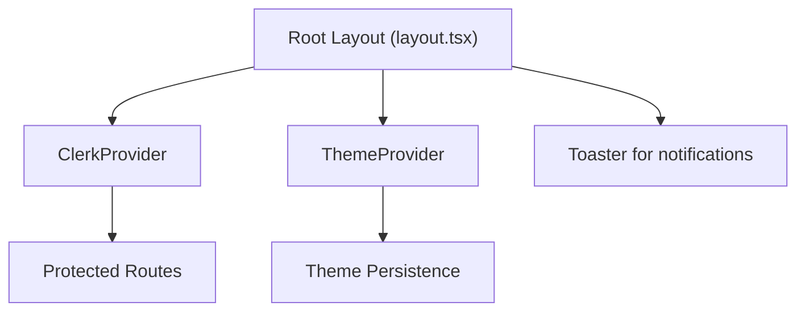
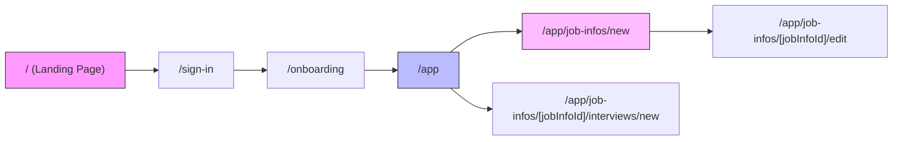

# Getting Started

<cite>
**Referenced Files in This Document**   
- [client.ts](file://src/data/env/client.ts)
- [server.ts](file://src/data/env/server.ts)
- [drizzle.config.ts](file://drizzle.config.ts)
- [layout.tsx](file://src/app/layout.tsx)
- [page.tsx](file://src/app/page.tsx)
- [onboarding/page.tsx](file://src/app/onboarding/page.tsx)
- [job-infos/new/page.tsx](file://src/app/app/job-infos/new/page.tsx)
</cite>

## Table of Contents
1. [Prerequisites](#prerequisites)
2. [Environment Setup](#environment-setup)
3. [Database Configuration and Drizzle ORM Migrations](#database-configuration-and-drizzle-orm-migrations)
4. [Running the Application Locally](#running-the-application-locally)
5. [Application Navigation and Key Entry Points](#application-navigation-and-key-entry-points)
6. [Common Setup Issues and Solutions](#common-setup-issues-and-solutions)

## Prerequisites

Before setting up the darasa application, ensure your development environment meets the following requirements:

- **Node.js**: Version 18 or higher. The application uses modern JavaScript/TypeScript features and relies on npm or yarn for package management.
- **PostgreSQL**: A running PostgreSQL instance is required. You can use a local installation or a cloud-hosted solution such as Neon.tech.
- **API Keys**:
  - **Clerk**: Required for authentication. Create an account at [clerk.com](https://clerk.com) and obtain your publishable and secret keys.
  - **Hume AI**: Needed for voice and emotion analysis during interviews. Register at [hume.ai](https://hume.ai) to get your API and secret keys.
  - **Google Gemini or OpenAI**: Used for AI-powered resume and interview feedback. Obtain an API key from either Google AI Studio (for Gemini) or OpenAI.

Ensure all these services are configured before proceeding with the setup.

**Section sources**
- [client.ts](file://src/data/env/client.ts#L1-L23)
- [server.ts](file://src/data/env/server.ts#L1-L58)

## Environment Setup

The darasa application separates client and server environment variables using `@t3-oss/env-nextjs` for type-safe configuration.

### Client-Side Environment Variables

Define the following variables in your `.env.local` file for frontend functionality:

- `NEXT_PUBLIC_CLERK_SIGN_IN_URL`: URL where users sign in via Clerk.
- `NEXT_PUBLIC_CLERK_SIGN_IN_FALLBACK_REDIRECT_URL`: Fallback redirect after sign-in.
- `NEXT_PUBLIC_CLERK_SIGN_UP_FORCE_REDIRECT_URL`: Redirect URL after sign-up.
- `NEXT_PUBLIC_CLERK_PUBLISHABLE_KEY`: Clerk’s publishable key for frontend integration.
- `NEXT_PUBLIC_HUME_CONFIG_ID`: Hume AI configuration ID for real-time voice processing.

These values are validated using Zod in `src/data/env/client.ts`.

### Server-Side Environment Variables

Add the following to your `.env.local` for backend operations:

- `DATABASE_URL`: Full PostgreSQL connection string (e.g., Neon.tech URL). If not provided, individual DB_* variables will be used to construct it.
- `DB_HOST`, `DB_PORT`, `DB_USER`, `DB_NAME`, `DB_PASSWORD`: Database credentials if not using `DATABASE_URL`.
- `ARCJET_KEY`: For rate limiting and security via Arcjet.
- `CLERK_SECRET_KEY`: Clerk's secret key for server-side user verification.
- `HUME_API_KEY`, `HUME_SECRET_KEY`: Hume AI credentials for backend API access.
- `GEMINI_API_KEY`: Google Gemini API key for AI model interactions.

The logic to resolve `DATABASE_URL` from fallback components is implemented in `src/data/env/server.ts`.

**Section sources**
- [client.ts](file://src/data/env/client.ts#L1-L23)
- [server.ts](file://src/data/env/server.ts#L1-L58)

## Database Configuration and Drizzle ORM Migrations

The application uses Drizzle ORM for database schema management and migrations.

### Configure drizzle.config.ts

The `drizzle.config.ts` file defines:
- Migration output directory: `./src/drizzle/migrations`
- Schema entry point: `./src/drizzle/schema.ts`
- Dialect: PostgreSQL
- Database credentials sourced from `process.env.DATABASE_URL`

Ensure the `.env` file is loaded at runtime using `dotenv` so that Drizzle CLI tools can access the database URL.

### Running Migrations

To initialize the database:
1. Set `DATABASE_URL` in `.env.local`.
2. Run `npx drizzle-kit push` to apply the latest schema directly to the database.
3. Alternatively, generate migration files with `npx drizzle-kit generate` and apply them using `npx drizzle-kit migrate`.

Migrations are stored in `src/drizzle/migrations/` and should be committed to version control.

For Neon.tech users, copy the connection string directly into `DATABASE_URL`. No additional configuration is needed.

**Section sources**
- [drizzle.config.ts](file://drizzle.config.ts#L1-L14)

## Running the Application Locally

After completing setup:

1. Install dependencies:
   ```bash
   npm install
   ```

2. Start the development server:
   ```bash
   npm run dev
   ```

3. Open [http://localhost:3000](http://localhost:3000) in your browser.

The app uses Next.js App Router, and hot reloading is enabled by default. Any changes to files under `src/app` will trigger automatic refreshes.

**Section sources**
- [README.md](file://README.md#L7-L14)

## Application Navigation and Key Entry Points

### Root Layout Structure

The main layout is defined in `src/app/layout.tsx`. It wraps all pages with:
- `ClerkProvider`: Manages authentication state.
- `ThemeProvider`: Enables light/dark mode via `next-themes`.
- Global styles and font loading (`Outfit`).

This layout ensures consistent UI behavior across routes.



**Diagram sources**
- [layout.tsx](file://src/app/layout.tsx#L21-L43)

### Key Application Routes

#### Landing Page (`/`)
Located at `src/app/page.tsx`, this is the public-facing homepage showcasing features and pricing. Unauthenticated users see a "Get Started" button that redirects to Clerk sign-in.

#### Onboarding Flow (`/onboarding`)
Defined in `src/app/onboarding/page.tsx`, this route checks authentication status:
- If no user exists, redirects to home.
- If user already exists, redirects to `/app`.
- Otherwise, displays onboarding UI to complete profile setup.

It uses `getCurrentUser()` from `@/services/clerk/lib/getCurrentUser` to verify session state.

#### Dashboard and Job Creation (`/app`, `/app/job-infos/new`)
Once authenticated, users land on `/app`, which renders the dashboard listing saved job descriptions.

To create a new job info:
- Navigate to `/app/job-infos/new`
- The form is powered by `JobInfoForm` component from `@/features/jobInfos/components/JobInfoForm`
- Data is persisted via Drizzle ORM to the `job_info` table

This flow enables AI-driven interview preparation tailored to specific roles.



**Diagram sources**
- [page.tsx](file://src/app/page.tsx#L1-L799)
- [onboarding/page.tsx](file://src/app/onboarding/page.tsx#L4-L16)
- [job-infos/new/page.tsx](file://src/app/app/job-infos/new/page.tsx#L4-L18)

**Section sources**
- [layout.tsx](file://src/app/layout.tsx#L1-L44)
- [page.tsx](file://src/app/page.tsx#L1-L799)
- [onboarding/page.tsx](file://src/app/onboarding/page.tsx#L1-L16)
- [job-infos/new/page.tsx](file://src/app/app/job-infos/new/page.tsx#L1-L19)

## Common Setup Issues and Solutions

### Authentication Callback Misconfiguration
**Issue**: After signing in with Clerk, users are redirected incorrectly or receive errors.  
**Solution**: Ensure `NEXT_PUBLIC_CLERK_SIGN_IN_URL` and `NEXT_PUBLIC_CLERK_SIGN_UP_FORCE_REDIRECT_URL` point to valid routes like `/onboarding`. Verify allowed callback URLs in the Clerk dashboard.

### CORS Errors During API Calls
**Issue**: Browser blocks requests to `/api/*` endpoints due to CORS policy.  
**Solution**: Confirm that `middleware.ts` properly handles preflight requests. Avoid hardcoding origins; instead, use environment variables to define trusted domains.

### Database Connection Failures
**Issue**: "Database URL is not set" error despite providing credentials.  
**Solution**: Either set `DATABASE_URL` directly or ensure all `DB_HOST`, `DB_USER`, `DB_PASSWORD`, `DB_PORT`, and `DB_NAME` are correctly specified. The fallback logic in `server.ts` requires all five to be present.

### Missing API Keys
**Issue**: AI features fail silently or throw unauthorized errors.  
**Solution**: Double-check that `HUME_API_KEY`, `GEMINI_API_KEY`, and `CLERK_SECRET_KEY` are included in `.env.local` and not prefixed with `NEXT_PUBLIC_` (which would expose them to the client).

### Migration Not Detected
**Issue**: Drizzle CLI cannot find migrations.  
**Solution**: Confirm `out` and `schema` paths in `drizzle.config.ts` match the actual project structure. Run `npx drizzle-kit studio` to visually inspect the current schema state.

**Section sources**
- [client.ts](file://src/data/env/client.ts#L1-L23)
- [server.ts](file://src/data/env/server.ts#L1-L58)
- [drizzle.config.ts](file://drizzle.config.ts#L1-L14)
- [middleware.ts](file://middleware.ts)