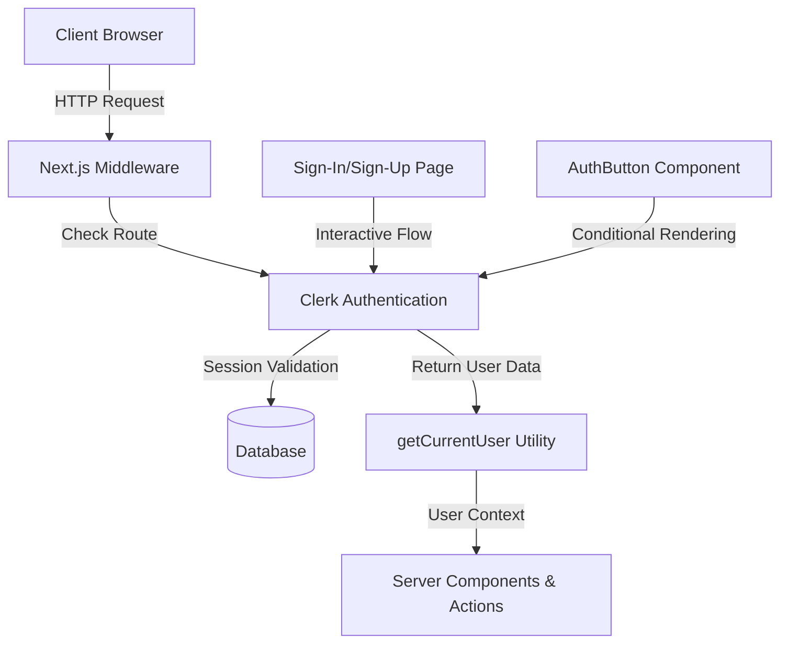
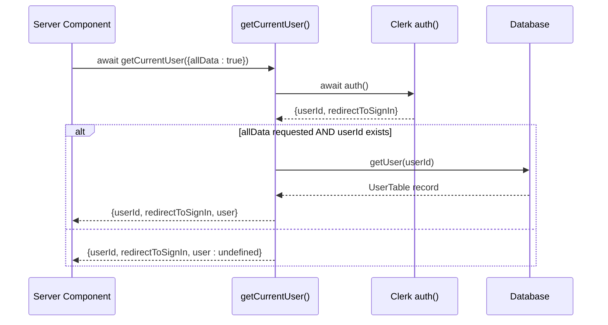
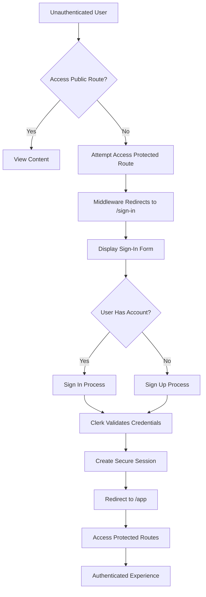

# Authentication Flow

<cite>
**Referenced Files in This Document**
- [middleware.ts](file://src/middleware.ts)
- [getCurrentUser.ts](file://src/services/clerk/lib/getCurrentUser.ts)
- [signInAppearance.ts](file://src/services/clerk/lib/signInAppearance.ts)
- [page.tsx](file://src/app/sign-in/[[...sign-in]]/page.tsx)
- [AuthButton.tsx](file://src/components/AuthButton.tsx)
</cite>

## Table of Contents
1. [Introduction](#introduction)
2. [Authentication Architecture Overview](#authentication-architecture-overview)
3. [Clerk Integration and Middleware Configuration](#clerk-integration-and-middleware-configuration)
4. [Route Protection and Public Access Management](#route-protection-and-public-access-management)
5. [getCurrentUser Utility and User Context Abstraction](#getcurrentuser-utility-and-user-context-abstraction)
6. [Sign-In/Sign-Up Page Implementation](#sign-in-sign-up-page-implementation)
7. [Authentication Lifecycle](#authentication-lifecycle)
8. [Appearance Customization and UI Consistency](#appearance-customization-and-ui-consistency)
9. [Conclusion](#conclusion)

## Introduction
This document provides a comprehensive overview of the authentication flow in the Darasa application, focusing on its integration with Clerk for user authentication and management. It details the middleware configuration that protects routes, the utility functions that abstract user session handling, and the implementation of sign-in and sign-up pages with dynamic mode switching and appearance customization.

## Authentication Architecture Overview
The authentication system in Darasa is built on top of Clerk, a third-party authentication provider that handles user sessions, identity verification, and security concerns. The architecture follows a layered approach where:
- Clerk manages the core authentication logic
- Next.js middleware enforces route protection
- Custom utilities abstract Clerk's API for consistent usage across components
- Appearance configurations ensure visual consistency regardless of global theme settings

**Diagram sources**
- [middleware.ts](file://src/middleware.ts#L1-L54)
- [getCurrentUser.ts](file://src/services/clerk/lib/getCurrentUser.ts#L7-L24)

## Clerk Integration and Middleware Configuration
The integration with Clerk is primarily configured through the `clerkMiddleware` function in `middleware.ts`. This middleware serves as the central gatekeeper for all incoming requests, determining whether authentication is required based on the requested route.

The middleware imports `clerkMiddleware` and `createRouteMatcher` from `@clerk/nextjs/server` to define public routes that don't require authentication. Currently, the following patterns are considered public:
- Sign-in routes (`/sign-in(.*)`)
- Home page (`/`)
- Webhook endpoints (`/api/webhooks(.*)`)

Arcjet integration was temporarily disabled for debugging purposes but remains available for bot detection, rate limiting, and DDoS protection when re-enabled.

**Section sources**
- [middleware.ts](file://src/middleware.ts#L1-L54)

## Route Protection and Public Access Management
Route protection is implemented using Clerk's `createRouteMatcher` utility, which allows defining URL patterns that should be accessible without authentication. All other routes are protected by default.

The middleware specifically allows webhook endpoints to bypass authentication checks, which is essential for receiving events from Clerk about user creation, updates, or deletions. For non-public routes, the middleware invokes `auth.protect()` to ensure the user has a valid session before proceeding.

The matcher configuration ensures that static assets, Next.js internals, and common file types are excluded from authentication checks unless they appear in query parameters, optimizing performance by reducing unnecessary authentication overhead.

**Section sources**
- [middleware.ts](file://src/middleware.ts#L10-L20)

## getCurrentUser Utility and User Context Abstraction
The `getCurrentUser` utility function, located in `getCurrentUser.ts`, provides a consistent interface for accessing user information across server components and actions. It wraps Clerk's `auth()` function and extends it with additional database queries when needed.

Key features of this utility include:
- Returns both `userId` and `redirectToSignIn` function from Clerk
- Optionally fetches full user data from the application database via `getUser()`
- Uses Next.js caching mechanisms with `cacheTag` for performance optimization
- Abstracts away direct dependencies on Clerk's API in business logic

When `allData = true` is passed as an option, the function performs a database lookup using Drizzle ORM to retrieve the complete user record associated with the authenticated session, enabling rich user context throughout the application.

**Diagram sources**
- [getCurrentUser.ts](file://src/services/clerk/lib/getCurrentUser.ts#L7-L24)

**Section sources**
- [getCurrentUser.ts](file://src/services/clerk/lib/getCurrentUser.ts#L7-L24)

## Sign-In/Sign-Up Page Implementation
The authentication page at `/sign-in/[[...sign-in]]/page.tsx` implements a dynamic authentication interface that supports both sign-in and sign-up modes within a single component. Key implementation details include:

- Client-side state management using React's `useState` hook to toggle between modes
- Conditional rendering of `<SignIn>` or `<SignUp>` components based on current mode
- Mode switching functionality through a toggle button that changes text and behavior contextually
- Consistent layout with branded header, logo, and descriptive text for each mode
- Responsive design optimized for various screen sizes

The page uses Clerk's pre-built UI components while maintaining full control over the surrounding layout and user experience. The routing is set to "hash" mode, which helps prevent full page reloads during authentication flows.

**Section sources**
- [page.tsx](file://src/app/sign-in/[[...sign-in]]/page.tsx#L1-L62)

## Authentication Lifecycle
The authentication lifecycle in Darasa follows a well-defined sequence from unauthenticated state to protected resource access:

1. **Unauthenticated State**: Users land on public pages like home or sign-in
2. **Authentication Initiation**: User clicks sign-in button or attempts to access protected route
3. **Redirect to Sign-In**: Middleware redirects to `/sign-in` if not authenticated
4. **Credential Submission**: User enters credentials via Clerk's hosted UI
5. **Session Creation**: Clerk validates credentials and creates session token
6. **Redirect Back**: User redirected to originally requested protected route (e.g., `/app`)
7. **Session Verification**: Middleware validates session on subsequent requests
8. **Protected Access**: User gains access to authenticated areas of the application

Throughout this lifecycle, session persistence is handled by Clerk's secure cookies, and token verification occurs automatically on each request through the middleware layer.

**Diagram sources**
- [middleware.ts](file://src/middleware.ts#L1-L54)
- [page.tsx](file://src/app/sign-in/[[...sign-in]]/page.tsx#L1-L62)

## Appearance Customization and UI Consistency
To maintain visual consistency across themes, Darasa implements a custom light-themed appearance configuration for Clerk components through `signInLightAppearance`. This ensures that sign-in and sign-up forms always display with a white background and dark text, even when the user has selected a dark mode theme for the main application.

The appearance object defines both variables (color palette) and elements (CSS classes for specific components). Notable customizations include:
- Hidden footer elements to streamline the authentication experience
- Custom styling for form fields, buttons, and cards
- Specific color definitions that align with the application's design system
- Shadow effects on the main card for depth perception

This appearance configuration is consistently applied across all authentication interfaces, including standalone sign-in buttons and the full authentication page, ensuring a cohesive user experience.

**Section sources**
- [signInAppearance.ts](file://src/services/clerk/lib/signInAppearance.ts#L1-L36)

## Conclusion
The authentication flow in Darasa effectively leverages Clerk to handle complex identity management tasks while maintaining flexibility through custom middleware and utility functions. The architecture balances security, usability, and performance by:
- Protecting routes through centralized middleware
- Abstracting user context with reusable utilities
- Providing seamless authentication experiences with dynamic mode switching
- Ensuring visual consistency through customized appearance settings
- Maintaining extensibility for future security enhancements (e.g., Arcjet integration)

This implementation provides a solid foundation for user management that can scale with the application's growing feature set while maintaining high standards for security and user experience.