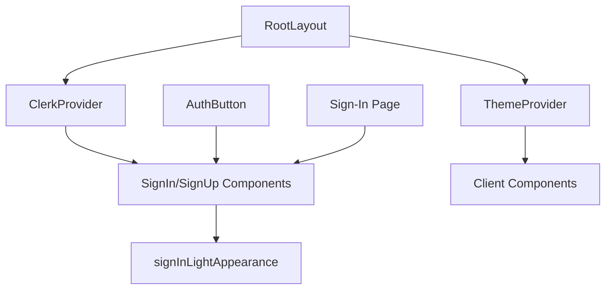
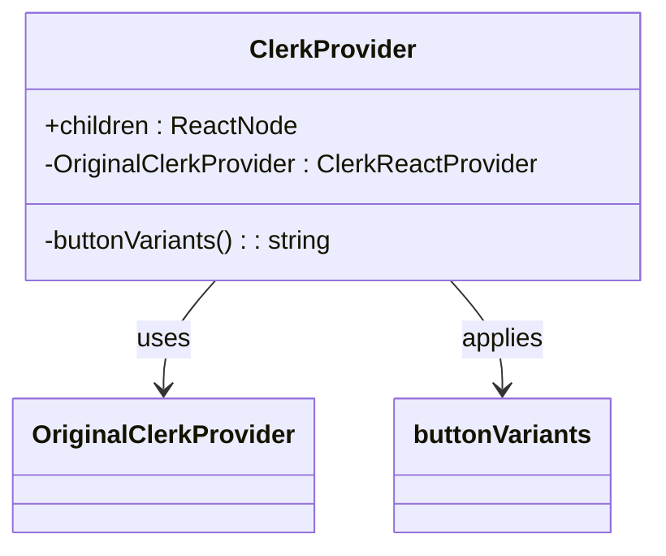
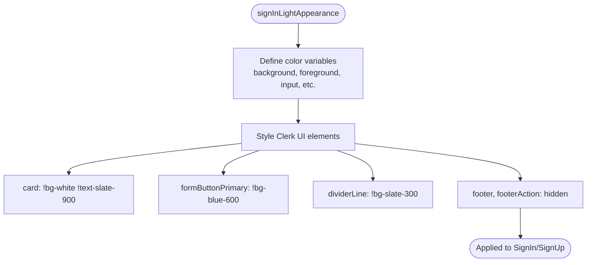

# Clerk Integration

<cite>
**Referenced Files in This Document**
- [ClerkProvider.tsx](file://src/services/clerk/components/ClerkProvider.tsx)
- [signInAppearance.ts](file://src/services/clerk/lib/signInAppearance.ts)
- [layout.tsx](file://src/app/layout.tsx)
- [page.tsx](file://src/app/sign-in/[[...sign-in]]/page.tsx)
- [AuthButton.tsx](file://src/components/AuthButton.tsx)
</cite>

## Table of Contents
1. [Introduction](#introduction)
2. [Core Components](#core-components)
3. [Architecture Overview](#architecture-overview)
4. [Detailed Component Analysis](#detailed-component-analysis)
5. [Integration with Next.js App Router](#integration-with-nextjs-app-router)
6. [UI Customization and Branding](#ui-customization-and-branding)
7. [Common Issues and Edge Cases](#common-issues-and-edge-cases)
8. [Performance Optimization](#performance-optimization)
9. [Conclusion](#conclusion)

## Introduction
This document provides a comprehensive overview of the Clerk integration within the Darasa application, focusing on authentication and user management. It details how the `ClerkProvider` wraps the application to initialize the Clerk SDK, configures appearance through `signInLightAppearance`, and integrates seamlessly with the Next.js App Router. The documentation also covers UI customization, common issues such as redirect loops and session persistence, and performance optimization strategies.

## Core Components

The core components involved in the Clerk integration include the `ClerkProvider`, which initializes the Clerk SDK at the root level, and the `signInLightAppearance` configuration object that ensures consistent theming across sign-in and sign-up flows regardless of the app's dark or light mode.

**Section sources**
- [ClerkProvider.tsx](file://src/services/clerk/components/ClerkProvider.tsx#L4-L55)
- [signInAppearance.ts](file://src/services/clerk/lib/signInAppearance.ts#L4-L36)

## Architecture Overview

**Diagram sources**
- [layout.tsx](file://src/app/layout.tsx#L1-L44)
- [ClerkProvider.tsx](file://src/services/clerk/components/ClerkProvider.tsx#L4-L55)

## Detailed Component Analysis

### ClerkProvider Analysis
The `ClerkProvider` component is a wrapper around the original `@clerk/nextjs` provider, used to inject custom appearance settings based on the application’s design tokens. It maps Tailwind CSS variables to Clerk’s theming system, ensuring visual consistency across the app.

It defines both global variables (e.g., colors, fonts, radii) and specific element classes for components like pricing tables. This allows full control over styling without requiring deep CSS overrides.

**Diagram sources**
- [ClerkProvider.tsx](file://src/services/clerk/components/ClerkProvider.tsx#L4-L55)

**Section sources**
- [ClerkProvider.tsx](file://src/services/clerk/components/ClerkProvider.tsx#L4-L55)

### signInLightAppearance Analysis
The `signInLightAppearance` object enforces a consistent light-themed UI for authentication forms, even when the rest of the application uses dark mode. This prevents visual inconsistency during login/signup and aligns with brand identity.

It explicitly sets background, text, border, and interactive element colors using hex values, overriding any inherited theme. Key elements such as input fields, buttons, dividers, and form labels are styled for clarity and accessibility.

Additionally, non-essential elements like footers and action links are hidden to streamline the user experience.

**Diagram sources**
- [signInAppearance.ts](file://src/services/clerk/lib/signInAppearance.ts#L4-L36)

**Section sources**
- [signInAppearance.ts](file://src/services/clerk/lib/signInAppearance.ts#L4-L36)

## Integration with Next.js App Router

The Clerk integration leverages the Next.js App Router pattern by wrapping the entire application in the `ClerkProvider` within `RootLayout`. This ensures the authentication context is available globally.

Client-side mounting is handled via `"use client"` directives in relevant pages like `/sign-in`, where dynamic interactivity (e.g., toggling between sign-in and sign-up modes) is required. The `routing="hash"` prop enables client-side navigation within the auth flow without full page reloads.

Hydration considerations are addressed by suppressing React hydration warnings in the HTML tag (`suppressHydrationWarning`) and conditionally rendering authenticated content using Suspense fallbacks.

**Section sources**
- [layout.tsx](file://src/app/layout.tsx#L1-L44)
- [page.tsx](file://src/app/sign-in/[[...sign-in]]/page.tsx#L1-L62)

## UI Customization and Branding

Customizing the sign-in UI involves passing the `signInLightAppearance` object directly to the `<SignIn />` and `<SignUp />` components. This guarantees branding consistency by enforcing white backgrounds, slate text, blue primary buttons, and subtle shadows.

The layout includes a centered card with the Darasa logo, clear headings, and a toggle mechanism between sign-in and sign-up modes—all wrapped in a responsive container.

Additional branding touches include:
- Logo placement using `next/image`
- Consistent font usage via `Outfit` from Google Fonts
- Shadow effects and rounded corners matching the app’s design language

These customizations ensure users perceive a seamless transition between public and authenticated areas of the site.

**Section sources**
- [page.tsx](file://src/app/sign-in/[[...sign-in]]/page.tsx#L1-L62)
- [AuthButton.tsx](file://src/components/AuthButton.tsx#L49-L69)

## Common Issues and Edge Cases

### Redirect Loops
Redirect loops can occur if `forceRedirectUrl` is misconfigured or if middleware interferes with protected routes. To prevent this, ensure the redirect URL matches an existing route accessible post-authentication (e.g., `/app`).

### Session Persistence Across Deployments
Clerk manages sessions server-side, so deployment cycles do not inherently break active sessions. However, clearing browser storage or revoking API keys may force reauthentication. Ensure environment variables (e.g., `CLERK_PUBLISHABLE_KEY`) remain consistent across deployments.

### Social Login Failures
Social login failures often stem from incorrect OAuth provider configurations in the Clerk dashboard. Always verify callback URLs, client IDs, and secrets. Additionally, handle edge cases like canceled logins or network errors gracefully using Clerk’s built-in error handling.

### User Creation Conflicts
Duplicate email or social account linking conflicts are managed automatically by Clerk, but should be communicated clearly to users. Customize error messages via Clerk’s localization settings or use webhook events (e.g., `user.created`) to trigger downstream actions safely.

**Section sources**
- [webhooks/clerk/route.ts](file://src/app/api/webhooks/clerk/route.ts)

## Performance Optimization

To minimize bundle impact and improve load times:
- **Code Splitting**: Clerk components are only imported on demand in client components (e.g., `/sign-in`), avoiding unnecessary inclusion in static pages.
- **Lazy Loading**: Use dynamic imports with `next/dynamic` for heavy components if needed.
- **Optimized Appearance Injection**: By defining appearance once in `signInLightAppearance`, redundant style recalculations are avoided.
- **Minimize Re-renders**: The `ClerkProvider` sits high in the tree but does not cause excessive updates due to Clerk’s internal memoization.

Avoid importing Clerk-related modules in server-only contexts unless necessary (e.g., `getCurrentUser`), reducing payload size and improving TTFB.

**Section sources**
- [ClerkProvider.tsx](file://src/services/clerk/components/ClerkProvider.tsx#L4-L55)
- [AuthButton.tsx](file://src/components/AuthButton.tsx#L49-L69)

## Conclusion
The Clerk integration in Darasa provides a robust, secure, and visually consistent authentication solution. By leveraging the `ClerkProvider` and `signInLightAppearance`, the application maintains brand integrity while benefiting from Clerk’s advanced features like social logins, multi-factor authentication, and session management. Proper integration with the Next.js App Router, combined with thoughtful performance optimizations, ensures a smooth and scalable user experience.