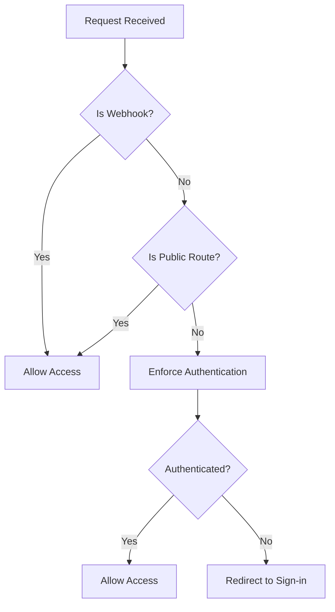
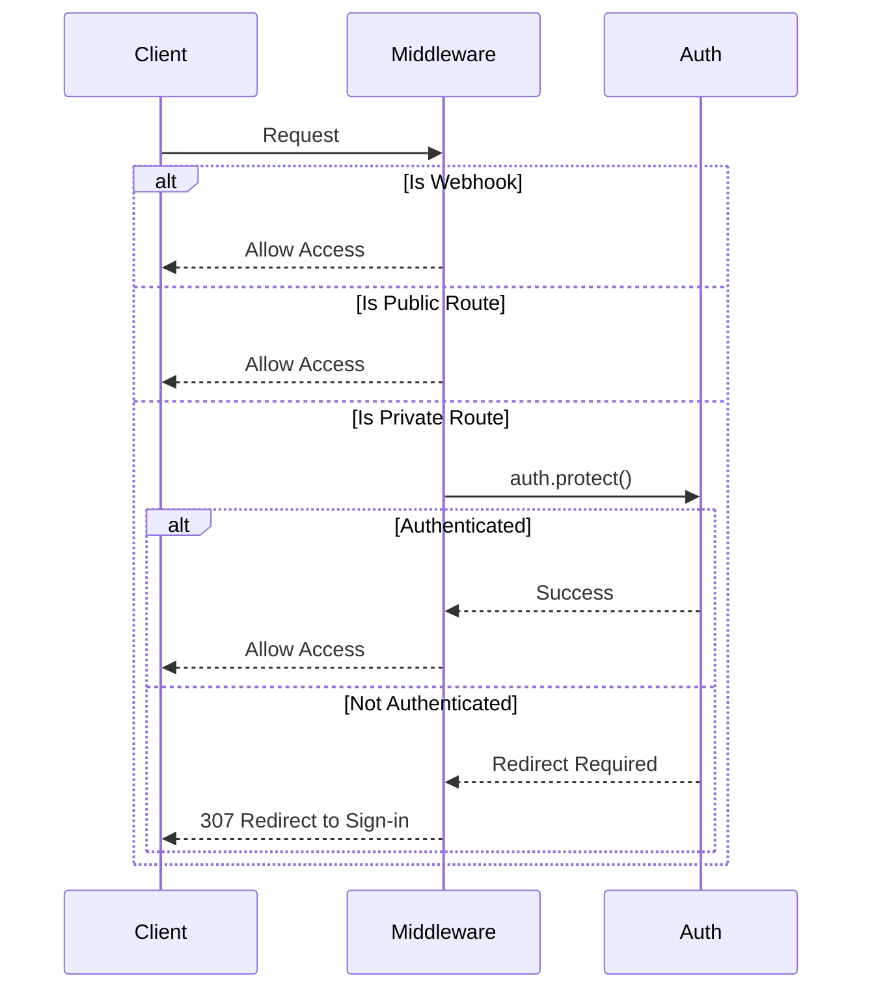
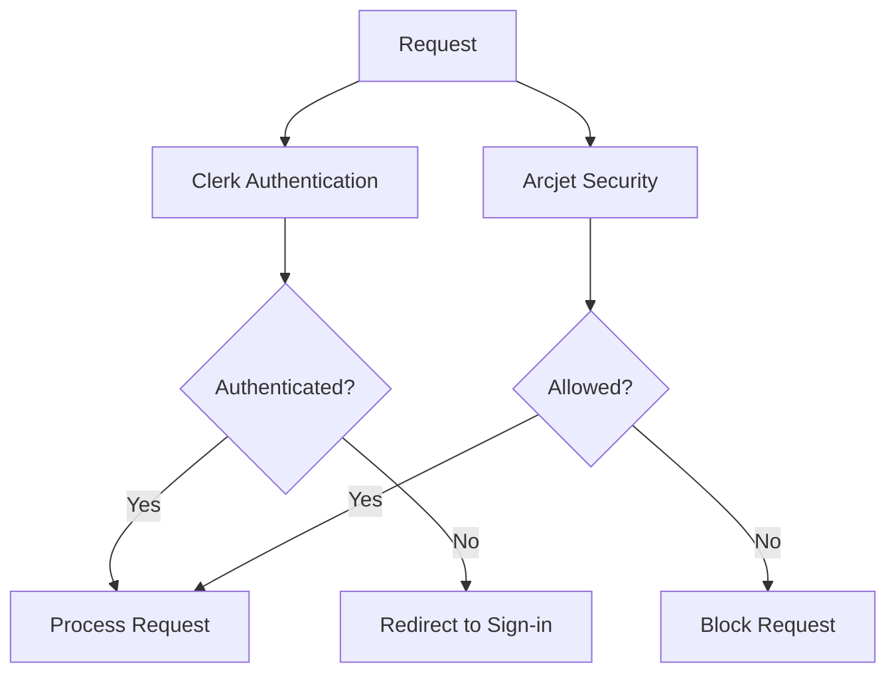

# Middleware Authentication

<cite>
**Referenced Files in This Document**   
- [middleware.ts](file://src/middleware.ts)
- [app/api/arcjet/route.ts](file://src/app/api/arcjet/route.ts)
- [next.config.ts](file://next.config.ts)
</cite>

## Table of Contents
1. [Introduction](#introduction)
2. [Core Components](#core-components)
3. [Authentication Flow](#authentication-flow)
4. [Route Matching Configuration](#route-matching-configuration)
5. [Security Layer Integration](#security-layer-integration)
6. [Performance and Caching](#performance-and-caching)
7. [Troubleshooting Guide](#troubleshooting-guide)

## Introduction

The middleware authentication system in darasa implements a robust security framework using Clerk for authentication management and route protection. The system is designed to protect private routes while allowing unauthenticated access to specific public endpoints such as sign-in pages, the root route, and API webhooks. This document details the implementation, configuration, and best practices for the middleware system.

**Section sources**
- [middleware.ts](file://src/middleware.ts#L1-L54)

## Core Components

The authentication middleware is implemented in `middleware.ts` using Clerk's server-side utilities. The core components include:

- **clerkMiddleware**: The main middleware function that intercepts requests and applies authentication rules
- **createRouteMatcher**: Utility for defining public routes that don't require authentication
- **auth.protect()**: Method that enforces authentication on protected routes and triggers redirect behavior

The system defines three public routes that are accessible without authentication: sign-in pages (matching `/sign-in(.*)`), the root route (`/`), and API webhooks (matching `/api/webhooks(.*)`). All other routes are protected by default.



**Diagram sources**
- [middleware.ts](file://src/middleware.ts#L8-L14)
- [middleware.ts](file://src/middleware.ts#L30-L38)

**Section sources**
- [middleware.ts](file://src/middleware.ts#L1-L54)

## Authentication Flow

The authentication flow follows a sequential decision process:

1. First, webhook requests are checked and allowed to bypass authentication entirely
2. Next, the request is evaluated against the public route matcher
3. If neither condition is met, authentication is enforced using `auth.protect()`

This flow ensures that critical webhook endpoints remain accessible to external services while protecting application routes from unauthorized access. The `auth.protect()` method handles the redirect logic automatically, sending unauthenticated users to the sign-in page.



**Diagram sources**
- [middleware.ts](file://src/middleware.ts#L30-L38)

**Section sources**
- [middleware.ts](file://src/middleware.ts#L30-L38)

## Route Matching Configuration

The middleware configuration uses a sophisticated regex pattern in the `matcher` property to determine which requests should be processed by the authentication middleware:

```json
{
  "matcher": [
    "/((?!_next|[^?]*\\.(?:html?|css|js(?!on)|jpe?g|webp|png|gif|svg|ttf|woff2?|ico|csv|docx?|xlsx?|zip|webmanifest)).*)",
    "/(api|trpc)(.*)"
  ]
}
```

This pattern implements several important rules:
- Excludes Next.js internal routes (`_next`)
- Skips static assets (images, CSS, JS, fonts, documents, etc.)
- Always includes API routes regardless of file type
- Handles query parameters correctly

The configuration balances performance by avoiding unnecessary middleware execution on static assets while ensuring all dynamic routes are properly protected.

**Section sources**
- [middleware.ts](file://src/middleware.ts#L40-L53)

## Security Layer Integration

The codebase includes a commented-out Arcjet security layer that was intended to provide additional protection through bot detection and rate limiting. Although currently disabled for debugging purposes, the implementation shows the planned security architecture:

- **Shield rule**: Protection against common attacks like SQL injection
- **Bot detection**: Blocking automated traffic while allowing search engines and monitoring services
- **Rate limiting**: Token bucket algorithm with 5 tokens refilled every 10 seconds, with a capacity of 10 tokens

The Arcjet integration demonstrates a layered security approach where authentication (Clerk) works alongside abuse prevention (Arcjet) to create a comprehensive security posture.



**Diagram sources**
- [middleware.ts](file://src/middleware.ts#L16-L29)
- [app/api/arcjet/route.ts](file://src/app/api/arcjet/route.ts#L1-L29)

**Section sources**
- [middleware.ts](file://src/middleware.ts#L16-L29)
- [app/api/arcjet/route.ts](file://src/app/api/arcjet/route.ts#L1-L81)

## Performance and Caching

The middleware system incorporates several performance considerations:

- **Selective execution**: The matcher regex prevents middleware from running on static assets and Next.js internals, reducing overhead
- **Early returns**: Webhook requests are immediately allowed without further processing
- **Caching configuration**: The `next.config.ts` file enables the experimental useCache feature, which can improve performance for data fetching operations

The caching strategy complements the middleware by reducing database load for authenticated users while maintaining security at the routing level.

**Section sources**
- [middleware.ts](file://src/middleware.ts#L40-L53)
- [next.config.ts](file://next.config.ts#L1-L9)

## Troubleshooting Guide

Common issues with the middleware authentication system and their solutions:

### Infinite Redirects
**Symptom**: Users are redirected to sign-in page repeatedly
**Cause**: Public route patterns not matching actual routes
**Solution**: Verify that all intended public routes are included in the `isPublicRoute` matcher array

### Incorrect Path Matching
**Symptom**: Static assets or API routes being incorrectly handled
**Cause**: Regex pattern in matcher configuration
**Solution**: Test the regex pattern with actual URLs and adjust as needed, ensuring API routes are properly included

### Middleware Execution Order Conflicts
**Symptom**: Middleware behavior conflicts with other middleware or route handlers
**Cause**: Multiple middleware functions interfering with each other
**Solution**: Ensure middleware functions are properly ordered and consider combining related logic into a single middleware

### Performance Issues
**Symptom**: Slow response times for protected routes
**Cause**: Unnecessary middleware execution on static assets
**Solution**: Verify the matcher pattern excludes all static asset types and Next.js internals

**Section sources**
- [middleware.ts](file://src/middleware.ts#L1-L54)