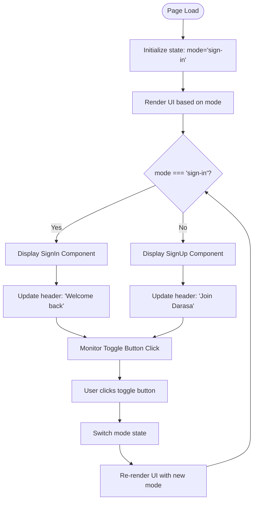
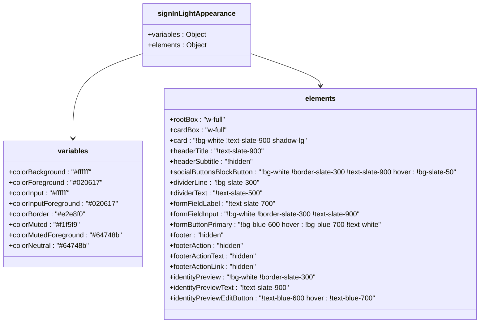

# Sign-In Flow

<cite>
**Referenced Files in This Document**
- [page.tsx](file://src/app/sign-in/[[...sign-in]]/page.tsx)
- [signInAppearance.ts](file://src/services/clerk/lib/signInAppearance.ts)
- [AuthButton.tsx](file://src/components/AuthButton.tsx)
</cite>

## Table of Contents
1. [Introduction](#introduction)
2. [Core Components](#core-components)
3. [State Management and User Experience](#state-management-and-user-experience)
4. [Appearance Configuration](#appearance-configuration)
5. [Routing Strategy](#routing-strategy)
6. [User Interface Messaging](#user-interface-messaging)
7. [Integration with Clerk Authentication](#integration-with-clerk-authentication)
8. [Performance and Optimization Considerations](#performance-and-optimization-considerations)

## Introduction
This document details the implementation of the dynamic sign-in/sign-up flow in Darasa, focusing on the unified authentication page that allows users to seamlessly toggle between signing in and creating an account. The system leverages Clerk's authentication components while enhancing user experience through client-side state management and consistent appearance configuration.

## Core Components

The sign-in flow is primarily implemented in the `src/app/sign-in/[[...sign-in]]/page.tsx` file, which serves as the main entry point for authentication. This component renders either the Clerk SignIn or SignUp component based on the current mode, sharing a common appearance configuration defined in `signInLightAppearance`. The page maintains a clean, focused interface with appropriate messaging for both new and returning users.

**Section sources**
- [page.tsx](file://src/app/sign-in/[[...sign-in]]/page.tsx#L1-L62)

## State Management and User Experience

The authentication page implements client-side state management using React's `useState` hook to manage the authentication mode. A type-safe `AuthMode` union type ("sign-in" | "sign-up") ensures type correctness throughout the component. The `handleToggle` function efficiently switches between modes by negating the current state, providing an intuitive user experience.

This approach keeps users on the same page during mode transitions, reducing cognitive load and preventing navigation away from the authentication context. The visual feedback is enhanced by dynamically updating the header text and description based on the current mode, clearly communicating the purpose of the form to the user.

**Diagram sources**
- [page.tsx](file://src/app/sign-in/[[...sign-in]]/page.tsx#L11-L61)

**Section sources**
- [page.tsx](file://src/app/sign-in/[[...sign-in]]/page.tsx#L11-L61)

## Appearance Configuration

The application uses a shared appearance configuration object `signInLightAppearance` to ensure visual consistency across both sign-in and sign-up forms. This configuration enforces a light theme regardless of the user's system preferences, maintaining brand consistency and readability.

The appearance settings include specific color variables for background, foreground, input fields, and borders, ensuring high contrast and accessibility compliance. Custom CSS classes are applied to various elements through the `elements` property, including:
- Form fields with white backgrounds and slate text
- Primary buttons with blue color scheme and hover effects
- Hidden footer elements to streamline the user experience
- Custom styling for social login buttons

This centralized appearance configuration reduces duplication and makes visual updates easier to implement across the authentication flow.

**Diagram sources**
- [signInAppearance.ts](file://src/services/clerk/lib/signInAppearance.ts#L3-L35)

**Section sources**
- [signInAppearance.ts](file://src/services/clerk/lib/signInAppearance.ts#L3-L35)

## Routing Strategy

The authentication components utilize hash-based routing by setting the `routing` prop to "hash" in both the SignIn and SignUp components. This client-side routing approach prevents full page reloads when navigating between different authentication screens (such as password reset, email verification, or multi-factor authentication), resulting in a smoother user experience.

Hash routing keeps the user within the same application context without triggering server requests for route changes, which improves performance and maintains the application state during the authentication process.

**Section sources**
- [page.tsx](file://src/app/sign-in/[[...sign-in]]/page.tsx#L43-L45)

## User Interface Messaging

The sign-in flow includes carefully crafted messaging to guide users through the authentication process. The page displays distinct welcome messages based on the current mode:
- "Welcome back" with instructions to continue to the dashboard for returning users
- "Join Darasa" with information about interview preparation benefits for new users

Below the form, contextual toggle text helps users understand the transition:
- "New to Darasa? Create an account" when in sign-in mode
- "Returning to Darasa? Sign in" when in sign-up mode

These messages provide clear affordances and reduce user confusion by explicitly stating the available actions.

**Section sources**
- [page.tsx](file://src/app/sign-in/[[...sign-in]]/page.tsx#L20-L35)

## Integration with Clerk Authentication

The authentication system integrates with Clerk through the `@clerk/nextjs` package, using both the SignIn and SignUp components within a single page. The shared `signInLightAppearance` configuration is imported from the services directory, ensuring consistency with other authentication interfaces in the application.

The `AuthButton` component, used elsewhere in the application, also references the same appearance configuration, creating a unified authentication experience across different entry points. This component handles both signed-out and signed-in states, redirecting authenticated users to the application dashboard.

**Section sources**
- [page.tsx](file://src/app/sign-in/[[...sign-in]]/page.tsx#L5-L10)
- [AuthButton.tsx](file://src/components/AuthButton.tsx#L1-L69)

## Performance and Optimization Considerations

While the current implementation does not explicitly include lazy loading for the Clerk components, the architecture supports such optimizations. The use of a single page for both sign-in and sign-up reduces initial load time compared to separate pages.

The appearance configuration is defined as a static export, allowing for potential tree-shaking and minimizing bundle size impact. The client-side state management approach avoids unnecessary re-renders by only updating the relevant parts of the UI when the authentication mode changes.

For future optimization, consider implementing dynamic imports for the Clerk components to reduce the initial bundle size, particularly if authentication is not the primary entry point for all users. Additionally, critical assets such as the logo image are already optimized with the `priority` attribute, indicating proper attention to loading performance.

**Section sources**
- [page.tsx](file://src/app/sign-in/[[...sign-in]]/page.tsx#L15-L18)
- [signInAppearance.ts](file://src/services/clerk/lib/signInAppearance.ts#L1-L35)