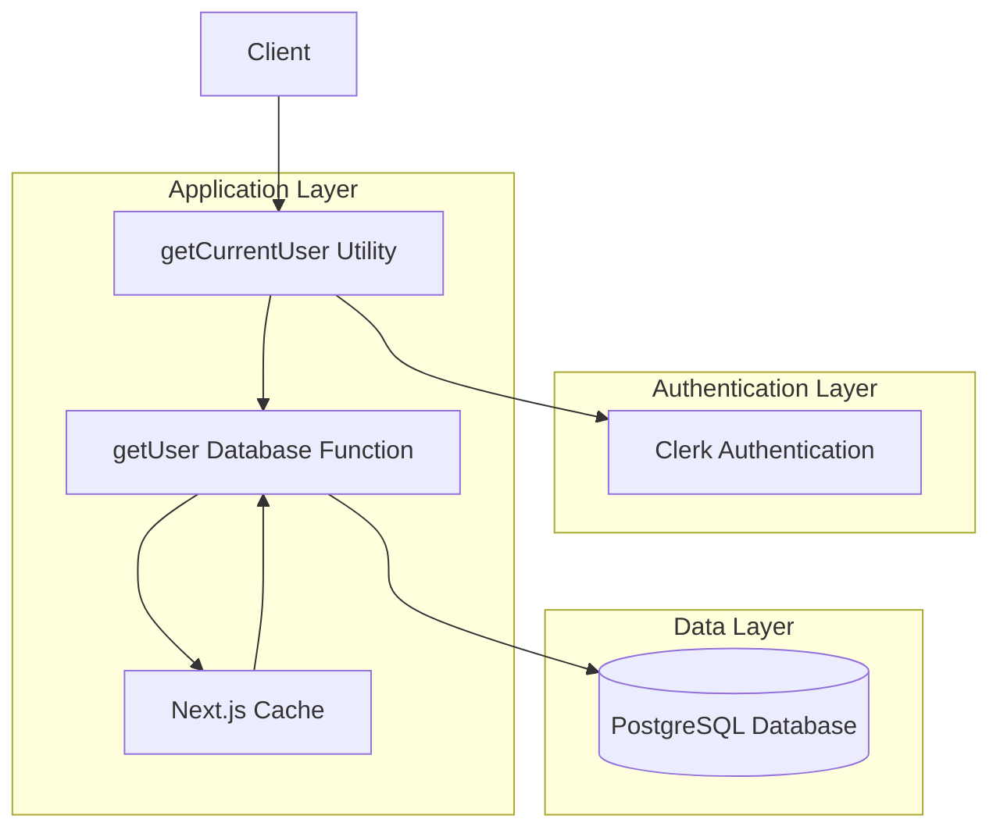
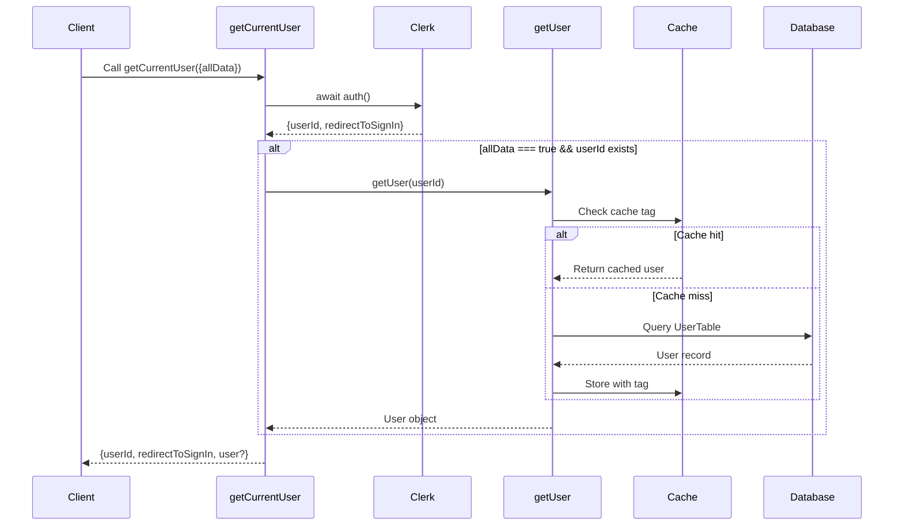
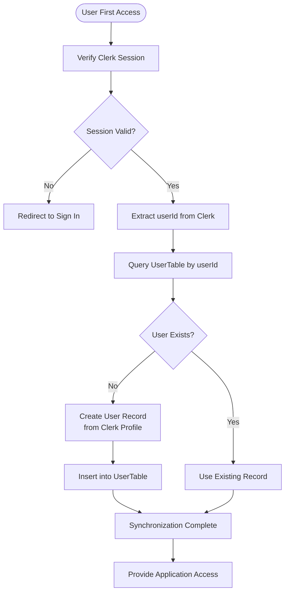
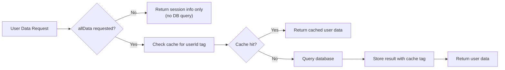

# User Session Management

<cite>
**Referenced Files in This Document**  
- [getCurrentUser.ts](file://src/services/clerk/lib/getCurrentUser.ts)
- [user.ts](file://src/drizzle/schema/user.ts)
- [dbCache.ts](file://src/features/users/dbCache.ts)
</cite>

## Table of Contents
1. [Introduction](#introduction)
2. [Core Components](#core-components)
3. [Architecture Overview](#architecture-overview)
4. [Detailed Component Analysis](#detailed-component-analysis)
5. [Dependency Analysis](#dependency-analysis)
6. [Performance Considerations](#performance-considerations)
7. [Troubleshooting Guide](#troubleshooting-guide)

## Introduction
This document provides a comprehensive analysis of user session management in the darasa application using Clerk for authentication. The focus is on the `getCurrentUser` utility function that serves as the primary interface for accessing authenticated user data throughout the application. The system integrates Clerk's authentication service with the application's internal database to provide both session information and extended user data while maintaining performance through strategic caching mechanisms.

## Core Components
The user session management system revolves around three core components: the `getCurrentUser` function that abstracts session access, the `UserTable` schema that defines the user data structure, and the caching infrastructure that optimizes data retrieval. These components work together to provide secure, efficient access to user session data across server actions and API routes.

**Section sources**
- [getCurrentUser.ts](file://src/services/clerk/lib/getCurrentUser.ts#L7-L15)
- [user.ts](file://src/drizzle/schema/user.ts#L7-L17)
- [dbCache.ts](file://src/features/users/dbCache.ts#L7-L9)

## Architecture Overview
The user session management architecture follows a layered approach where authentication is handled externally by Clerk while user data is stored internally in the application database. The `getCurrentUser` function acts as an abstraction layer between these systems, providing a unified interface for accessing user session data.



**Diagram sources**
- [getCurrentUser.ts](file://src/services/clerk/lib/getCurrentUser.ts#L7-L15)
- [user.ts](file://src/drizzle/schema/user.ts#L7-L17)

## Detailed Component Analysis

### getCurrentUser Function Analysis
The `getCurrentUser` function provides a centralized way to access user session data, abstracting away the complexity of interacting with both Clerk's authentication system and the application's database. It returns essential session information including the user ID and redirection logic, while conditionally fetching extended user data when requested.

#### Function Signature and Parameters
The function accepts an optional parameter object with a single boolean property:
- `allData`: When true, retrieves complete user record from database; when false (default), returns only session identifiers

#### Session Data Retrieval Flow


**Diagram sources**
- [getCurrentUser.ts](file://src/services/clerk/lib/getCurrentUser.ts#L7-L15)
- [getCurrentUser.ts](file://src/services/clerk/lib/getCurrentUser.ts#L17-L24)

**Section sources**
- [getCurrentUser.ts](file://src/services/clerk/lib/getCurrentUser.ts#L7-L24)

### User Data Synchronization
When a user accesses the application for the first time, their session data from Clerk is synchronized with the internal UserTable. This ensures that extended user attributes are available for application features while maintaining Clerk as the authoritative source for authentication state.



**Diagram sources**
- [getCurrentUser.ts](file://src/services/clerk/lib/getCurrentUser.ts#L7-L15)
- [user.ts](file://src/drizzle/schema/user.ts#L7-L17)

## Dependency Analysis
The user session management system has well-defined dependencies that ensure separation of concerns while enabling seamless integration between authentication, data storage, and caching layers.

```mermaid
classDiagram
class getCurrentUser {
+allData : boolean
+auth() : Promise~{userId, redirectToSignIn}~
+getUser(id) : Promise~User?
}
class getUser {
+id : string
+cacheTag(tag) : void
+db.query.UserTable.findFirst() : Promise~User?
}
class UserTable {
+id : varchar(255)
+name : varchar(255)
+email : varchar(255)
+imageUrl : varchar(1000)
+createdAt : timestamp
+updatedAt : timestamp
}
class getUserIdTag {
+id : string
+getIdTag(type, id) : string
}
class revalidateUserCache {
+id : string
+revalidateTag(tag) : void
}
getCurrentUser --> getUser : "conditional call"
getUser --> UserTable : "database query"
getUser --> getUserIdTag : "cache tagging"
revalidateUserCache --> getUserIdTag : "tag generation"
revalidateUserCache --> revalidateTag : "cache invalidation"
```

**Diagram sources**
- [getCurrentUser.ts](file://src/services/clerk/lib/getCurrentUser.ts#L7-L24)
- [user.ts](file://src/drizzle/schema/user.ts#L7-L17)
- [dbCache.ts](file://src/features/users/dbCache.ts#L7-L14)

**Section sources**
- [getCurrentUser.ts](file://src/services/clerk/lib/getCurrentUser.ts#L7-L24)
- [dbCache.ts](file://src/features/users/dbCache.ts#L7-L14)

## Performance Considerations
The system implements several performance optimizations to minimize database queries and leverage Next.js caching mechanisms effectively.

### Caching Strategy
The implementation uses Next.js cache tags to enable fine-grained revalidation of user data. Each user record is associated with a unique cache tag generated by `getUserIdTag`, allowing targeted invalidation when user data changes.



**Diagram sources**
- [getCurrentUser.ts](file://src/services/clerk/lib/getCurrentUser.ts#L17-L24)
- [dbCache.ts](file://src/features/users/dbCache.ts#L7-L9)

### Security Considerations
The design incorporates several security best practices:
- Avoids unnecessary database queries by default (only fetches extended data when explicitly requested)
- Protects sensitive user fields by limiting what data is exposed
- Handles session expiration through Clerk's built-in mechanisms
- Prevents unauthorized access by requiring valid Clerk sessions
- Uses proper type safety to prevent data leakage

When user data is updated, the `revalidateUserCache` function ensures stale data is cleared from the cache, maintaining data consistency across the application.

## Troubleshooting Guide
Common issues in user session management typically relate to authentication state, data synchronization, or caching behavior.

**Section sources**
- [getCurrentUser.ts](file://src/services/clerk/lib/getCurrentUser.ts#L7-L24)
- [dbCache.ts](file://src/features/users/dbCache.ts#L11-L14)