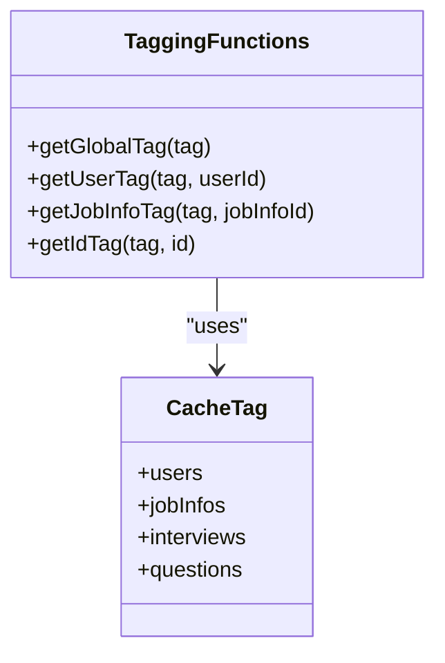
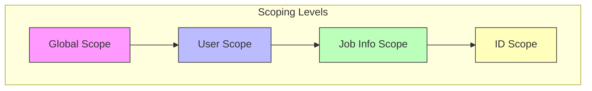
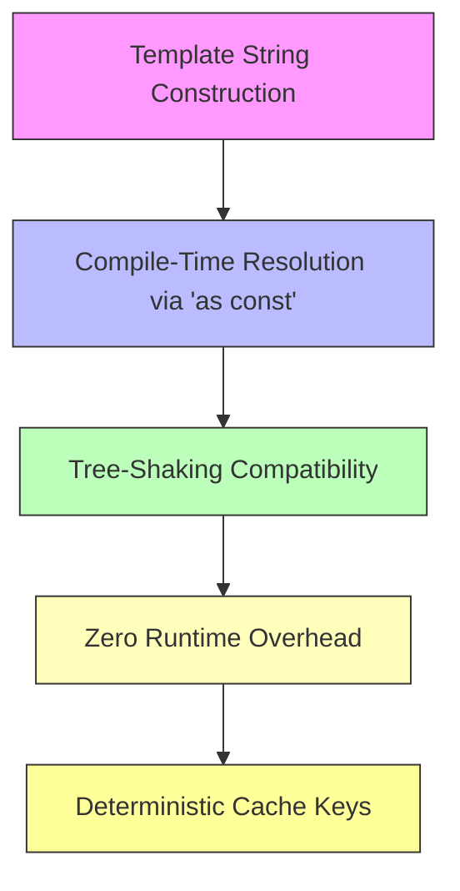
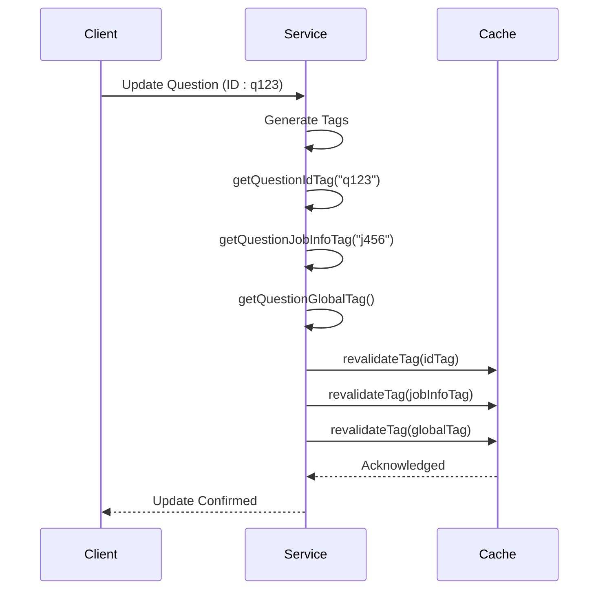
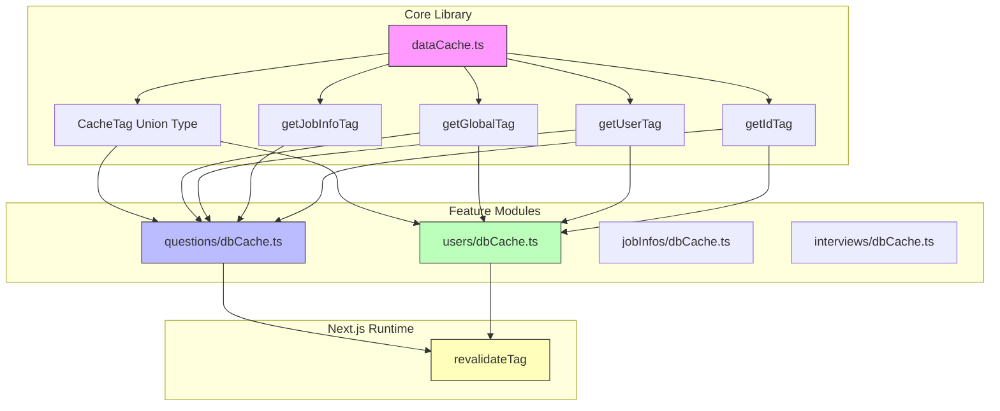

# Cache Tag System

<cite>
**Referenced Files in This Document**  
- [dataCache.ts](file://src/lib/dataCache.ts)
- [questions/dbCache.ts](file://src/features/questions/dbCache.ts)
- [users/dbCache.ts](file://src/features/users/dbCache.ts)
- [cache.d.ts](file://node_modules/next/cache.d.ts)
</cite>

## Table of Contents
1. [Introduction](#introduction)
2. [Core Components](#core-components)
3. [Four-Tiered Tagging Hierarchy](#four-tiered-tagging-hierarchy)
4. [Type Safety and Performance](#type-safety-and-performance)
5. [Cache Invalidation Patterns](#cache-invalidation-patterns)
6. [Architecture Overview](#architecture-overview)
7. [Implementation Examples](#implementation-examples)
8. [Conclusion](#conclusion)

## Introduction

The cache tag system in darasa provides a robust, type-safe mechanism for managing data caching and invalidation across different scoping levels. Built on Next.js's revalidation capabilities, this system enables precise control over cached data through a hierarchical tagging approach that supports both broad revalidation and granular updates. The implementation leverages TypeScript's type system to prevent invalid tag names while maintaining optimal performance through const assertions.

**Section sources**
- [dataCache.ts](file://src/lib/dataCache.ts#L0-L16)

## Core Components

The cache tag system consists of a central `CacheTag` union type and four primary tagging functions that generate deterministic cache keys at different scoping levels. These components work together to create a consistent interface for cache management throughout the application.



**Diagram sources**  
- [dataCache.ts](file://src/lib/dataCache.ts#L0-L16)

**Section sources**
- [dataCache.ts](file://src/lib/dataCache.ts#L0-L16)

## Four-Tiered Tagging Hierarchy

The system implements a four-level hierarchy for cache tags, enabling increasingly specific data scoping:

### Global Tags
Global tags provide the broadest scope, affecting all instances of a particular data type across the entire application. Generated by `getGlobalTag`, these tags are used for system-wide revalidation of data types.

### User-Specific Tags
User-scoped tags, created by `getUserTag`, isolate data to individual users. This level ensures that cache invalidation only affects data belonging to a specific user, preventing cross-user contamination.

### Job-Specific Tags
Job-info scoped tags, produced by `getJobInfoTag`, target data associated with specific job postings or career opportunities. This allows for targeted updates when job-related information changes.

### ID-Specific Tags
The most granular level, implemented by `getIdTag`, creates tags for individual entities regardless of their type. This enables surgical precision in cache invalidation down to single records.



**Diagram sources**  
- [dataCache.ts](file://src/lib/dataCache.ts#L2-L16)

**Section sources**
- [dataCache.ts](file://src/lib/dataCache.ts#L2-L16)

## Type Safety and Performance

The system employs several techniques to ensure type safety and optimal performance:

### Type-Safe Union Type
The `CacheTag` union type restricts valid tag values to a predefined set: `"users"`, `"jobInfos"`, `"interviews"`, and `"questions"`. This prevents runtime errors caused by invalid tag names through compile-time validation.

### Const Assertions
Each tagging function uses TypeScript's `as const` assertion to create literal types from template strings. This enables tree-shaking and ensures zero runtime overhead, as the string concatenation is resolved at compile time.

### Deterministic Key Generation
All tagging functions produce predictable, consistent cache keys based on input parameters. This determinism is crucial for reliable cache invalidation and prevents memory leaks from inconsistent key generation.



**Diagram sources**  
- [dataCache.ts](file://src/lib/dataCache.ts#L2-L16)

**Section sources**
- [dataCache.ts](file://src/lib/dataCache.ts#L2-L16)

## Cache Invalidation Patterns

The tagging system enables sophisticated cache invalidation strategies by combining different tag levels:

### Broad Revalidation
Applications can invalidate all data of a certain type across the entire system using global tags. For example, updating platform-wide question templates would trigger revalidation of all questions.

### Targeted Updates
More focused updates can target specific contexts, such as refreshing all interview data for a particular job posting without affecting other job-related content.

### Granular Operations
Individual entity updates use ID-specific tags to minimize unnecessary revalidation, ensuring optimal performance during frequent small changes.



**Diagram sources**  
- [questions/dbCache.ts](file://src/features/questions/dbCache.ts#L1-L25)
- [dataCache.ts](file://src/lib/dataCache.ts#L14-L16)

**Section sources**
- [questions/dbCache.ts](file://src/features/questions/dbCache.ts#L1-L25)
- [users/dbCache.ts](file://src/features/users/dbCache.ts#L1-L14)

## Architecture Overview

The cache tag system integrates with Next.js's caching infrastructure to provide a comprehensive solution for data consistency. At its core, the system separates tag definition from revalidation logic, allowing features to define their own convenience wrappers while sharing the underlying tagging mechanism.



**Diagram sources**  
- [dataCache.ts](file://src/lib/dataCache.ts#L0-L16)
- [questions/dbCache.ts](file://src/features/questions/dbCache.ts#L1-L25)
- [users/dbCache.ts](file://src/features/users/dbCache.ts#L1-L14)

**Section sources**
- [dataCache.ts](file://src/lib/dataCache.ts#L0-L16)
- [questions/dbCache.ts](file://src/features/questions/dbCache.ts#L1-L25)
- [users/dbCache.ts](file://src/features/users/dbCache.ts#L1-L14)

## Implementation Examples

### Questions Feature Module
The questions feature demonstrates how higher-level modules build upon the core tagging system. It defines convenience functions like `getQuestionGlobalTag()` that wrap the base `getGlobalTag()` function with the specific `"questions"` tag value.

### Users Feature Module
Similarly, the users module implements `getUserGlobalTag()` and `getUserIdTag()` functions that specialize the generic tagging functions for user-related data operations.

### Revalidation Strategy
Both modules implement revalidation functions that invalidate multiple tag levels simultaneously, ensuring data consistency across different scopes when an entity is updated.

```mermaid
classDiagram
class dataCache {
<<Module>>
+CacheTag
+getGlobalTag()
+getUserTag()
+getJobInfoTag()
+getIdTag()
}
class questionsDbCache {
<<Module>>
+getQuestionGlobalTag()
+getQuestionJobInfoTag()
+getQuestionIdTag()
+revalidateQuestionCache()
}
class usersDbCache {
<<Module>>
+getUserGlobalTag()
+getUserIdTag()
+revalidateUserCache()
}
questionsDbCache --> dataCache : "imports"
usersDbCache --> dataCache : "imports"
questionsDbCache --> "next/cache" : "revalidateTag"
usersDbCache --> "next/cache" : "revalidateTag"
```

**Diagram sources**  
- [dataCache.ts](file://src/lib/dataCache.ts#L0-L16)
- [questions/dbCache.ts](file://src/features/questions/dbCache.ts#L1-L25)
- [users/dbCache.ts](file://src/features/users/dbCache.ts#L1-L14)

**Section sources**
- [questions/dbCache.ts](file://src/features/questions/dbCache.ts#L1-L25)
- [users/dbCache.ts](file://src/features/users/dbCache.ts#L1-L14)

## Conclusion

The cache tag system in darasa provides a sophisticated yet simple solution for managing data caching and invalidation. By implementing a four-tiered hierarchy with type-safe tag definitions and compile-time optimized key generation, the system balances flexibility with reliability. The architecture enables both broad revalidation scenarios and highly targeted updates, making it suitable for complex applications with diverse data consistency requirements. Future extensions could include additional scoping levels or enhanced tag composition patterns while maintaining the core principles of type safety and performance optimization.