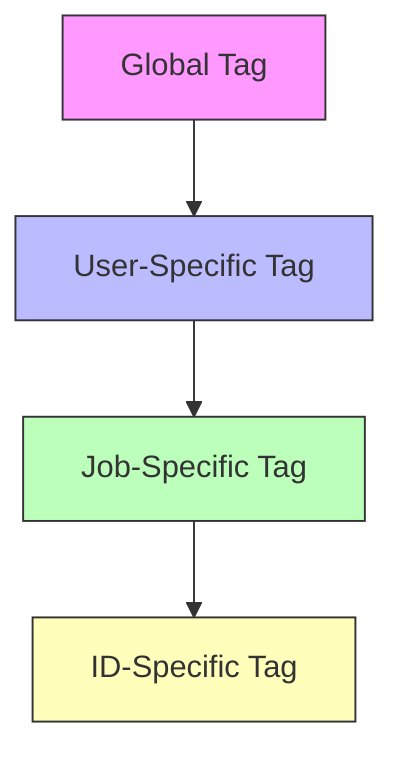
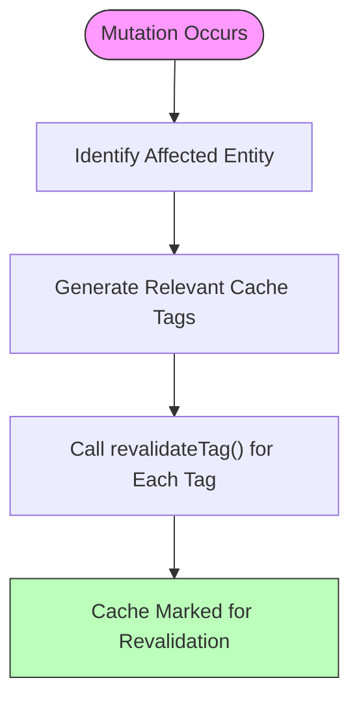
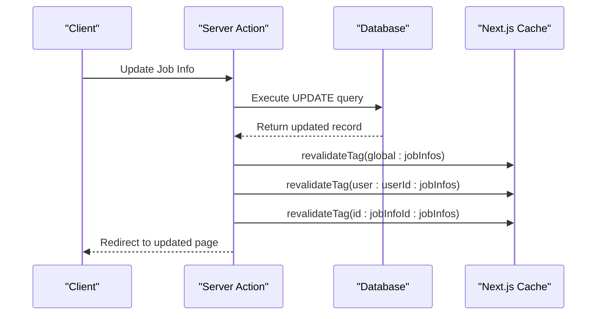
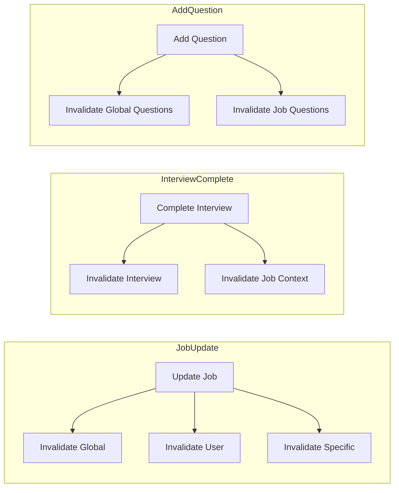

# Caching Strategy

<cite>
**Referenced Files in This Document**   
- [dataCache.ts](file://src/lib/dataCache.ts)
- [dbCache.ts](file://src/features/users/dbCache.ts)
- [dbCache.ts](file://src/features/jobInfos/dbCache.ts)
- [dbCache.ts](file://src/features/interviews/dbCache.ts)
- [dbCache.ts](file://src/features/questions/dbCache.ts)
- [actions.ts](file://src/features/users/actions.ts)
- [actions.ts](file://src/features/jobInfos/actions.ts)
- [actions.ts](file://src/features/interviews/actions.ts)
- [getCurrentUser.ts](file://src/services/clerk/lib/getCurrentUser.ts)
- [next.config.ts](file://next.config.ts)
</cite>

## Table of Contents
1. [Introduction](#introduction)
2. [Core Cache Tagging System](#core-cache-tagging-system)
3. [Hierarchical Tag Structure](#hierarchical-tag-structure)
4. [Cache Invalidation Mechanism](#cache-invalidation-mechanism)
5. [Integration with Server Actions and Database Mutations](#integration-with-server-actions-and-database-mutations)
6. [Use Case Analysis](#use-case-analysis)
7. [Performance Benefits](#performance-benefits)
8. [Edge Case Handling](#edge-case-handling)
9. [Debugging Techniques](#debugging-techniques)
10. [Configuration Requirements](#configuration-requirements)

## Introduction
The darasa application implements a sophisticated caching strategy leveraging Next.js cache tags to enable fine-grained control over data revalidation. Unlike traditional path-based invalidation, this system uses a hierarchical tagging approach that allows precise cache management across multiple levels of data granularity. The architecture enables efficient data synchronization between the database layer and cached content while minimizing unnecessary revalidations.

**Section sources**
- [dataCache.ts](file://src/lib/dataCache.ts#L2-L16)

## Core Cache Tagging System
The foundation of the caching strategy is built upon a centralized tagging utility defined in `dataCache.ts`. This module exports four primary functions that generate standardized cache tags based on different scopes: global, user-specific, job-specific, and ID-specific contexts. These functions ensure consistent tag formatting across the entire application, preventing inconsistencies that could lead to cache misses or improper invalidation.

```mermaid
classDiagram
class DataCache {
+getGlobalTag(tag : CacheTag) string
+getUserTag(tag : CacheTag, userId : string) string
+getJobInfoTag(tag : CacheTag, jobInfoId : string) string
+getIdTag(tag : CacheTag, id : string) string
}
note right of DataCache
Centralized cache tag generation
Ensures consistency across features
end note
```

**Diagram sources**
- [dataCache.ts](file://src/lib/dataCache.ts#L2-L16)

**Section sources**
- [dataCache.ts](file://src/lib/dataCache.ts#L2-L16)

## Hierarchical Tag Structure
The system employs a multi-level tagging hierarchy designed to support both broad and granular cache invalidation:

- **Global Tags**: Apply to all instances of a resource type (e.g., `global:jobInfos`)
- **User-Specific Tags**: Scope resources to individual users (e.g., `user:userId:jobInfos`)
- **Job-Specific Tags**: Associate resources with specific job information (e.g., `jobInfo:jobInfoId:interviews`)
- **ID-Specific Tags**: Target individual records (e.g., `id:interviewId:interviews`)

This hierarchical approach enables selective revalidation where updating a single record can invalidate caches at multiple relevant levels without affecting unrelated data.



**Diagram sources**
- [dataCache.ts](file://src/lib/dataCache.ts#L2-L16)

**Section sources**
- [dataCache.ts](file://src/lib/dataCache.ts#L2-L16)

## Cache Invalidation Mechanism
Cache invalidation is implemented through dedicated revalidation functions in each feature's `dbCache.ts` file. When a mutation occurs, these functions trigger `revalidateTag` for all relevant cache tags associated with the affected data. This ensures that stale data is purged from the cache immediately after database changes.

For example, when a job information record is updated, the system invalidates:
- The global job infos tag
- The user-specific job infos tag
- The specific job info instance tag

This comprehensive approach guarantees data consistency across all access patterns.



**Diagram sources**
- [dbCache.ts](file://src/features/jobInfos/dbCache.ts#L15-L25)
- [dbCache.ts](file://src/features/interviews/dbCache.ts#L15-L25)

**Section sources**
- [dbCache.ts](file://src/features/jobInfos/dbCache.ts#L15-L25)
- [dbCache.ts](file://src/features/interviews/dbCache.ts#L15-L25)

## Integration with Server Actions and Database Mutations
The caching system is tightly integrated with Server Actions and database operations. Functions marked with `"use cache"` directive utilize `cacheTag` to associate cached results with specific tags. When mutations occur through Server Actions, they automatically trigger the appropriate revalidation chain.

For instance, in the `updateJobInfo` function within `jobInfos/db.ts`, after successfully updating a record in the database, it calls `revalidateJobInfoCache()` which propagates the invalidation across all relevant cache layers.



**Diagram sources**
- [actions.ts](file://src/features/jobInfos/actions.ts#L39-L70)
- [db.ts](file://src/features/jobInfos/db.ts#L21-L37)

**Section sources**
- [actions.ts](file://src/features/jobInfos/actions.ts#L39-L70)
- [db.ts](file://src/features/jobInfos/db.ts#L21-L37)

## Use Case Analysis
### Job Updates
When a user updates a job description, the system invalidates caches at three levels: global job listings, user-specific job collection, and the specific job instance. This ensures that any page displaying job information will receive fresh data on next access.

### Interview Completions
Completing an interview triggers invalidation of interview-specific caches as well as related job information caches. The `generateInterviewFeedback` action also updates the interview record, which automatically invalidates all associated cached views.

### Question Additions
Adding new questions to a job context invalidates both the global questions list and the job-specific question collection, ensuring that assessment interfaces display up-to-date content.



**Diagram sources**
- [actions.ts](file://src/features/jobInfos/actions.ts#L39-L70)
- [actions.ts](file://src/features/interviews/actions.ts#L50-L80)
- [dbCache.ts](file://src/features/questions/dbCache.ts#L15-L25)

**Section sources**
- [actions.ts](file://src/features/jobInfos/actions.ts#L39-L70)
- [actions.ts](file://src/features/interviews/actions.ts#L50-L80)
- [dbCache.ts](file://src/features/questions/dbCache.ts#L15-L25)

## Performance Benefits
The tag-based revalidation system provides several performance advantages:

- **Reduced Database Load**: Cached queries don't hit the database until invalidated
- **Faster Page Loads**: Subsequent requests serve from cache rather than executing database queries
- **Efficient Invalidation**: Only necessary caches are cleared, preserving valid cached data
- **Scalability**: The system handles increased load gracefully by serving cached content

By avoiding full-site or route-based revalidation, the application maintains high performance even during frequent data updates.

**Section sources**
- [dataCache.ts](file://src/lib/dataCache.ts#L2-L16)
- [next.config.ts](file://next.config.ts#L1-L8)

## Edge Case Handling
The system includes safeguards for various edge cases:

- **Permission Checks**: All data access verifies user ownership before returning results
- **Existence Validation**: Operations confirm record existence before processing
- **Error Recovery**: Failed operations maintain cache integrity by only invalidating on success
- **Race Conditions**: Next.js cache mechanisms handle concurrent access appropriately

For example, the `deleteJobInfo` action confirms user ownership before deletion and only triggers revalidation upon successful removal.

**Section sources**
- [actions.ts](file://src/features/jobInfos/actions.ts#L81-L120)
- [actions.ts](file://src/features/interviews/actions.ts#L1-L178)

## Debugging Techniques
Effective debugging of cache behavior involves:

- Monitoring console logs for cache tag usage
- Verifying proper tag generation in development
- Testing revalidation flows after mutations
- Using browser developer tools to inspect cache headers
- Implementing logging in critical cache operations

The use of descriptive tag formats makes it easier to trace cache interactions and diagnose issues.

**Section sources**
- [actions.ts](file://src/features/users/actions.ts#L19-L66)
- [getCurrentUser.ts](file://src/services/clerk/lib/getCurrentUser.ts#L15-L24)

## Configuration Requirements
The caching system requires specific configuration in `next.config.ts` to function properly. The experimental `useCache` flag must be enabled to activate Next.js cache tagging functionality. This configuration setting is essential for the entire cache tag system to work as designed.

```typescript
const nextConfig: NextConfig = {
  experimental: {
    useCache: true,
  },
};
```

**Diagram sources**
- [next.config.ts](file://next.config.ts#L1-L8)

**Section sources**
- [next.config.ts](file://next.config.ts#L1-L8)