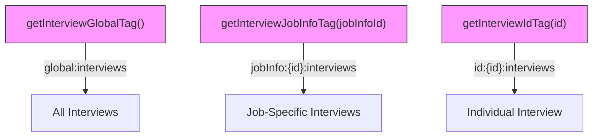
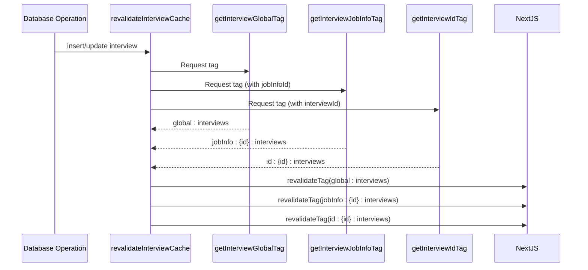
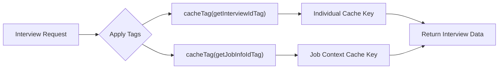
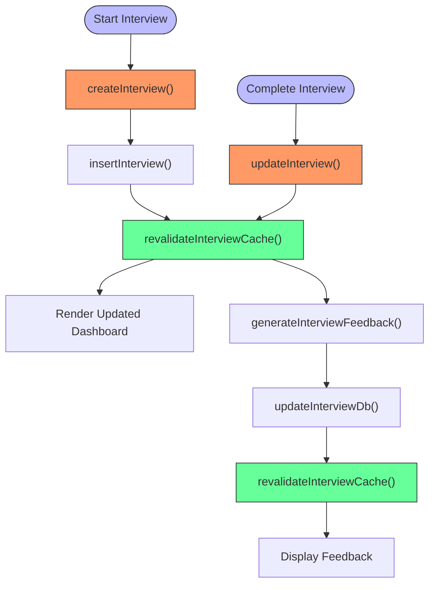

# Interview Caching Strategy

<cite>
**Referenced Files in This Document**  
- [dbCache.ts](file://src/features/interviews/dbCache.ts)
- [dataCache.ts](file://src/lib/dataCache.ts)
- [actions.ts](file://src/features/interviews/actions.ts)
- [db.ts](file://src/features/interviews/db.ts)
</cite>

## Table of Contents
1. [Introduction](#introduction)
2. [Core Tagging Functions](#core-tagging-functions)
3. [Cache Invalidation Mechanism](#cache-invalidation-mechanism)
4. [Data Access Patterns](#data-access-patterns)
5. [Application Flow Integration](#application-flow-integration)
6. [Performance Implications](#performance-implications)
7. [Troubleshooting and Monitoring](#troubleshooting-and-monitoring)

## Introduction
The interview caching strategy implements a hierarchical tagging system that enables efficient cache management for interview-related data. This approach leverages Next.js cache tags to provide granular control over data invalidation, balancing performance optimization with data freshness. The system is designed around job-scoped contexts, allowing for targeted cache updates while maintaining global consistency.

**Section sources**
- [dbCache.ts](file://src/features/interviews/dbCache.ts#L1-L25)
- [dataCache.ts](file://src/lib/dataCache.ts#L1-L16)

## Core Tagging Functions
The caching strategy employs three specialized tag functions that create a hierarchical namespace for interview data:

### Global Interview Tag
`getInterviewGlobalTag()` generates a universal tag (`global:interviews`) that represents all interview data across the application. This tag serves as the broadest level of cache invalidation, useful when system-wide changes affect interview data integrity.

### Job-Specific Interview Tag
`getInterviewJobInfoTag(jobInfoId)` creates context-aware tags in the format `jobInfo:{jobInfoId}:interviews`. These tags enable scoped invalidation tied to specific job postings, ensuring that updates to interviews within one job context don't unnecessarily invalidate data from unrelated jobs.

### Individual Interview Tag
`getInterviewIdTag(id)` produces fine-grained tags (`id:{interviewId}:interviews`) for single interview records. This level of specificity allows for surgical cache updates when individual interview states change.

**Diagram sources**
- [dbCache.ts](file://src/features/interviews/dbCache.ts#L3-L13)

**Section sources**
- [dbCache.ts](file://src/features/interviews/dbCache.ts#L3-L13)
- [dataCache.ts](file://src/lib/dataCache.ts#L10-L16)

## Cache Invalidation Mechanism
The `revalidateInterviewCache` function coordinates a cascading invalidation strategy that simultaneously updates all three cache levels when an interview changes state.

### Coordinated Revalidation
When an interview is created, updated, or completed, the revalidation function triggers invalidation across the entire hierarchy:
1. Global interview cache (`global:interviews`)
2. Job-specific interview cache (`jobInfo:{jobInfoId}:interviews`)
3. Individual interview cache (`id:{interviewId}:interviews`)

This multi-level approach ensures data consistency while minimizing unnecessary cache misses.

### Implementation Flow
The invalidation process is automatically triggered by database operations through tight integration between the data access layer and caching logic.

**Diagram sources**
- [dbCache.ts](file://src/features/interviews/dbCache.ts#L15-L25)
- [db.ts](file://src/features/interviews/db.ts#L15-L31)

**Section sources**
- [dbCache.ts](file://src/features/interviews/dbCache.ts#L15-L25)
- [db.ts](file://src/features/interviews/db.ts#L15-L31)

## Data Access Patterns
The caching strategy enables efficient data retrieval patterns that optimize dashboard rendering and user experience.

### Contextual Caching in Server Actions
Server actions leverage cache tags to associate data queries with appropriate invalidation triggers. When retrieving an interview, the `getInterview` function applies both individual and job-level tags:

This dual-tagging approach ensures that the same data can be invalidated through multiple pathways, providing flexibility in cache management.

### Hierarchical Invalidation Benefits
By caching interview lists per `jobInfoId`, the system achieves:
- **Efficient Dashboard Rendering**: Job-specific interview lists load quickly from cache
- **Targeted Refreshes**: New interviews trigger only relevant cache updates
- **Context Preservation**: User navigation within job contexts maintains consistent data views

**Section sources**
- [actions.ts](file://src/features/interviews/actions.ts#L150-L178)
- [db.ts](file://src/features/interviews/db.ts#L1-L31)

## Application Flow Integration
The caching strategy integrates seamlessly with key application workflows, ensuring data consistency across user interactions.

### Interview Creation Flow
When a user starts a new interview:
1. `createInterview` action initiates the process
2. Database insertion occurs via `insertInterview`
3. `revalidateInterviewCache` triggers multi-level invalidation
4. Subsequent requests for interview lists reflect the updated state

### Interview Completion Flow
Upon interview completion:
1. `updateInterview` modifies the interview record
2. Duration and Hume chat ID are updated
3. Cache invalidation cascade ensures fresh data
4. Feedback generation becomes available

### Review and Feedback Flow
When generating AI feedback:
1. System verifies interview completion status
2. AI service processes conversation data
3. Feedback is stored via `updateInterviewDb`
4. All cache levels are refreshed to display updated feedback

**Diagram sources**
- [actions.ts](file://src/features/interviews/actions.ts#L0-L178)
- [db.ts](file://src/features/interviews/db.ts#L15-L31)

**Section sources**
- [actions.ts](file://src/features/interviews/actions.ts#L0-L178)

## Performance Implications
The hierarchical invalidation strategy offers significant performance advantages over alternative approaches.

### Comparison with Path-Based Revalidation
Unlike path-based revalidation which requires knowledge of specific URLs, tag-based invalidation:
- **Decouples business logic from routing**: Changes don't require URL mapping updates
- **Supports multiple access patterns**: Same data can be accessed through different routes
- **Enables bulk operations**: Single invalidation affects all matching tags regardless of endpoint

### Efficiency Analysis
The current strategy optimizes performance through:
- **Reduced database load**: Cached data serves multiple requests
- **Minimized network overhead**: Edge caching reduces origin requests
- **Predictable invalidation**: Clear tagging hierarchy prevents stale data

### Resource Utilization
While maintaining three cache levels increases memory usage slightly, the benefits outweigh costs:
- Global tag: Infrequent invalidation, high reuse
- Job-specific tag: Moderate invalidation, good reuse within context
- Individual tag: Frequent invalidation, essential for real-time updates

**Section sources**
- [dbCache.ts](file://src/features/interviews/dbCache.ts#L1-L25)
- [dataCache.ts](file://src/lib/dataCache.ts#L1-L16)

## Troubleshooting and Monitoring
Effective monitoring and troubleshooting practices ensure the caching system operates reliably.

### Stale Data Diagnosis
Common causes of stale interview data include:
- **Failed invalidation calls**: Verify `revalidateInterviewCache` executes after mutations
- **Incorrect tag application**: Ensure proper tag hierarchy in data access functions
- **Caching layer issues**: Check Next.js runtime and edge network status

### Recommended Monitoring
Implement these monitoring practices:
- **Cache hit/miss ratios**: Track effectiveness of caching strategy
- **Invalidation frequency**: Monitor how often each tag level is refreshed
- **Latency metrics**: Compare cached vs. uncached request performance
- **Error logging**: Capture failed revalidation attempts

### Debugging Checklist
When investigating cache-related issues:
1. Verify tag generation functions return expected values
2. Confirm `revalidateTag` calls occur in database mutation handlers
3. Check that `cacheTag` is applied in all data retrieval functions
4. Validate jobInfoId and interviewId parameters are correctly passed

**Section sources**
- [dbCache.ts](file://src/features/interviews/dbCache.ts#L1-L25)
- [actions.ts](file://src/features/interviews/actions.ts#L0-L178)
- [db.ts](file://src/features/interviews/db.ts#L1-L31)