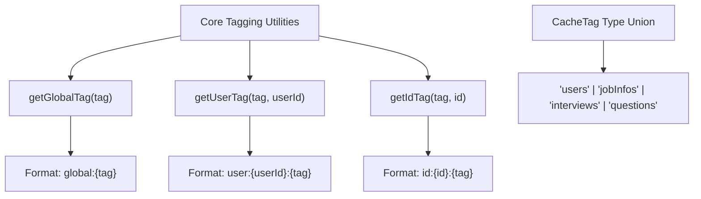
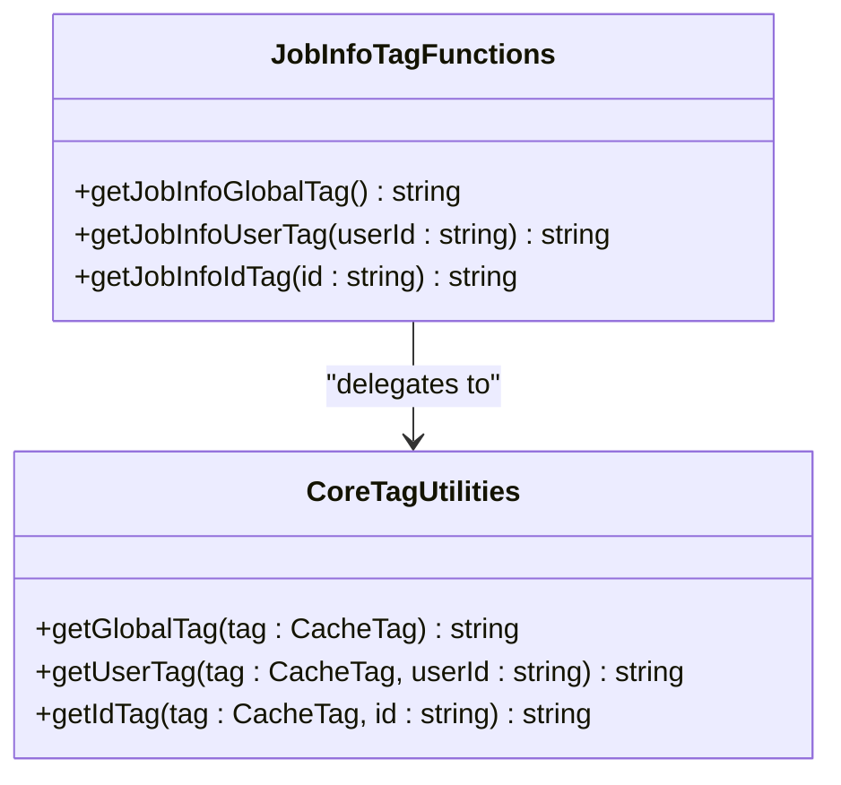
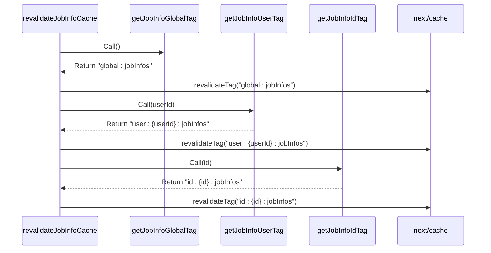
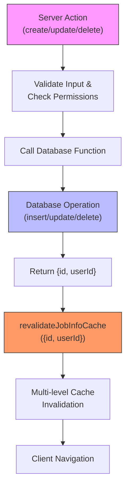
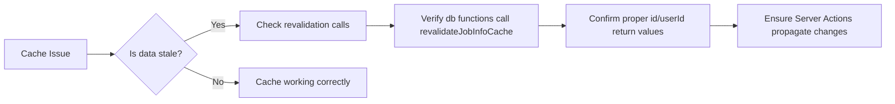

# Job Info Caching Strategy

<cite>
**Referenced Files in This Document**  
- [src/features/jobInfos/dbCache.ts](file://src/features/jobInfos/dbCache.ts)
- [src/lib/dataCache.ts](file://src/lib/dataCache.ts)
- [src/features/jobInfos/actions.ts](file://src/features/jobInfos/actions.ts)
- [src/features/jobInfos/db.ts](file://src/features/jobInfos/db.ts)
- [src/app/app/job-infos/[jobInfoId]/edit/page.tsx](file://src/app/app/job-infos/[jobInfoId]/edit/page.tsx)
- [next.config.ts](file://next.config.ts)
</cite>

## Table of Contents
1. [Introduction](#introduction)
2. [Core Tagging Utilities](#core-tagging-utilities)
3. [Job Info Specific Tag Functions](#job-info-specific-tag-functions)
4. [Cache Revalidation Mechanism](#cache-revalidation-mechanism)
5. [Invocation Flow for Mutations](#invocation-flow-for-mutations)
6. [Caching Strategy Rationale](#caching-strategy-rationale)
7. [Common Issues and Debugging](#common-issues-and-debugging)
8. [Conclusion](#conclusion)

## Introduction
This document details the caching strategy implemented for job information data in the application. The system leverages Next.js cache tagging and revalidation mechanisms to maintain data consistency across multiple scopes while optimizing performance. The architecture employs a hierarchical tagging approach that enables granular cache invalidation when job info records are created, updated, or deleted.

The caching strategy is designed around three primary tag functions—`getJobInfoGlobalTag`, `getJobInfoUserTag`, and `getJobInfoIdTag`—which create distinct cache tags at different levels of specificity. These tags work in conjunction with the `revalidateJobInfoCache` function to ensure data freshness across all relevant contexts after mutations occur.

**Section sources**
- [src/features/jobInfos/dbCache.ts](file://src/features/jobInfos/dbCache.ts#L3-L25)
- [src/lib/dataCache.ts](file://src/lib/dataCache.ts#L2-L16)

## Core Tagging Utilities
The foundation of the caching strategy lies in the core tagging utilities provided by the `dataCache.ts` module. These functions establish a consistent naming convention for cache tags across the entire application, enabling predictable and maintainable cache management patterns.

The system defines four primary tag types through the `CacheTag` type union: "users", "jobInfos", "interviews", and "questions". Each tag function generates a unique string identifier following specific formatting rules:

- `getGlobalTag(tag)`: Creates a global scope tag in the format `global:{tag}`
- `getUserTag(tag, userId)`: Creates a user-specific tag in the format `user:{userId}:{tag}`
- `getIdTag(tag, id)`: Creates an entity-specific tag in the format `id:{id}:{tag}`

These utility functions serve as building blocks for feature-specific tagging implementations, ensuring consistency in tag structure and reducing duplication across the codebase.

**Diagram sources**
- [src/lib/dataCache.ts](file://src/lib/dataCache.ts#L2-L16)

**Section sources**
- [src/lib/dataCache.ts](file://src/lib/dataCache.ts#L2-L16)

## Job Info Specific Tag Functions
The job information feature extends the core tagging utilities with three specialized functions that create context-specific cache tags. These functions encapsulate the domain logic for job info caching and provide a clean abstraction layer between the generic tagging utilities and the specific requirements of the job info feature.

### getJobInfoGlobalTag
This function returns a global cache tag for all job information data across the entire application. It serves as the broadest level of cache identification, useful for scenarios where any job info data might be affected.

### getJobInfoUserTag
This function creates a user-specific cache tag that identifies all job information belonging to a particular user. It combines the user ID with the job info context, enabling targeted invalidation when changes affect a specific user's data.

### getJobInfoIdTag
This function generates an entity-specific cache tag for a single job information record. It provides the most granular level of cache identification, allowing precise targeting of individual job info items.

Each of these functions delegates to the corresponding core utility function while providing domain-specific parameterization for the job info context.

**Diagram sources**
- [src/features/jobInfos/dbCache.ts](file://src/features/jobInfos/dbCache.ts#L3-L13)

**Section sources**
- [src/features/jobInfos/dbCache.ts](file://src/features/jobInfos/dbCache.ts#L3-L13)

## Cache Revalidation Mechanism
The `revalidateJobInfoCache` function implements a comprehensive cache invalidation strategy that ensures data consistency across all relevant scopes simultaneously. When invoked, it triggers revalidation for all three levels of job info cache tags, effectively clearing stale data from the cache hierarchy.

The function accepts an object containing both the job info ID and user ID, which are required to generate the complete set of cache tags for invalidation. It systematically calls `revalidateTag` for each tag type in sequence:

1. Global job infos tag - invalidates any cached data showing all job infos
2. User-specific job infos tag - invalidates data scoped to the owner user
3. Entity-specific job info tag - invalidates data for the specific job info record

This multi-level revalidation approach ensures that consumers of job info data at any scope will receive fresh data on their next request, preventing stale content from being served.

**Diagram sources**
- [src/features/jobInfos/dbCache.ts](file://src/features/jobInfos/dbCache.ts#L15-L25)

**Section sources**
- [src/features/jobInfos/dbCache.ts](file://src/features/jobInfos/dbCache.ts#L15-L25)

## Invocation Flow for Mutations
The caching strategy is tightly integrated with the data mutation workflow through Server Actions and database operations. When a job info record is created, updated, or deleted, the system follows a consistent pattern of database modification followed by multi-level cache revalidation.

### Creation Flow
When creating a new job info:
1. Server Action `createJobInfo` validates input data
2. Calls `insertJobInfo` in the database layer
3. Database function inserts record and returns {id, userId}
4. Immediately invokes `revalidateJobInfoCache` with returned identifiers
5. Redirects to the new job info page

### Update Flow
When updating an existing job info:
1. Server Action `updateJobInfo` validates input and checks permissions
2. Calls `updateJobInfo` in the database layer
3. Database function updates record and returns {id, userId}
4. Automatically triggers `revalidateJobInfoCache`
5. Redirects back to the job info page

### Deletion Flow
When deleting a job info:
1. Server Action `deleteJobInfo` verifies ownership
2. Calls `deleteJobInfo` in the database layer
3. Database function removes record and returns {id, userId}
4. Invokes `revalidateJobInfoCache` if deletion was successful
5. Handles post-deletion navigation based on remaining records

This flow ensures that cache invalidation occurs as part of the atomic database transaction, maintaining data consistency even in failure scenarios.

**Diagram sources**
- [src/features/jobInfos/actions.ts](file://src/features/jobInfos/actions.ts#L0-L121)
- [src/features/jobInfos/db.ts](file://src/features/jobInfos/db.ts#L0-L54)

**Section sources**
- [src/features/jobInfos/actions.ts](file://src/features/jobInfos/actions.ts#L0-L121)
- [src/features/jobInfos/db.ts](file://src/features/jobInfos/db.ts#L0-L54)

## Caching Strategy Rationale
The decision to implement cache invalidation rather than purging represents a strategic optimization for performance and scalability. Invalidation marks cached data as stale without immediately removing it, allowing the system to continue serving potentially valid content until fresh data is available.

### Performance Benefits
- **Reduced Latency**: Subsequent requests can still be served from cache during regeneration
- **Lower Database Load**: Prevents thundering herd problem when popular data expires
- **Improved User Experience**: Maintains responsiveness even during cache misses

### Strategic Advantages
The three-tiered tagging approach provides several key advantages:
- **Granularity**: Allows precise targeting of cache invalidation
- **Efficiency**: Minimizes unnecessary cache clears
- **Consistency**: Ensures all relevant caches are updated together
- **Maintainability**: Clear separation between tag generation and revalidation logic

By invalidating rather than purging, the system achieves optimal balance between data freshness and performance, particularly important in scenarios with high read-to-write ratios.

**Section sources**
- [src/features/jobInfos/dbCache.ts](file://src/features/jobInfos/dbCache.ts#L15-L25)
- [src/lib/dataCache.ts](file://src/lib/dataCache.ts#L2-L16)

## Common Issues and Debugging
Several common issues can arise with the job info caching implementation, primarily related to missing revalidation calls or incorrect tag usage.

### Missing Revalidation
The most frequent issue occurs when revalidation calls are omitted after data mutations. This results in stale data being served to users even though the database has been updated. To prevent this:
- Ensure all database mutation functions call `revalidateJobInfoCache`
- Verify that return values include both `id` and `userId` fields
- Check that Server Actions properly handle the revalidation chain

### Debugging Techniques
The application provides several mechanisms for inspecting and debugging cache behavior:

1. **Enable Cache Logging**: The experimental `useCache: true` setting in `next.config.ts` enables detailed cache instrumentation
2. **Verify Tag Application**: Check that `cacheTag()` is called with appropriate tags in data fetching functions
3. **Monitor Network Requests**: Observe cache status headers in API responses
4. **Test Revalidation Triggers**: Manually invoke actions and verify cache clearing through subsequent requests

Developers should also verify that the `experimental.useCache` flag remains enabled in development to facilitate cache-related debugging.

**Diagram sources**
- [next.config.ts](file://next.config.ts#L0-L8)
- [src/features/jobInfos/db.ts](file://src/features/jobInfos/db.ts#L0-L54)

**Section sources**
- [next.config.ts](