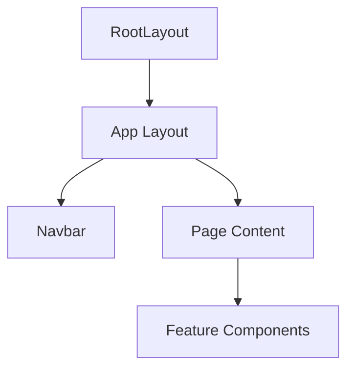
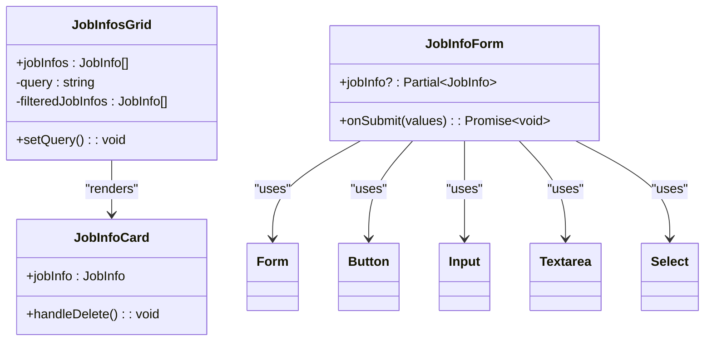
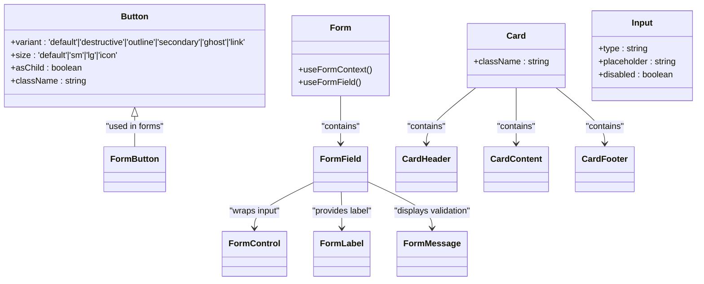
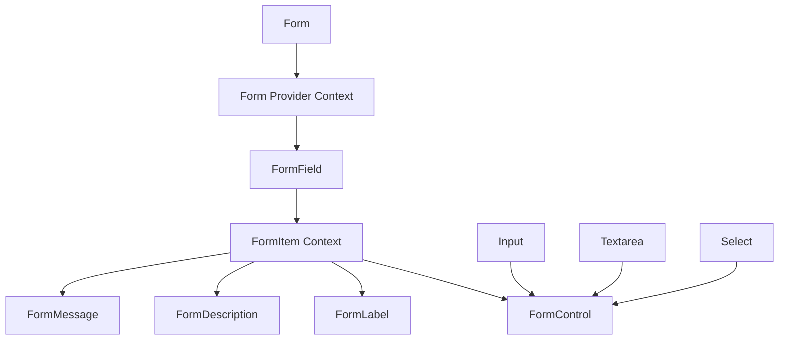
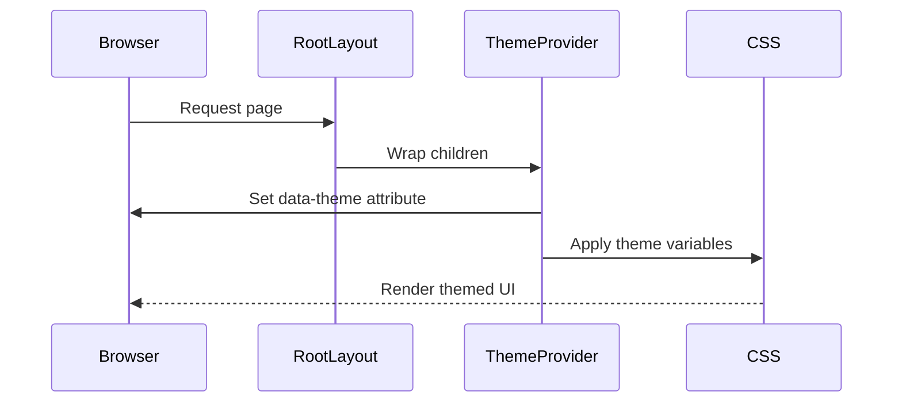
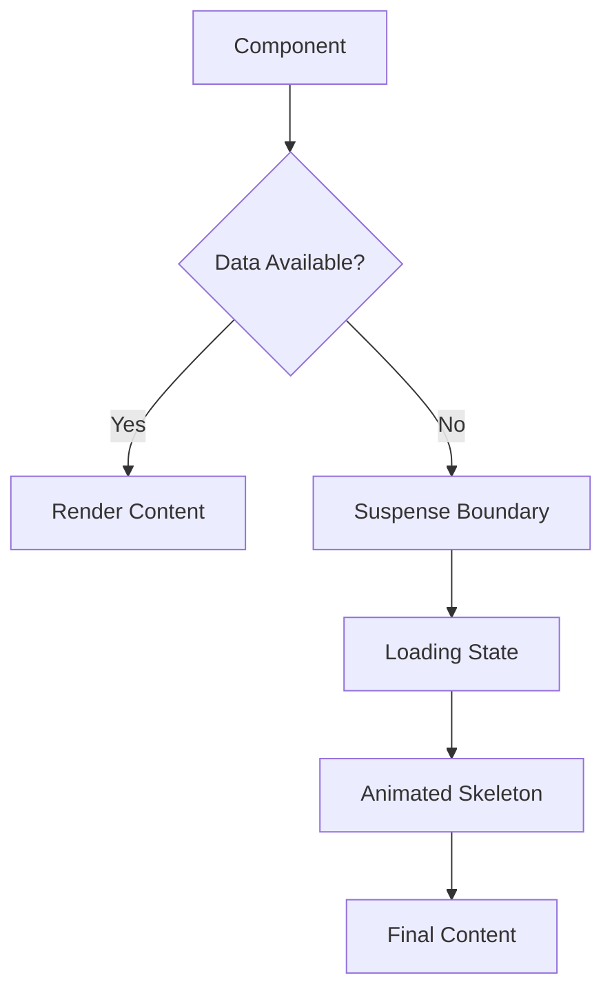

# Component Composition Model

<cite>
**Referenced Files in This Document **   
- [src/app/layout.tsx](file://src/app/layout.tsx)
- [src/app/app/layout.tsx](file://src/app/app/layout.tsx)
- [src/app/app/_Navbar.tsx](file://src/app/app/_Navbar.tsx)
- [src/app/app/_JobInfosGrid.tsx](file://src/app/app/_JobInfosGrid.tsx)
- [src/features/jobInfos/components/JobInfoForm.tsx](file://src/features/jobInfos/components/JobInfoForm.tsx)
- [src/components/ui/button.tsx](file://src/components/ui/button.tsx)
- [src/components/ui/form.tsx](file://src/components/ui/form.tsx)
- [src/components/ui/card.tsx](file://src/components/ui/card.tsx)
</cite>

## Table of Contents
1. [Introduction](#introduction)
2. [Layout Hierarchy and Root Components](#layout-hierarchy-and-root-components)
3. [Feature-Specific UI Components](#feature-specific-ui-components)
4. [Atomic UI Primitives and Design System](#atomic-ui-primitives-and-design-system)
5. [Composition Patterns](#composition-patterns)
6. [Theming and Styling Strategy](#theming-and-styling-strategy)
7. [Performance Optimizations](#performance-optimizations)
8. [Conclusion](#conclusion)

## Introduction
The Darasa application implements a layered component composition model that structures the user interface from high-level layout containers down to atomic UI primitives. This documentation details the architectural approach used to build reusable, accessible, and maintainable components across the application. The system leverages React's composition patterns, Next.js app directory features, and a design system built on Radix UI primitives with Tailwind CSS for styling.

## Layout Hierarchy and Root Components

The application follows a hierarchical layout structure starting from the root layout and progressing through nested route layouts. This creates a consistent UI shell while allowing for progressive enhancement at each level.



**Diagram sources **
- [src/app/layout.tsx](file://src/app/layout.tsx#L21-L43)
- [src/app/app/layout.tsx](file://src/app/app/layout.tsx)

**Section sources**
- [src/app/layout.tsx](file://src/app/layout.tsx#L21-L43)

## Feature-Specific UI Components

At the feature level, the application implements domain-specific components that encapsulate business logic and user interactions. These components sit between layout containers and atomic primitives, providing focused functionality for specific use cases.

### Job Information Management Components
The job information feature includes two primary UI components: `JobInfosGrid` for displaying multiple job entries and `JobInfoForm` for creating and editing job details. These components demonstrate the pattern of feature-specific composition using lower-level primitives.



**Diagram sources **
- [src/app/app/_JobInfosGrid.tsx](file://src/app/app/_JobInfosGrid.tsx#L44-L124)
- [src/features/jobInfos/components/JobInfoForm.tsx](file://src/features/jobInfos/components/JobInfoForm.tsx#L33-L164)

**Section sources**
- [src/app/app/_JobInfosGrid.tsx](file://src/app/app/_JobInfosGrid.tsx#L44-L124)
- [src/features/jobInfos/components/JobInfoForm.tsx](file://src/features/jobInfos/components/JobInfoForm.tsx#L33-L164)

## Atomic UI Primitives and Design System

The foundation of the component composition model is a library of atomic UI primitives located in `src/components/ui`. These components are built on top of Radix UI, providing accessible, unstyled base elements enhanced with Tailwind CSS classes and application-specific behaviors.

### Core Primitive Components
The design system includes essential form controls, interactive elements, and layout components that serve as building blocks throughout the application:



**Diagram sources **
- [src/components/ui/button.tsx](file://src/components/ui/button.tsx#L37-L56)
- [src/components/ui/form.tsx](file://src/components/ui/form.tsx)
- [src/components/ui/card.tsx](file://src/components/ui/card.tsx#L4-L15)

**Section sources**
- [src/components/ui/button.tsx](file://src/components/ui/button.tsx#L37-L56)
- [src/components/ui/form.tsx](file://src/components/ui/form.tsx)
- [src/components/ui/card.tsx](file://src/components/ui/card.tsx#L4-L15)

## Composition Patterns

The application employs several advanced React composition patterns to create flexible and reusable components while minimizing prop drilling and maximizing type safety.

### Compound Components Pattern
The form system implements a compound component pattern where `Form`, `FormField`, `FormItem`, `FormLabel`, `FormControl`, and `FormMessage` work together to create a cohesive form experience with shared context:



**Diagram sources **
- [src/components/ui/form.tsx](file://src/components/ui/form.tsx)

### Slot-Based Composition
Many components utilize the slot pattern via Radix UI's `Slot` component, allowing for flexible content composition while preserving event handling and refs:

```typescript
// Example pattern used throughout UI components
const Comp = asChild ? Slot : "button"
return <Comp className={cn(variants({ variant, size, className }))} {...props} />
```

This pattern enables components like `Button` to accept arbitrary children while maintaining consistent styling and behavior.

**Section sources**
- [src/components/ui/button.tsx](file://src/components/ui/button.tsx#L37-L56)

## Theming and Styling Strategy

The application implements a comprehensive theming strategy using `next-themes` for dark mode support and Tailwind CSS for utility-first styling. This creates a consistent visual language across all components.

### Theme Integration
The `ThemeProvider` from `next-themes` is applied at the root layout level, enabling theme persistence and system preference detection:



**Diagram sources **
- [src/app/layout.tsx](file://src/app/layout.tsx#L21-L43)

### Styling Architecture
The styling approach combines several techniques:
- **Tailwind CSS**: Utility classes for layout, spacing, and basic styling
- **Class Variance Authority (CVA)**: For creating variant-based component APIs
- **CSS Variables**: For theme colors and typography
- **Custom Utilities**: In `lib/utils.ts` for common class compositions

This layered approach ensures consistency while allowing for flexibility when needed.

**Section sources**
- [src/app/layout.tsx](file://src/app/layout.tsx#L21-L43)
- [src/lib/utils.ts](file://src/lib/utils.ts)

## Performance Optimizations

The component composition model incorporates several performance optimizations to ensure a responsive user experience, particularly in data-intensive views.

### Memoization and Re-rendering Control
Components use React hooks like `useMemo` and `useCallback` to prevent unnecessary re-renders:

```typescript
// Example from JobInfosGrid
const filteredJobInfos = useMemo(() => {
  const normalized = query.trim().toLowerCase();
  if (!normalized) return jobInfos;
  return jobInfos.filter(/* filtering logic */);
}, [jobInfos, query]);
```

This prevents expensive filtering operations on every render when the dependencies haven't changed.

### Suspense and Loading States
The application leverages React's concurrent features including Suspense boundaries and loading states to provide feedback during data fetching:



Components like `SuspendedItem` and `loading-swap` provide consistent loading experiences across the application.

**Section sources**
- [src/app/app/_JobInfosGrid.tsx](file://src/app/app/_JobInfosGrid.tsx#L44-L124)
- [src/components/ui/loading-swap.tsx](file://src/components/ui/loading-swap.tsx)

## Conclusion
The component composition model in Darasa demonstrates a well-structured approach to building React applications with clear separation of concerns. By organizing components into a hierarchy from layout containers to atomic primitives, the application achieves high reusability and maintainability. The design system based on Radix UI and Tailwind CSS ensures accessibility and visual consistency, while advanced composition patterns minimize prop drilling and enhance developer experience. Performance optimizations leverage React's modern features to create a smooth user experience even with complex data interactions.