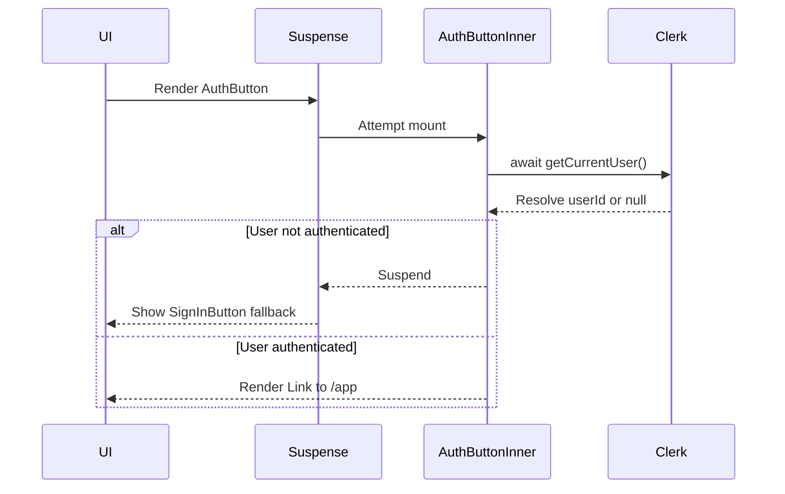
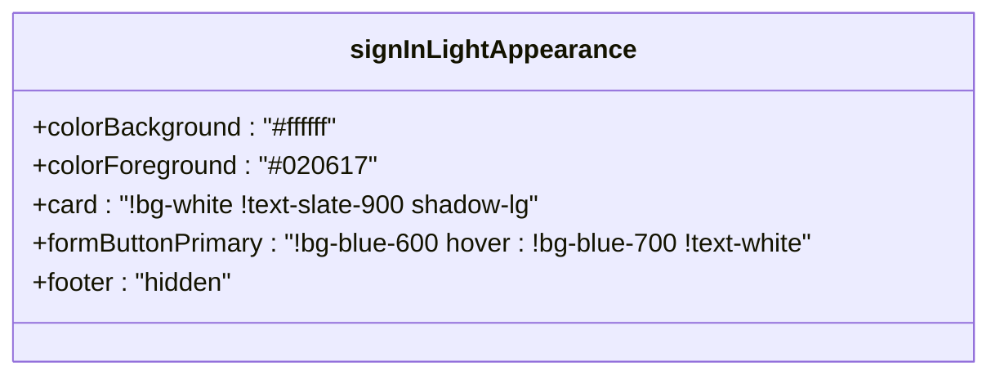
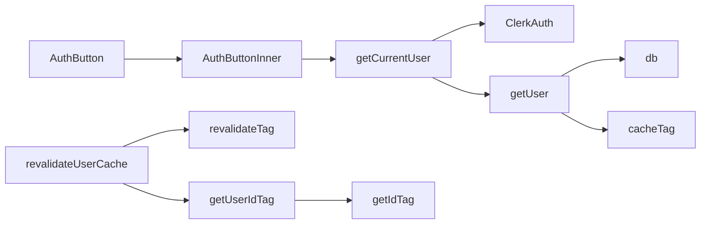

# Authentication-Integrated Components

<cite>
**Referenced Files in This Document**   
- [AuthButton.tsx](file://src/components/AuthButton.tsx)
- [signInAppearance.ts](file://src/services/clerk/lib/signInAppearance.ts)
- [getCurrentUser.ts](file://src/services/clerk/lib/getCurrentUser.ts)
- [dbCache.ts](file://src/features/users/dbCache.ts)
- [dataCache.ts](file://src/lib/dataCache.ts)
</cite>

## Table of Contents
1. [Introduction](#introduction)
2. [Core Components](#core-components)
3. [Architecture Overview](#architecture-overview)
4. [Detailed Component Analysis](#detailed-component-analysis)
5. [Dependency Analysis](#dependency-analysis)
6. [Performance Considerations](#performance-considerations)
7. [Troubleshooting Guide](#troubleshooting-guide)
8. [Conclusion](#conclusion)

## Introduction
This document provides a comprehensive analysis of authentication-aware UI components within the application, using `AuthButton` as a case study. It explores how React Suspense and fallback rendering are leveraged to manage asynchronous authentication state resolution via Clerk. The integration with Clerk’s authentication flow, theming consistency, redirect logic, and security considerations are examined in depth. Additionally, performance optimization strategies and extensibility patterns for auth-gated components are discussed.

## Core Components

The primary component under analysis is `AuthButton`, which serves as a reusable, authentication-intelligent button that dynamically renders either a sign-in prompt or a navigation link based on the user's authentication status. It relies on Clerk’s server-side authentication utilities and employs React Suspense to handle loading states during authentication resolution.

**Section sources**
- [AuthButton.tsx](file://src/components/AuthButton.tsx#L1-L70)

## Architecture Overview

```mermaid
graph TD
A[AuthButton] --> B[Suspense]
B --> C[fallback: SignInButton]
B --> D[AuthButtonInner]
D --> E[getCurrentUser]
E --> F[Clerk auth()]
D --> G{userId exists?}
G --> |Yes| H[Link to /app]
G --> |No| I[SignInButton with redirect]
```

**Diagram sources**
- [AuthButton.tsx](file://src/components/AuthButton.tsx#L20-L69)
- [getCurrentUser.ts](file://src/services/clerk/lib/getCurrentUser.ts#L7-L15)

## Detailed Component Analysis

### AuthButton Implementation

The `AuthButton` component wraps its inner logic with `Suspense` to gracefully handle the asynchronous nature of authentication state retrieval. During initial render, when the authentication state is not yet resolved, the fallback UI displays a styled `SignInButton`.

#### Suspense and Fallback Rendering
React Suspense enables declarative handling of pending promises. In this context, `AuthButtonInner` performs an async operation (`getCurrentUser`) that may suspend, triggering the fallback until resolution.



**Diagram sources**
- [AuthButton.tsx](file://src/components/AuthButton.tsx#L20-L44)

#### AuthButtonInner Logic
`AuthButtonInner` is an async server component that determines whether the user is authenticated by calling `getCurrentUser`. If no `userId` is present, it returns a `SignInButton`; otherwise, it renders a `Link` to `/app`.

This pattern ensures that sensitive routes remain inaccessible until authentication completes, while maintaining SSR compatibility through server-side evaluation of auth state.

**Section sources**
- [AuthButton.tsx](file://src/components/AuthButton.tsx#L46-L69)
- [getCurrentUser.ts](file://src/services/clerk/lib/getCurrentUser.ts#L7-L15)

### Theming and Appearance Customization

To maintain visual consistency across authentication flows—especially in dark mode—the component uses a predefined light-themed appearance configuration via `signInLightAppearance`.

#### signInLightAppearance Configuration
This object enforces a white background and readable text colors regardless of the global theme, ensuring sign-in modals remain accessible and consistent.

Key styling decisions include:
- Forced white backgrounds (`!bg-white`)
- High-contrast text (`!text-slate-900`)
- Hidden footer actions to streamline UX
- Shadowed card elements for depth perception



**Diagram sources**
- [signInAppearance.ts](file://src/services/clerk/lib/signInAppearance.ts#L3-L35)

**Section sources**
- [signInAppearance.ts](file://src/services/clerk/lib/signInAppearance.ts#L3-L35)

### Redirect Logic and Navigation Flow

The `forceRedirectUrl='/app'` prop ensures users are redirected to the application dashboard after successful sign-in. This prevents open redirect vulnerabilities by hardcoding trusted destinations.

Additionally, post-authentication navigation uses Next.js `Link`, enabling client-side routing without full page reloads once inside protected areas.

**Section sources**
- [AuthButton.tsx](file://src/components/AuthButton.tsx#L25-L27)
- [AuthButton.tsx](file://src/components/AuthButton.tsx#L54-L56)

## Dependency Analysis



**Diagram sources**
- [AuthButton.tsx](file://src/components/AuthButton.tsx#L1-L70)
- [getCurrentUser.ts](file://src/services/clerk/lib/getCurrentUser.ts#L7-L24)
- [dbCache.ts](file://src/features/users/dbCache.ts#L7-L14)
- [dataCache.ts](file://src/lib/dataCache.ts#L2-L16)

**Section sources**
- [getCurrentUser.ts](file://src/services/clerk/lib/getCurrentUser.ts#L7-L24)
- [dbCache.ts](file://src/features/users/dbCache.ts#L7-L14)
- [dataCache.ts](file://src/lib/dataCache.ts#L2-L16)

## Performance Considerations

### Code Splitting and Lazy Loading
While `AuthButton` itself is lightweight, integrating code splitting for larger auth-related UIs (e.g., full sign-up modals) can reduce initial bundle size. Dynamic imports with `next/dynamic` are recommended for non-critical authentication components.

### Minimizing Waterfall Requests
Authentication state resolution should occur early in the request lifecycle. By leveraging Clerk’s server-side `auth()` function during rendering, the app avoids additional client-side API calls, reducing waterfall delays.

### Caching Strategy
The `getCurrentUser` function integrates with Next.js caching via `cacheTag` and `revalidateTag`, allowing efficient invalidation upon user data changes. Cache tags follow a structured naming convention (`id:${id}:users`) for precise revalidation control.

**Section sources**
- [getCurrentUser.ts](file://src/services/clerk/lib/getCurrentUser.ts#L10-L15)
- [dbCache.ts](file://src/features/users/dbCache.ts#L11-L14)
- [dataCache.ts](file://src/lib/dataCache.ts#L2-L16)

## Troubleshooting Guide

### Handling Edge Cases

#### Session Expiration
When sessions expire mid-session, `getCurrentUser` will return `null` for `userId`. The component automatically falls back to the sign-in flow, ensuring secure access enforcement.

#### Race Conditions During Mount
Due to server-side rendering, there is minimal risk of race conditions. However, if hydration mismatches occur (e.g., cached vs actual auth state), ensure proper cache tagging and revalidation hooks are triggered post-login/logout.

#### SSR Compatibility
All authentication checks use `@clerk/nextjs/server`, which supports SSR natively. Avoid using client-only auth hooks in server components to prevent hydration errors.

### Security Considerations

- **Redirect Validation**: Hardcoded `forceRedirectUrl="/app"` mitigates open redirect risks.
- **Phishing Prevention**: Consistent theming reduces spoofing opportunities; users recognize official login interfaces.
- **Token Exposure**: Authentication tokens are handled entirely by Clerk and never exposed to frontend JavaScript, minimizing XSS attack surface.

**Section sources**
- [AuthButton.tsx](file://src/components/AuthButton.tsx#L25-L27)
- [getCurrentUser.ts](file://src/services/clerk/lib/getCurrentUser.ts#L7-L15)

## Conclusion

The `AuthButton` component exemplifies a robust pattern for building authentication-aware UIs in Next.js applications integrated with Clerk. By combining Suspense for loading states, server-side auth resolution, and consistent theming, it delivers a seamless and secure user experience. This approach can be extended to other gated components such as `AuthLayout`, `ProtectedRoute`, or feature-specific controls like `UpgradeButton`, ensuring uniform behavior across the application.