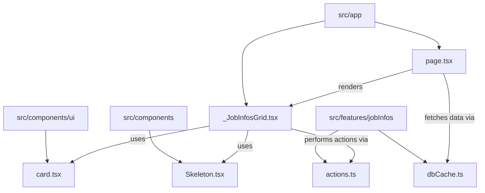
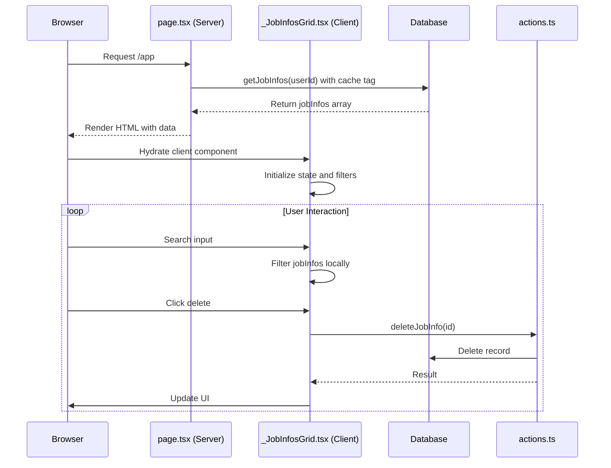
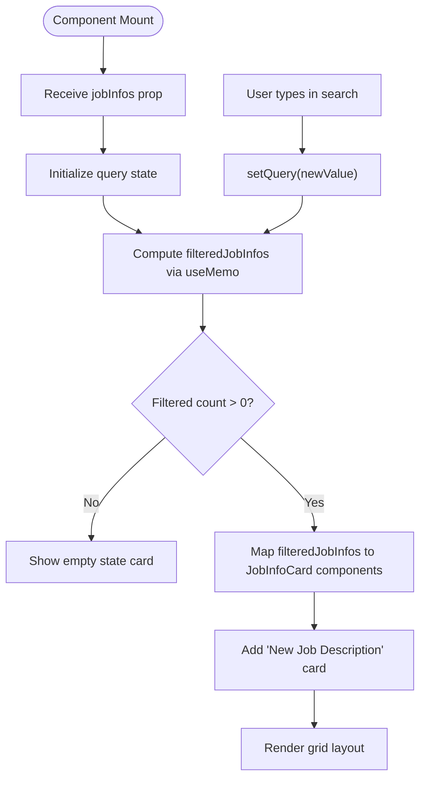
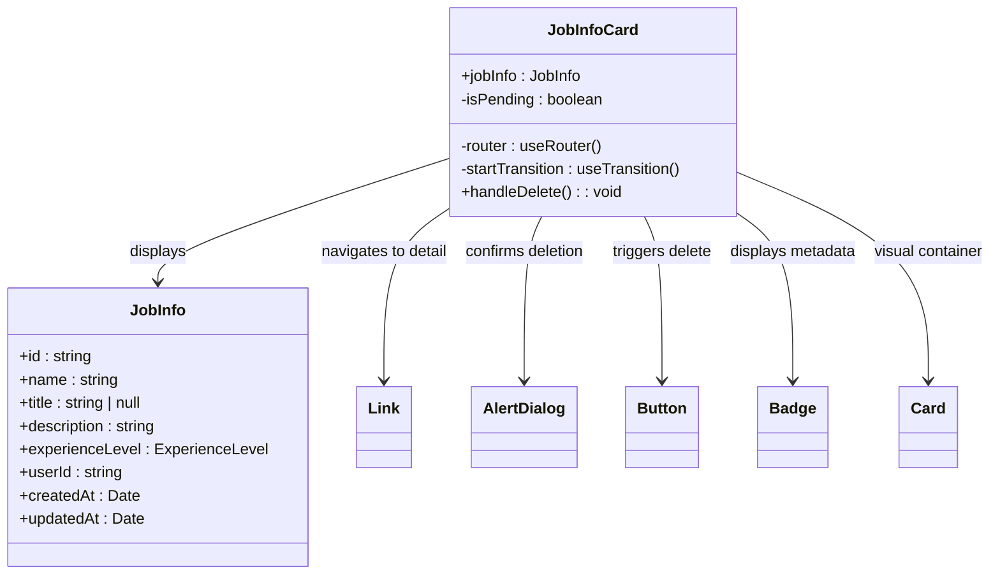
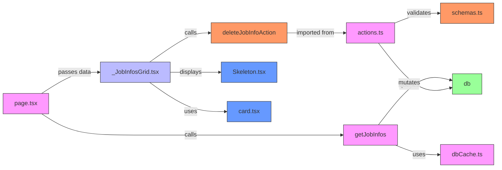

# Collection Display Components

<cite>
**Referenced Files in This Document**  
- [_JobInfosGrid.tsx](file://src/app/_JobInfosGrid.tsx)
- [page.tsx](file://src/app/page.tsx)
- [dbCache.ts](file://src/features/jobInfos/dbCache.ts)
- [actions.ts](file://src/features/jobInfos/actions.ts)
- [Skeleton.tsx](file://src/components/Skeleton.tsx)
- [card.tsx](file://src/components/ui/card.tsx)
- [formatters.ts](file://src/features/jobInfos/lib/formatters.ts)
</cite>

## Table of Contents
1. [Introduction](#introduction)
2. [Project Structure](#project-structure)
3. [Core Components](#core-components)
4. [Architecture Overview](#architecture-overview)
5. [Detailed Component Analysis](#detailed-component-analysis)
6. [Dependency Analysis](#dependency-analysis)
7. [Performance Considerations](#performance-considerations)
8. [Troubleshooting Guide](#troubleshooting-guide)
9. [Conclusion](#conclusion)

## Introduction
This document provides comprehensive documentation for collection display patterns in the Darasa application, with a focus on the `_JobInfosGrid` component as a representative example. The analysis covers data fetching strategies, rendering patterns, responsive design implementation, and performance optimization techniques used to display multiple JobInfo entities in a grid layout. The documentation details how server-side data retrieval integrates with client-side interactivity, search functionality, and navigation patterns within the Next.js application architecture.

## Project Structure
The `_JobInfosGrid` component resides in the main application directory (`src/app/`) and serves as a central UI element for displaying job information collections. It is integrated into the primary application page and works in conjunction with data access layers in the `features/jobInfos` directory. The component leverages UI primitives from the `components/ui` library and interacts with backend services through action functions defined in feature modules.

**Diagram sources**
- [src/app/_JobInfosGrid.tsx](file://src/app/_JobInfosGrid.tsx)
- [src/app/page.tsx](file://src/app/page.tsx)
- [src/features/jobInfos/dbCache.ts](file://src/features/jobInfos/dbCache.ts)
- [src/features/jobInfos/actions.ts](file://src/features/jobInfos/actions.ts)
- [src/components/Skeleton.tsx](file://src/components/Skeleton.tsx)
- [src/components/ui/card.tsx](file://src/components/ui/card.tsx)

**Section sources**
- [src/app/_JobInfosGrid.tsx](file://src/app/_JobInfosGrid.tsx)
- [src/app/page.tsx](file://src/app/page.tsx)

## Core Components
The `_JobInfosGrid` component implements a collection display pattern for JobInfo entities, providing a responsive grid layout with search functionality, item cards, and creation affordances. It receives pre-fetched job information data as a prop and manages client-side state for filtering and interaction. Each job item is rendered using the `JobInfoCard` subcomponent, which encapsulates individual item presentation and deletion workflow. The component integrates with Next.js routing through the `Link` component for navigation to specific job details or creation interfaces.

**Section sources**
- [src/app/_JobInfosGrid.tsx](file://src/app/_JobInfosGrid.tsx)

## Architecture Overview
The collection display architecture follows a hybrid server-client pattern where data is fetched server-side but interactive features are handled client-side. The parent `page.tsx` component performs server-side data retrieval using cached database queries, then passes the data to the client component. This approach optimizes initial load performance while maintaining rich client interactivity. The architecture separates concerns between data access (server components), presentation (client components), and business logic (feature actions).

**Diagram sources**
- [src/app/page.tsx](file://src/app/page.tsx)
- [src/app/_JobInfosGrid.tsx](file://src/app/_JobInfosGrid.tsx)
- [src/features/jobInfos/actions.ts](file://src/features/jobInfos/actions.ts)

## Detailed Component Analysis

### _JobInfosGrid Analysis
The `_JobInfosGrid` component implements a comprehensive collection display interface with search, filtering, and creation capabilities. It renders job information in a responsive grid that adapts from single-column on mobile to dual-column on medium screens and above. The component includes a prominent "Create Job Description" option both as a standalone card and as a button, ensuring discoverability across different viewport sizes.

#### Data Flow and State Management

**Diagram sources**
- [src/app/_JobInfosGrid.tsx](file://src/app/_JobInfosGrid.tsx)

#### JobInfoCard Implementation
The `JobInfoCard` component provides a consistent presentation layer for individual job information items, featuring title, description preview, metadata badges, and interactive elements.

**Diagram sources**
- [src/app/_JobInfosGrid.tsx](file://src/app/_JobInfosGrid.tsx)
- [src/drizzle/schema.ts](file://src/drizzle/schema.ts)

**Section sources**
- [src/app/_JobInfosGrid.tsx](file://src/app/_JobInfosGrid.tsx)

## Dependency Analysis
The collection display system demonstrates a well-structured dependency graph with clear separation between server and client responsibilities. Server components handle data retrieval with caching, while client components manage presentation and user interaction. Action functions encapsulate business logic and data mutations, maintaining loose coupling between UI and persistence layers.

**Diagram sources**
- [src/app/page.tsx](file://src/app/page.tsx)
- [src/app/_JobInfosGrid.tsx](file://src/app/_JobInfosGrid.tsx)
- [src/features/jobInfos/dbCache.ts](file://src/features/jobInfos/dbCache.ts)
- [src/features/jobInfos/actions.ts](file://src/features/jobInfos/actions.ts)
- [src/components/Skeleton.tsx](file://src/components/Skeleton.tsx)
- [src/components/ui/card.tsx](file://src/components/ui/card.tsx)

**Section sources**
- [src/app/page.tsx](file://src/app/page.tsx)
- [src/app/_JobInfosGrid.tsx](file://src/app/_JobInfosGrid.tsx)
- [src/features/jobInfos/dbCache.ts](file://src/features/jobInfos/dbCache.ts)
- [src/features/jobInfos/actions.ts](file://src/features/jobInfos/actions.ts)

## Performance Considerations
The collection display implementation incorporates several performance optimizations:

1. **Server-Side Data Fetching**: Data is retrieved server-side with caching enabled through `cacheTag`, reducing database load and improving response times for subsequent requests.

2. **Client-Side Filtering**: Search and filtering operations are performed client-side using `useMemo`, avoiding additional network requests when users modify search queries.

3. **Progressive Hydration**: The main page uses `Suspense` with a loading fallback, providing immediate feedback during hydration while the client component initializes.

4. **Optimized Rendering**: The grid uses React's `key` prop with stable identifiers and leverages Tailwind's JIT compilation for efficient CSS generation.

5. **Conditional Loading States**: Skeleton components provide visual feedback during asynchronous operations without blocking the main thread.

The current implementation does not include virtualization for large collections, which could become a performance consideration if the number of job descriptions grows significantly. For such cases, implementing windowing libraries like `react-window` would be recommended to maintain smooth scrolling performance.

## Troubleshooting Guide
Common issues with the collection display components and their solutions:

**Data Not Appearing**
- Verify the user has associated job information records in the database
- Check that `getJobInfoUserTag` is correctly generating cache tags
- Ensure the server component has proper authentication context from `getCurrentUser`

**Search Functionality Not Working**
- Confirm the search filter logic correctly handles null/undefined values in jobInfo fields
- Verify the `useMemo` dependency array includes both `jobInfos` and `query`
- Check that case-insensitive comparison is properly implemented

**Deletion Workflow Issues**
- Ensure the `deleteJobInfoAction` server function properly validates user permissions
- Verify the `revalidateJobInfoCache` function is called after successful deletion
- Check that router refresh or redirect behavior works correctly in all scenarios

**Responsive Layout Problems**
- Validate Tailwind's breakpoint classes (`sm:`, `md:`, `lg:`) are correctly applied
- Ensure the grid container has proper width constraints at different breakpoints
- Test on actual devices to confirm touch interactions work as expected

**Accessibility Concerns**
- Verify all interactive elements have appropriate ARIA labels
- Ensure keyboard navigation works through tab order and focus states
- Confirm screen reader announcements for dynamic content updates

**Section sources**
- [src/app/_JobInfosGrid.tsx](file://src/app/_JobInfosGrid.tsx)
- [src/app/page.tsx](file://src/app/page.tsx)
- [src/features/jobInfos/actions.ts](file://src/features/jobInfos/actions.ts)
- [src/components/Skeleton.tsx](file://src/components/Skeleton.tsx)

## Conclusion
The `_JobInfosGrid` component exemplifies effective collection display patterns in modern Next.js applications, combining server-side data fetching with rich client-side interactivity. Its implementation demonstrates best practices in component architecture, state management, and performance optimization. The separation of concerns between data access, presentation, and business logic creates a maintainable and extensible foundation. Future enhancements could include virtualization for large datasets, improved accessibility features, and enhanced animation transitions. The current architecture provides a solid base for scaling the collection display functionality across other entity types within the application.