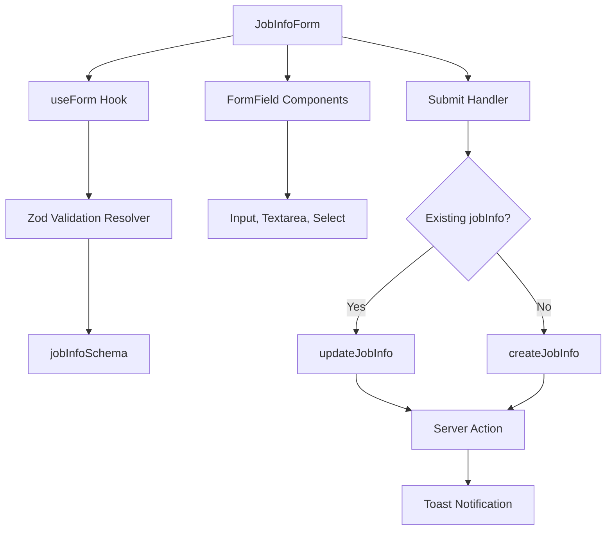
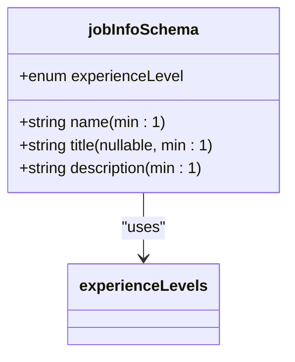
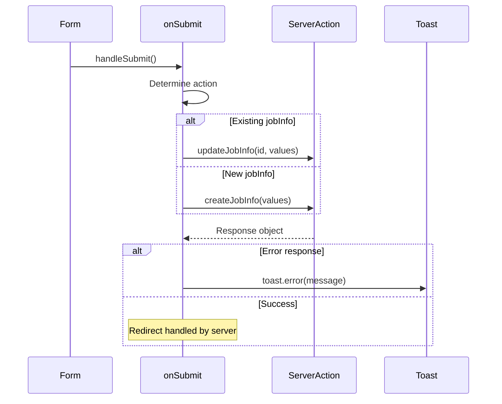
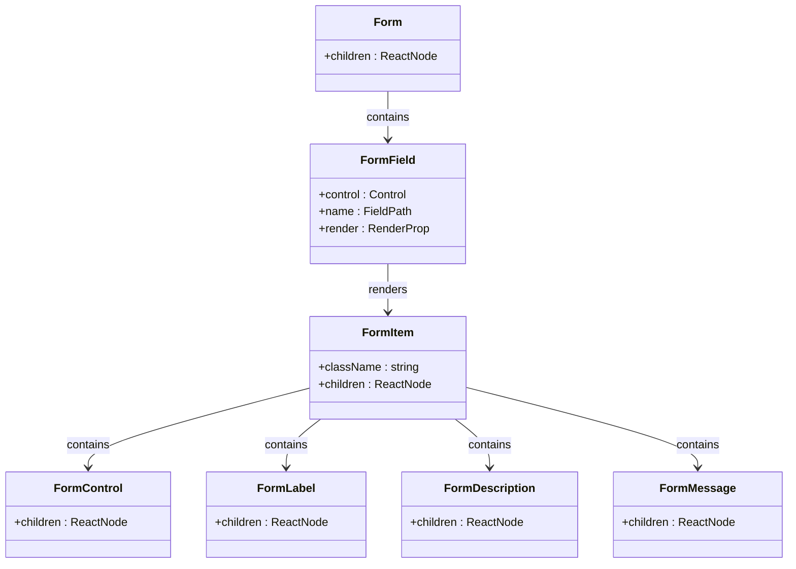
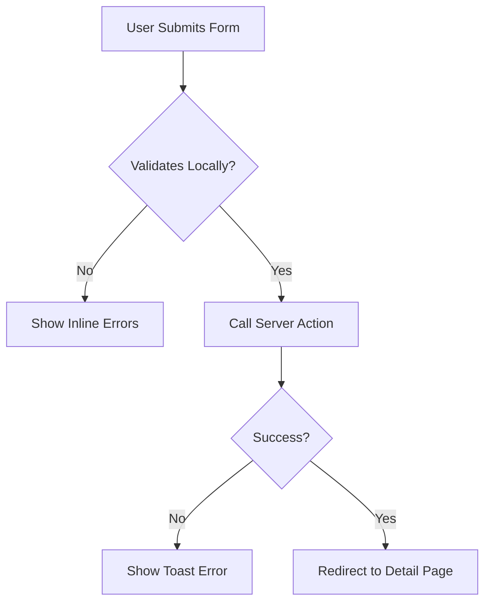

# Data-Driven Forms

<cite>
**Referenced Files in This Document**
- [JobInfoForm.tsx](file://src/features/jobInfos/components/JobInfoForm.tsx)
- [schemas.ts](file://src/features/jobInfos/schemas.ts)
- [actions.ts](file://src/features/jobInfos/actions.ts)
- [form.tsx](file://src/components/ui/form.tsx)
- [jobinfo.ts](file://src/drizzle/schema/jobinfo.ts)
- [formatters.ts](file://src/features/jobInfos/lib/formatters.ts)
- [loading-swap.tsx](file://src/components/ui/loading-swap.tsx)
</cite>

## Table of Contents
1. [Introduction](#introduction)
2. [Core Components](#core-components)
3. [Validation Schema with Zod](#validation-schema-with-zod)
4. [Form State Management with react-hook-form](#form-state-management-with-react-hook-form)
5. [Server Action Binding and Submission Handling](#server-action-binding-and-submission-handling)
6. [Handling Nullable Inputs and Controlled Behavior](#handling-nullable-inputs-and-controlled-behavior)
7. [Responsive Layout with Tailwind CSS Grids](#responsive-layout-with-tailwind-css-grids)
8. [UI Component Integration: Form, FormField, FormItem](#ui-component-integration-form-formfield-formitem)
9. [Error Handling and User Feedback](#error-handling-and-user-feedback)
10. [Performance Considerations and Re-render Optimization](#performance-considerations-and-re-render-optimization)

## Introduction
This document provides a comprehensive analysis of the data-driven form implementation in the darasa application, using `JobInfoForm` as the primary example. It details how React Hook Form and Zod are used together to create type-safe, validated forms that bind seamlessly to server actions. The documentation covers initialization patterns, validation logic, submission workflows, responsive design strategies, and performance optimizations.

## Core Components

The `JobInfoForm` component serves as the central example for demonstrating data-driven form patterns in the application. It integrates client-side form state management with server-side actions through a clean, reusable architecture. The form supports both creation and editing modes by conditionally binding to either `createJobInfo` or `updateJobInfo` server actions based on the presence of existing data.

**Diagram sources**
- [JobInfoForm.tsx](file://src/features/jobInfos/components/JobInfoForm.tsx#L33-L164)
- [schemas.ts](file://src/features/jobInfos/schemas.ts#L3-L8)
- [actions.ts](file://src/features/jobInfos/actions.ts#L17-L70)

**Section sources**
- [JobInfoForm.tsx](file://src/features/jobInfos/components/JobInfoForm.tsx#L1-L165)
- [schemas.ts](file://src/features/jobInfos/schemas.ts#L1-L9)

## Validation Schema with Zod

The `jobInfoSchema` defined in `schemas.ts` establishes a type-safe contract for form data validation. It uses Zod to define required fields, optional nullable values, and enumerated types. The schema ensures that all submitted data meets strict criteria before being processed by server actions.

Key aspects:
- `name` and `description` are required strings
- `title` is a nullable string field, allowing optional input
- `experienceLevel` uses an enum derived from database schema constants
- Each field includes appropriate validation rules (e.g., minimum length)

The integration with `react-hook-form` via `zodResolver` enables automatic type inference throughout the component, providing compile-time safety and eliminating manual validation logic.

**Diagram sources**
- [schemas.ts](file://src/features/jobInfos/schemas.ts#L3-L8)
- [jobinfo.ts](file://src/drizzle/schema/jobinfo.ts#L2-L5)

**Section sources**
- [schemas.ts](file://src/features/jobInfos/schemas.ts#L1-L9)

## Form State Management with react-hook-form

The `useForm` hook from `react-hook-form` manages the entire form state lifecycle. It is initialized with the Zod resolver and default values derived from the optional `jobInfo` prop. When editing an existing record, the form is pre-populated; otherwise, it starts with empty defaults.

Type inference through `z.infer<typeof jobInfoSchema>` ensures complete type alignment between the schema, form state, and submission handler. This eliminates type casting and reduces potential runtime errors.

The form tracks various states including `isSubmitting`, which is used to disable the submit button during processing and trigger loading indicators.

**Section sources**
- [JobInfoForm.tsx](file://src/features/jobInfos/components/JobInfoForm.tsx#L33-L45)

## Server Action Binding and Submission Handling

Form submission is handled through a dynamic action binding pattern. The `onSubmit` function determines whether to use `createJobInfo` or `updateJobInfo` based on the presence of an existing `jobInfo` object. This approach enables a single form component to serve dual purposes without code duplication.

Server actions are bound using `.bind()` to pre-fill the ID parameter when updating records. After submission, any errors are surfaced via toast notifications using the `sonner` library, while successful operations result in redirects managed by Next.js.

**Diagram sources**
- [JobInfoForm.tsx](file://src/features/jobInfos/components/JobInfoForm.tsx#L47-L60)
- [actions.ts](file://src/features/jobInfos/actions.ts#L17-L70)

**Section sources**
- [JobInfoForm.tsx](file://src/features/jobInfos/components/JobInfoForm.tsx#L47-L60)
- [actions.ts](file://src/features/jobInfos/actions.ts#L17-L70)

## Handling Nullable Inputs and Controlled Behavior

Nullable fields like `title` require special handling to maintain proper controlled component behavior. The `Input` component receives both `value` and `onChange` props that explicitly manage nullability:

- `value` is set to an empty string if the field value is null
- `onChange` converts empty string inputs back to null values

This pattern ensures consistent data representation while preserving user experience. It prevents uncontrolled-to-controlled transitions and maintains accurate form state throughout interaction cycles.

**Section sources**
- [JobInfoForm.tsx](file://src/features/jobInfos/components/JobInfoForm.tsx#L78-L88)

## Responsive Layout with Tailwind CSS Grids

The form employs a responsive grid layout using Tailwind CSS's `grid-cols` utilities. On small screens, all fields stack vertically; on large screens (`lg:` breakpoint), related fields align side-by-side in a two-column layout.

The `gap-4` spacing and `items-start` alignment ensure visual consistency across devices. This mobile-first approach enhances usability while maintaining information hierarchy and reducing cognitive load.

**Section sources**
- [JobInfoForm.tsx](file://src/features/jobInfos/components/JobInfoForm.tsx#L75-L77)

## UI Component Integration: Form, FormField, FormItem

The form leverages a structured component hierarchy from the UI library:
- `Form`: Root provider component that connects to `react-hook-form`
- `FormField`: Connects individual fields to the form context using `Controller`
- `FormItem`: Wrapper that provides contextual styling and layout
- `FormLabel`, `FormControl`, `FormDescription`, `FormMessage`: Accessory components for labeling and validation feedback

Each `FormField` uses render props to access field state (`field`) and applies it correctly to underlying input components. This abstraction simplifies integration while ensuring accessibility compliance.

**Diagram sources**
- [form.tsx](file://src/components/ui/form.tsx#L31-L87)
- [JobInfoForm.tsx](file://src/features/jobInfos/components/JobInfoForm.tsx#L33-L164)

**Section sources**
- [form.tsx](file://src/components/ui/form.tsx#L1-L167)

## Error Handling and User Feedback

Error handling occurs at multiple levels:
- Client-side: Immediate validation feedback via `FormMessage` components
- Server-side: Action responses with error flags trigger toast notifications
- Accessibility: ARIA attributes communicate validation states to assistive technologies

The `LoadingSwap` component provides visual feedback during submission by conditionally displaying either the button text or a spinning loader icon based on `form.formState.isSubmitting`. This prevents duplicate submissions and improves perceived responsiveness.

**Diagram sources**
- [JobInfoForm.tsx](file://src/features/jobInfos/components/JobInfoForm.tsx#L47-L60)
- [loading-swap.tsx](file://src/components/ui/loading-swap.tsx#L4-L37)

**Section sources**
- [JobInfoForm.tsx](file://src/features/jobInfos/components/JobInfoForm.tsx#L55-L58)
- [loading-swap.tsx](file://src/components/ui/loading-swap.tsx#L1-L37)

## Performance Considerations and Re-render Optimization

The implementation minimizes unnecessary re-renders through several strategies:
- Using `React.useCallback` internally within `react-hook-form` hooks
- Avoiding inline object/function creation in render props where possible
- Leveraging memoized components from the UI library
- Proper separation of concerns between presentation and logic

While some render prop patterns may cause suboptimal re-renders, the overall impact is mitigated by the relatively shallow component tree and infrequent updates typical of form interactions. The use of granular `FormItem` wrappers helps contain re-render propagation.

**Section sources**
- [JobInfoForm.tsx](file://src/features/jobInfos/components/JobInfoForm.tsx#L33-L164)
- [form.tsx](file://src/components/ui/form.tsx#L1-L167)