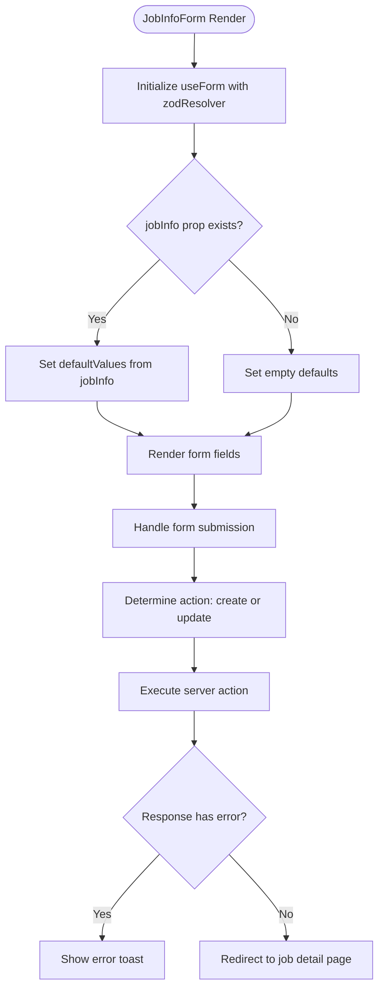
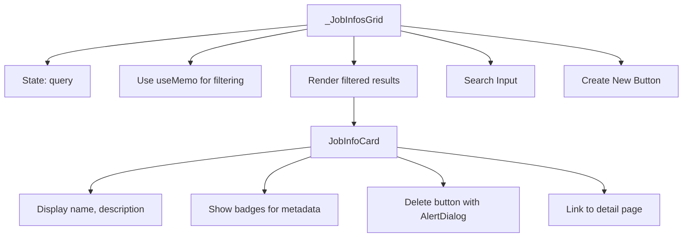
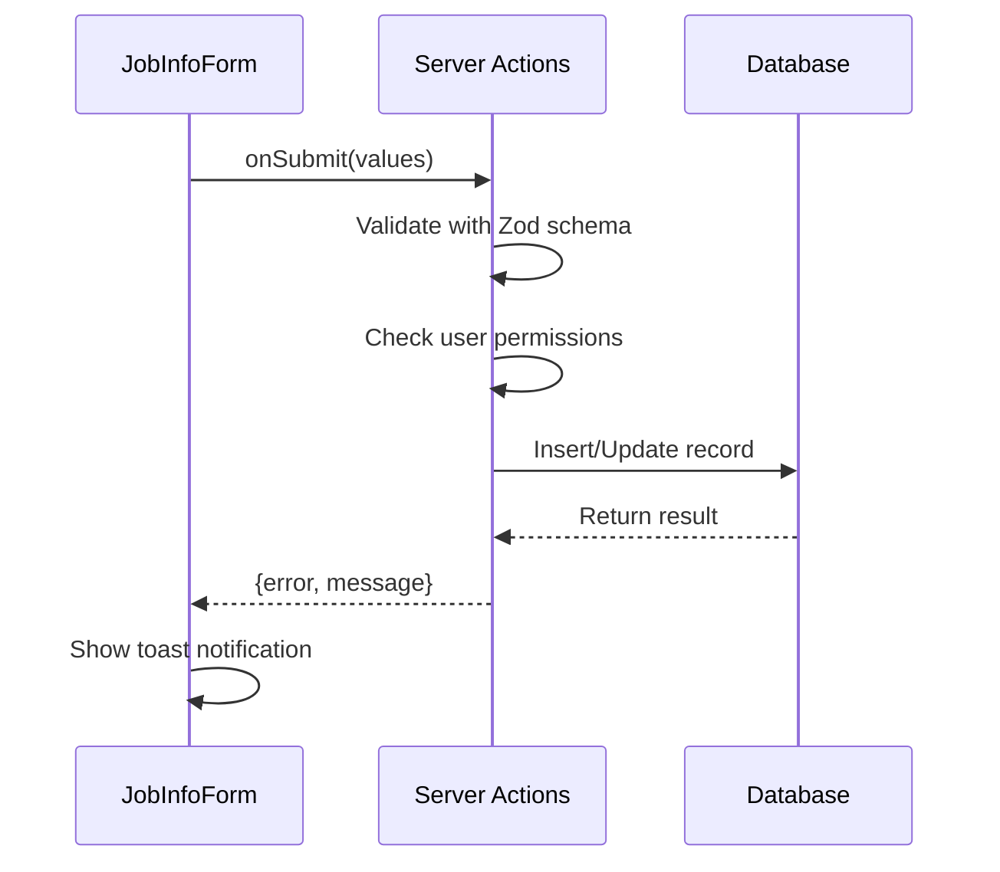
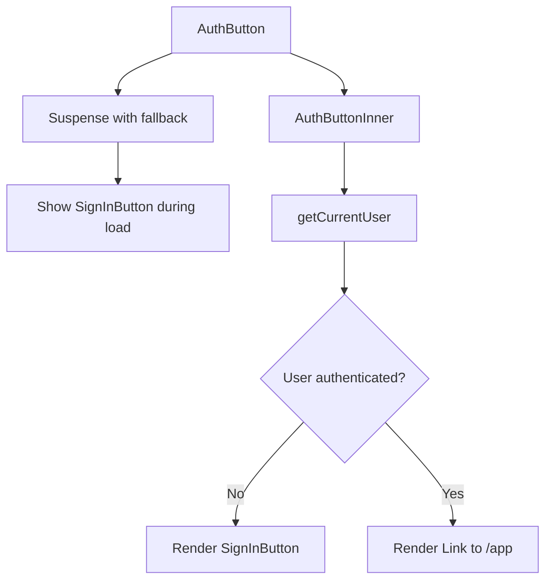

# Feature Component Patterns

<cite>
**Referenced Files in This Document**  
- [JobInfoForm.tsx](file://src/features/jobInfos/components/JobInfoForm.tsx)
- [_JobInfosGrid.tsx](file://src/app/app/_JobInfosGrid.tsx)
- [AuthButton.tsx](file://src/components/AuthButton.tsx)
- [schemas.ts](file://src/features/jobInfos/schemas.ts)
- [actions.ts](file://src/features/jobInfos/actions.ts)
- [loading-swap.tsx](file://src/components/ui/loading-swap.tsx)
</cite>

## Table of Contents
1. [Introduction](#introduction)
2. [Core Component Analysis](#core-component-analysis)
3. [Data Flow and Mutation Handling](#data-flow-and-mutation-handling)
4. [UI State Management Patterns](#ui-state-management-patterns)
5. [Permission-Aware Rendering](#permission-aware-rendering)
6. [Component Composition Strategy](#component-composition-strategy)
7. [Conclusion](#conclusion)

## Introduction

This document analyzes feature-specific component patterns in the darasa application, focusing on data-driven form components and collection display systems. The analysis centers on `JobInfoForm` as a representative example of a modern React component pattern that combines react-hook-form with Zod validation and server actions for mutation handling. Additionally, it examines `_JobInfosGrid` for its role in displaying collections with responsive layout and routing behavior. Key architectural patterns such as error toast integration, loading state management, and permission-aware rendering are documented to establish best practices for component development within the codebase.

## Core Component Analysis

### JobInfoForm: Data-Driven Form Pattern

The `JobInfoForm` component exemplifies a sophisticated data-driven form implementation that leverages several modern React patterns. As a client-side component, it integrates react-hook-form for efficient form state management and Zod for robust type-safe validation. The form supports both creation and editing workflows through conditional logic that determines whether to invoke `createJobInfo` or `updateJobInfo` actions based on the presence of existing job information.



**Diagram sources**
- [JobInfoForm.tsx](file://src/features/jobInfos/components/JobInfoForm.tsx#L33-L164)

**Section sources**
- [JobInfoForm.tsx](file://src/features/jobInfos/components/JobInfoForm.tsx#L1-L165)
- [schemas.ts](file://src/features/jobInfos/schemas.ts#L1-L9)
- [actions.ts](file://src/features/jobInfos/actions.ts#L1-L122)

### _JobInfosGrid: Collection Display Pattern

The `_JobInfosGrid` component implements a responsive grid layout for displaying job information collections with integrated search functionality and deletion capabilities. It employs React's `useMemo` hook to efficiently filter job listings based on user input, ensuring optimal performance even with larger datasets. The component features a hover effect system that reduces opacity of non-hovered items, creating a focused interaction experience.

Each job listing is rendered as a card component that displays key information including name, description, experience level, and optional job title. The grid includes a dedicated "Create New" card that maintains visual consistency while serving as an interactive entry point for new job information creation.



**Diagram sources**
- [_JobInfosGrid.tsx](file://src/app/app/_JobInfosGrid.tsx#L1-L231)

**Section sources**
- [_JobInfosGrid.tsx](file://src/app/app/_JobInfosGrid.tsx#L1-L231)

## Data Flow and Mutation Handling

### Server Action Integration

The component architecture demonstrates a clean separation between client-side presentation and server-side business logic through the use of Next.js server actions. The `JobInfoForm` component abstracts mutation logic into reusable actions defined in `actions.ts`, which handle both creation and updating of job information records. This pattern ensures that sensitive database operations occur on the server, maintaining security while providing a seamless user experience.



**Diagram sources**
- [JobInfoForm.tsx](file://src/features/jobInfos/components/JobInfoForm.tsx#L33-L164)
- [actions.ts](file://src/features/jobInfos/actions.ts#L1-L122)

**Section sources**
- [actions.ts](file://src/features/jobInfos/actions.ts#L1-L122)

### Error Handling and User Feedback

The application implements a consistent error handling strategy using toast notifications powered by the Sonner library. When server actions encounter validation errors or permission issues, they return structured error objects that the client components transform into user-friendly notifications. This pattern provides immediate feedback while maintaining a non-intrusive user experience.

The error flow follows a standardized pattern:
1. Server action validates input and permissions
2. On failure, returns `{ error: true, message: string }`
3. Client component detects error response
4. Displays toast notification with error message
5. Maintains form state for correction

**Section sources**
- [JobInfoForm.tsx](file://src/features/jobInfos/components/JobInfoForm.tsx#L33-L164)
- [actions.ts](file://src/features/jobInfos/actions.ts#L1-L122)

## UI State Management Patterns

### Loading State Management with LoadingSwap

The application employs a sophisticated loading state management pattern through the `LoadingSwap` component. This utility provides a seamless transition between loading and loaded states by overlaying a spinner on top of the original content, then swapping visibility based on the loading state. The implementation uses CSS grid positioning to precisely layer the loading indicator over the primary content.

```mermaid
classDiagram
class LoadingSwap {
+isLoading : boolean
+children : ReactNode
+className? : string
+loadingIconClassName? : string
}
LoadingSwap --> "1" "div.grid" : contains
"div.grid" --> "2" "div.col-start-1" : positions
"div.col-start-1" --> "Content" : displays when !isLoading
"div.col-start-1" --> "Spinner" : displays when isLoading
```

**Diagram sources**
- [loading-swap.tsx](file://src/components/ui/loading-swap.tsx#L1-L38)

**Section sources**
- [loading-swap.tsx](file://src/components/ui/loading-swap.tsx#L1-L38)
- [JobInfoForm.tsx](file://src/features/jobInfos/components/JobInfoForm.tsx#L33-L164)

### Search and Filtering Implementation

The `_JobInfosGrid` component implements client-side search functionality that filters job listings based on keyword matching across multiple fields (name, title, and description). The filtering logic normalizes the search query and target text to lowercase before performing substring matching, ensuring case-insensitive searches.

The implementation leverages React's `useMemo` hook to memoize the filtered results, preventing unnecessary re-computation on every render. This optimization is particularly important for maintaining responsiveness as the number of job listings grows.

**Section sources**
- [_JobInfosGrid.tsx](file://src/app/app/_JobInfosGrid.tsx#L1-L231)

## Permission-Aware Rendering

### AuthButton: Conditional Authentication Flow

The `AuthButton` component demonstrates a sophisticated permission-aware rendering pattern that adapts its behavior based on authentication state. Using React Suspense, it provides a fallback loading state while asynchronously determining the current user's authentication status. This approach ensures a smooth user experience during the authentication check process.



**Diagram sources**
- [AuthButton.tsx](file://src/components/AuthButton.tsx#L20-L70)

**Section sources**
- [AuthButton.tsx](file://src/components/AuthButton.tsx#L1-L71)

### Server-Side Permission Checks

Both the `createJobInfo` and `updateJobInfo` server actions implement comprehensive permission checks by verifying the authenticated user's ID against the record ownership. This pattern ensures that users can only modify their own job information, enforcing data isolation at the server level. The permission check occurs early in the action lifecycle, preventing unnecessary processing for unauthorized requests.

**Section sources**
- [actions.ts](file://src/features/jobInfos/actions.ts#L1-L122)

## Component Composition Strategy

### Separation of Concerns

The codebase demonstrates a clear separation of concerns through its component organization:
- **Presentation Components**: Handle UI rendering and user interaction (e.g., `JobInfoForm`, `_JobInfosGrid`)
- **Logic Components**: Manage business rules and data transformation (e.g., formatters, validators)
- **Service Components**: Interface with external systems or APIs (e.g., Clerk integration)
- **Utility Components**: Provide reusable UI patterns (e.g., `LoadingSwap`, `AuthButton`)

This architectural approach enables independent development and testing of components while promoting reusability across features.

### Prop Drilling Mitigation

While the current implementation does involve some prop drilling (particularly in the job information workflow), the architecture suggests opportunities for improvement through context providers. The use of server actions helps mitigate deep prop drilling for mutation functions, as components can import actions directly rather than receiving them as props through multiple levels.

The recommendation would be to introduce feature-specific contexts for complex workflows, particularly around job information management, to further reduce prop complexity and improve component independence.

**Section sources**
- [JobInfoForm.tsx](file://src/features/jobInfos/components/JobInfoForm.tsx#L1-L165)
- [AuthButton.tsx](file://src/components/AuthButton.tsx#L1-L71)
- [_JobInfosGrid.tsx](file://src/app/app/_JobInfosGrid.tsx#L1-L231)

## Conclusion

The darasa application exemplifies modern React component patterns with a strong emphasis on separation of concerns, type safety, and user experience. The `JobInfoForm` component serves as an excellent model for data-driven forms, combining react-hook-form, Zod validation, and server actions into a cohesive unit. The `_JobInfosGrid` component demonstrates effective collection display with responsive design and integrated search functionality.

Key architectural strengths include:
- Consistent error handling with toast notifications
- Efficient loading state management via `LoadingSwap`
- Permission-aware rendering at both client and server levels
- Clear separation between presentation and business logic
- Reusable component patterns that promote consistency

Future improvements could focus on reducing prop drilling through strategic use of React Context and expanding the utility component library to cover additional common patterns. The established patterns provide a solid foundation for scalable feature development within the application.