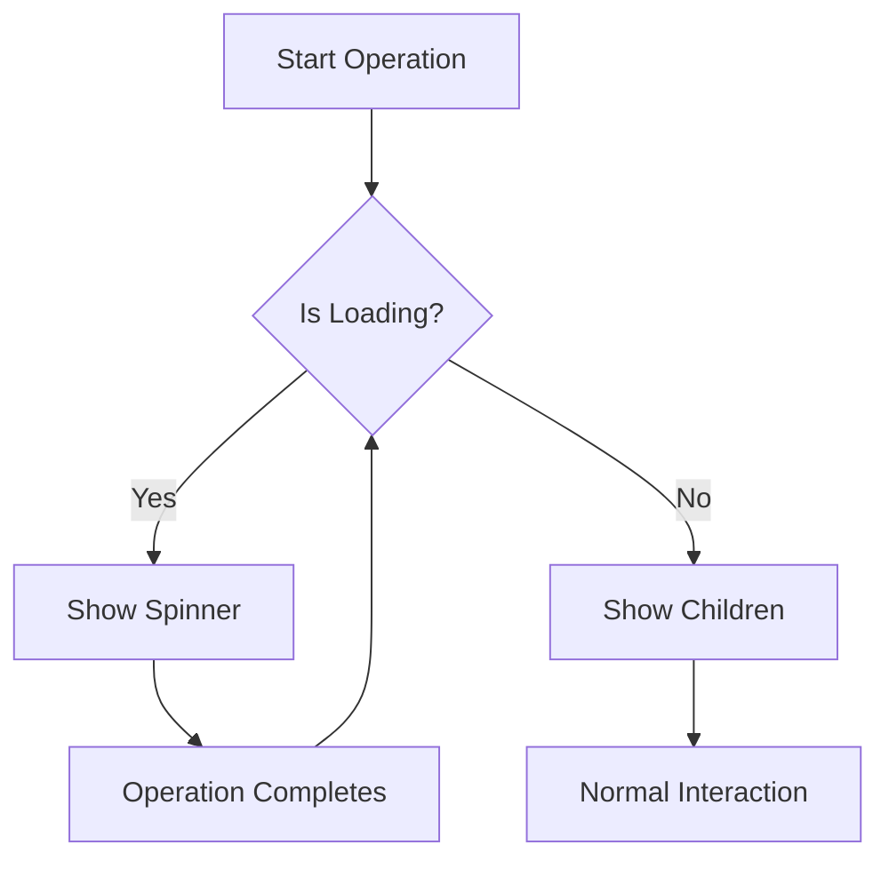
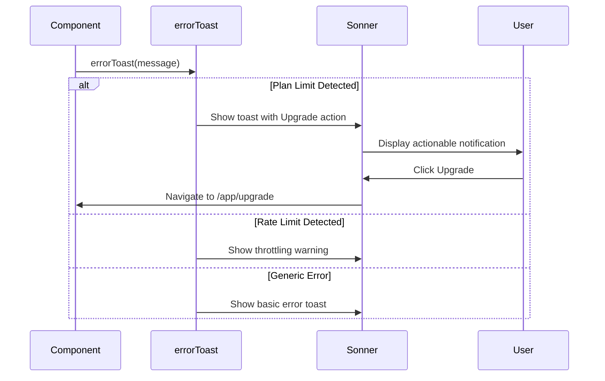
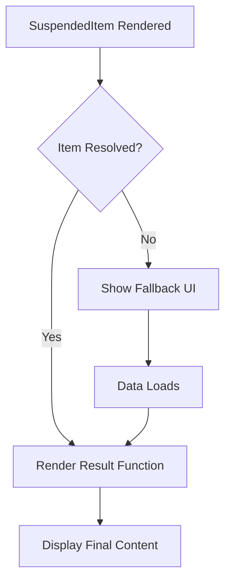
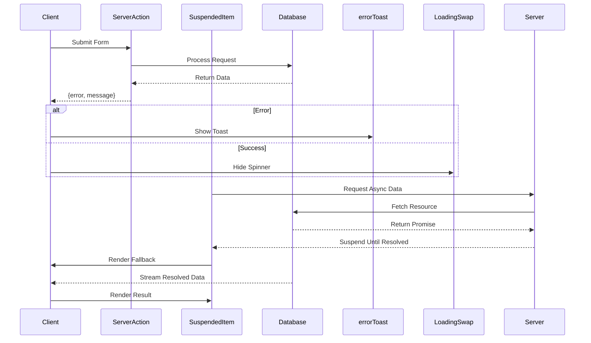

# UI State Management Patterns

<cite>
**Referenced Files in This Document**
- [loading-swap.tsx](file://src/components/ui/loading-swap.tsx)
- [errorToast.tsx](file://src/lib/errorToast.tsx)
- [SuspendedItem.tsx](file://src/components/SuspendedItem.tsx)
- [action-button.tsx](file://src/components/ui/action-button.tsx)
</cite>

## Table of Contents
1. [Introduction](#introduction)
2. [Loading State Management with LoadingSwap](#loading-state-management-with-loadingswap)
3. [Error Handling with errorToast](#error-handling-with-errortoast)
4. [Suspense and Data Fetching with SuspendedItem](#suspense-and-data-fetching-with-suspendeditem)
5. [Integration with React Server Components and Server Actions](#integration-with-react-server-components-and-server-actions)
6. [Accessibility and Internationalization Considerations](#accessibility-and-internationalization-considerations)
7. [Performance and Timing Best Practices](#performance-and-timing-best-practices)
8. [Debugging Strategies for Transient States](#debugging-strategies-for-transient-states)
9. [Best Practices for Consistent UX](#best-practices-for-consistent-ux)
10. [Conclusion](#conclusion)

## Introduction
This document provides a comprehensive analysis of UI state management patterns in the darasa application, focusing on loading, error, and suspense states. It examines three core utilities—`LoadingSwap`, `errorToast`, and `SuspendedItem`—that abstract transient state logic to promote consistent user experience across features. These components are designed to work seamlessly within a Next.js environment using React Server Components, server actions, and client-side interactions.

**Section sources**
- [loading-swap.tsx](file://src/components/ui/loading-swap.tsx#L1-L37)
- [errorToast.tsx](file://src/lib/errorToast.tsx#L1-L33)
- [SuspendedItem.tsx](file://src/components/SuspendedItem.tsx#L1-L26)

## Loading State Management with LoadingSwap

The `LoadingSwap` component provides a declarative way to conditionally render loading indicators during asynchronous operations such as form submissions or API calls. It uses CSS grid positioning to overlay content and spinner elements, enabling smooth transitions between visible and invisible states without layout shifts.

Internally, it leverages Tailwind's visibility utilities (`visible`/`invisible`) rather than display properties to preserve space during state changes. The component accepts optional class names for both container and loader icon, allowing styling flexibility while maintaining consistent behavior. It is commonly used within interactive components like `ActionButton`, where it wraps button text and swaps it with a spinning `Loader2Icon` from Lucide React during pending transitions.

**Diagram sources**
- [loading-swap.tsx](file://src/components/ui/loading-swap.tsx#L4-L37)
- [action-button.tsx](file://src/components/ui/action-button.tsx#L20-L25)

**Section sources**
- [loading-swap.tsx](file://src/components/ui/loading-swap.tsx#L4-L37)
- [action-button.tsx](file://src/components/ui/action-button.tsx#L20-L25)

## Error Handling with errorToast

The `errorToast` utility centralizes error presentation using Sonner, a toast notification system. It standardizes error messaging by mapping specific error codes (e.g., `PLAN_LIMIT`, `RATE_LIMIT`) to user-friendly messages with appropriate actions.

For plan limits, it displays an actionable toast with an "Upgrade" button that navigates users to the upgrade page. For rate limiting, it shows a descriptive message advising users to slow down. Generic errors fall back to a simple toast with the raw message. This abstraction ensures consistent error feedback across the application while reducing duplication in error handling logic.

The use of `toast.dismiss(toastId)` within the click handler ensures notifications can be programmatically closed after interaction, enhancing usability.

**Diagram sources**
- [errorToast.tsx](file://src/lib/errorToast.tsx#L7-L33)

**Section sources**
- [errorToast.tsx](file://src/lib/errorToast.tsx#L7-L33)

## Suspense and Data Fetching with SuspendedItem

`SuspendedItem` is a higher-level wrapper around React’s `Suspense` component, designed to handle lazy-loaded or data-dependent content gracefully. It accepts a promise (`item`), a fallback UI, and a result renderer function, making it ideal for rendering async data in server-rendered components.

It encapsulates an `InnerComponent` that awaits the promise and passes the resolved value to the `result` function. This pattern enables clean separation between loading state and rendered output, avoiding direct Promise handling in presentational code.

By leveraging React’s built-in Suspense mechanism, `SuspendedItem` integrates seamlessly with server components, allowing components to suspend rendering until data dependencies are resolved, thus improving perceived performance and reducing loading-related complexity.

**Diagram sources**
- [SuspendedItem.tsx](file://src/components/SuspendedItem.tsx#L2-L16)

**Section sources**
- [SuspendedItem.tsx](file://src/components/SuspendedItem.tsx#L2-L16)

## Integration with React Server Components and Server Actions

These state management utilities are architected to work efficiently within a hybrid rendering model. `LoadingSwap` and `errorToast` are primarily used in client components that interact with server actions, where transitions need visual feedback.

Server actions return structured responses containing `error` and optional `message` fields. When an action fails, `errorToast` is called directly, ensuring centralized error handling. Meanwhile, `useTransition` from React hooks manages the loading state, which is passed to `LoadingSwap` to control spinner visibility.

`SuspendedItem` operates at the boundary between server and client components, allowing server components to await promises while delegating fallback rendering to the client via Suspense. This enables progressive hydration and improves time-to-interactive metrics by deferring non-critical rendering.

**Diagram sources**
- [action-button.tsx](file://src/components/ui/action-button.tsx#L10-L30)
- [SuspendedItem.tsx](file://src/components/SuspendedItem.tsx#L2-L16)

**Section sources**
- [action-button.tsx](file://src/components/ui/action-button.tsx#L10-L30)
- [SuspendedItem.tsx](file://src/components/SuspendedItem.tsx#L2-L16)

## Accessibility and Internationalization Considerations

All state management components adhere to accessibility best practices. `LoadingSwap` maintains focus continuity and avoids abrupt content removal, preventing screen reader disorientation. While not explicitly marked with ARIA live regions, its predictable replacement of content ensures assistive technologies announce changes naturally.

For internationalization readiness, hardcoded strings in `errorToast` should ideally be replaced with i18n function calls. Currently, messages like "You have reached your plan limit." are static English strings, limiting multilingual support. Future enhancements could inject translation functions into the utility to enable dynamic language resolution.

Spinner animations use semantic icons (`Loader2Icon`) with no text alternatives, relying on context for meaning. In critical paths, adding visually hidden text (e.g., "Loading…") would improve clarity for screen readers.

**Section sources**
- [errorToast.tsx](file://src/lib/errorToast.tsx#L10-L25)
- [loading-swap.tsx](file://src/components/ui/loading-swap.tsx#L25-L30)

## Performance and Timing Best Practices

The `LoadingSwap` component avoids premature spinner flicker by showing the loader immediately upon `isLoading` becoming true. However, for very fast operations (<100ms), this may cause jarring flashes. An enhancement could introduce a configurable delay threshold before displaying the spinner.

Similarly, `SuspendedItem` relies on Suspense fallbacks, which appear instantly when data isn’t ready. To prevent layout thrashing, fallbacks should match the dimensions of expected content. Skeleton loaders or placeholders are recommended for better perceived performance.

No debouncing or throttling is implemented in current error toasts, meaning rapid successive errors will stack notifications. Implementing deduplication or cooldown periods could improve user experience in high-error scenarios.

**Section sources**
- [loading-swap.tsx](file://src/components/ui/loading-swap.tsx#L1-L37)
- [SuspendedItem.tsx](file://src/components/SuspendedItem.tsx#L1-L26)

## Debugging Strategies for Stuck Loading States

Stuck loading states often arise from unhandled promise rejections or missing `startTransition` completions. Since `LoadingSwap` depends on external `isLoading` flags (typically from `useTransition`), incomplete state updates can leave spinners perpetually visible.

Recommended debugging strategies include:
- Logging transitions to verify start/end symmetry
- Using React DevTools to inspect component state
- Ensuring all server actions resolve promises even on error
- Validating that `toast.dismiss()` does not interfere with ongoing operations

Error boundaries should wrap major UI sections but not individual state management components. They serve as fallbacks for unexpected crashes, complementing—but not replacing—the proactive error handling in `errorToast`.

**Section sources**
- [action-button.tsx](file://src/components/ui/action-button.tsx#L15-L20)
- [errorToast.tsx](file://src/lib/errorToast.tsx#L7-L33)

## Best Practices for Consistent UX

To reduce cognitive load and ensure predictable feedback:
- Use `LoadingSwap` uniformly for all interactive controls involving async operations
- Standardize error messages through `errorToast` instead of inline `toast.error()`
- Employ `SuspendedItem` for any data-dependent rendering to maintain consistency
- Align timing thresholds across components to avoid erratic behavior
- Ensure loading and error states are reversible and do not trap users

These utilities collectively abstract transient state logic, enabling developers to focus on business logic while maintaining a cohesive user experience across features.

**Section sources**
- [loading-swap.tsx](file://src/components/ui/loading-swap.tsx#L4-L37)
- [errorToast.tsx](file://src/lib/errorToast.tsx#L7-L33)
- [SuspendedItem.tsx](file://src/components/SuspendedItem.tsx#L2-L16)

## Conclusion
The darasa application employs a robust set of UI state management patterns centered around `LoadingSwap`, `errorToast`, and `SuspendedItem`. These abstractions promote consistency, enhance developer productivity, and improve user experience by providing predictable feedback during asynchronous operations. Their integration with React Server Components and server actions demonstrates a modern approach to full-stack state management in Next.js applications.

Future improvements could include configurable delay thresholds for loading indicators, enhanced internationalization support, and more sophisticated error deduplication mechanisms.