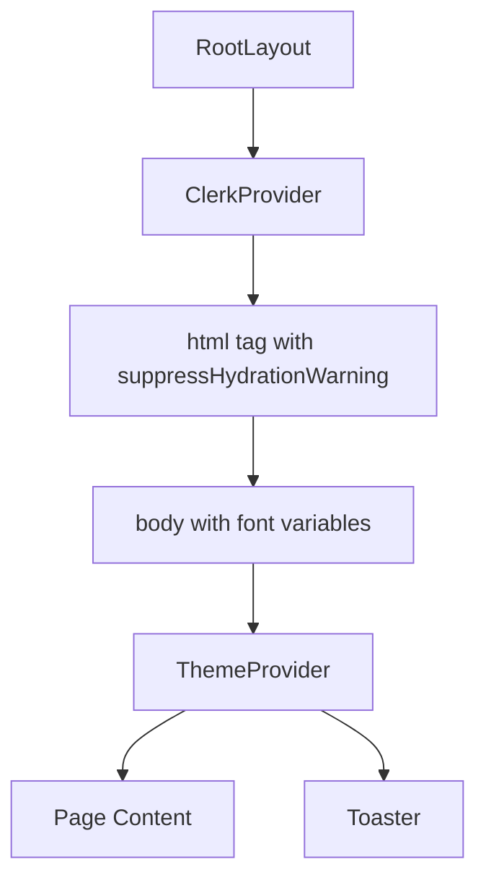
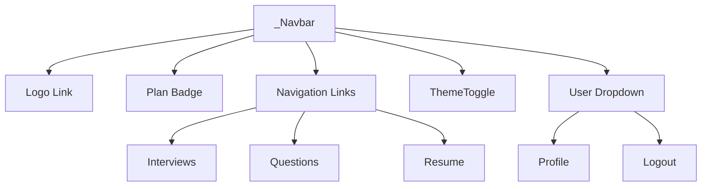
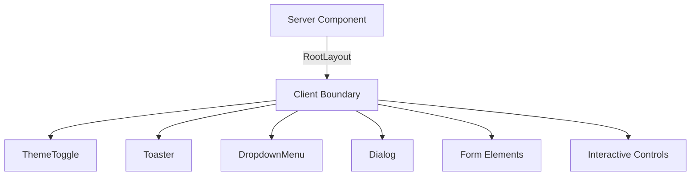

# Layout Architecture

<cite>
**Referenced Files in This Document**   
- [src/app/layout.tsx](file://src/app/layout.tsx)
- [src/components/ThemeToggle.tsx](file://src/components/ThemeToggle.tsx)
- [src/components/ui/sonner.tsx](file://src/components/ui/sonner.tsx)
- [src/app/app/_Navbar.tsx](file://src/app/app/_Navbar.tsx)
</cite>

## Table of Contents
1. [Introduction](#introduction)
2. [RootLayout Structure and Provider Orchestration](#rootlayout-structure-and-provider-orchestration)
3. [Global UI Components Integration](#global-ui-components-integration)
4. [Font Management with Tailwind CSS Variables](#font-management-with-tailwind-css-variables)
5. [Server-Side Rendering Optimization](#server-side-rendering-optimization)
6. [Client-Side Interactivity via React Server Components](#client-side-interactivity-via-react-server-components)
7. [Layout Nesting Patterns](#layout-nesting-patterns)
8. [Conclusion](#conclusion)

## Introduction
This document details the layout architecture of the Darasa application, focusing on the foundational RootLayout component and its role in orchestrating global providers, managing theme state, handling notifications, and integrating navigation elements. The architecture leverages Next.js App Router features including React Server Components, nested layouts, and client-server boundary management through 'use client' directives.

The system demonstrates modern full-stack React patterns with a clear separation between server-rendered shell components and interactive client-side features, optimized for performance and user experience.

## RootLayout Structure and Provider Orchestration

The RootLayout serves as the top-level container for the entire application, responsible for initializing and composing global context providers that are available across all routes. It implements a hierarchical provider pattern where authentication (ClerkProvider), theming (ThemeProvider), and notification (Toaster) services are stacked to create a consistent application environment.

The layout wraps children in a structured hierarchy: ClerkProvider at the outermost level ensures authentication state is available before rendering any content; ThemeProvider manages color schemes and UI appearance; and Toaster provides global notification capabilities. This composition enables cross-cutting concerns like authentication, theming, and user feedback to be handled uniformly throughout the application.



**Diagram sources**
- [src/app/layout.tsx](file://src/app/layout.tsx#L21-L43)

**Section sources**
- [src/app/layout.tsx](file://src/app/layout.tsx#L21-L43)

## Global UI Components Integration

The main application shell integrates key UI components that provide consistent navigation and user controls across all pages. The _Navbar component delivers primary navigation with contextual links based on the current route, while the ThemeToggle allows users to switch between light, dark, and system themes.

These components are integrated within page-specific layouts rather than the root layout, allowing for flexible composition. The _Navbar receives user and plan information as props, enabling personalized display of navigation options and subscription status badges. Navigation items are dynamically rendered based on the current jobInfoId parameter, demonstrating adaptive UI patterns.



**Diagram sources**
- [src/app/app/_Navbar.tsx](file://src/app/app/_Navbar.tsx#L0-L116)

**Section sources**
- [src/app/app/_Navbar.tsx](file://src/app/app/_Navbar.tsx#L0-L116)
- [src/components/ThemeToggle.tsx](file://src/components/ThemeToggle.tsx#L0-L69)

## Font Management with Tailwind CSS Variables

The application implements custom font management using Next.js font optimization with Tailwind CSS variable integration. The Outfit font is preloaded and configured with a CSS variable (--font-outfit-sans) that can be referenced throughout the application via Tailwind's @apply directive or className usage.

This approach enables efficient font loading with automatic self-hosting and performance optimizations while maintaining design system consistency. The font variable is applied globally through the RootLayout's body className, ensuring the custom typography is available across all pages without requiring individual imports or configuration.

```mermaid
flowchart TD
A[Outfit Import] --> B[Font Configuration]
B --> C{variable: "--font-outfit-sans"}
C --> D[Tailwind CSS Integration]
D --> E[Global Application]
E --> F[className={`${outfitSans.variable} font-sans`}]
```

**Diagram sources**
- [src/app/layout.tsx](file://src/app/layout.tsx#L7-L10)

**Section sources**
- [src/app/layout.tsx](file://src/app/layout.tsx#L7-L10)

## Server-Side Rendering Optimization

The layout system implements several SSR (Server-Side Rendering) optimizations to enhance performance and user experience during hydration. The suppressHydrationWarning attribute on the html element prevents console warnings when there are minor differences between server-rendered and client-rendered content, which commonly occurs with theme switching implementations.

This strategy improves perceived performance by reducing noise in developer tools and preventing potential issues with strict mode. The combination of server-rendered shell content with selectively hydrated client components creates a fast initial render while maintaining interactivity where needed.

**Section sources**
- [src/app/layout.tsx](file://src/app/layout.tsx#L25)

## Client-Side Interactivity via React Server Components

The architecture employs a hybrid rendering model where the RootLayout is a Server Component, but nested components use the 'use client' directive to enable client-side interactivity. This pattern is evident in components like ThemeToggle, Toaster, and various UI primitives in the components/ui directory.

The 'use client' directive establishes a client-server boundary, allowing components to use React hooks, handle events, and maintain state while being rendered within a server component tree. This selective hydration approach minimizes JavaScript bundle size and improves performance by only making interactive components client-side.

A comprehensive analysis reveals 25 components across the application that utilize the 'use client' directive, primarily concentrated in UI components, form elements, and interactive controls.



**Diagram sources**
- [src/components/ThemeToggle.tsx](file://src/components/ThemeToggle.tsx#L0)
- [src/components/ui/sonner.tsx](file://src/components/ui/sonner.tsx#L0)
- [src/app/app/_Navbar.tsx](file://src/app/app/_Navbar.tsx#L0)

**Section sources**
- [src/components/ThemeToggle.tsx](file://src/components/ThemeToggle.tsx#L0)
- [src/components/ui/sonner.tsx](file://src/components/ui/sonner.tsx#L0)
- [src/app/app/_Navbar.tsx](file://src/app/app/_Navbar.tsx#L0)

## Layout Nesting Patterns

The application implements a multi-level layout nesting structure that follows Next.js conventions. The root layout (src/app/layout.tsx) provides global providers, while route-specific layouts in directories like src/app/app/ can define additional structure and data requirements.

This pattern enables shared UI elements like navigation bars to be rendered at appropriate levels of the routing hierarchy, balancing code reuse with contextual relevance. Data fetching for user and plan information occurs in parent layouts, making this data available to child components without redundant queries.

The nesting pattern supports both static and dynamic segments, with layouts adapting to route parameters like [jobInfoId]. This creates a flexible architecture where common functionality is abstracted into reusable components while maintaining the ability to customize behavior based on route context.

**Section sources**
- [src/app/layout.tsx](file://src/app/layout.tsx#L21-L43)
- [src/app/app/_Navbar.tsx](file://src/app/app/_Navbar.tsx#L0-L116)

## Conclusion

The Darasa layout architecture demonstrates a well-structured implementation of modern Next.js patterns, effectively balancing server-side rendering performance with client-side interactivity. The RootLayout serves as a central orchestration point for global providers, establishing a consistent foundation for the application.

Key architectural decisions include the strategic use of provider composition, selective client component hydration, and thoughtful layout nesting that enables both code reuse and contextual adaptation. The integration of third-party services like Clerk for authentication and Sonner for notifications is handled cleanly through wrapper components that abstract complexity while maintaining flexibility.

This architecture provides a scalable foundation that supports the application's growth while maintaining performance and developer experience through established best practices in React and Next.js development.