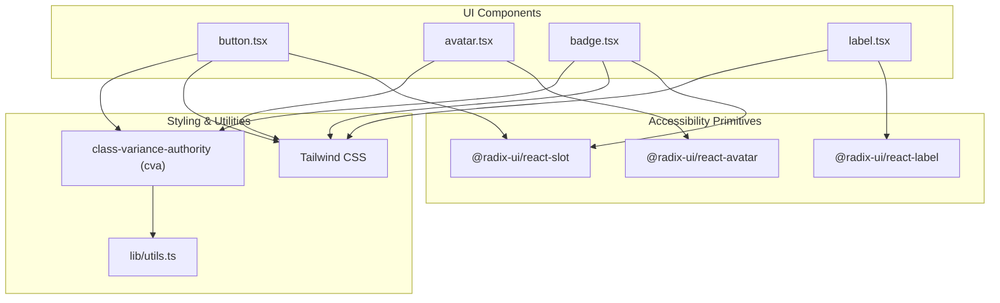
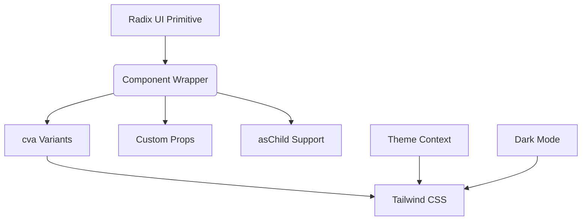
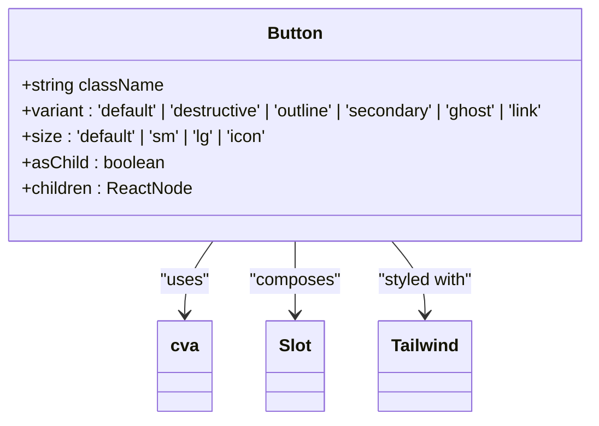
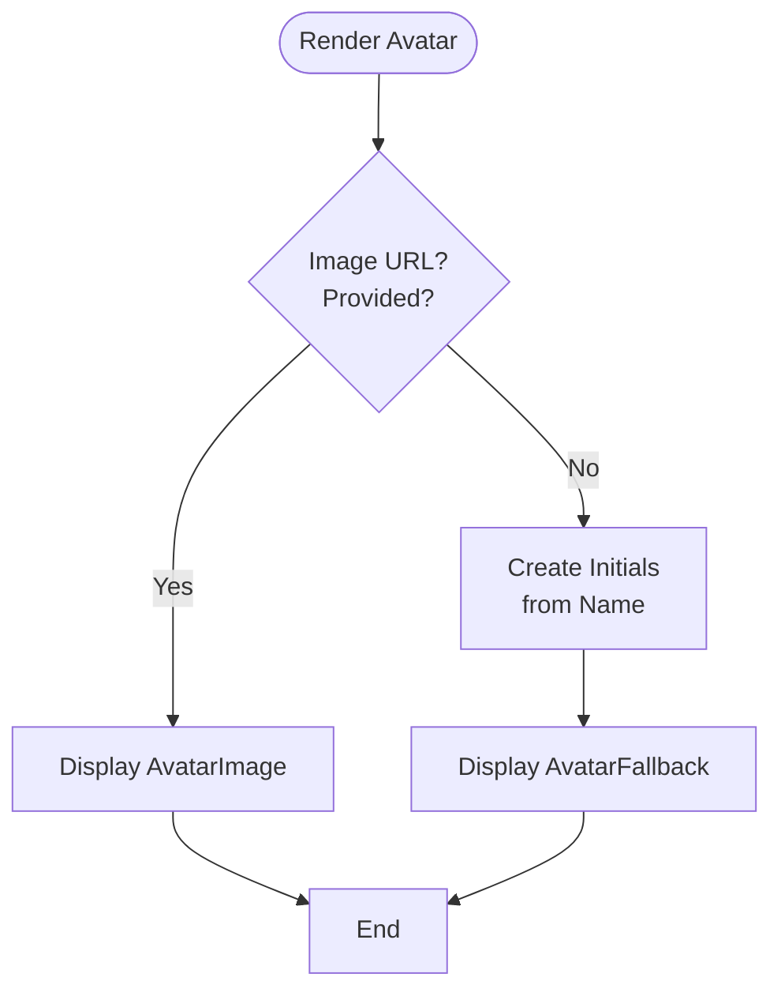
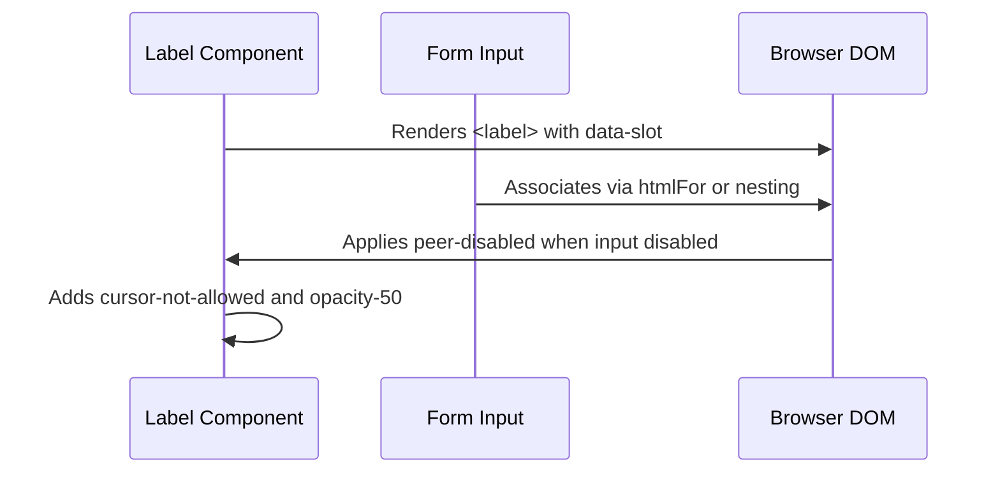
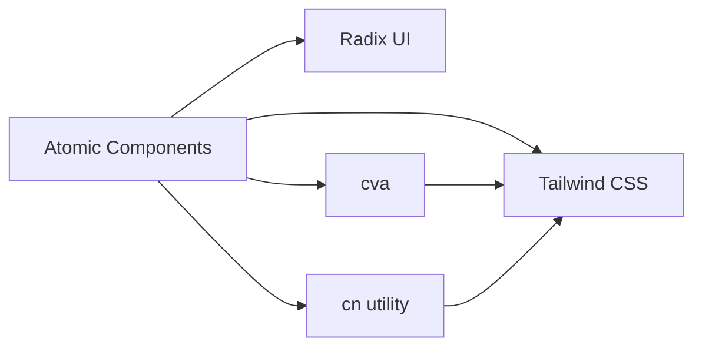

# Atomic Components

<cite>
**Referenced Files in This Document**
- [button.tsx](file://src/components/ui/button.tsx)
- [avatar.tsx](file://src/components/ui/avatar.tsx)
- [badge.tsx](file://src/components/ui/badge.tsx)
- [label.tsx](file://src/components/ui/label.tsx)
- [components.json](file://components.json)
- [tailwind.config.ts](file://tailwind.config.ts)
</cite>

## Table of Contents
1. [Introduction](#introduction)
2. [Project Structure](#project-structure)
3. [Core Components](#core-components)
4. [Architecture Overview](#architecture-overview)
5. [Detailed Component Analysis](#detailed-component-analysis)
6. [Dependency Analysis](#dependency-analysis)
7. [Performance Considerations](#performance-considerations)
8. [Troubleshooting Guide](#troubleshooting-guide)
9. [Conclusion](#conclusion)

## Introduction
This document provides comprehensive documentation for the atomic UI components Button, Avatar, Badge, and Label within the project. These components are built using Radix UI primitives and styled with Tailwind CSS utility classes through `class-variance-authority` (cva) for consistent variant management. The documentation covers implementation details, accessibility features, styling customization via `className`, usage patterns, dark mode compatibility, and integration guidance.

## Project Structure
The atomic components reside in the `src/components/ui/` directory as standalone React components that leverage Radix UI for accessible base behavior and Tailwind for styling. Each component is implemented as a composition of Radix primitives enhanced with custom utility-based styles and variants.



**Diagram sources**
- [button.tsx](file://src/components/ui/button.tsx)
- [avatar.tsx](file://src/components/ui/avatar.tsx)
- [badge.tsx](file://src/components/ui/badge.tsx)
- [label.tsx](file://src/components/ui/label.tsx)
- [tailwind.config.ts](file://tailwind.config.ts)

**Section sources**
- [src/components/ui/](file://src/components/ui/)
- [tailwind.config.ts](file://tailwind.config.ts)

## Core Components
The core atomic components—Button, Avatar, Badge, and Label—are designed to be reusable, accessible, and theme-aware. They follow a consistent pattern: wrapping Radix UI primitives with Tailwind-based styling via `cva` for variant control. All components support `className` overrides and respect ARIA attributes and keyboard navigation through their underlying Radix implementations.

**Section sources**
- [button.tsx](file://src/components/ui/button.tsx)
- [avatar.tsx](file://src/components/ui/avatar.tsx)
- [badge.tsx](file://src/components/ui/badge.tsx)
- [label.tsx](file://src/components/ui/label.tsx)

## Architecture Overview
The architecture follows a headless UI approach where Radix UI provides unstyled, fully accessible components, and Tailwind CSS applies visual styling. The `cva` library enables type-safe variant definitions for props like `variant` and `size`. This separation ensures accessibility by default while allowing flexible design system extensions.



**Diagram sources**
- [button.tsx](file://src/components/ui/button.tsx#L1-L60)
- [badge.tsx](file://src/components/ui/badge.tsx#L1-L48)
- [components.json](file://components.json)

## Detailed Component Analysis

### Button Component Analysis
The Button component wraps a native button or Slot (for composition) and supports multiple variants (`default`, `destructive`, `outline`, `secondary`, `ghost`, `link`) and sizes (`default`, `sm`, `lg`, `icon`). It uses `buttonVariants` defined via `cva` to generate class combinations. Accessibility is ensured through focus rings, disabled states, and proper ARIA handling.

#### Component Implementation


**Diagram sources**
- [button.tsx](file://src/components/ui/button.tsx#L37-L59)

**Section sources**
- [button.tsx](file://src/components/ui/button.tsx#L1-L59)

### Avatar Component Analysis
The Avatar component implements a user profile image fallback system using Radix UI's `Avatar.Root`, `Avatar.Image`, and `Avatar.Fallback`. It renders an image if available; otherwise, it displays initials from the user’s name. The component is client-side rendered due to its interactive nature.

#### Usage Example


**Diagram sources**
- [avatar.tsx](file://src/components/ui/avatar.tsx#L7-L21)
- [UserAvatar.tsx](file://src/features/users/components/UserAvatar.tsx)

**Section sources**
- [avatar.tsx](file://src/components/ui/avatar.tsx#L1-L53)
- [UserAvatar.tsx](file://src/features/users/components/UserAvatar.tsx)

### Badge Component Analysis
Badges are used to highlight status, categories, or metadata. Implemented as a span element (or Slot), they support variants: `default`, `secondary`, `destructive`, `warning`, and `outline`. Styling includes small text, rounded borders, and hover effects for link badges.

#### Variant Behavior
```mermaid
stateDiagram-v2
[*] --> Default
Default --> Secondary : variant="secondary"
Default --> Destructive : variant="destructive"
Default --> Warning : variant="warning"
Default --> Outline : variant="outline"
Default : bg-primary<br/>text-primary-foreground
Secondary : bg-secondary<br/>text-secondary-foreground
Destructive : bg-destructive<br/>text-white
Warning : bg-warning<br/>text-warning-foreground
Outline : border-solid<br/>text-foreground
```

**Diagram sources**
- [badge.tsx](file://src/components/ui/badge.tsx#L29-L47)

**Section sources**
- [badge.tsx](file://src/components/ui/badge.tsx#L1-L47)

### Label Component Analysis
Labels provide accessible text labels for form controls, leveraging Radix UI's labeling system. They automatically connect to associated inputs via implicit association and support disabled states through `peer-disabled` and group selectors.

#### Accessibility Flow


**Diagram sources**
- [label.tsx](file://src/components/ui/label.tsx#L7-L21)

**Section sources**
- [label.tsx](file://src/components/ui/label.tsx#L1-L24)

## Dependency Analysis
The atomic components depend on several key libraries:
- **Radix UI**: Provides accessible, unstyled primitives
- **Tailwind CSS**: Handles all visual styling
- **class-variance-authority (cva)**: Manages variant-based class generation
- **clsx/cn**: Utility for conditional class concatenation



**Diagram sources**
- [button.tsx](file://src/components/ui/button.tsx)
- [components.json](file://components.json)
- [tailwind.config.ts](file://tailwind.config.ts)

**Section sources**
- [components.json](file://components.json)
- [tailwind.config.ts](file://tailwind.config.ts)

## Performance Considerations
All components are lightweight and optimized:
- No unnecessary re-renders; stateless functional components
- `asChild` prop allows seamless integration without wrapper divs
- Tailwind classes are precompiled, ensuring minimal runtime cost
- Memoization not required due to simplicity and lack of internal state
- Efficient rendering via server-side rendering (RSC enabled per `components.json`)

While these components do not explicitly use `React.memo`, their simplicity and typical usage patterns make such optimizations unnecessary. The use of `Slot` avoids extraneous DOM nodes, improving layout performance.

**Section sources**
- [button.tsx](file://src/components/ui/button.tsx)
- [badge.tsx](file://src/components/ui/badge.tsx)

## Troubleshooting Guide
Common issues and solutions:

- **Missing Styles**: Ensure `globals.css` imports the Tailwind directives and that `tailwind.config.ts` includes correct content paths.
- **Dark Mode Not Working**: Verify that the root HTML element has the `class="dark"` toggle applied via the `ThemeToggle` component.
- **Focus Rings Invisible**: Check that `focus-visible:ring-[3px]` and color variables (`ring`, `ring-ring`) are properly defined in the theme.
- **asChild Not Rendering Correctly**: Confirm the child component accepts standard DOM props like `className` and `onClick`.

**Section sources**
- [tailwind.config.ts](file://tailwind.config.ts)
- [ThemeToggle.tsx](file://src/components/ThemeToggle.tsx)

## Conclusion
The Button, Avatar, Badge, and Label components exemplify a modern, accessible, and maintainable UI architecture using Radix UI and Tailwind CSS. Their design promotes consistency, supports theming and responsiveness, and integrates seamlessly into forms and compound components. By adhering to atomic principles and leveraging powerful tooling, these components provide a robust foundation for scalable interface development.