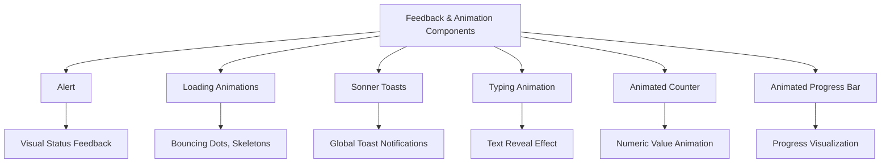
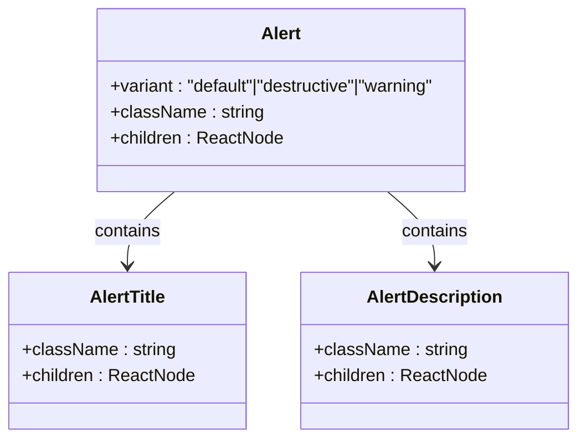
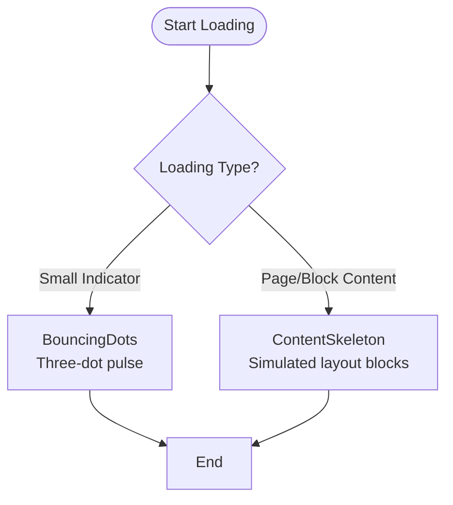
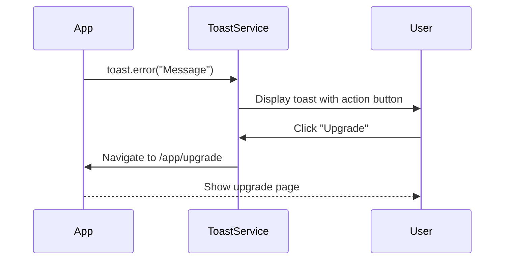
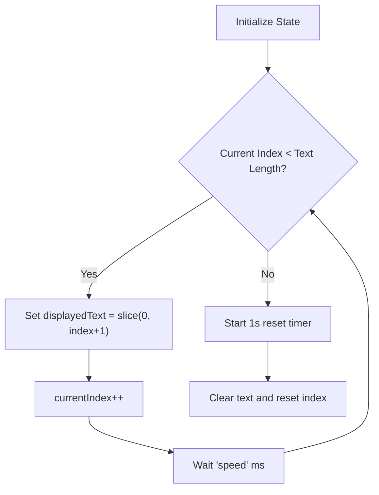
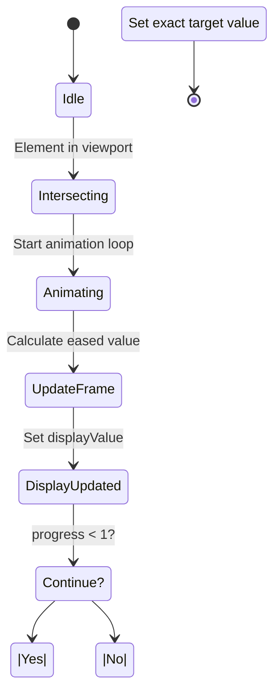
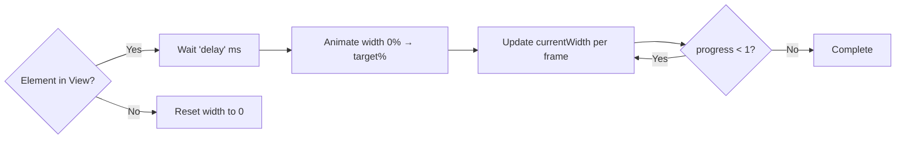

# Feedback & Animation Components

<cite>
**Referenced Files in This Document**   
- [alert.tsx](file://src/components/ui/alert.tsx)
- [loading-animations.tsx](file://src/components/ui/loading-animations.tsx)
- [sonner.tsx](file://src/components/ui/sonner.tsx)
- [typing-animation.tsx](file://src/components/ui/typing-animation.tsx)
- [animated-counter.tsx](file://src/components/ui/animated-counter.tsx)
- [animated-progress-bar.tsx](file://src/components/ui/animated-progress-bar.tsx)
- [errorToast.tsx](file://src/lib/errorToast.tsx)
- [upgrade/page.tsx](file://src/app/app/upgrade/page.tsx)
</cite>

## Table of Contents
1. [Introduction](#introduction)
2. [Core Components Overview](#core-components-overview)
3. [Alert Component](#alert-component)
4. [Loading Animations](#loading-animations)
5. [Sonner Toast Notifications](#sonner-toast-notifications)
6. [Typing Animation](#typing-animation)
7. [Animated Counter](#animated-counter)
8. [Animated Progress Bar](#animated-progress-bar)
9. [Integration with Async Operations](#integration-with-async-operations)
10. [Accessibility Considerations](#accessibility-considerations)
11. [Performance Optimization](#performance-optimization)
12. [Conclusion](#conclusion)

## Introduction
This document provides comprehensive documentation for the feedback and animation components used throughout the application. These components—Alert, LoadingAnimations, Sonner (toast notifications), TypingAnimation, AnimatedCounter, and AnimatedProgressBar—are essential for delivering a responsive, engaging user experience through visual feedback and motion design.

The components leverage modern React patterns, CSS animations via Tailwind, and efficient state management to provide smooth transitions and real-time updates. They are designed to integrate seamlessly with asynchronous operations such as API calls, form submissions, and data loading sequences while maintaining accessibility and performance standards.

## Core Components Overview

**Diagram sources**
- [alert.tsx](file://src/components/ui/alert.tsx#L1-L68)
- [loading-animations.tsx](file://src/components/ui/loading-animations.tsx#L1-L40)
- [sonner.tsx](file://src/components/ui/sonner.tsx#L1-L25)
- [typing-animation.tsx](file://src/components/ui/typing-animation.tsx#L1-L45)
- [animated-counter.tsx](file://src/components/ui/animated-counter.tsx#L1-L99)
- [animated-progress-bar.tsx](file://src/components/ui/animated-progress-bar.tsx#L1-L83)

**Section sources**
- [alert.tsx](file://src/components/ui/alert.tsx#L1-L68)
- [loading-animations.tsx](file://src/components/ui/loading-animations.tsx#L1-L40)
- [sonner.tsx](file://src/components/ui/sonner.tsx#L1-L25)

## Alert Component

The `Alert` component is used to display contextual messages to users, supporting variants such as default, destructive (error), and warning states. It integrates with icons and structured content using `AlertTitle` and `AlertDescription`.

It uses `class-variance-authority` (cva) to manage variant styles and ensures semantic HTML with proper ARIA roles (`role="alert"`). The component is styled using utility classes from Tailwind and supports custom class overrides.

Example usage includes plan limit warnings and system notifications.

**Diagram sources**
- [alert.tsx](file://src/components/ui/alert.tsx#L1-L68)

**Section sources**
- [alert.tsx](file://src/components/ui/alert.tsx#L1-L68)
- [upgrade/page.tsx](file://src/app/app/upgrade/page.tsx#L1-L26)

## Loading Animations

The `loading-animations.tsx` file exports two primary components: `BouncingDots` and `ContentSkeleton`. 

- **BouncingDots**: Displays a simple three-dot pulsing animation commonly used during short async operations.
- **ContentSkeleton**: Renders animated placeholder blocks that simulate content loading, useful for lists or forms before data arrives.

Both use Tailwind’s `animate-pulse` and `animate-bounce` utilities for lightweight, performant animations without JavaScript-based frame control.

**Diagram sources**
- [loading-animations.tsx](file://src/components/ui/loading-animations.tsx#L1-L40)

**Section sources**
- [loading-animations.tsx](file://src/components/ui/loading-animations.tsx#L1-L40)

## Sonner Toast Notifications

The `Sonner` toast system provides global, non-intrusive notifications triggered programmatically. It wraps the `sonner` library and adapts to the app's theme via `next-themes`, ensuring consistent appearance across light/dark modes.

Toasts can display success, error, warning, or info messages and support interactive actions like "Undo" or navigation (e.g., "Upgrade" link in rate-limit errors).

Custom styling is applied using CSS variables mapped to design tokens (`--popover`, `--border`, etc.), enabling seamless integration with the UI framework.

**Diagram sources**
- [sonner.tsx](file://src/components/ui/sonner.tsx#L1-L25)
- [errorToast.tsx](file://src/lib/errorToast.tsx#L1-L33)

**Section sources**
- [sonner.tsx](file://src/components/ui/sonner.tsx#L1-L25)
- [errorToast.tsx](file://src/lib/errorToast.tsx#L1-L33)

## Typing Animation

The `TypingAnimation` component simulates text being typed out character by character, often used during AI-generated content loading (e.g., "Generating question...").

It uses React’s `useState` and `useEffect` hooks to manage typing progress and timing. Each character appears at an interval defined by the `speed` prop (default 50ms). After completion, the animation resets after a 1-second delay.

A blinking cursor (`|`) is rendered alongside the text using `animate-pulse` for visual continuity.

**Diagram sources**
- [typing-animation.tsx](file://src/components/ui/typing-animation.tsx#L1-L45)

**Section sources**
- [typing-animation.tsx](file://src/components/ui/typing-animation.tsx#L1-L45)

## Animated Counter

The `AnimatedCounter` component animates numeric values when they come into view, using Intersection Observer API for lazy activation.

It parses input strings to extract numeric values, prefixes (like `$`), and suffixes (like `%` or `k`). The animation uses an easing function (`easeOutCubic`) for natural acceleration and runs over a configurable duration (default 2000ms).

Values update via `requestAnimationFrame` for smooth 60fps rendering, and formatting adjusts based on whether the number is integer or decimal.

**Diagram sources**
- [animated-counter.tsx](file://src/components/ui/animated-counter.tsx#L1-L99)

**Section sources**
- [animated-counter.tsx](file://src/components/ui/animated-counter.tsx#L1-L99)

## Animated Progress Bar

The `AnimatedProgressBar` visually represents progress percentages with smooth width transitions. Like the counter, it activates only when visible using Intersection Observer and supports optional delays.

The animation uses cubic easing for fluid motion and resets when scrolled out of view. Styling leverages Tailwind’s utility classes with dynamic inline styles for width control.

Use cases include file uploads, survey completion, or multi-step process tracking.

**Diagram sources**
- [animated-progress-bar.tsx](file://src/components/ui/animated-progress-bar.tsx#L1-L83)

**Section sources**
- [animated-progress-bar.tsx](file://src/components/ui/animated-progress-bar.tsx#L1-L83)

## Integration with Async Operations

These components are frequently used in conjunction with asynchronous workflows:

- **API Calls**: `TypingAnimation` shows during AI response generation; `LoadingAnimations` indicate fetch status.
- **Form Submissions**: `Alert` displays validation or submission results; `Sonner` confirms success/error.
- **Real-Time Updates**: `AnimatedCounter` and `AnimatedProgressBar` reflect live metrics or upload progress.

State synchronization is handled via React hooks (`useState`, `useEffect`), ensuring UI reflects data changes immediately. Error boundaries and fallback UIs prevent broken experiences during failures.

## Accessibility Considerations

All components adhere to accessibility best practices:

- **Screen Reader Support**: Alerts use `role="alert"` for immediate announcement. Toasts are announced via live regions.
- **Reduced Motion**: Animations respect `prefers-reduced-motion` through CSS media queries. For example, `animate-pulse` and `animate-bounce` can be disabled globally if needed.
- **Focus Management**: Toasts do not steal focus. Interactive alerts maintain keyboard navigability.
- **Color Contrast**: All text meets WCAG AA standards against background colors.

Developers should avoid relying solely on motion to convey information and ensure alternative indicators (text, icons) are present.

## Performance Optimization

To minimize jank and ensure 60fps animations:

- **Use Hardware-Accelerated Properties**: Animations primarily manipulate `opacity`