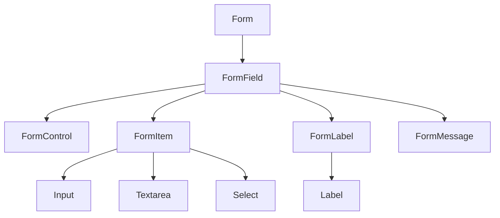
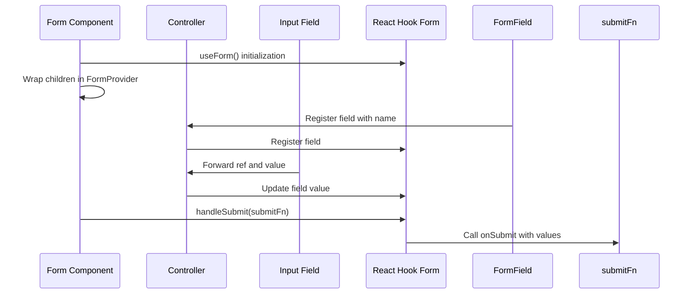
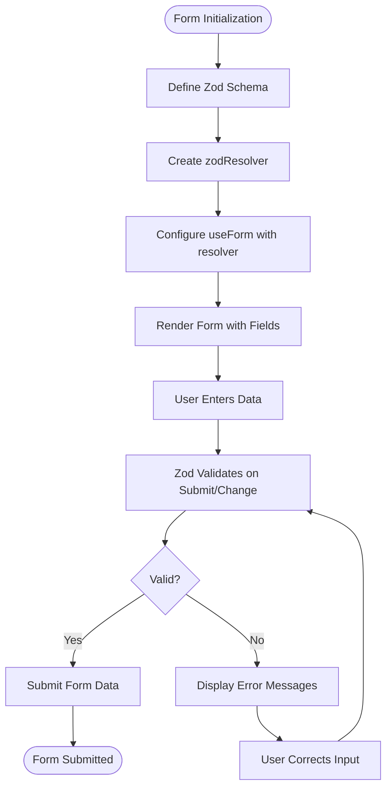
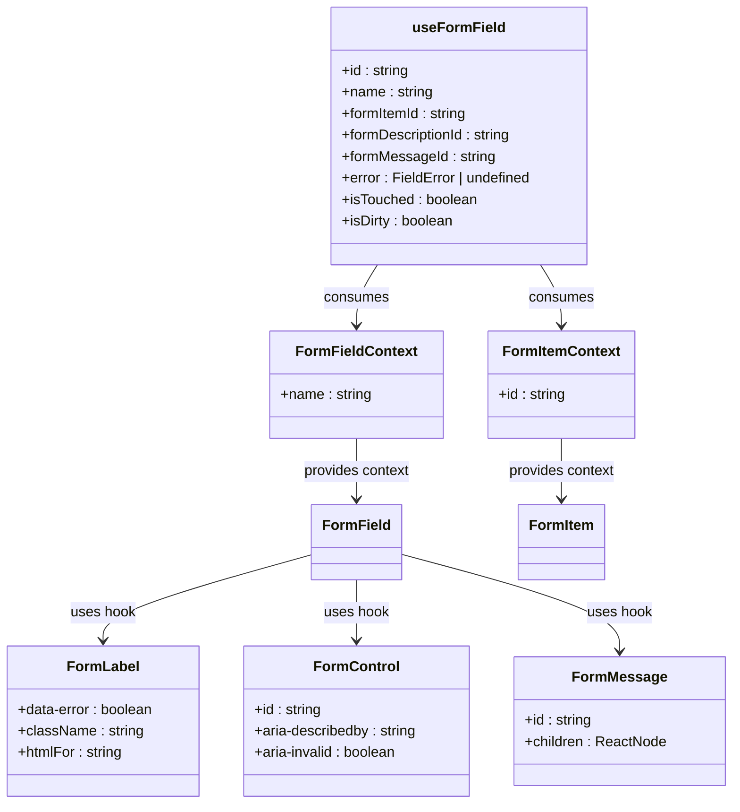
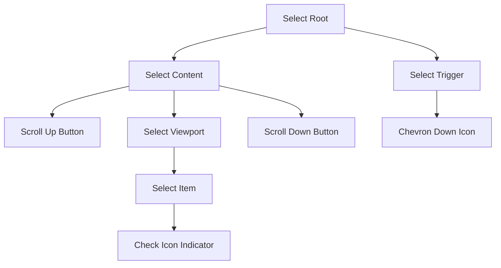
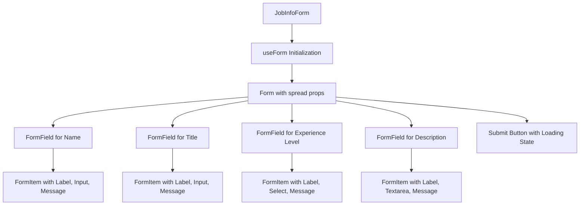

# Form Controls

<cite>
**Referenced Files in This Document**   
- [form.tsx](file://src/components/ui/form.tsx)
- [input.tsx](file://src/components/ui/input.tsx)
- [textarea.tsx](file://src/components/ui/textarea.tsx)
- [select.tsx](file://src/components/ui/select.tsx)
- [label.tsx](file://src/components/ui/label.tsx)
- [JobInfoForm.tsx](file://src/features/jobInfos/components/JobInfoForm.tsx)
- [schemas.ts](file://src/features/jobInfos/schemas.ts)
</cite>

## Table of Contents
1. [Introduction](#introduction)
2. [Core Components Overview](#core-components-overview)
3. [React Hook Form Integration](#react-hook-form-integration)
4. [Schema Validation with Zod](#schema-validation-with-zod)
5. [Error Handling and Accessibility](#error-handling-and-accessibility)
6. [Component-Specific Implementations](#component-specific-implementations)
7. [Dynamic Field Management](#dynamic-field-management)
8. [Practical Usage Examples](#practical-usage-examples)
9. [Common Issues and Solutions](#common-issues-and-solutions)
10. [Best Practices](#best-practices)

## Introduction

This documentation provides comprehensive guidance on the form control components within the application, specifically focusing on Input, Textarea, Select, and Form components. These components are designed to work seamlessly with React Hook Form for state management and validation, while leveraging Radix UI primitives for accessibility and consistent behavior. The system supports schema validation through Zod, ensuring type safety and robust data validation across forms.

The components follow a composable architecture that promotes reusability and consistency throughout the application. They are built with accessibility as a core principle, including proper labeling, error messaging, focus states, and keyboard navigation support. The styling is consistent across variants and responsive to different screen sizes.

**Section sources**
- [form.tsx](file://src/components/ui/form.tsx)
- [input.tsx](file://src/components/ui/input.tsx)
- [textarea.tsx](file://src/components/ui/textarea.tsx)
- [select.tsx](file://src/components/ui/select.tsx)

## Core Components Overview

The form system consists of several key components that work together to create accessible, validated forms:

- **Form**: The root component that provides context for all nested form elements using React Hook Form
- **Input**: A styled text input field with consistent styling and accessibility features
- **Textarea**: A multi-line text input with appropriate sizing and styling
- **Select**: A dropdown selection component built on Radix UI primitives
- **Label**: Accessible labels that properly associate with their corresponding form controls
- **FormField**: A wrapper that connects individual fields to React Hook Form's controller

These components are implemented as uncontrolled components by default, allowing React Hook Form to manage their state efficiently. Each component includes built-in support for error states, focus indicators, and disabled appearances.



**Diagram sources**
- [form.tsx](file://src/components/ui/form.tsx)
- [input.tsx](file://src/components/ui/input.tsx)
- [textarea.tsx](file://src/components/ui/textarea.tsx)
- [select.tsx](file://src/components/ui/select.tsx)
- [label.tsx](file://src/components/ui/label.tsx)

**Section sources**
- [form.tsx](file://src/components/ui/form.tsx)
- [input.tsx](file://src/components/ui/input.tsx)
- [textarea.tsx](file://src/components/ui/textarea.tsx)
- [select.tsx](file://src/components/ui/select.tsx)

## React Hook Form Integration

The form components are tightly integrated with React Hook Form, which provides efficient form state management, validation, and submission handling. The integration is achieved through several key patterns:

- **Form Provider**: The `Form` component is a wrapper around React Hook Form's `FormProvider`, establishing context for all child components
- **Controller Pattern**: Individual fields use the `Controller` component from React Hook Form to connect uncontrolled inputs to the form state
- **Context Sharing**: Custom contexts (`FormFieldContext` and `FormItemContext`) share field-specific information like IDs and error states
- **State Hooks**: The `useFormField` hook provides access to field state including errors, touched status, and validation results

The implementation avoids unnecessary re-renders by only subscribing to relevant parts of the form state. Field registration is handled automatically through the `FormField` component, which registers each field with React Hook Form when mounted.



**Diagram sources**
- [form.tsx](file://src/components/ui/form.tsx)

**Section sources**
- [form.tsx](file://src/components/ui/form.tsx)

## Schema Validation with Zod

The application implements schema validation using Zod, providing type-safe validation rules that are defined once and used both client-side and potentially server-side. The validation schema for job information demonstrates key patterns:

- **Union Types**: Using `z.enum()` for predefined options (experience levels)
- **Nullable Fields**: Supporting optional fields with `.nullable()`
- **Required Fields**: Enforcing presence with `.min(1, "Required")`
- **Type Inference**: Using `z.infer<typeof schema>` to derive TypeScript types from the schema

The validation resolver connects Zod to React Hook Form through `@hookform/resolvers/zod`, automatically transforming validation errors into a format that React Hook Form can consume. This creates a seamless experience where validation occurs at both the type level and runtime level.



**Diagram sources**
- [schemas.ts](file://src/features/jobInfos/schemas.ts)

**Section sources**
- [schemas.ts](file://src/features/jobInfos/schemas.ts)
- [JobInfoForm.tsx](file://src/features/jobInfos/components/JobInfoForm.tsx)

## Error Handling and Accessibility

The form system implements comprehensive error handling and accessibility features to ensure an inclusive user experience:

- **Visual Error States**: Inputs display distinct visual indicators when invalid, including border color changes and error message display
- **ARIA Attributes**: Proper ARIA attributes are set automatically, including `aria-invalid`, `aria-describedby`, and labeled-by relationships
- **Error Messaging**: FormMessage components conditionally render only when errors exist, preventing empty error containers
- **Focus Management**: Clear focus states are provided, with enhanced visibility for accessibility
- **Screen Reader Support**: Error messages are properly associated with their controls through ARIA relationships

The implementation uses data attributes (`data-slot`) to target specific parts of components for styling, ensuring consistent appearance across different themes and states. Error states are communicated through both color and text, supporting users with color vision deficiencies.



**Diagram sources**
- [form.tsx](file://src/components/ui/form.tsx)

**Section sources**
- [form.tsx](file://src/components/ui/form.tsx)
- [label.tsx](file://src/components/ui/label.tsx)

## Component-Specific Implementations

### Input Component

The Input component is a styled wrapper around the native HTML input element, providing consistent styling and accessibility features across the application. It supports all standard input props and adds semantic class names for styling.

**Section sources**
- [input.tsx](file://src/components/ui/input.tsx)

### Textarea Component

The Textarea component provides a multi-line text input with minimum height constraints and consistent styling. It automatically grows to accommodate content while maintaining proper spacing and appearance.

**Section sources**
- [textarea.tsx](file://src/components/ui/textarea.tsx)

### Select Component

The Select component is built on Radix UI's Select primitive, providing a fully accessible dropdown menu with keyboard navigation support. It includes scroll buttons for long lists and proper positioning logic.



**Diagram sources**
- [select.tsx](file://src/components/ui/select.tsx)

**Section sources**
- [select.tsx](file://src/components/ui/select.tsx)

## Dynamic Field Management

The form system supports dynamic field management through React Hook Form's array fields functionality. While not explicitly shown in the current examples, the architecture allows for:

- Adding and removing fields dynamically
- Managing arrays of form fields
- Conditional field rendering based on other field values
- Nested field structures

The use of `useFormContext` enables child components to access the form methods needed for dynamic operations without prop drilling. This makes it possible to create complex forms with repeating sections or conditional logic.

**Section sources**
- [form.tsx](file://src/components/ui/form.tsx)

## Practical Usage Examples

### Job Information Form Implementation

The JobInfoForm demonstrates a complete implementation of the form system in practice:

- **Form Initialization**: Using `useForm` with Zod resolver and default values
- **Controlled vs Uncontrolled**: Handling nullable fields by converting empty strings to null
- **Conditional Rendering**: Displaying different submit actions based on edit/create mode
- **Loading States**: Integrating loading indicators during form submission
- **Error Feedback**: Using toast notifications for submission errors

The form composition follows a consistent pattern where each field is wrapped in a FormItem containing label, control, description, and message components.



**Diagram sources**
- [JobInfoForm.tsx](file://src/features/jobInfos/components/JobInfoForm.tsx)

**Section sources**
- [JobInfoForm.tsx](file://src/features/jobInfos/components/JobInfoForm.tsx)

## Common Issues and Solutions

### Uncontrolled Input Warnings

When working with nullable fields, ensure proper value transformation:
```tsx
<Input
  {...field}
  value={field.value ?? ""}
  onChange={(e) => field.onChange(e.target.value || null)}
/>
```

This pattern prevents React warnings about switching between controlled and uncontrolled states.

### Performance During Rapid Re-renders

To optimize performance:
- Use memo