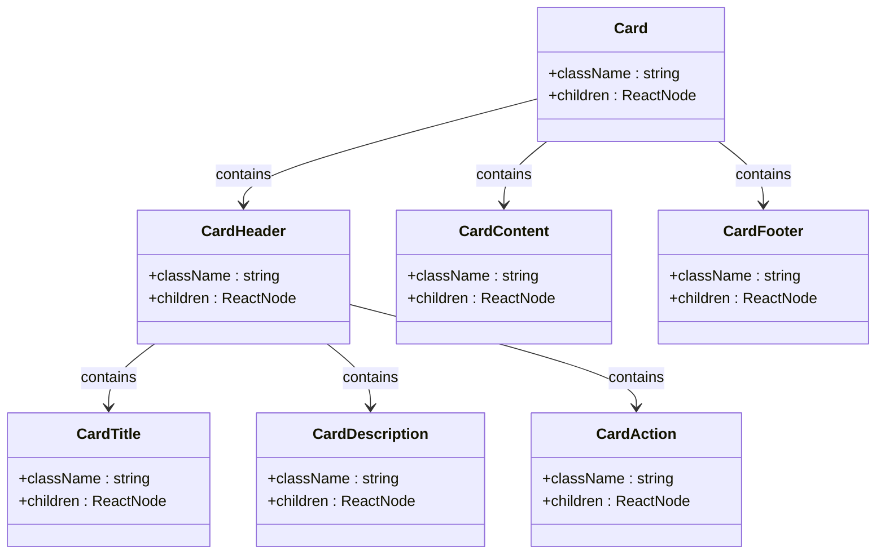
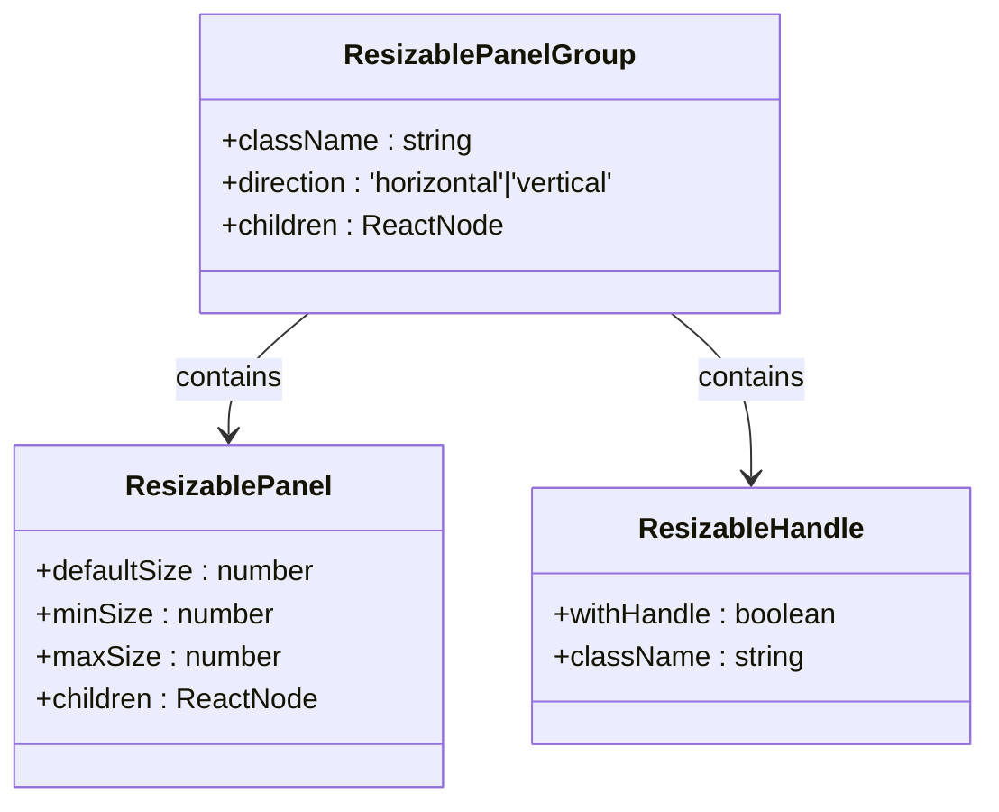
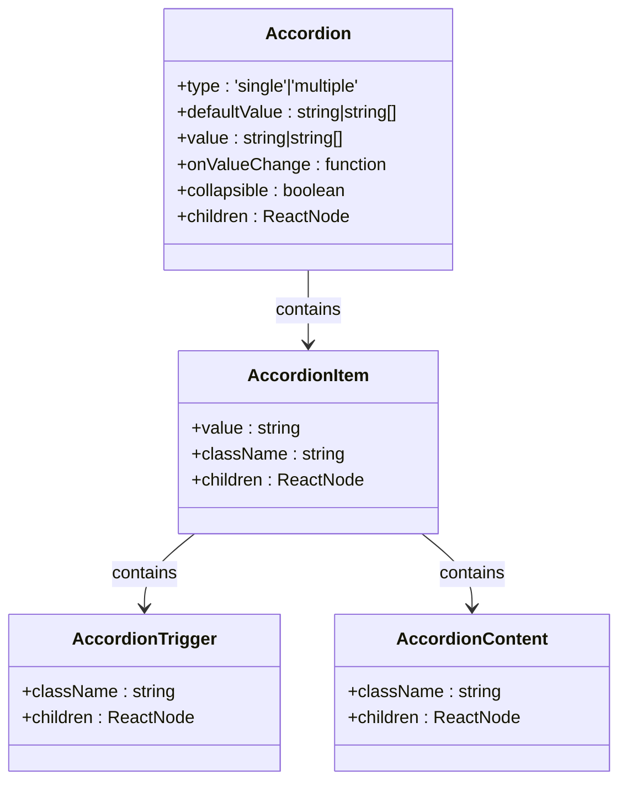
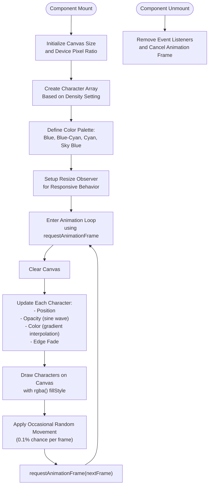
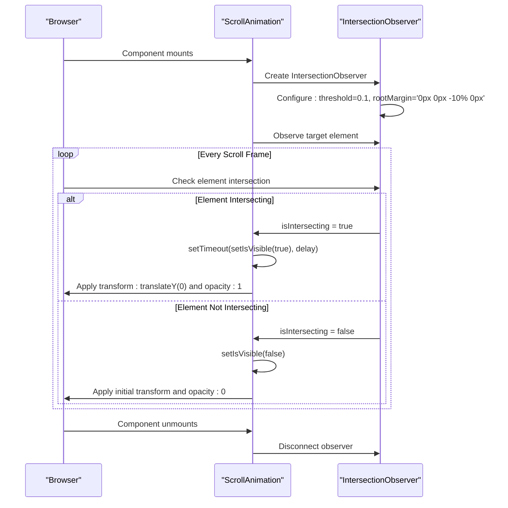

# Layout & Utility Components

<cite>
**Referenced Files in This Document**   
- [card.tsx](file://src/components/ui/card.tsx)
- [resizable.tsx](file://src/components/ui/resizable.tsx)
- [accordion.tsx](file://src/components/ui/accordion.tsx)
- [ascii-background-animation.tsx](file://src/components/ui/ascii-background-animation.tsx)
- [scroll-animation.tsx](file://src/components/ui/scroll-animation.tsx)
</cite>

## Table of Contents
1. [Introduction](#introduction)
2. [Core Components Overview](#core-components-overview)
3. [Card Component](#card-component)
4. [Resizable Component](#resizable-component)
5. [Accordion Component](#accordion-component)
6. [ASCII Background Animation](#ascii-background-animation)
7. [ScrollAnimation Component](#scrollanimation-component)
8. [Implementation Details](#implementation-details)
9. [Usage Examples](#usage-examples)
10. [Performance and Compatibility](#performance-and-compatibility)
11. [Integration Guidelines](#integration-guidelines)

## Introduction
This document provides comprehensive documentation for the layout and utility components used in the application: Card, Resizable, Accordion, ASCII Background Animation, and ScrollAnimation. These components serve distinct purposes in structuring content, enabling interactive layouts, and adding decorative visual effects. The implementation leverages modern web technologies including CSS Flexbox/Grid, ResizeObserver API, Intersection Observer API, and canvas-based animations to deliver responsive and performant user interfaces.

## Core Components Overview
The documented components fall into three functional categories:
- **Structural components**: Card and Accordion provide content organization and information hierarchy
- **Interactive layout components**: Resizable enables dynamic dimension control between UI sections
- **Decorative animation components**: ASCII Background Animation and ScrollAnimation enhance visual appeal with motion effects

These components are designed to work together seamlessly, supporting both functional interface requirements and aesthetic enhancements while maintaining performance across devices.

**Section sources**
- [card.tsx](file://src/components/ui/card.tsx)
- [resizable.tsx](file://src/components/ui/resizable.tsx)
- [accordion.tsx](file://src/components/ui/accordion.tsx)
- [ascii-background-animation.tsx](file://src/components/ui/ascii-background-animation.tsx)
- [scroll-animation.tsx](file://src/components/ui/scroll-animation.tsx)

## Card Component
The Card component implements a container for grouping related content using CSS Flexbox. It follows a structured composition pattern with dedicated subcomponents for header, title, description, content, footer, and action elements. The implementation uses Tailwind CSS classes combined with the `cn` utility for conditional styling.

Cards utilize a vertical flex layout with consistent spacing (gap-6) and include built-in support for borders, shadows, and rounded corners. The component supports responsive design through container queries (`@container/card-header`) and automatically adjusts grid behavior when action elements are present.

**Diagram sources**
- [card.tsx](file://src/components/ui/card.tsx#L4-L92)

**Section sources**
- [card.tsx](file://src/components/ui/card.tsx#L4-L92)

## Resizable Component
The Resizable component provides split-pane functionality using the react-resizable-panels library. It consists of three main parts: ResizablePanelGroup (container), ResizablePanel (content areas), and ResizableHandle (drag interface). The implementation uses CSS Flexbox with dynamic direction switching based on the panel group orientation.

The component supports both horizontal and vertical layouts through data attributes that trigger appropriate flex-direction changes. The resize handle includes visual indicators (grip icon) and proper focus management for accessibility. The underlying library handles complex resize logic, while the wrapper component applies consistent styling and semantic markup.

**Diagram sources**
- [resizable.tsx](file://src/components/ui/resizable.tsx#L8-L55)

**Section sources**
- [resizable.tsx](file://src/components/ui/resizable.tsx#L8-L55)

## Accordion Component
The Accordion component implements collapsible content sections using @radix-ui/react-accordion. It follows an accessible design pattern with proper keyboard navigation and ARIA attributes. The component consists of four parts: Accordion (root), AccordionItem (individual section), AccordionTrigger (toggle button), and AccordionContent (collapsible panel).

The trigger includes a chevron icon that rotates on state change, providing visual feedback. Content areas use CSS transitions with predefined animations (animate-accordion-up/down) for smooth opening and closing effects. Each item is separated by a border, with the last item having no bottom border for clean visual termination.

**Diagram sources**
- [accordion.tsx](file://src/components/ui/accordion.tsx#L8-L65)

**Section sources**
- [accordion.tsx](file://src/components/ui/accordion.tsx#L8-L65)

## ASCII Background Animation
The ASCII Background Animation component creates a dynamic canvas-based background effect using ASCII characters. It renders animated symbols with wave-like pulsing, color gradients, and edge fading effects. The implementation uses HTML5 Canvas API with requestAnimationFrame for smooth 60fps rendering.

Key features include configurable density (1-10 scale), animation speed control, customizable symbol sets, and optional edge fading. The animation uses a blue-cyan color palette with interpolated gradients that shift over time, creating a seamless mesh effect. Characters have individual properties including position, opacity, speed, and color phase for varied movement patterns.

**Diagram sources**
- [ascii-background-animation.tsx](file://src/components/ui/ascii-background-animation.tsx#L12-L206)

**Section sources**
- [ascii-background-animation.tsx](file://src/components/ui/ascii-background-animation.tsx#L12-L206)

## ScrollAnimation Component
The ScrollAnimation component implements entrance animations triggered by scroll position using Intersection Observer API. Elements animate into view when they enter the viewport, with configurable direction (up, down, left, right), delay, and duration. The component resets animation when elements scroll out of view, enabling bidirectional effects.

The implementation uses CSS transforms and opacity changes with cubic-bezier easing for natural motion. The observer uses a threshold of 0.1 and root margin of "0px 0px -10% 0px" to trigger animation slightly before full visibility. This creates a proactive rather than reactive animation experience.

**Diagram sources**
- [scroll-animation.tsx](file://src/components/ui/scroll-animation.tsx#L12-L78)

**Section sources**
- [scroll-animation.tsx](file://src/components/ui/scroll-animation.tsx#L12-L78)

## Implementation Details
### CSS Layout Techniques
The components leverage modern CSS layout methods:
- **Flexbox**: Used extensively in Card and Resizable components for flexible content arrangement
- **CSS Grid**: Employed in CardHeader for complex header layouts with action alignment
- **Container Queries**: Applied in card headers for responsive behavior within their context
- **Absolute Positioning**: Utilized in ASCII background for full-container coverage

### JavaScript APIs