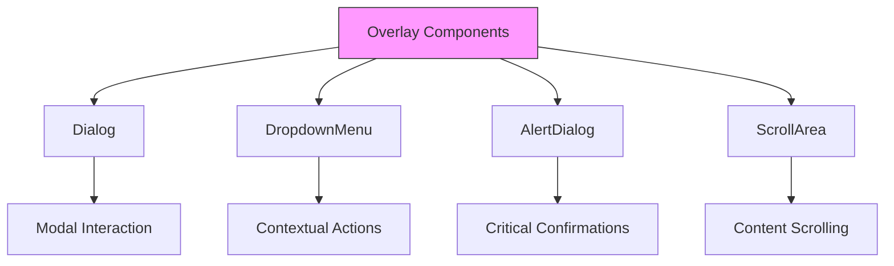
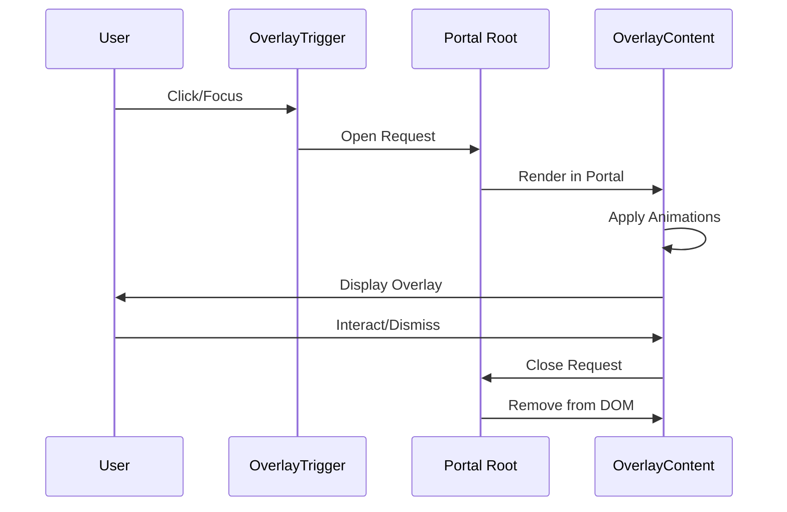
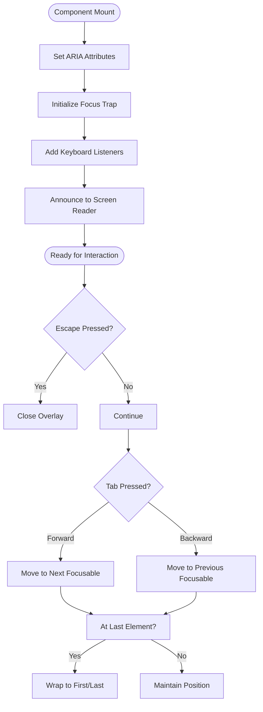
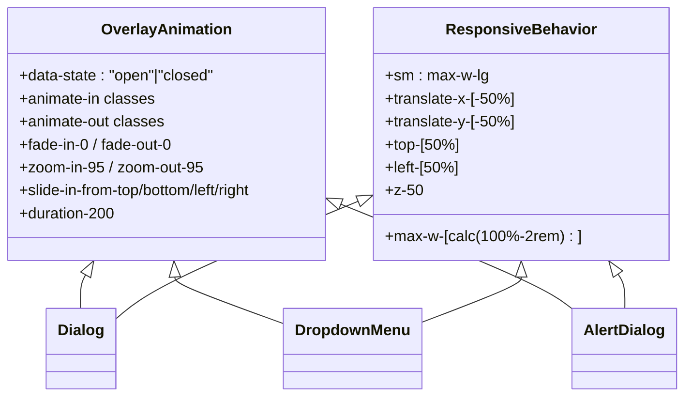
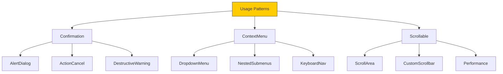

# Overlay Components

<cite>
**Referenced Files in This Document**  
- [dialog.tsx](file://src/components/ui/dialog.tsx)
- [dropdown-menu.tsx](file://src/components/ui/dropdown-menu.tsx)
- [alert-dialog.tsx](file://src/components/ui/alert-dialog.tsx)
- [scroll-area.tsx](file://src/components/ui/scroll-area.tsx)
- [utils.ts](file://src/lib/utils.ts)
</cite>

## Table of Contents
1. [Introduction](#introduction)
2. [Core Overlay Components](#core-overlay-components)
3. [State Management and Event Handling](#state-management-and-event-handling)
4. [Accessibility Implementation](#accessibility-implementation)
5. [Responsive Design and Animation](#responsive-design-and-animation)
6. [Usage Patterns](#usage-patterns)
7. [Performance Considerations](#performance-considerations)

## Introduction

The overlay component system provides a comprehensive suite of UI elements for managing modal and non-modal overlays within the application. Built on top of Radix UI primitives, these components ensure consistent behavior, accessibility compliance, and smooth user interactions across various use cases including confirmation dialogs, context menus, and scrollable content containers. The implementation leverages portals for proper z-index management and focus trapping to maintain keyboard navigation integrity.

## Core Overlay Components

The overlay system consists of four primary components that serve distinct purposes in user interface design:

### Dialog Component
The Dialog component implements modal dialogs that require user interaction before continuing with the main application flow. It uses Radix UI's portal mechanism to render content above other page elements, ensuring proper stacking context and preventing interaction with background content during active state.

### DropdownMenu Component
DropdownMenu provides non-modal context menus that appear temporarily in response to user actions such as right-clicks or button presses. Unlike modal dialogs, dropdown menus allow users to dismiss them by clicking elsewhere without requiring explicit confirmation.

### AlertDialog Component
AlertDialog specializes in presenting critical information that requires user acknowledgment, typically for destructive actions or important confirmations. It extends the base dialog functionality with dedicated action and cancel buttons styled according to their semantic meaning.

### ScrollArea Component
ScrollArea enables controlled scrolling within confined spaces, particularly useful when overlay content exceeds available viewport dimensions. It integrates custom scrollbar styling while maintaining native scrolling performance and touch gesture support.



**Diagram sources**
- [dialog.tsx](file://src/components/ui/dialog.tsx#L8-L12)
- [dropdown-menu.tsx](file://src/components/ui/dropdown-menu.tsx#L8-L12)
- [alert-dialog.tsx](file://src/components/ui/alert-dialog.tsx#L8-L12)
- [scroll-area.tsx](file://src/components/ui/scroll-area.tsx#L7-L28)

**Section sources**
- [dialog.tsx](file://src/components/ui/dialog.tsx#L8-L12)
- [dropdown-menu.tsx](file://src/components/ui/dropdown-menu.tsx#L8-L12)
- [alert-dialog.tsx](file://src/components/ui/alert-dialog.tsx#L8-L12)
- [scroll-area.tsx](file://src/components/ui/scroll-area.tsx#L7-L28)

## State Management and Event Handling

The overlay components utilize Radix UI's state management system to handle open/close states, focus trapping, and event propagation. Each component exposes trigger, content, and portal subcomponents that work together to manage the lifecycle of the overlay.

Event handling is implemented through Radix primitives that automatically manage keyboard navigation (particularly Tab key traversal), mouse events, and escape key dismissal. The components prevent event bubbling to avoid unintended interactions with underlying elements while allowing proper propagation within the overlay itself.

Portal rendering ensures that overlays appear at the correct z-index level regardless of their position in the DOM hierarchy. This approach prevents clipping issues and ensures consistent stacking order across different parts of the application.



**Diagram sources**
- [dialog.tsx](file://src/components/ui/dialog.tsx#L14-L143)
- [dropdown-menu.tsx](file://src/components/ui/dropdown-menu.tsx#L14-L257)
- [alert-dialog.tsx](file://src/components/ui/alert-dialog.tsx#L14-L157)

**Section sources**
- [dialog.tsx](file://src/components/ui/dialog.tsx#L14-L143)
- [dropdown-menu.tsx](file://src/components/ui/dropdown-menu.tsx#L14-L257)
- [alert-dialog.tsx](file://src/components/ui/alert-dialog.tsx#L14-L157)

## Accessibility Implementation

All overlay components are designed with accessibility as a core requirement, implementing comprehensive support for screen readers and keyboard navigation.

### Screen Reader Support
Each component includes appropriate ARIA roles, labels, and live regions to communicate state changes to assistive technologies. Dialogs announce their opening with proper context, and critical alerts use assertive politeness levels to ensure immediate attention.

### Keyboard Navigation
The components implement full keyboard operability:
- Tab navigation is trapped within the overlay until dismissed
- Escape key closes the overlay
- Arrow keys navigate between menu items in dropdowns
- Enter/Space activates selected options

Focus management ensures that keyboard focus moves appropriately between trigger and content elements, maintaining a logical navigation flow. The `data-slot` attributes provide semantic hooks for styling while preserving accessibility semantics.



**Diagram sources**
- [dialog.tsx](file://src/components/ui/dialog.tsx#L14-L143)
- [dropdown-menu.tsx](file://src/components/ui/dropdown-menu.tsx#L14-L257)
- [alert-dialog.tsx](file://src/components/ui/alert-dialog.tsx#L14-L157)

**Section sources**
- [dialog.tsx](file://src/components/ui/dialog.tsx#L14-L143)
- [dropdown-menu.tsx](file://src/components/ui/dropdown-menu.tsx#L14-L257)
- [alert-dialog.tsx](file://src/components/ui/alert-dialog.tsx#L14-L157)

## Responsive Design and Animation

The overlay components incorporate responsive behaviors and smooth animations to enhance user experience across different devices and screen sizes.

### Responsive Behavior
Dialogs and alert dialogs adapt their width based on viewport size, using CSS classes that apply different maximum widths for small screens versus larger displays. The positioning logic centers overlays vertically and horizontally while accounting for available space.

### Animation System
Transitions are implemented using data-state attributes that reflect the current open/closed state of the overlay. These attributes trigger CSS transitions for fade-in/fade-out effects and scale transformations that create a smooth appearance and disappearance.

The animation duration is standardized across all overlay types to maintain consistency, with a 200ms transition time that balances responsiveness with visual feedback. Entrance and exit animations differ slightly to provide clear visual cues about the overlay's direction of movement.



**Diagram sources**
- [dialog.tsx](file://src/components/ui/dialog.tsx#L65-L75)
- [dropdown-menu.tsx](file://src/components/ui/dropdown-menu.tsx#L45-L55)
- [alert-dialog.tsx](file://src/components/ui/alert-dialog.tsx#L65-L75)
- [scroll-area.tsx](file://src/components/ui/scroll-area.tsx#L10-L15)

**Section sources**
- [dialog.tsx](file://src/components/ui/dialog.tsx#L65-L75)
- [dropdown-menu.tsx](file://src/components/ui/dropdown-menu.tsx#L45-L55)
- [alert-dialog.tsx](file://src/components/ui/alert-dialog.tsx#L65-L75)

## Usage Patterns

The overlay components support several common usage patterns across the application.

### Confirmation Dialogs
AlertDialog is used for critical operations requiring user confirmation, such as data deletion or account changes. The component provides semantically named Action and Cancel buttons with appropriate styling to indicate their purpose.

### Context Menus
DropdownMenu implements right-click context menus and button-activated dropdowns. It supports nested submenus, keyboard navigation between items, and visual indicators for different item types (checkbox, radio, separator).

### Scrollable Content Containers
ScrollArea wraps content that may exceed available space, providing consistent scrollbar styling across browsers while maintaining native scrolling performance. It's commonly used within dialogs containing long forms or lists.



**Diagram sources**
- [alert-dialog.tsx](file://src/components/ui/alert-dialog.tsx#L100-L130)
- [dropdown-menu.tsx](file://src/components/ui/dropdown-menu.tsx#L100-L200)
- [scroll-area.tsx](file://src/components/ui/scroll-area.tsx#L30-L50)

**Section sources**
- [alert-dialog.tsx](file://src/components/ui/alert-dialog.tsx#L100-L130)
- [dropdown-menu.tsx](file://src/components/ui/dropdown-menu.tsx#L100-L200)
- [scroll-area.tsx](file://src/components/ui/scroll-area.tsx#L30-L50)

## Performance Considerations

The overlay components are optimized for performance while maintaining rich interactive capabilities.

### Z-Index Management
Portal rendering ensures consistent z-index stacking without relying on complex parent element hierarchies. All overlays use z-50 to position above regular content while leaving room for higher-priority elements if needed.

### Animation Smoothness
CSS transforms and opacity changes are used for animations as they are GPU-accelerated and perform better than layout-affecting properties. The animation classes leverage Tailwind's optimized transition utilities for consistent timing.

### Heavy Content Handling
When overlays contain substantial content, the ScrollArea component prevents layout thrashing by containing overflow internally. For extremely heavy content, lazy loading strategies can be implemented within the overlay content area to minimize initial render cost.

The cn utility function from lib/utils.ts efficiently merges Tailwind classes, reducing style recalculations during component rendering.

```mermaid
flowchart LR
    Performance[Performance Factors] --> ZIndex["Z-Index Management"]
    Performance --> Animation["Animation Efficiency"]
    Performance --> Content["Heavy Content Handling