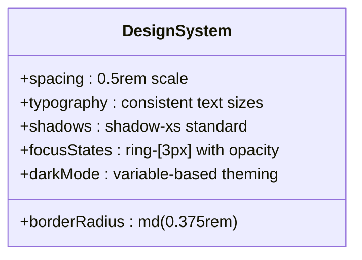
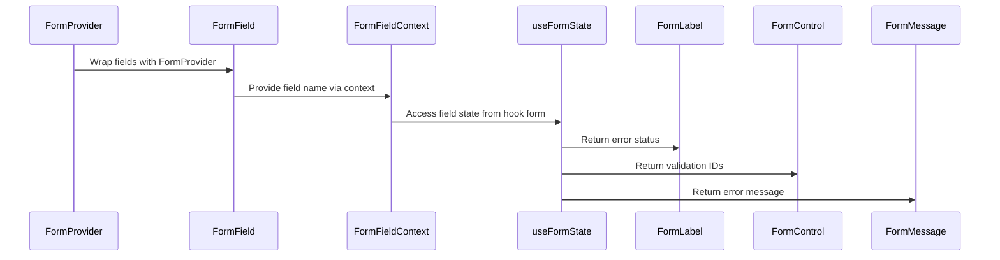
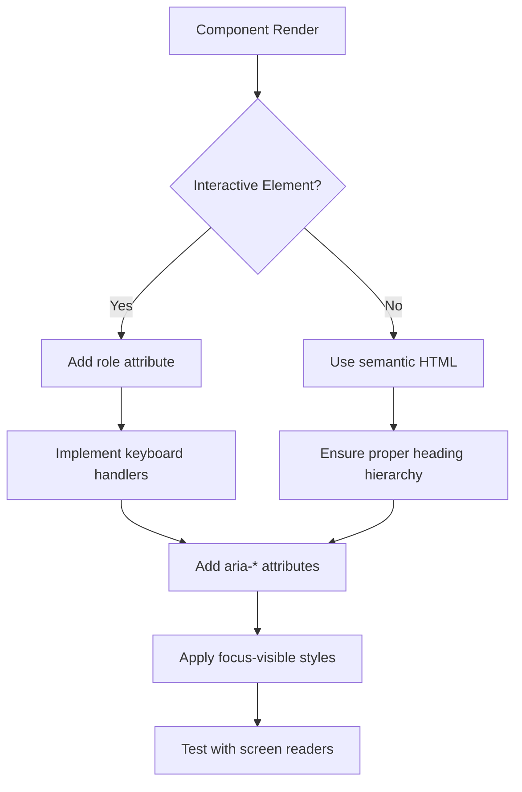
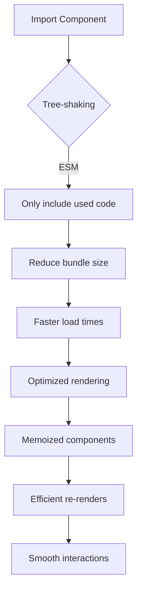

# UI Component Library

<cite>
**Referenced Files in This Document**   
- [button.tsx](file://src/components/ui/button.tsx)
- [input.tsx](file://src/components/ui/input.tsx)
- [textarea.tsx](file://src/components/ui/textarea.tsx)
- [select.tsx](file://src/components/ui/select.tsx)
- [form.tsx](file://src/components/ui/form.tsx)
- [dialog.tsx](file://src/components/ui/dialog.tsx)
- [dropdown-menu.tsx](file://src/components/ui/dropdown-menu.tsx)
- [tailwind.config.ts](file://tailwind.config.ts)
- [components.json](file://components.json)
</cite>

## Table of Contents
1. [Introduction](#introduction)
2. [Design System Principles](#design-system-principles)
3. [Core Components](#core-components)
4. [Form Integration and Compound Patterns](#form-integration-and-compound-patterns)
5. [Accessibility Implementation](#accessibility-implementation)
6. [Styling and Theme Consistency](#styling-and-theme-consistency)
7. [Performance Considerations](#performance-considerations)
8. [Usage Examples](#usage-examples)
9. [Conclusion](#conclusion)

## Introduction
The UI component library located in `src/components/ui` provides a collection of accessible, reusable primitives built on top of Radix UI and styled with Tailwind CSS. These components follow consistent design patterns for spacing, typography, focus states, and dark mode compatibility. The library supports React Hook Form integration through specialized form components and enables customization via className overrides while maintaining structural integrity.

**Section sources**
- [button.tsx](file://src/components/ui/button.tsx#L1-L60)
- [form.tsx](file://src/components/ui/form.tsx#L1-L168)

## Design System Principles
The component library implements a cohesive design system based on consistent spacing scales, typographic hierarchy, and interactive states. All components use standardized padding, border radii, and shadow values that align with the application's visual language. Focus states are uniformly implemented across interactive elements using ring utilities and outline management. The system supports dark mode through conditional class application and semantic color variables that adapt to user preferences.

**Diagram sources**
- [tailwind.config.ts](file://tailwind.config.ts#L1-L12)
- [components.json](file://components.json#L1-L23)

## Core Components

### Button Component
The Button component serves as a foundational interactive element with multiple variants including default, destructive, outline, secondary, ghost, and link styles. It supports size variations (default, sm, lg, icon) and accepts an `asChild` prop to render child elements as buttons while preserving styling. The implementation uses `cva` for variant management and applies consistent focus and disabled states.

**Section sources**
- [button.tsx](file://src/components/ui/button.tsx#L1-L60)

### Input and Textarea Components
Input and Textarea components provide standardized text entry fields with consistent styling for borders, padding, and focus states. Both support accessibility attributes like `aria-invalid` for error states and implement proper selection styling. They include built-in handling for placeholder text, disabled states, and file input appearance normalization.

**Section sources**
- [input.tsx](file://src/components/ui/input.tsx#L1-L22)
- [textarea.tsx](file://src/components/ui/textarea.tsx#L1-L19)

### Select Component
The Select component implements a fully accessible dropdown selection interface using Radix UI primitives. It includes structured subcomponents for Trigger, Content, Item, Label, and Scroll buttons. The implementation handles keyboard navigation, hover states, and visual indicators for selected items using CheckIcon from Lucide React. Size variants (default, sm) control height and padding.

**Section sources**
- [select.tsx](file://src/components/ui/select.tsx#L1-L186)

### Dialog Component
The Dialog component provides modal interfaces with proper accessibility semantics and animation transitions. It includes structured subcomponents for Header, Footer, Title, Description, Overlay, and Close button. The content is centered using transform positioning and supports configurable close behavior. Animation classes handle entrance and exit transitions with fade and zoom effects.

**Section sources**
- [dialog.tsx](file://src/components/ui/dialog.tsx#L1-L144)

### DropdownMenu Component
The DropdownMenu component implements context menu patterns with nested submenu support. It includes specialized item types such as CheckboxItem, RadioItem, and Shortcut labels. The implementation supports inset styling for hierarchical menus and provides visual feedback through focus states and selection indicators. Submenus are properly positioned with transition animations.

**Section sources**
- [dropdown-menu.tsx](file://src/components/ui/dropdown-menu.tsx#L1-L258)

## Form Integration and Compound Patterns
The form system is designed for seamless integration with React Hook Form, providing a structured compound component pattern. The Form component acts as a provider, while FormField wraps individual controlled inputs. FormItem establishes layout structure, and associated components (FormLabel, FormControl, FormDescription, FormMessage) automatically connect to field state through context.

**Diagram sources**
- [form.tsx](file://src/components/ui/form.tsx#L1-L168)

## Accessibility Implementation
All components implement comprehensive accessibility features following WAI-ARIA guidelines. Interactive elements include proper role attributes, keyboard navigation support, and screen reader annotations. Focus management uses visible ring indicators that respect user preference for reduced motion. Error states are communicated through `aria-invalid` attributes and corresponding visual styling. Semantic HTML elements are preserved or enhanced with appropriate ARIA labels.

**Diagram sources**
- [button.tsx](file://src/components/ui/button.tsx#L1-L60)
- [form.tsx](file://src/components/ui/form.tsx#L1-L168)
- [dialog.tsx](file://src/components/ui/dialog.tsx#L1-L144)

## Styling and Theme Consistency
The styling system leverages Tailwind CSS with configuration defined in `tailwind.config.ts`. The build process scans all source files to generate optimized utility classes. Semantic color names (primary, destructive, accent) enable theme consistency and dark mode adaptation. The components.json configuration establishes path aliases and ensures proper scoping of typography styles to markdown content only.

**Section sources**
- [tailwind.config.ts](file://tailwind.config.ts#L1-L12)
- [components.json](file://components.json#L1-L23)

## Performance Considerations
The component library supports efficient rendering through several optimizations. Modular imports enable tree-shaking, ensuring only used components are included in the final bundle. Stateless functional components with minimal re-renders reduce overhead. The use of `React.Slot` for composition avoids unnecessary wrapper divs. Focus management and animation classes are optimized for smooth 60fps performance even on lower-end devices.

**Diagram sources**
- [button.tsx](file://src/components/ui/button.tsx#L1-L60)
- [form.tsx](file://src/components/ui/form.tsx#L1-L168)

## Usage Examples
The component library supports various usage patterns including direct import of primitive components, compound form structures, and customization through className overrides. Forms integrate seamlessly with React Hook Form using the provided context system. Dialogs and dropdown menus can be composed with custom content while maintaining accessibility. All components respect dark mode preferences through CSS variables.

**Section sources**
- [form.tsx](file://src/components/ui/form.tsx#L1-L168)
- [dialog.tsx](file://src/components/ui/dialog.tsx#L1-L144)
- [dropdown-menu.tsx](file://src/components/ui/dropdown-menu.tsx#L1-L258)

## Conclusion
The UI component library provides a robust foundation for building consistent, accessible interfaces using modern React patterns. By combining Radix UI's accessibility features with Tailwind CSS's utility-first approach, the components offer both flexibility and reliability. The integration with React Hook Form simplifies complex form management, while the design system principles ensure visual harmony across the application. Developers can extend components safely through className overrides without breaking core functionality.